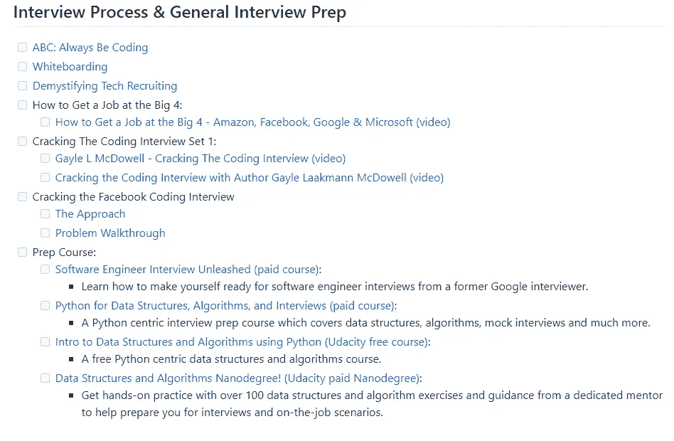
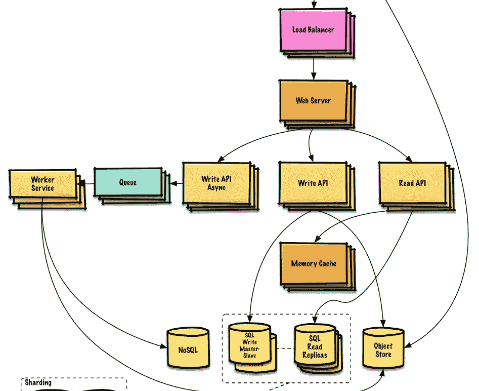
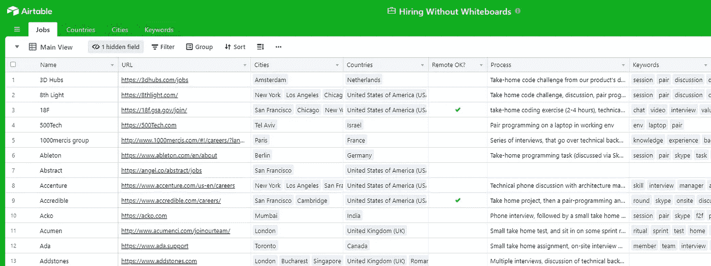
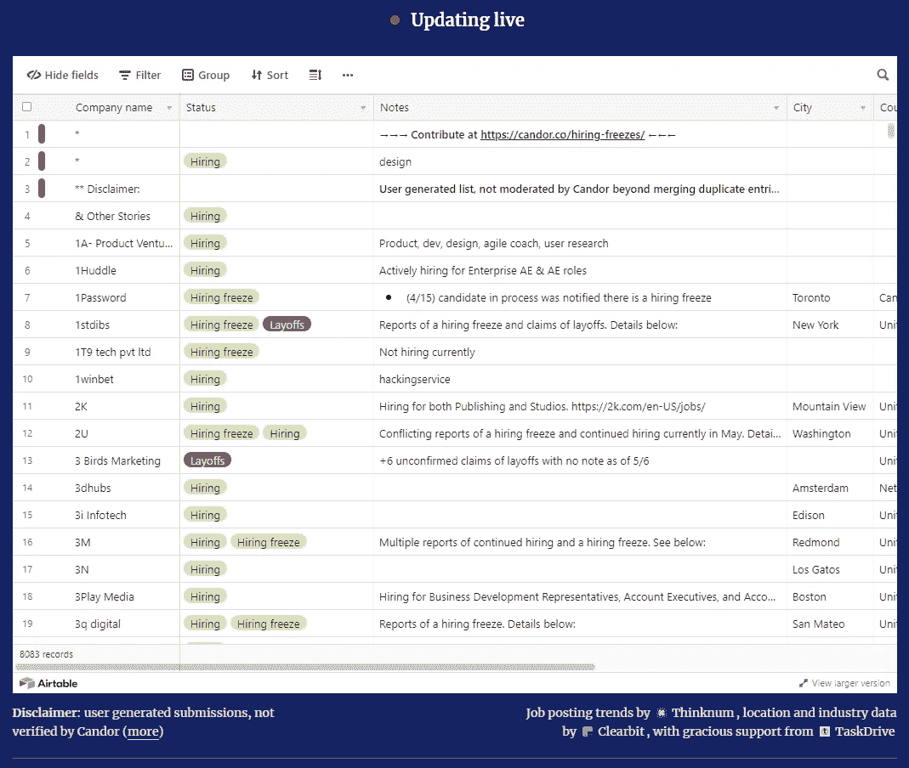
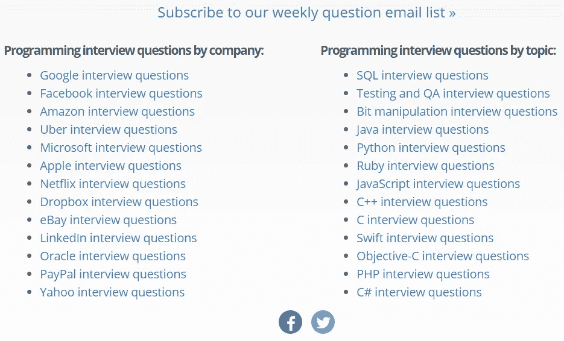
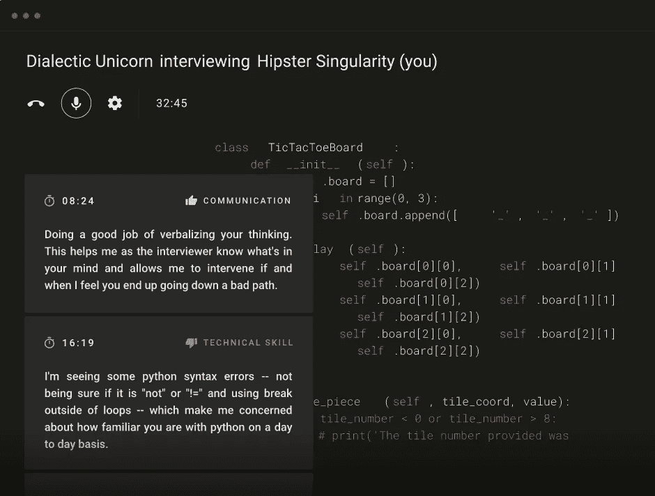
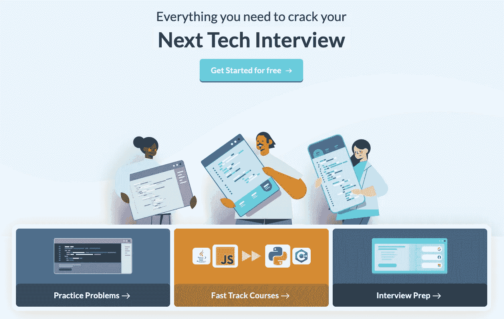

# 8 个绝佳的技术面试准备资源

> 原文：<https://betterprogramming.pub/7-fantastic-resources-for-tech-interview-prep-607df806584e>

## 好好准备，搞定你的下一次面试

克里斯汀·休姆在 [Unsplash](https://unsplash.com/s/photos/interview?utm_source=unsplash&utm_medium=referral&utm_content=creditCopyText) 上拍摄的照片

老实说，软件面试是找工作最具挑战性的方面之一。

即使在经历了几年的大学生活或几个月的新兵训练营后，你仍然必须在面试过程中取得胜利，然后才能开始赚取那笔丰厚的收入。

我收集了一份我最喜欢的资源清单，这些资源在过去的求职面试中给了我很大的帮助。希望这对你有帮助！

# 1.编码面试大学(免费)

回购链接截图

[编码面试大学](https://github.com/jwasham/coding-interview-university)是一个免费的 GitHub 知识库，由[约翰·沃沙姆](https://startupnextdoor.com/)在准备面试时创建。利用这个学习计划，他最终在亚马逊找到了一份工作。

它有大量的细节和资源(几百个链接！)，同时也是一个拥有超过 120k 星和 35k 叉的社区收藏夹。

使用它来研究您的算法、数据结构和底层操作系统知识！

# 2.系统设计入门(免费)

回购中图表的屏幕截图

《系统设计初级读本》也是一个免费的 GitHub 知识库，由脸书的工程师多恩·马丁创建。

如果你已经过了初级阶段，并且至少有几年的工作经验，你的面试可能也会涉及系统设计问题。

当你是一名新手时，雇主会就算法和数据结构对你进行拷问，以确保你具备解决问题的基本技能。然而，随着你越来越资深，在你的职业生涯中成长，设计系统的能力，尤其是大规模的，变得越来越重要。

这个存储库包含各种重要的概念，比如缓存、cdn、数据库复制和分片等等。

是中级及以上软件工程师的绝佳资源！

# 3.无白板招聘(公开)

附带的 Airtable 屏幕截图

[无白板招聘](https://github.com/poteto/hiring-without-whiteboards)是由[劳伦·谭](https://www.no.lol/)创建的 GitHub 知识库，汇集了没有 sh*tty 面试流程的公司名称。

虽然白板本身不是一个问题，但术语“白板”被用来比喻一个破碎的面试过程。

有时候，你会发现雇主们喜欢问一些不切实际的、琐碎的、通常晦涩难懂的问题，这些问题并不一定能衡量候选人写出好软件的能力。

这份名单上的公司已经公开声明，他们不会在面试中这样对你。值得一试，如果这对你很重要的话。

# 4.谁冻结了冠状病毒(公共)的招聘

[招聘冻结](https://candor.co/hiring-freezes/)页面是 David Chouinard ( [LinkedIn](https://www.linkedin.com/in/davidchouinard/) 、 [Twitter](https://twitter.com/davidchouinard?lang=en) )和 Candor(一家专门从事科技薪资谈判的公司)的其他成员创建的一个在线直播页面。

这个列表是一个社区贡献的列表，列出了现在超过 8，000 家公司及其招聘状态，您可以立即了解哪些公司仍在招聘，哪些公司已经冻结招聘或解雇员工。

尤其是现在是艰难时期，压力大增，没有必要在那些不稳定的公司身上浪费时间。

用这张表作为参考，看看你感兴趣的公司是否还在招聘！或者，他们也有一个在线表格，如果你被解雇了，你可以在那里提交你的名字和简历。

# 5.Pramp(免费)

来源: [Pramp 博文](https://blog.pramp.com/why-we-created-pramp-6fb05da7065e)

Pramp 是**Pra**ctice**M**akes**P**erfect 的缩写，它是一个免费的在线工具，允许你和你的朋友互相练习技术面试。

他们提供了大量的例子和练习题，供学员互相提问和练习技能。该界面允许远程视频聊天，所有其他功能，包括 IDE，都在浏览器中提供。

对于考生来说，这是一个方便的、现成的工具，可以让他们直接和朋友一起练习。邀请你的朋友，用它来准备你的下一次面试！

# 6.面试蛋糕(免费增值)

网站页脚的屏幕截图

我最喜欢的资源之一，[面试蛋糕](https://www.interviewcake.com/)，是帕克·菲尼( [LinkedIn](https://www.linkedin.com/in/pphinney/) 、 [Twitter](https://twitter.com/gameguy43) )为科技面试准备的在线课程，特别是关于算法、数据结构和数学的课程。

他们有免费的两周一次的电子邮件订阅，他们会向你发送问题并免费讨论他们的解决方案，购买他们的在线课程可以让你完全了解他们的整套面试问题。

这是我最喜欢的资源之一，尽管是有偿的，因为帕克和他的团队已经学会了如何以清晰、简洁和有组织的方式提取信息。

由于冠状病毒，他们最近降低了价格，使其更容易获得。一分钱一分货！

# 7.Interviewing.io(高级版)

截图来自[他们的网站](https://interviewing.io/)

[intervaling . io](https://interviewing.io/)是一个优质资源，它让你匿名地与业内真正的工程师配对，练习你的面试技巧。

Pramp 为你提供了一个应用程序和资源，让你可以免费和你的朋友一起练习，Interviewing.io 为你提供了真正的体验。

免费采访朋友可能会有帮助，但有时当你和你认识的人一起练习时，很难消除偏见。通过与顶级科技公司的真正工程师匿名合作，你可以在现实压力下磨练你的面试技巧，并从公正的第三方获得真正的反馈。

这很贵，但如果你得到了一份薪水高达六位数的好技术工作，几百美元的练习和准备只是一个小小的代价。

# 8.采访位

[采访截图 Bit](https://www.interviewbit.com/)

由一位同事推荐的 [InterviewBit](https://www.interviewbit.com/) 是一个将你的面试实践经验游戏化的网站，包括许多示例问题，从 FAANG 编码挑战到系统设计，再到脚本和谜题。

每个主题都有各种子类别和问题来帮助你掌握技术面试。

你甚至可以和同行进行模拟面试，也可以参加由业内公司赞助的竞赛。

入门是免费的。

# 结论

互联网是巨大的，可能有更多的资源。但这七个资源是我个人可以担保的，它们都是有益的，而且质量极高。

最重要的是，练习！有一种普遍的误解，认为只有天才才会在顶级科技公司工作，比如谷歌、脸书等。但是大多数人天生就没有递归二叉树的天赋。

对自己有耐心，给自己时间，继续练习和学习。

技术和软件正在吞噬世界，我们比以往任何时候都需要更多的人来编写下一代软件和应用程序。

祝你面试好运！