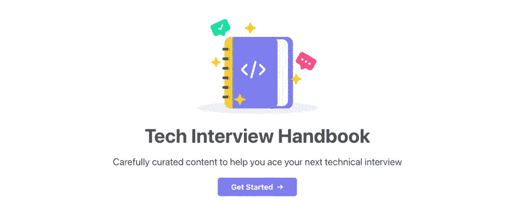
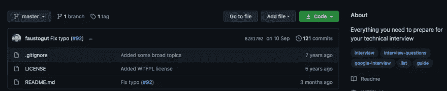
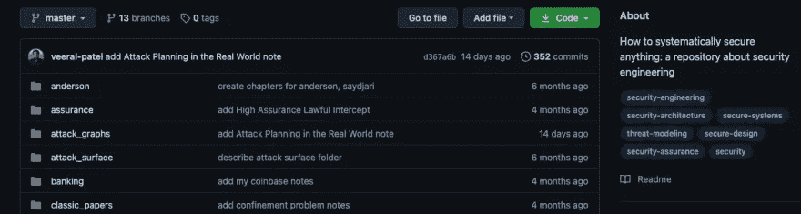
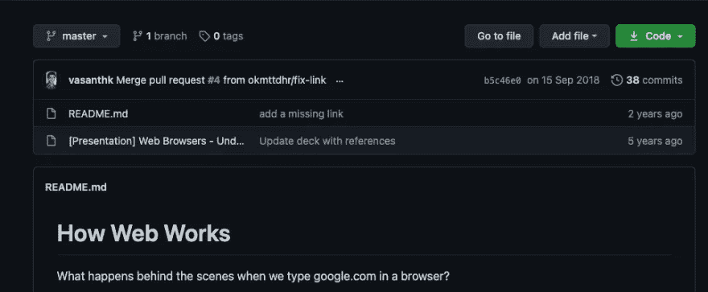
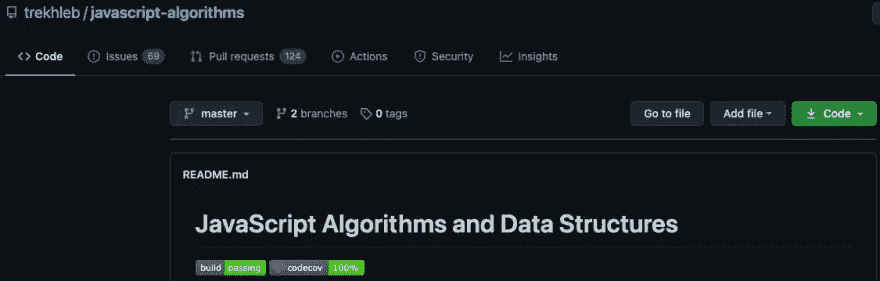

# 7 个 GitHub 库帮助你粉碎你的工作面试

> 原文：<https://betterprogramming.pub/7-github-repositories-to-help-you-crush-your-job-interviews-72cdb88dc958>

## 努力学习，通过面试，得到工作

由 [Pablo Heimplatz](https://unsplash.com/@pabloheimplatz?utm_source=medium&utm_medium=referral) 在 [Unsplash](https://unsplash.com?utm_source=medium&utm_medium=referral) 上拍摄的照片

“在技术领域，面试比实际工作更难”。这是个笑话，但在很多情况下可能是真的。因此，在这篇文章中，你会发现七个 GitHub 库可以帮助你赢得面试。

这些存储库包括以下信息:

*   网络是如何工作的(DNS、HTTP 和许多其他主题)
*   数据结构和算法
*   如何设计大型系统(系统设计)
*   应用程序安全性
*   JavaScript 算法

让我们开始吧！

# 1.编码面试大学

编码面试知识库是最全面的面试准备资源之一。存储库始于所有者的学习计划，他用它来成为一名软件工程师。

在这个存储库中，您可以找到关于数据结构、算法、动态编程、面向对象编程、设计模式等等的信息。

我建议你去看看[的知识库](https://github.com/jwasham/coding-interview-university)，自己探索一番。请注意，它是综合性的，你不必学所有的东西，或者一次学完所有的东西。尽管如此，这个资源对于准备面试来说还是非常方便的。

# 2.技术面试手册

另一个有用的资源是技术面试手册。它涵盖了关于技术面试的信息，但不仅如此。它还涵盖了工作申请(简历，求职信)，面试过程(行为问题，面试时问什么问题)，以及面试后的考虑(谈判)。

因此，您学到的不仅仅是数据结构、算法和其他技术主题。技术面试手册是一个方便的资源，我鼓励你去看看。

# 3.系统设计入门

对于小的副业项目，你可能不需要计划或太多的思考就能完成。然而，构建大规模系统是一个不同的游戏。学习如何设计可扩展的系统将有助于你成为一名软件工程师。

[系统设计初级知识库](https://github.com/donnemartin/system-design-primer)是来自互联网的材料和资源的集合。存储库的所有者将不同来源的资源和材料放在一起。此外，存储库会不断更新，所以请密切关注它！

回购包含一个学习指南，如何处理系统设计问题，以及问题的解决方案。我强烈推荐它学习更多关于设计可伸缩应用程序的知识。

# 4.面试资源

[访谈](https://github.com/Olshansk/interview)库没有关于你应该如何使用它的描述或指南。它只列出了到其他资源的链接，并按主题对这些链接进行分组。例如，算法部分包括书籍、编码实践、指南等等。

我特别喜欢这个资源库，因为它包含了大量的资源。此外，我喜欢他们按类型分类。除此之外，在结尾有类似的存储库也值得加分。这些是准备面试的额外资源。查看存储库！

# 5.如何保护任何东西

安全性过去是，现在是，将来也永远是构建应用程序时的一个基本主题。如果您的应用程序不安全，可能会导致灾难性的后果。

所以，安全不是一件可以掉以轻心的事情。因此，这里我们有了[如何保护任何东西的](https://github.com/veeral-patel/how-to-secure-anything)资源库。这个存储库的好处在于，信息适用于保护任何东西——不仅仅是应用程序。仓库所有者声称“旨在记录保护任何东西的过程，无论是中世纪的城堡、艺术博物馆还是计算机网络。”

这个知识库设计得非常好，包括很多额外的材料来补充你的学习。我怎么推荐都不为过！

# 6.网络如何工作

在我第一份开发工作的面试中，有人问我，“当你在浏览器中输入一个 URL 时会发生什么？”你可能遇到过同样的问题，或者将来可能会遇到。

你可以在名为[的回购协议中找到这些问题的答案。您可以找到关于 DNS、HTTP 协议和服务器如何工作的信息，或者关于 DOM 树、渲染树、页面绘制等等的信息。](https://github.com/vasanthk/how-web-works)

这是一个学习网络如何工作的便利的知识库。此外，该存储库还包括一些额外的链接，用于深入研究一些主题。

# 7.JavaScript 算法

[JavaScript 算法库](https://github.com/trekhleb/javascript-algorithms)更适合 JavaScript 职位。但是，如果您理解这些概念并知道如何用 JavaScript 实现它们，那么您很可能也知道如何用其他语言实现它们。

每种数据结构和算法都有单独的自述文件，报告还包括进一步资料的链接。因此，如果你不明白一个概念，你可以随时按照额外的材料额外的信息。

也就是说，我想说的是，有些信息可能很少，你可能需要额外的学习材料。尽管如此，这个存储库对于练习算法和数据结构来说是非常优秀的。

# 结论

我希望这些资源能帮助你赢得下一次技术面试。这篇文章中的资源非常有用——尤其是当你一起使用它们的时候。

这篇文章中的列表并不详尽，但它应该涵盖了你在面试中可能遇到的任何事情。一如既往，我乐于接受建议。如果你知道其他很棒的资源，欢迎在评论中发表！

*如果对 JavaScript 教程感兴趣，我推荐* [*前端高手*](https://catalins.tech/frontend-masters-membership-is-it-worth-it) *！*

*如果你想用技术写作赚钱，就去查查* [*那些付钱让你写*](https://catalins.tech/websites-that-pay-you-to-write-technical-articles) *技术文章的网站吧！*

*如果你想学习 JavaScript，我推荐这些* [*5 资源作为初学者学习 JavaScript*](https://catalins.tech/5-best-resources-to-learn-javascript-as-a-beginner)*！*

*谈判你的工资是必不可少的——学习* [*作为一名开发者如何谈判你的工资*](https://catalins.tech/how-to-negotiate-your-salary-as-a-developer) *！*

*用* [*Git 别名*](https://catalins.tech/git-aliases-what-are-they-and-how-to-use-them) *加速你的开发。*

*如果你想* [*以开发者身份开博客*](https://catalins.tech/how-to-start-your-blog-as-a-developer) *，我推荐你阅读《* [*如何以开发者身份开博客*](https://catalins.tech/how-to-start-your-blog-as-a-developer) *》一文！*

你是否很难跟上科技领域的最新消息？参见 [*作为开发者保持最新状态的一种方法*](https://catalins.tech/one-way-to-stay-up-to-date-as-developer) *！*

*学习* [*如何在 JavaScript 中使用 Async/Await*](https://catalins.tech/how-to-use-asyncawait-in-javascript)*！*

GitHub 简介目前风靡一时。了解 [*如何创建 GitHub 个人资料页面*](https://catalins.tech/how-to-create-a-kickass-github-profile-page) *！*

*查看这 7 个* [*资源，帮你通过求职面试*](https://catalins.tech/7-github-repositories-to-help-you-crush-your-job-interviews) *！*

*查看*[*JavaScript ECMAScript 2021 es 2021*](https://catalins.tech/javascript-es2021-you-need-to-see-these-ecmascript-2021-features)*即将推出的新功能！*

*你是初学程序员吗？查看这些* [*编程项目思路适合初学者*](https://catalins.tech/10-programming-project-ideas-for-beginners) *！*

你是在学习编码还是打算做编码？查看 [*免费学习编程的最佳去处*](https://catalins.tech/20-best-places-to-learn-programming-for-free) *！*

[*借助这 9 款浏览器扩展，提高您的开发人员工作效率*](https://catalins.tech/my-9-must-have-browser-extensions-for-increased-developer-productivity) *！*

*如果你是 Node.js 的开发者，我建议你查看 Node.js* *中的这些* [*4 种创造性的设计模式！*](https://catalins.tech/the-4-creational-design-patterns-in-nodejs-you-should-know)

*查看这些惊人的*[*JavaScript ECMAScript 2020 特性*](https://catalins.tech/javascript-es2020-the-features-you-should-know) *！*