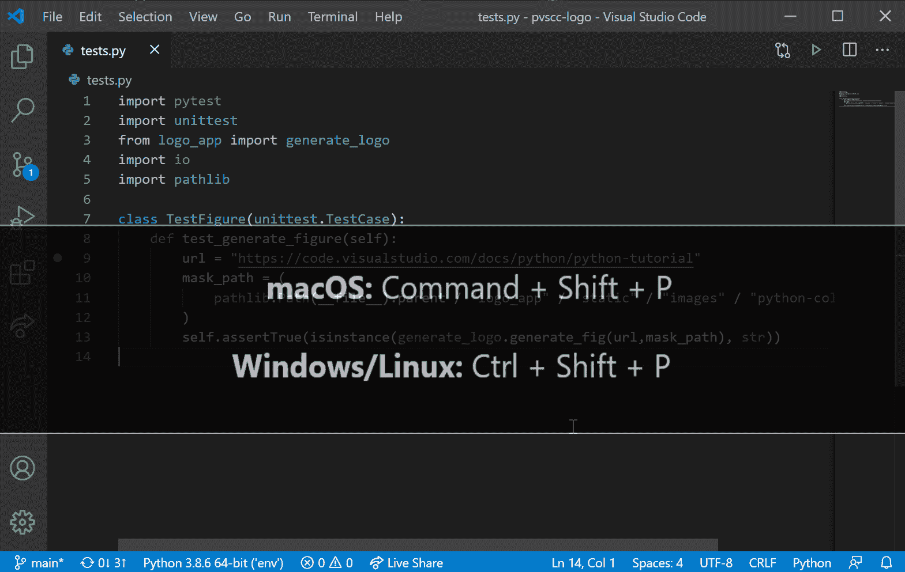
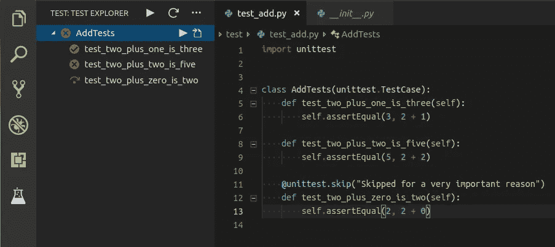
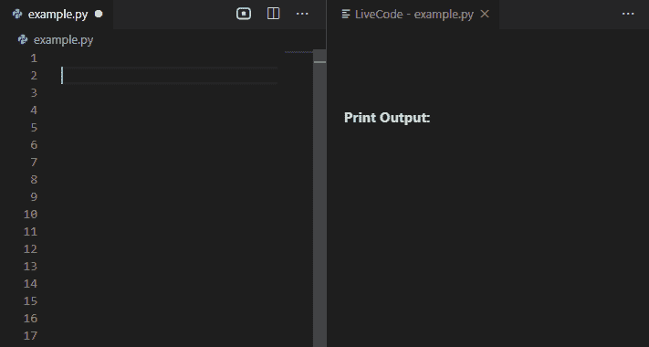

# Python 开发人员需要了解的 VS 代码扩展

> 原文：<https://betterprogramming.pub/7-good-to-know-vs-code-extensions-for-python-developers-857ca343cc9>

## 启动您的 IDE


凯文·卡纳斯在 [Unsplash](https://unsplash.com?utm_source=medium&utm_medium=referral) 上的照片

Python 是世界上最常用的编程语言之一。根据一项调查，它在所有编程语言中占有 26.9%的份额([来源](https://statisticstimes.com/tech/top-computer-languages.php))。哪一个是最大的？

VSCode 是流行的 IDE 之一。我相信很难找到不使用 VSCode 的开发者。这里有 7 个 VScode 扩展，如果你是 python 开发者，它们将帮助你最好地利用 VScode。

# 1.计算机编程语言



也许这是你唯一需要的。这是安装量最大的扩展之一，安装量超过 5300 万。它有许多功能，如林挺、调试、代码导航、代码格式化、重构、变量资源管理器、测试资源管理器等等。

[](https://marketplace.visualstudio.com/items?itemName=ms-python.python) [## Python - Visual Studio 市场

### 一个对 Python 语言有丰富支持的 Visual Studio 代码扩展(对于所有积极支持的版本…

marketplace.visualstudio.com](https://marketplace.visualstudio.com/items?itemName=ms-python.python) 

# 2.Python 缩进


这对你来说可能是救命稻草。缩进在编程中是一件很重要的事情。因为它增加了可读性。但是在 Python 中，它超级重要。在 Python 中，缩进用来表示代码块。我想你已经明白这个扩展有助于纠正 Python 缩进。安装高度超过 1.7 米

[](https://marketplace.visualstudio.com/items?itemName=KevinRose.vsc-python-indent) [## Python 缩进- Visual Studio 市场

### 更正 Visual Studio 代码中的 python 缩进。查看 VSCode Marketplace 上的扩展及其源代码…

marketplace.visualstudio.com](https://marketplace.visualstudio.com/items?itemName=KevinRose.vsc-python-indent) 

# 3.AutoDocstring


有时候，当你打开一个项目很长时间后，你不知道这个项目是做什么的，或者这个项目是如何工作的。因为没有文档。你遇到过这种情况吗？。如果不是，我希望你不必。Docstring 类似于源代码中指定的注释，用于记录代码的特定部分。它使得创建文档变得容易。这个扩展帮助您快速生成 python 函数的文档字符串。安装高度超过 1.8 米

[](https://marketplace.visualstudio.com/items?itemName=njpwerner.autodocstring) [## autoDocstring - Python Docstring 生成器- Visual Studio 市场

### Visual Studio 代码扩展，用于快速生成 python 函数的文档字符串。快速生成文档字符串片段…

marketplace.visualstudio.com](https://marketplace.visualstudio.com/items?itemName=njpwerner.autodocstring) 

# 4.Python 测试浏览器



测试是软件开发的重要周期之一。测试让你的代码没有 bug，节省了很多时间。这个扩展将帮助您使用[测试浏览器 UI](https://marketplace.visualstudio.com/items?itemName=hbenl.vscode-test-explorer) 运行 Python [Unittest](https://docs.python.org/3/library/unittest.html#module-unittest) 、 [Pytest](https://docs.pytest.org/en/latest/) 或 [Testplan](https://testplan.readthedocs.io/) 测试。这个扩展安装了超过 545k。

[](https://marketplace.visualstudio.com/items?itemName=LittleFoxTeam.vscode-python-test-adapter) [## Visual Studio 代码的 Python 测试资源管理器- Visual Studio Marketplace

### 这个扩展允许您使用测试资源管理器 UI 运行 Python 单元测试、Pytest 或 Testplan 测试。

marketplace.visualstudio.com](https://marketplace.visualstudio.com/items?itemName=LittleFoxTeam.vscode-python-test-adapter) 

# 5.Python 片段


这个扩展将帮助你提高生产力。我想从名字上你已经理解了这个扩展将帮助你自动完成 Python 代码。不仅如此，如果你是初学者，这个扩展也将帮助你学习 Python。

[](https://marketplace.visualstudio.com/items?itemName=frhtylcn.pythonsnippets) [## python 片段- Visual Studio 市场

### 一个代码片段包，让你更有效率地使用 python。这个代码片段包包含了以下所有 python 方法

marketplace.visualstudio.com](https://marketplace.visualstudio.com/items?itemName=frhtylcn.pythonsnippets) 

# 6.python 的 LiveCode



每个人都会犯错，开发人员也一样。这个扩展将帮助你少犯错误，并尽快找到错误。因为这个扩展会在您键入时评估您的 python 代码。它具有实时评估、变量显示、循环显示、错误显示等功能。

[](https://marketplace.visualstudio.com/items?itemName=xirider.livecode) [## python 的 LiveCode-Visual Studio market place

### 当您键入并显示每行的变量值时，LiveCode 会评估您的 python 代码。LiveCode 可用…

marketplace.visualstudio.com](https://marketplace.visualstudio.com/items?itemName=xirider.livecode) 

# 7.Python 资源监视器


有时在任务管理器中找到正确的 Python 进程是很烦人的。到目前为止，VS Code 的资源和性能监视器扩展只以列表和文本的形式显示当前的全局资源消耗指标。该扩展为显示与 Python 调试器的当前进程相关的数据提供了一种更加用户友好的图形化方法。

[](https://marketplace.visualstudio.com/items?itemName=kaih2o.python-resource-monitor) [## Python 资源监视器- Visual Studio 市场

### 到目前为止，VS 代码中的资源和性能监视器扩展只显示当前的全局资源消耗…

marketplace.visualstudio.com](https://marketplace.visualstudio.com/items?itemName=kaih2o.python-resource-monitor) 

今天到此为止。我希望这个扩展将有助于简化开发过程。

如果你知道任何其他漂亮的 Python 扩展，请在评论中分享。直到我们再次见面…干杯！

```
**Want to Connect?**If you want to, you can connect with me on [Twitter](https://twitter.com/FarhanT99598254) or [LinkedIn](https://www.linkedin.com/in/farhan-tanvir-b08520151/).
```