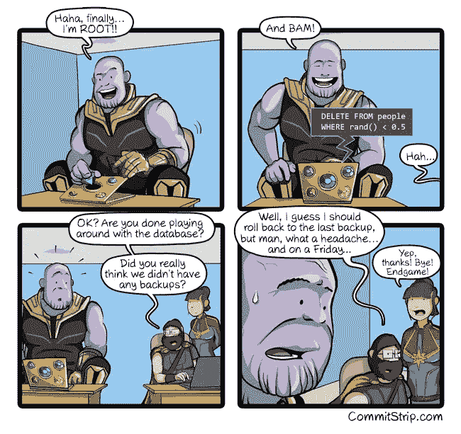
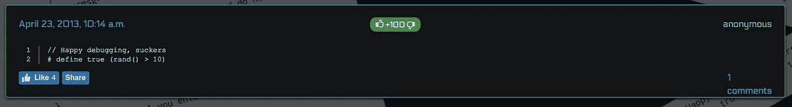
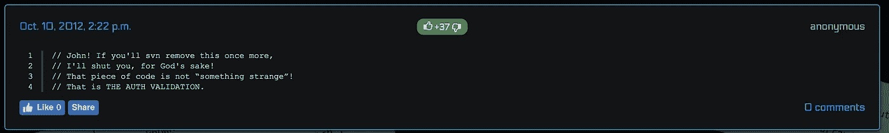
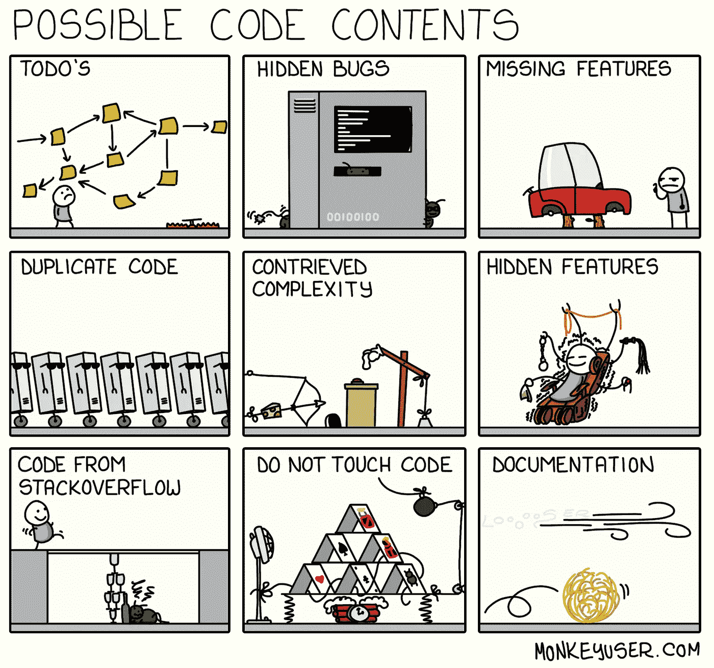
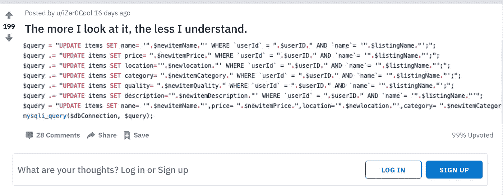
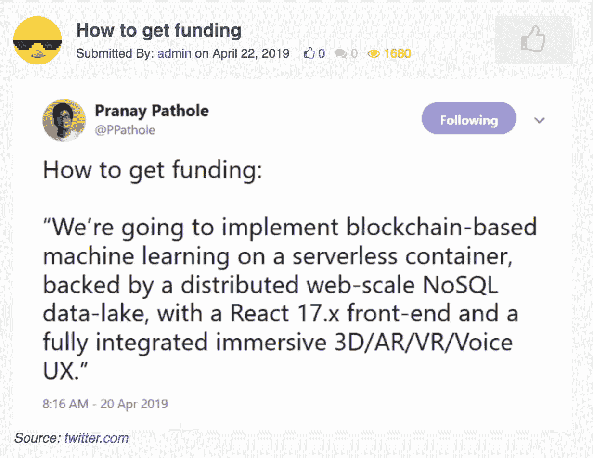

# 编程幽默的 7 大来源

> 原文：<https://betterprogramming.pub/7-great-sources-for-programming-humor-14983a36f437>

## 编写笑话、漫画和恐怖片

[张秀坤·万尼](https://unsplash.com/@dominik_photography?utm_source=unsplash&utm_medium=referral&utm_content=creditCopyText)在 [Unsplash](https://unsplash.com/s/photos/funny?utm_source=unsplash&utm_medium=referral&utm_content=creditCopyText) 上的照片

编程，数据科学，实际上，任何技术角色都需要大量的逻辑思维。这经常会导致程序员有一种奇怪的幽默感(或者也许我们一开始就是这样？).它可以从干燥到完全拖曳。作为一名技术人员，无论你喜欢什么样的幽默，都有各种各样的网站、内容制作人和漫画会吸引你。

当我们觉得自己编程时间太长时，我们喜欢访问以下顶级幽默科技网站。

# 1.CommitStrip

[CommitStrip](http://www.commitstrip.com/en/?) 可以说是一个有几个月经验的程序员会喜欢的最平易近人的漫画之一。漫画画得很好，前提和妙语都很好理解。有时他们可以是非常高级的，有时他们可以专门关注 Github 或 JQuery 之类的主题。

# **2。Codecrap.com**

听着，除非你是编码之神，否则在我们职业生涯的早期，我们写的都是糟糕的代码。我们写的代码过于复杂，不可维护，而且非常糟糕。现在，我们稍后也将分享来自 Reddit 的编程恐惧，但这是不同的。[Codecrap.com](https://codecrap.com/content/best/)有很棒的代码片段、注释和相关函数。这些代码片段较小，但似乎总是有更大的幽默效果。

# 3.猴子用户

类似于 CommitStrip， [MonkeyUser](https://www.monkeyuser.com/2019/possible-code-contents/?sc=true) 制作非常注重代码的漫画。艺术更简单一点，但我发现讲述的故事通常比 CommitStrip 更有趣。它们很可爱，会让你开心一天。

# 4.Reddit 编程幽默和编程恐怖

Reddit 一直是小众文化的聚集地。在过去的几年里，这已经扩展到一个更大的市场——权力的游戏，漫威，以及所有成为主流的书呆子文化。但是，对于编程内向者来说，还是有地方可以藏身的。编程幽默和[编程恐怖](https://www.reddit.com/r/programminghorror/comments/bda6o1/the_more_i_look_at_it_the_less_i_understand/)是程序员处理滑稽和可怕事实的好例子。这两个分支很棒。

所以如果你想花几个小时浏览 Reddit，看看这些。

# 5.发展幽默

假设您不想为了您的编程幽默而一次访问一个站点。不要一次一个地去 Commitstrip、MonkeyUser、Twitter 和 Nixcraft，试着去一个汇总和评价每个漫画的地方。这样你就不需要通过分析旧的漫画档案来获得笑声。那是[的幽默。](http://devhumor.com/)

# 6.Bash.org(面向核心程序员)

好吧，假设你已经编程很长时间了。你住在终点站。你以为其他不用 Vim 或者 Nano 的程序员都比不上。那么[Bash.org](http://www.bash.org/?latest)是给你的。基本上感觉你只是直接从终端上读。

# 7.技术领导

这是列表中唯一基于视频的参考。我之前提到过，程序员往往有一种干巴巴的幽默感。技术负责人在他的视频中很好地展示了这一点。当他制作视频时，他努力保持面无表情，专注于吸引你的标准点击诱饵标题，如[如何成为 10 倍工程师](https://www.youtube.com/watch?v=Iydpa_gPdes&t=27s)、[软件工程师的 10 年人生# 10 年挑战](https://www.youtube.com/watch?v=Ap2uWsJV25w)和[为什么你不应该学习编码。(“别说了，太难了。”)](https://www.youtube.com/watch?v=wrij5uTtDxE)。他显然是一个优秀的程序员，也很有幽默感。

[为什么不应该学习编码。(“别说了，太难了。”)](https://www.youtube.com/watch?v=wrij5uTtDxE)