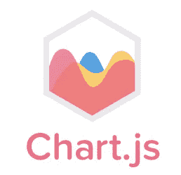
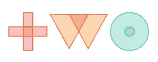

# 用 JavaScript 实现数据可视化的 7 大实用程序库

> 原文：<https://betterprogramming.pub/7-great-utility-libraries-for-data-visualization-with-javascript-30621445d784>

## 面向开发人员和设计人员的库

马修·费尼在 [Unsplash](https://unsplash.com/s/photos/library?utm_source=unsplash&utm_medium=referral&utm_content=creditCopyText) 上的照片

JavaScript 运行网络。您可以在浏览器中使用它，可以在服务器上使用它，也可以在移动应用程序中使用它。

今天的生态系统充满了伟大的库和框架，帮助工程师为任何平台构建强大的、以用户为中心的应用程序。

数据可视化是目前世界上最热门的话题之一，甚至在新冠肺炎疫情之前。公司坐拥大量数据，需要找到分析、解释和可视化这些数据的方法。

无论您是数据科学家还是必须处理数据可视化的程序员，这里有七个很棒的 JavaScript 框架可以帮助您创建令人惊叹的解决方案。

# 1.D3

[D3](https://github.com/d3/d3) 目前在 GitHub 上有 90，000 颗星，使其成为最受欢迎的 JavaScript 库之一。这是一个非常棒的库，可以使用 web 标准(SVG、Canvas、HTML)用 JavaScript 可视化数据。它结合了强大的交互和可视化技术，以数据驱动的方式操作 DOM。

它允许将任意数据绑定到 DOM，然后将转换应用到文档。

主要特点是:

*   web 标准的全部功能
*   速度极快，支持大型数据集
*   提供官方和社区开发的模块

# 2.三. js

three.js 是另一个伟大的用于数据可视化的 JavaScript 库，目前拥有大约 60，000 个 GitHub stars。它希望创建一个易于使用、简单和轻量级的 3D 库，并带有默认的 WebGL 渲染器。

主要特点是:

*   默认 WebGL 渲染器
*   支持画布 2D、SVG 和 CSS3D 的渲染器
*   良好的文档

# 3.Chart.js

Chart.js 是一个为设计者和开发者设计的简单而灵活的 JavaScript 图表库，目前在 GitHub 上有大约 50，000 颗星。它有很好的文档，并且很容易上手。

主要特点:

*   混合图表类型
*   开箱即用的惊艳过渡
*   开源项目
*   支持八种图表类型
*   应答的

# 4.纸张. js

[Paper.js](https://github.com/paperjs/paper.js) 是一个运行在 HTML5 Canvas 之上的开源矢量图形脚本框架。它提供了许多强大的功能来创建和处理贝塞尔曲线和矢量图形。它基于 Scriptographer，一个 Adobe Illustrator 的脚本环境。Paper.js 对于初学者来说很容易学习，但是对于高级用户来说也有很多高级特性。

主要特点:

*   易于上手
*   设计精良、久经沙场的 API
*   基于 Scriptographer，使用 HTML5 标准
*   它提供嵌套图层、组、路径、复合路径、栅格、符号等。

# 5.织物. js

[Fabric.js](https://github.com/kangax/fabric.js) 是一个很棒的 JavaScript 框架，可以轻松处理 HTML 画布元素。它在 canvas 元素之上有一个交互式对象模型和一个 SVG-to-canvas 解析器。

有了 Fabric，人们可以使用 JavaScript 轻松创建简单的形状，如圆形、三角形、矩形或其他多边形。

主要特点:

*   测试单元
*   模块结构
*   跨浏览器功能
*   它速度很快，并且遵循语义版本控制

# 6.埃查尔兹

[ECharts](https://github.com/apache/incubator-echarts) 是一个强大的 JavaScript 可视化和图表库，提供了向应用程序添加交互式、直观和高度可定制的图表的简单方法，目前在 GitHub 上有大约 40，000 颗星。它基于 ZRender，用纯 JavaScript 编写。

主要特点:

*   Apache 软件基金会孵化器项目
*   免费使用
*   支持多维数据分析
*   活跃社区
*   各种尺寸设备的图表

# 7.Two.js

[Two.js](https://github.com/jonobr1/two.js) 是现代浏览器中二维绘图的小 API。它与渲染器无关，支持在多种上下文中使用相同的 API 进行渲染，如 WebGL、Canvas2D 或 SVG。

主要特点:

*   关注矢量形状
*   依赖于场景图
*   内置动画循环
*   具有可扩展的矢量图形解释器

# 结论

我真的希望你喜欢这些库，并能在你的一个项目中使用它们！