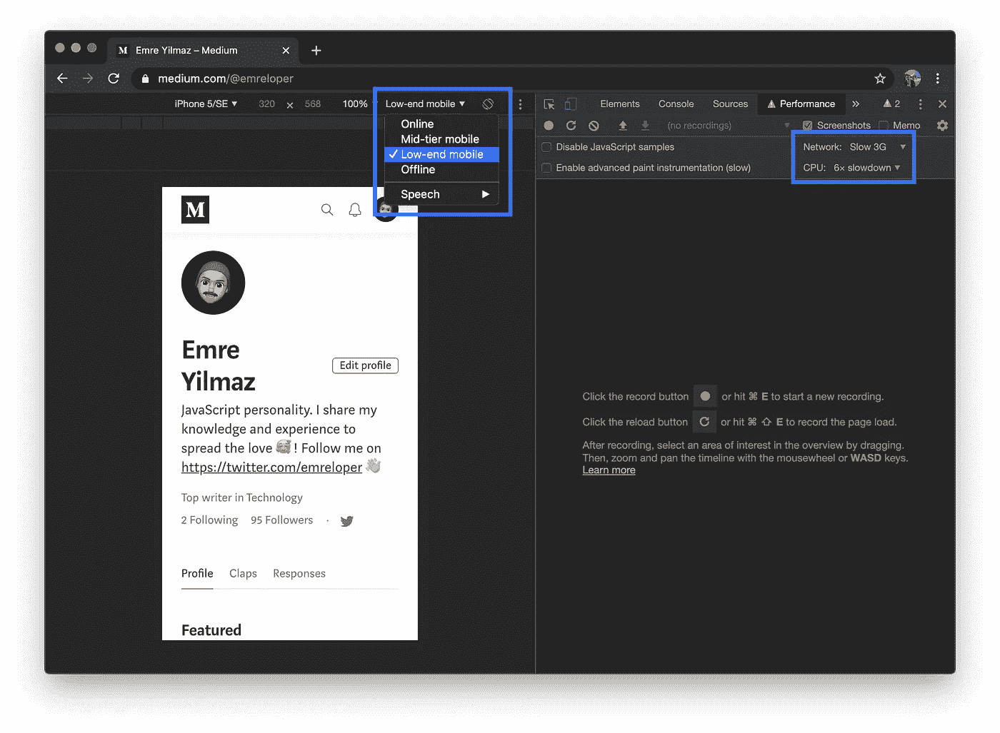
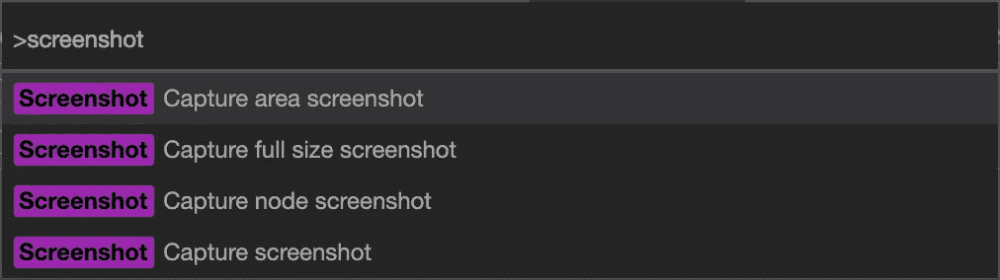
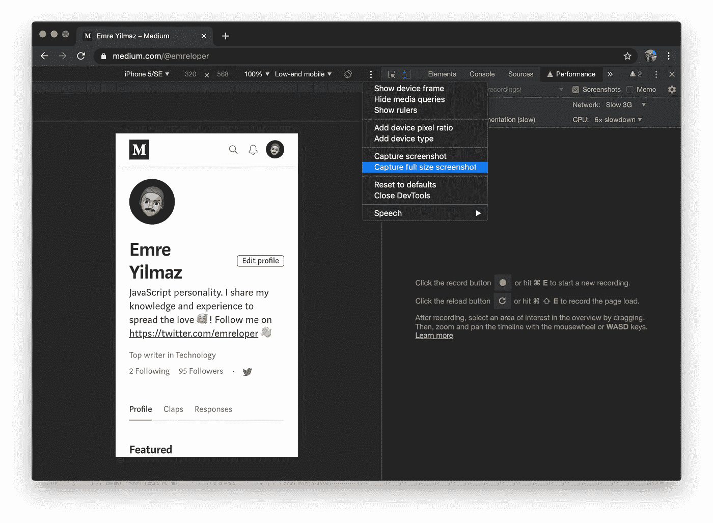
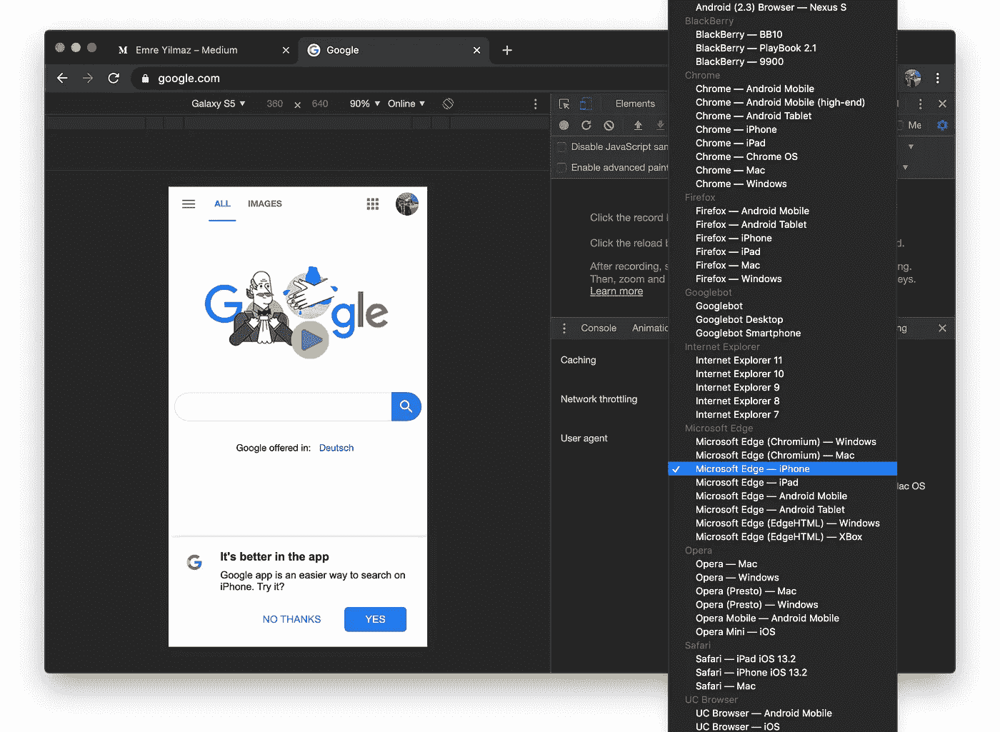
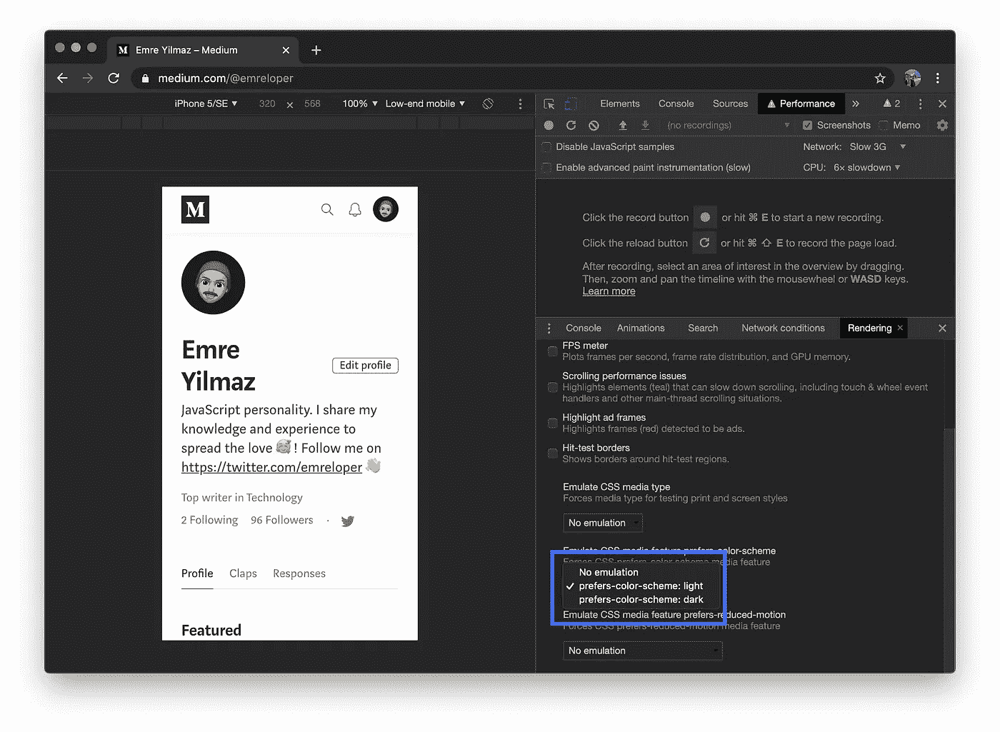
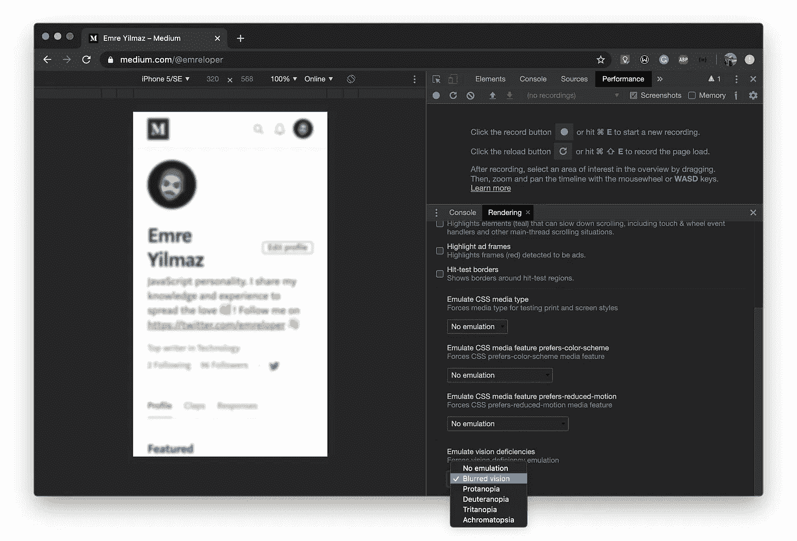
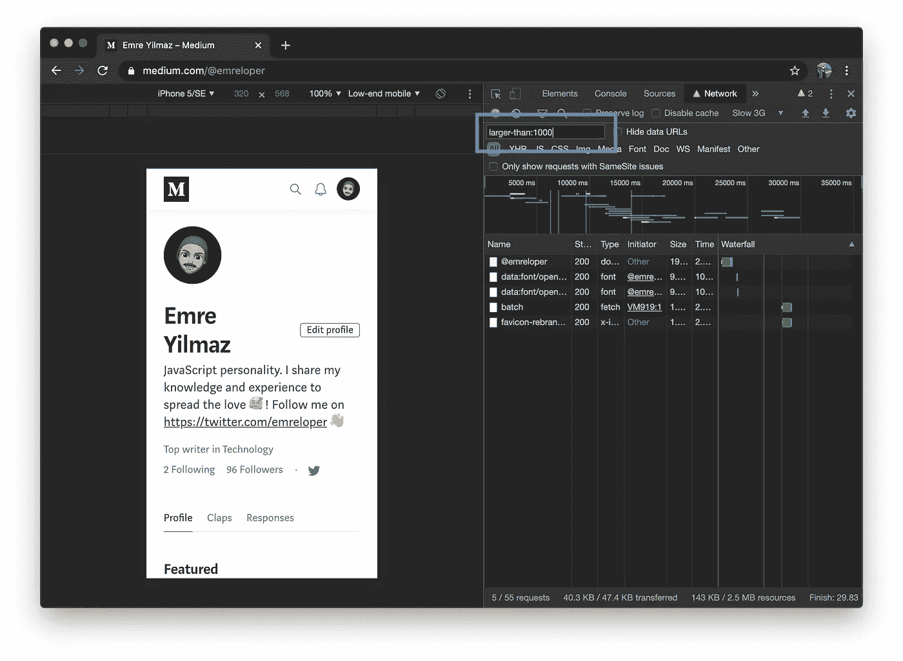
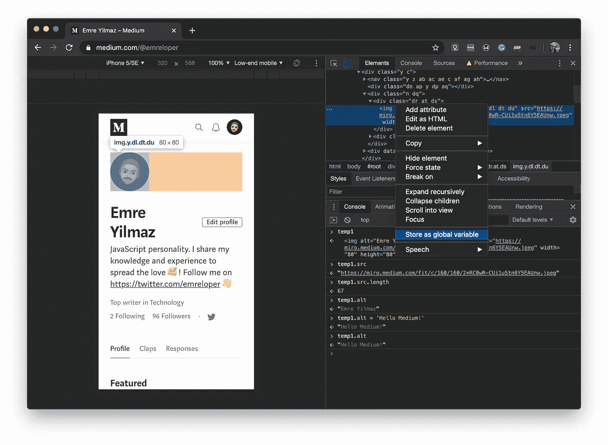

# 7 个隐藏的 Chrome DevTools 特性

> 原文：<https://betterprogramming.pub/7-hidden-chrome-devtools-features-8f5fd3b1385f>

## 使用这些 Chrome 开发工具提高您的工作效率

布鲁克·拉克在 [Unsplash](https://unsplash.com?utm_source=medium&utm_medium=referral) 拍摄的照片

# 目录

*   [在低端设备上测试你的网络应用的性能](#e096)
*   [在不同尺寸的设备上抓图](#23fd)
*   [更改用户代理](#8922)
*   [测试你的明暗主题](#5f98)
*   [为有视觉障碍的人测试你的网络应用](#cf04)
*   [按属性过滤网络请求](#2a9d)
*   [在控制台中获取 DOM 节点引用](#638b)
*   [奖金](#f3e8)

开发者工具对于软件开发是必不可少的。我们需要他们来开发、测试和调试我们的工作。作为一名网络应用开发者，你使用 Chrome DevTools 的几率非常高。

我将向您展示 Chrome DevTools 的一些隐藏功能，以帮助提高您的工作效率。

如果你需要的话，这里有一个来自谷歌的关于如何以多种不同方式打开 Chrome DevTools 的详细帖子。

 [## 打开 Chrome DevTools |开发人员工具| Google 开发人员

### 有很多方法可以打开 Chrome DevTools，因为不同的用户想要快速访问不同的部分…

developers.google.com](https://developers.google.com/web/tools/chrome-devtools/open) 

附注:某些功能可能无法在您当前的 Chrome 版本中使用。为了确保您能够测试所有的特性，您可以使用 canary 版本。你可以在这里下载。

# 在低端设备上测试您的 Web 应用程序性能

一般来说，我们开发人员在有高速互联网连接的高端设备上工作。但是，不幸的是，我们的用户无法始终使用高端设备和高速互联网连接。

随着移动设备的兴起，我们都应该更加意识到这种情况。并不是每个人都有超级昂贵的手机，或者一直都能使用 LTE。

你知道如何轻松模拟低端设备和低速互联网连接吗？

你可以在 Chrome DevTools 中轻松调节 CPU 功率和网络速度。这样，您可以测试您的 web 应用程序性能，并据此进行优化。你可以这样做:

打开 Chrome DevTools。按`CMD/CTRL + SHIFT + P`打开命令菜单。写下`Show Performance`并按下`Enter`打开性能面板。

按下右侧的齿轮图标，打开捕捉设置。现在，您可以为网络和 CPU 选择不同的节流选项。

还有一个更简单的选项来模拟预定义的设备配置文件。

按`CMD/CTRL + SHIFT + M`切换设备的工具栏。您可以在`Mid-tier mobile`和`Low-end mobile`选项之间进行选择。这些选项将相对设置网络和 CPU 节流。

网络和 CPU 节流

# 捕捉不同设备尺寸的屏幕截图

您已经创建了一个外观漂亮的 web 应用程序，并希望捕获一个屏幕截图。幸运的是，Chrome DevTools 支持你。您可以轻松地为您的 web 应用程序捕获正常、全尺寸或区域屏幕截图。你可以这样做:

打开 Chrome DevTools。按`CMD/CTRL + SHIFT + P`打开命令菜单。编写`screenshot`来查看所有的截图选项。选择其中一个来截图。

命令菜单中的屏幕截图选项

还有一种更简单的方法来捕捉正常和全尺寸的截图。

按下`CMD/CTRL + SHIFT + M`切换设备的工具栏。按设备工具栏右侧的三点菜单。您可以在`Capture screenshot`和`Capture full size screenshot`之间进行选择。

这些选项将捕获所选仿真设备视口的屏幕截图。

设备工具栏中的屏幕截图选项

# 更改用户代理

作为一名 web 应用程序开发人员，你需要编写能够在多个平台上运行的应用程序。好像这还不够，你还需要考虑不同平台上的不同浏览器。

您可能需要有条件地更改特定浏览器的样式表，或者希望为某个用户组提供产品。

感谢 Chrome DevTools，你可以很容易地动态改变用户代理，并测试所有这些。你可以这样做:

打开 Chrome DevTools。按`CMD/CTRL + SHIFT + P`打开命令菜单。

写入`Show Network conditions`并按下`Enter`打开网络条件面板。取消勾选`User agent`选项旁边的`Select automatically`复选框。现在，您可以从预定义的用户代理列表中进行选择。

网络条件面板中的用户代理选项

# 测试你的黑暗与光明主题

CSS 属性帮助你检测用户是否要求系统使用浅色或深色主题。有了这个属性，您可以轻松地在暗主题和亮主题之间切换，而无需任何用户交互。

 [## 首选颜色方案

### 首选配色方案 CSS 媒体功能用于检测用户是否要求系统使用浅色或深色…

developer.mozilla.org](https://developer.mozilla.org/en-US/docs/Web/CSS/@media/prefers-color-scheme) 

要测试这种行为，您不需要更改系统设置。Chrome DevTools 帮助你轻松做到这一点。你可以这样做:

打开 Chrome DevTools。按下`CMD/CTRL + SHIFT + P`打开命令菜单。书写`Show Rendering`并按`Enter`打开渲染面板。

您可以使用`Emulate CSS media feature prefers-color-scheme`选项在`prefers-color-scheme: light`和`prefers-color-scheme: dark`之间进行选择。

首选-配色方案模拟选项

# 为有视觉缺陷的人测试你的网络应用

作为 web 应用程序开发人员，我们有责任确保我们的工作是可访问的。

如果没有任何视觉缺陷，就很难理解它是什么样的，并据此测试我们的工作。幸运的是，Chrome DevTools 也涵盖了这个主题。

使用视觉缺陷模拟，您可以针对视力模糊、色盲、弱视、色盲的人测试您的 web 应用程序。你可以这样做:

打开 Chrome DevTools。按`CMD/CTRL + SHIFT + P`打开命令菜单。书写`Show Rendering`并按`Enter`打开渲染面板。

您可以使用`Emulate vision deficiencies`选项在`Blurredvision`、`Protanopia`、`Deuteranopia`、`Tritanopia`和`Achromatopsia`之间进行选择。

视觉缺陷模拟

# 按属性筛选网络请求

您知道吗，您可以使用属性通过许多不同的标准来过滤网络请求？

Chrome DevTools 为您提供了大量过滤网络请求的选项。例如，您可以使用`larger-than:1k`属性过滤大小大于 1kb 的请求。

打开 Chrome DevTools。按`CMD/CTRL + SHIFT + P`打开命令菜单。写入`Show Network`并按下`Enter`打开网络面板。将`larger-than:1k`写入过滤器输入，并按 enter 键。

网络滤波器

你可以在下面谷歌的帖子中找到完整的列表。

 [## 网络分析参考|面向 Web 开发人员的工具

### 在这个全面的 Chrome DevTools 网络分析参考中，发现新的方法来分析您的页面如何加载…

developers.google.com](https://developers.google.com/web/tools/chrome-devtools/network/reference#filter) 

# 在控制台中获取 DOM 节点引用

有没有想过在控制台中获取一个 DOM 节点引用来进行一些测试？您可以使用 JavaScript 来实现这一点。您可以使用类似于`document.getElementById`的方法，将节点赋给一个变量。

但是有些节点可能没有 ID，甚至没有类。与其纠结于选择器，不如想出一个更简单的方法。在这种情况下，您可以利用 Chrome DevTools。

Chrome DevTools 有一个功能叫做`Store as global variable`。使用这个特性，您可以很容易地获得控制台中的任何节点。你可以这样使用它:

右键单击要在屏幕上显示的任何节点。在菜单中选择`Inspect`，打开 Chrome DevTools，选择元素。

右键单击“元素”面板中的节点。选择`Store as global variable`。之后，它将在控制台的一个全局变量中可用。

存储为全局变量

# 奖金

实际上，这不是一个功能。但是知道键盘快捷键对提高工作效率很有帮助。在这里你可以找到 Chrome DevTools 可以使用的所有快捷键:

 [## Chrome DevTools 键盘快捷键 Web 开发人员工具

### 这个页面是 Chrome DevTools 中键盘快捷键的参考。您也可以在工具提示中找到快捷方式。悬停在…

developers.google.com](https://developers.google.com/web/tools/chrome-devtools/shortcuts) 

# 结论

Chrome DevTools 功能强大。还有很多你可能不知道的其他功能。查看下面的参考资料部分以了解更多信息。

# 资源

 [## Chrome DevTools |开发者工具| Google 开发者

### Chrome DevTools 是一套直接内置于谷歌 Chrome 浏览器的网络开发工具。DevTools 可以帮助你…

developers.google.com](https://developers.google.com/web/tools/chrome-devtools)  [## chrome DevTools(@ ChromeDevTools)| Twitter

### Chrome DevTools 的最新推文(@ChromeDevTools)。官方账号。关注最新新闻、功能、提示…

twitter.com](https://twitter.com/ChromeDevTools)  [## 谷歌 Chrome 开发者

### 让网络变得更棒。

www.youtube.com](https://www.youtube.com/channel/UCnUYZLuoy1rq1aVMwx4aTzw)