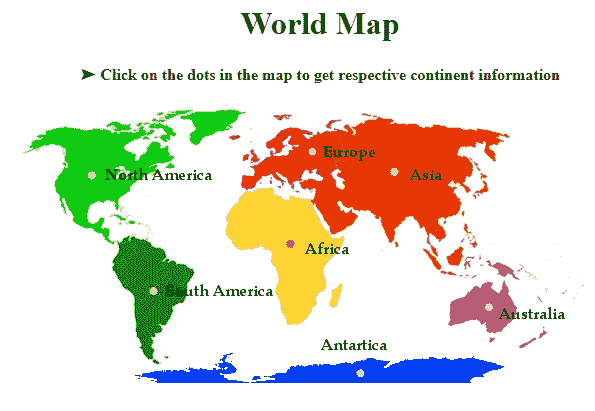
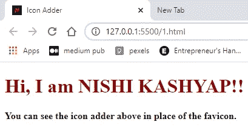
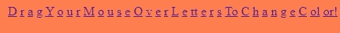
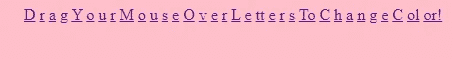
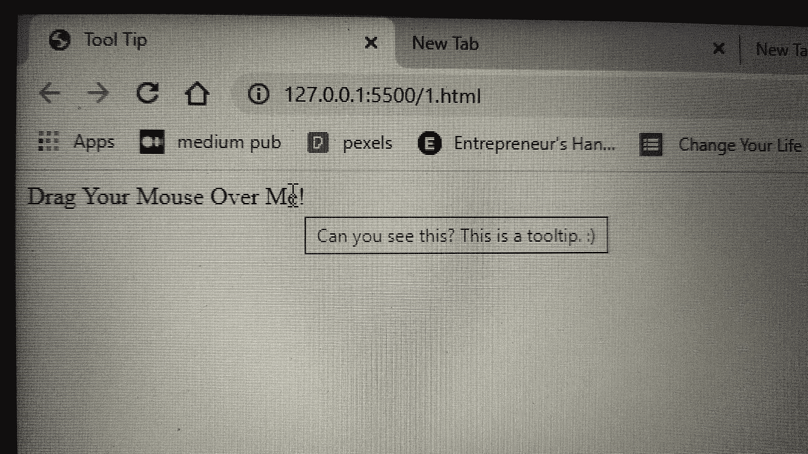
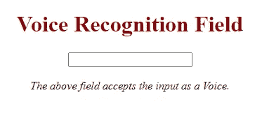
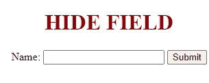
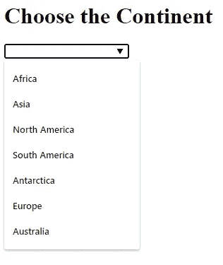

# 让你惊叹的 7 个 HTML 技巧

> 原文：<https://betterprogramming.pub/7-html-tricks-that-will-wow-you-8a9404e8faab>

## 你不需要知道 CSS 或 PHP 来建立一个奇特的网站。使用这些很酷的 HTML 技巧来生成令人敬畏的效果


来自[像素](https://www.pexels.com/photo/silver-imac-displaying-collage-photos-1779487/?utm_content=attributionCopyText&utm_medium=referral&utm_source=pexels)的[设计生态学家](https://www.pexels.com/@designecologist?utm_content=attributionCopyText&utm_medium=referral&utm_source=pexels)的照片

我们倾向于将 HTML 与 CSS、JavaScript 等结合使用。，使我们的网站或博客看起来更有吸引力，但你知道吗，HTML 本身就有很多实用的秘密，可能会派上用场，并帮助你设计一个华丽的网站？

下面是一些很酷的 HTML 技巧，你可以用它们来建立一个真正动态的网站。

# 招数 1。图像地图

一个[图像地图](https://www.w3schools.com/tags/tag_map.asp#:~:text=An%20image%20map%20is%20an,areas%20in%20the%20image%20map.)基本上是一个带有可点击区域的图像。我们可以使用该可点击区域链接到网页的其他部分、文档或新链接。

嗯，不是每个人都知道这样一个事实，即`<map>`元素可以定义用户可以点击的图像区域。我们所需要做的就是使用`<area>`元素，并在`<map>`元素中提到它对应的 XY 坐标。

下面是一个例子，当你的网站访问者点击世界地图上的不同大洲时，他们可以了解你在全球的业务。



# 招数二。图标加法器

*图标添加器*基本上是指用图标代替收藏夹图标。

您只需要在 body 标记内的 link 标记中包含源图像文件的路径链接。

输出:



# 招数三。允许用户选择背景颜色

使用这种技巧，网站访问者只需将鼠标指针拖到文字的某些字母上，就可以更改网页的背景颜色。

示例:在这种情况下，访问者可以通过将鼠标指针拖动到“将鼠标拖动到字母上以改变颜色！”文字。

输出:



当你拖动鼠标到不同的字母时，背景会改变颜色

# 招数四。添加标题工具提示

[Tooltip](https://www.educba.com/html-tooltip/) 是“HTML 中使用的一个概念，用于显示关于特定选择的元素的一些额外信息。”

这个技巧基本上显示了当访问者将鼠标指针悬停在某个元素上时，站点创建者提供的额外信息。

语法:

```
<span title="Can you see this? This is the tooltip.:)">Drag Your Mouse Over Me!</span>
```

输出:



# 招数 5。声音识别

这个功能类似于你在谷歌搜索文本框中看到的功能，语音识别功能可以帮助你将句子输入到输入框中。

当您使用语音识别输入时，会有一个小麦克风图标显示在输入栏的旁边，当访问者单击该语音图标时，他们的语音将被记录下来并用作用户的输入。

为了做到这一点，您只需将`x-webkit-speech`属性添加到输入框中。

```
<input type="text" x-webkit-speech />
```

让我给你看一个例子:

输出:

但是，在实时服务器中，您会看到:



但是当你从其他浏览器查看时，你也会在输入栏中看到麦克风图标，用户可以通过它输入他们的声音。

# 招数 6。隐藏字段

能够公开看到内部字段被 Reddit 士兵称为“编程恐惧”——毫无疑问，没有人希望在他们的网站上经历这种恐惧。

但是这个问题可以通过使用 HTML 的隐藏字段特性来解决。

当访问者提交表单时，隐藏字段允许 web 开发人员控制可以或不可以修改的数据，或者需要更新的记录。

语法:

```
<input type="hidden">
```

它是这样工作的:

从上面的代码来看，结果输出将是一个隐藏字段，访问者将无法看到。

输出:



# 招数 7。输入建议

这个功能基本上提供了一个预定义选项的下拉列表，使访问者更容易找到他们想要的东西。

示例:下面的代码让访问者从下拉列表中找到不同大洲的名称，并将其用作输入。

代码:

输出:

[](https://javascript.plainenglish.io/10-must-watch-programming-movies-you-shouldnt-miss-as-a-programmer-5989a9d4c400) [## 作为程序员不应错过的 10 部必看编程电影

### 你的编码眼睛无论如何都不应该错过的电影

javascript.plainenglish.io](https://javascript.plainenglish.io/10-must-watch-programming-movies-you-shouldnt-miss-as-a-programmer-5989a9d4c400) [](https://javascript.plainenglish.io/5-best-side-hustles-to-a-make-six-figure-passive-income-as-a-programmer-3392f0d6bc53) [## 作为一名程序员，5 Best Side 的被动收入高达六位数

### 通过这些副业每月赚取 500 到 150，000 美元

javascript.plainenglish.io](https://javascript.plainenglish.io/5-best-side-hustles-to-a-make-six-figure-passive-income-as-a-programmer-3392f0d6bc53)