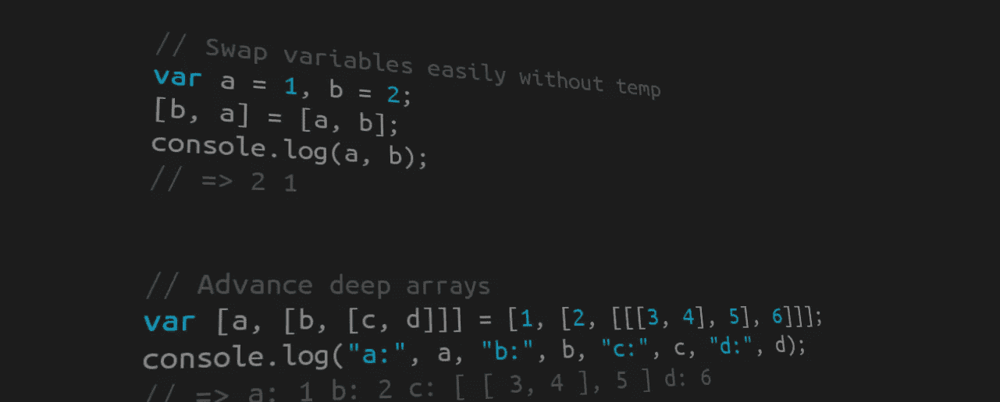

# 7 JavaScript 模式第 1 部分:从属性生成变量

> 原文：<https://betterprogramming.pub/7-js-patterns-part-1-switching-from-properties-to-variables-and-reverse-3d86fea07c1d>

## 所有初级开发人员都应该知道的 JavaScript 模式系列的第一部分



# 从属性切换到变量…看起来像什么？

自从 ES6 发布以来，有几种方法可以将变量的值/引用分配给属性，反之亦然。一方面，我们有**增强的对象字面量**，另一方面，有**析构赋值**。

增强的对象文字是从变量中分配对象属性的一种方式，如下所示:

析构从对象的属性创建变量，如下所示:

** * * ES6 及更高版本支持，* [*文档*](https://developer.mozilla.org/en-US/docs/Web/JavaScript/Reference/Operators/Destructuring_assignment) *****

# 怎么解码？

## **增强的对象文字**

假设您声明了两个变量:

```
const model = "civic", wheel = 4
```

使用增强的语法创建一个对象文字，如下所示:

```
const my_car = {model, wheel}
```

与没有增强语法的情况相同，如下所示:

```
const my_car = {model: model, wheel: wheel}
```

很明显，对吧？这就是每次遇到增强的对象文字时需要看到的内容。它创建一个对象属性，其名称和值/引用与用来增强对象的变量相同。

## **解构**

现在让我们假设你有一个看起来像这样的物体:

```
const car = {
  model: "civic",
  brand: {
    name: "Honda",
    founding_year: 1948
  }
}
```

如果使用析构赋值创建变量:

```
const {model, brand} = car
```

这和不这样用是一样的

```
const model = car.model, brand = car.brand
```

这一条可能不太明确，但同样的原则适用。
在变量赋值的一边，你把你想访问的所有属性的名字作为一个变量写在一个对象文字里。另一方面，编写要从中提取属性的对象。像这样制作的变量将与它的属性具有相同的名称和相同的值/引用。

# 它们有什么用？

我们讨论的模式是为了让你的代码枯燥无味(不要重复)。


例如，假设我们想创建一个函数来记录你有多爱你的车:

使用析构赋值可以省去我们每次想要访问其属性时键入 *your_car* 的麻烦。因此，析构赋值是使用同一个对象的属性而不用多次提及它的一种更简单的方法。增强对象文字是用变量创建对象的一种更简单的方法，因为如果属性名称与变量同名，就不必指定属性名称。

而且，你知道我还可以更干 *loveYourCar* 功能吗？

是的，的确，你也可以在函数参数中使用析构赋值，只要那个参数是一个对象。

## 有趣的仿真陈述

在 webpack 中，当您从这样的库中导入模块时:

```
import {Text, View} from 'react-native';
```

你实际上只是在使用析构赋值！

# 有什么你应该知道的怪癖吗？

是的，有一个，虽然它实际上更像是 JS 的一个怪癖。

JS 通过所有原语(数字、字符串、布尔值等)的值和对象的引用来分配变量或属性。[点击此处了解更多信息](https://codeburst.io/explaining-value-vs-reference-in-javascript-647a975e12a0)。让我们看一个增强对象文字的例子:

具有相同引用的属性或变量赋值将指向同一个对象。因此，此对象的变异会对其所有引用产生影响。非常注意这一点。

# 我们到此为止

这个系列的下一步:[扩展语法](https://medium.com/@patick.cyiza/js-patterns-part-2-the-spread-syntax-9f7e66038c86)

[点击此处查看完整系列。](https://medium.com/@patick.cyiza/7-js-patterns-junior-developers-should-know-well-1a0ad075338f)