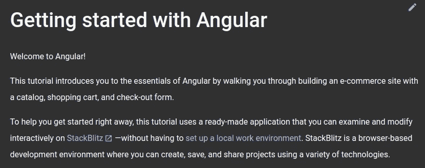
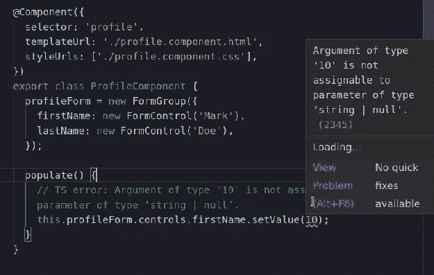

# 角度状态的 7 个关键点——Google I/O 2022

> 原文：<https://betterprogramming.pub/7-key-points-from-state-of-angular-google-i-o-2022-6f2c95540cac>

## [角度](https://medium.com/@lorenzozar/list/angular-5496c492a185)

## Google I/O 和 Angular 14 的亮点


照片由[米切尔罗](https://unsplash.com/@mitchel3uo?utm_source=medium&utm_medium=referral)在 [Unsplash](https://unsplash.com?utm_source=medium&utm_medium=referral)

Google I/O 是 Google 举办的开发者大会。“I/O”代表输入/输出，口号是“开放创新”

谷歌已经结束了长达两个小时的 I/O 主题演讲，里面塞满了信息。人工智能、Android，当然还有一系列 Pixel 硬件都被提到了。

我只是想说，除了我在这篇文章中总结的，还有很多东西。

这里我们将重点关注 Angular 和这个框架的未来。马克·汤普森和艾玛·特沃斯基在 Angular 的*状态中提到的要点与 Angular 14 的一些主要特征一致。*

Angular 14 将于 2022 年 6 月发布，但你可以在 [Angular 的 Github 页面](https://github.com/angular/angular/blob/main/CHANGELOG.md#1400-rc1-2022-05-18)上阅读更多关于发布候选版本 14.0.0-rc.1 的信息！

# 角度状态

通过这七个要点，您将看到这些变化是如何有机地相互支持和建立的。

同样，Angular 14 将通过改进其中一些点来增强 Angular。


马克·汤普森和艾玛·特沃斯基在谷歌 2022 年 I/O 大会上的演讲

# 1.常青藤发动机

Angular 团队彻底重写了 Angular 的运行时和编译器，因此应用程序现在由更好、更高效的 [Ivy 渲染引擎](https://docs.angular.lat/guide/ivy)提供支持。

以下是 Ivy 引擎提供的一些优势:

*   改进的类型检查和错误报告，更好的调试，以及更小的包大小，这要归功于对树摇动的强调(更多内容见下文)
*   [角度语言服务](https://angular.io/guide/language-service)VS 代码插件
*   [角度开发工具](https://angular.io/guide/devtools)浏览器扩展

Ivy 承诺在角度应用方面做出重大改变。

如上所述，常春藤非常强调摇树。这是 TypeScript 编译器检查您的代码并确定哪些库是必需的，然后移除任何不必要的代码的过程。

因此，分布式代码将显著减少，应用程序的加载速度将会提高。

此外，常春藤应该使建筑构件更加相互独立。这通过在重新编译应用程序时只编译已经改变的组件来减少开发时间。

这就把我们带到了下一个重点:独立组件。

# 2.独立组件

在 [Angular 的博客](https://blog.angular.io/an-update-on-standalone-components-ea53b4d55214)上，我们可以看到独立组件的目标是“*减少样板文件，使 Angular 更容易使用和学习，使构建没有 NgModules 的组件和应用成为可能。”*

这很重要，因为，除了别的以外，它想让新开发人员更容易学习 Angular！

## 角度 14 和独立组件

独立组件是 Angular 14 的主要特性之一。

独立组件没有在任何现有的 NgModule 中定义，它处理其依赖关系，而不是依赖 NgModule。可以直接依赖它，而不需要中间模块。

我们应该能够编写如下组件:

```
import {Component} from '@angular/core';

@Component({
  standalone: true,  
  template: `Standalone component!`
})
export class LonelyComponent {}
```

独立标志是`@Component`装饰器元数据的一个属性，它将一个组件指定为“独立的”

换句话说，独立标志表示组件可以单独使用。

在许多情况下，独立组件可能会减少样板文件。

# 3.新入门

Angular 团队正在为刚接触框架的开发人员设计一个新的入门路径。



角页入门

这是一个非常好的消息，因为当前的学习道路相当陡峭，尤其是对于新开发人员。

我的小[棱角教程](https://www.vitainbeta.org/2022/04/29/angular-tutorial-and-posts/)可能很快就会过时。但是如果有更好的东西存在，它肯定会使整个社区受益。

# 4.到处都是打字稿

您可能知道，Angular 是一个固执己见的框架，默认内置了最佳实践。

Angular 努力保持强大的默认和最佳实践。为了支持这一愿景并实现开发人员最需要的特性，Angular 在 Angular 模板中增加了对类型化表单的支持。

## 角形 14 和打字格式

[在 Angular 模板中支持类型化表单](https://github.com/angular/angular/discussions/44513#user-content-prototype)是一个必需的特性，它将增强类型检查和错误报告以及更好的调试。

让我们看看下面的代码。这是 Angular 团队提供的[原型代码](https://github.com/angular/angular/discussions/44513#user-content-prototype)的简化。

使用键入形式的角度代码

我试图将`*firstName*` 属性的值设置为一个数字，我立即得到一个 TypeScript 错误: *TS 错误:类型为“10”的参数不能赋给类型为“string | null”的参数*



使用类型化表单时出现类型化脚本错误

这非常酷，因为即使第 17 行的代码在`populate()`方法中并且没有执行，TypeScript 也会通知我这个错误。

在其他情况下，我只是在本地试用我的应用程序时偶然发现了它。或者更糟的是，用户会在生产几天或几周后告诉我。

使用 Stackblitz 上的角度 14 找到此[示例，并将其与使用角度 13](https://stackblitz.com/edit/angular-typed-forms-ex-kqbvwm?file=src%2Fapp%2Fprofile%2Fprofile.component.ts,src%2Fapp%2Fprofile%2Fprofile.component.html) 的相同[代码进行比较。](https://stackblitz.com/edit/angular-ivy-bmyr7m?file=src%2Fapp%2Fprofile%2Fprofile.component.css,src%2Fapp%2Fprofile%2Fprofile.component.ts)

你会很快注意到 Angular 13 会让你毫无怨言地前进，尽管有潜在的代码风险。

# 5.可量测性

Angular 清楚地表明，尽管它是一个固执己见的框架，但它可以支持不同的需求:

*   独立开发人员:新的独立组件使启动变得更加容易，没有太多的样板文件。CLI 已经使得创建一个新的 Angular 应用程序、组件和其他东西变得像`ng new`一样简单。
*   初创公司:Angular 语言服务保证开发者产生一致的代码。多亏了打字和工具，开发人员可以在部署之前发现错误。
*   扩大规模:国际化和渐进式网络应用(PWA)将变得有用。此外，由于固执己见，很容易开始从事一个不同的项目，并确切地知道它会是什么样子。
*   大型组织:微前端是下一步吗？

在所有这些中，通过使用 [update.angular.io](https://update.angular.io/) ，每当一个新的主要版本出现时，或者更频繁地更新 Angular 是相当容易的。

# 6.改进的可访问性

这是一个新特性，允许更容易地定义唯一的页面标题。这解决了 web 框架中常见的可访问性问题。

使用 a11y 服务，提供独特、简短的页面名称，帮助人们立即理解网页的内容和目的。因为页面标题是屏幕阅读软件报告的第一个元素，所以对于有视觉障碍的用户来说，它们是至关重要的。

因为 Angular 是一个单页面应用程序，所以大多数转换，比如切换到新页面，都不需要页面刷新。直到最近，这意味着每个页面都有相同的标题，这对理解页面的内容或目的毫无用处。

## 角度 14 提高了可达性

在 Angular 14 中，路由器将提供一种超级简单的方法来构建唯一的页面名称。

```
const routes: Routes = [
  { path: 'shop', component: HomeComponent, title: 'Home - CompanyName' },
  { path: 'about', component: ShopComponent, title: 'Shop - CompanyName' },
  { path: 'locate', component: ContactsComponent, title: 'Contacts - CompanyName' },
  { path: '',   redirectTo: '/home', pathMatch: 'full' },
  { path: '**', component: HomeComponent },
];
```

这使得开发人员在创建页面标题时更容易遵循标准实践。

# 7.新命令

更多的诊断有助于代码编辑在部署之前警告开发人员常见的错误。这里我们有两个新的 CLI 命令:

*   `ng analytics`:控制和打印分析设置的方法
*   `ng cache`:控制和打印缓存信息的方式

目前，编译器不提供任何警告，只有当出现阻碍编译的致命错误时才会失败。

额外的诊断将使提供警告来检查小错误或像 foo？？当 foo 不可为空时为“bar”。

根据 Github 上的问题，建议的解决方案将在编译器中添加一个“*新的私有标志，该标志启用“扩展模板诊断”检查，提供关于用户模板的警告/信息诊断，这些模板严格来说不是致命错误。*

*这个问题主要是关于构建所需的基础设施，但我们应该包括一两个简单的检查来验证系统*。

# 结论

在 YouTube 上查看 Angular 视频的整个[状态。](https://youtu.be/ukGoWyla2lI)

演讲以“*这是成为 Angular 开发者的最佳时机。”*

至少，这是在你的项目中使用 Angular 的一个非常酷的时刻！

感谢阅读。