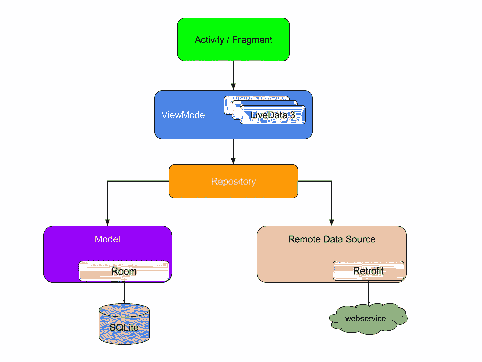
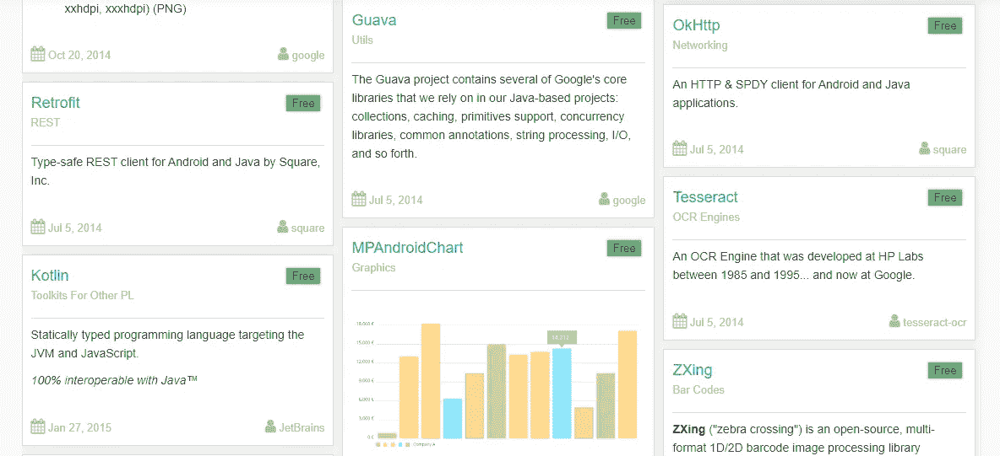
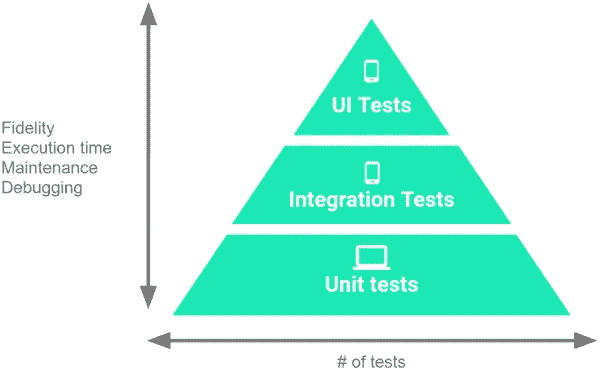
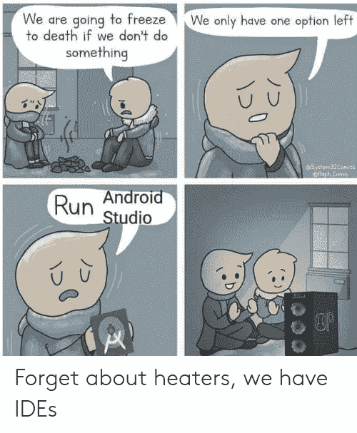

# 我在两年的 Android 开发过程中学到的 7 个教训

> 原文：<https://betterprogramming.pub/7-lessons-i-learned-in-two-years-of-android-development-5d06ee744082>

## 我希望在开始 Android 开发时就知道的事情

从我第一次对 Android 开发感兴趣到现在已经两年多了。今天，在几个项目和许多例外之后，我想和你们分享我在这个短暂的旅程中学到的七个教训。

# 1.选择正确的架构，并从一开始就使用它

你听说过 MVC、MVP、MVVM 等这些首字母缩写吗？？它们是不同的软件架构，你应该知道它们。

许多初学者在 activity 类中编写他们所有的代码，这在开始时似乎还可以。但是相信我，事实并非如此。

随着项目的增长，您的代码将会越来越混乱和强耦合，使得测试、维护和新功能的开发变得非常困难。

这就是为什么你应该从一开始就采用一个清晰的软件架构。正如我之前所说，有几种，每一种都有利弊。迄今为止，这是谷歌推荐的应用架构:

[Android 开发者推荐的应用架构](https://developer.android.com/)

从上图可以看出，每个组件只依赖于它下面一级的组件。

这种设计创建了一致的 UX，尊重关注点的分离，并针对测试和可伸缩性进行了优化。显然，不存在适用于任何情况的单一完美结构，正如谷歌所说:

> 不可能有一种编写应用程序的方式最适合所有场景。也就是说，这个推荐的架构对于大多数情况和工作流来说是一个很好的起点。

## 资源

因为这不是本文的目的，所以我不会解释这个架构的细节，但是我会列出所有有用的资源:

*   [应用架构指南](https://developer.android.com/jetpack/docs/guide)
*   [Android 架构组件基本样本](https://github.com/android/architecture-components-samples/tree/master/BasicSample)

# 2.第三方库:找到正确的平衡

Android 军火库中的一些库

当我开始我的第一个项目时，我想一切从零开始。我几乎拒绝使用第三方库。我可能以为我能学到更多。

虽然这对于第一个项目可能没问题，但通常是错误的。用这种方法，你最终会浪费很多时间去重新发明轮子。不要这样做。

第一次体验后，我开始使用开源库。太棒了，有一个适合各种情况的免费图书馆。所以，我开始添加一个库，然后另一个，然后另一个。

你猜怎么着？最终，我的项目只不过是一大堆第三方库。不要这样做。谨慎选择库。并不是所有的都写得很好，很可靠。

所以，我的建议是找到合适的平衡点。如果你在开发过程中遇到了问题，而有人已经用一个很棒的库解决了它，那就使用它。如果需要 HTTP 客户端，可以用[改装](https://square.github.io/retrofit/)。

如果你需要下载和管理许多图片，你可以使用 [Glide](https://github.com/bumptech/glide) 。这些都是优秀的库，非常知名，也很稳定。

同时要知道，并不是所有的图书馆都是这样的。总是检查作者是谁，如果你有时间，探索源代码，并试图了解问题是如何解决的。

## 资源

[安卓兵工厂](https://android-arsenal.com/)维护着一个巨大的数据库，几乎包含了所有可用的安卓库。

# 3.从简单干净的用户界面开始

如果你在大公司做安卓开发者，app 的 UI/UX 设计就交给设计师了，你就不用担心了。

相反，如果你在一家初创公司工作，或者甚至是为个人项目工作，你很可能需要负责 UI/UX 设计。相信我，就像一个好的界面可以为一个好的产品锦上添花一样，一个坏的界面可以完全毁掉一个伟大的产品。

> “用户界面就像一个笑话，如果你必须解释它，它并没有那么好。”—马丁·勒布朗

我过去经常犯的一个错误是把太多东西放在界面上。过多的元素会给用户造成混乱，并且经常会产生不好的美感。我的建议是从简单开始。非常简单干净。

尤其是如果你没有很好的设计技巧。尽量做非常基础和用户友好的界面。当你有了它，你可以试着提高审美，给你的用户留下更难忘的印象。

记得在不同尺寸和 DPI 的显示器上测试你的 UI。永远不要使用固定的测量单位，如 px，始终使用动态单位，如 dp *(文本使用*或 sp )。

## 资源

*   [Dribbble](https://dribbble.com/) :当你不知道从哪里开始时，你可以在这个梦幻般的设计师社区中寻找灵感。
*   Google Material Design:一个由指南、组件和工具组成的适应性系统，支持用户界面设计的最佳实践。
*   日常事物心理学:一本关于日常生活中可用性的好书，作者唐·诺曼。

# 4.测试，测试，测试

你有多少次想过:“我在我的智能手机上测试了这个应用程序，它工作了！”

我们都知道这还不够。也许减少测试阶段会在开发过程中节省你几天的时间，但是会在生产中花费你几周的时间！

一个好的测试阶段可以帮助你在发布前检查你的应用程序的健壮性、操作性和可用性。

我应该如何测试我的应用程序？这是一个非常广泛的话题。有不同类型的测试，每一种都有特定的目的。

Android 开发者的测试级别

如图所示，我们可以确定三个测试级别:

*   单元测试:一次验证一个类的行为。
*   集成测试:验证一个模块中不同层次的堆栈之间的交互或者相关模块之间的交互。
*   UI 测试:验证 UI 行为和用户流。

基于你的应用的用例，你需要决定执行多少不同类型的测试。

Google 建议的一个经验法则是将你的测试分成 70%的小型测试(单元测试)，20%的中型测试(集成测试)，10%的大型测试(UI 测试和端到端测试)。

## 资源

*   [在 Android 上测试应用](https://developer.android.com/training/testing):这是你开始测试应用所需要的一切。
*   [Android 上的 TDD](https://www.youtube.com/watch?v=pK7W5npkhho&start=111):来自 Google I/O 2017 的 TDD 上的视频会话。

# 5.Android Studio 是你的朋友

当然，你已经在使用这个 IDE 了，但是你正在开发它的所有潜力吗？

Android Studio 内置了许多工具，可以帮助您开发应用程序。以下是我最常用的一些:

*   设备仿真器，用于测试您的应用在不同 Android 版本的各种设备上的行为。
*   APK 分析器通过检查 APK 内容来分析应用程序的大小。
*   实时分析器，用于分析 CPU、内存和网络使用情况的实时统计数据。
*   Firebase Assistant 将应用程序连接到 Firebase，只需点击几下，即可添加您需要的所有 Firebase 服务。
*   Vector Asset Studio 可以轻松地为每种密度大小创建新的图像资源。

你知道 Android Studio 还有一个功能可以把你的电脑变成一个炉子吗？

## 资源

欲了解更多信息和功能，请参见 [Android Studio 用户指南](https://developer.android.com/studio/intro)。

# 6.总是使用 Git

Git 是一个*版本控制系统(VCS)* 和在一个非常基础的层面上，VCS 允许你做两件伟大的事情:跟踪你的文件中的变化，并且它简化了与多个开发人员合作的大型项目。

> 我不明白为什么我应该使用 Git，我可以简单地对我的项目进行备份。—我，三年前

我知道，我知道。

现在，让我告诉你三年前就应该有人告诉我的话:你需要 Git。Git 可以极大地改善您的工作流程。为什么？以下是一些很好的理由:

*   您的源代码安全地存储在云中，可以在任何地方访问。
*   您的代码的所有过去版本都是可用的。您可以检查旧版本，甚至在出错时返回。
*   团队合作被简化了。每个开发人员可以在一个并行分支上工作，并在需要时合并变更。
*   您可以为数千个开源项目做出贡献。
*   有了 GitHub 和 [BitBucket](https://bitbucket.org/) 这样的平台，你就有可能创建并展示你的项目组合。

还有很多其他原因，但我希望这些原因足以让人们明白:如果你认为你不需要 Git，那你就错了。

## 资源

[GitHub](https://try.github.io/) 和 [BitBucket](https://www.atlassian.com/git) 指南 Git 入门。

# 7.使用发布清单

格伦·卡斯滕斯-彼得斯在 [Unsplash](https://unsplash.com/s/photos/list?utm_source=unsplash&utm_medium=referral&utm_content=creditCopyText) 上的照片

有时候你认为你的应用程序已经可以发布了。但真的是这样吗？你怎么能确定？在这个阶段，你不应该太草率，最好问自己几个问题:

*   我删除了调试代码吗？
*   我做了足够的测试吗？
*   我是否更新了构建目录中的名称和版本代码？
*   我让 Proguard 混淆了 APK 代码了吗？
*   我的应用程序本地化了吗？
*   我在 Google Play 上准备好开发者账号了吗？

如果你对所有这些问题都回答“是”，那么你就可以继续。我建议你生成一个 Android 应用捆绑包( *aab* )而不是 APK 来优化你的应用的大小和资源。

在 Google Play 上发布应用程序后，总是检查用户反馈和所有的分析。它们将极大地帮助你改进你的应用。

## 资源

这里有一个由 Android 开发者制作的很棒的[发布清单](https://developer.android.com/distribute/best-practices/launch/launch-checklist)。

# 最后的话

我试图与你分享我在 Android 开发经历中学到的一些最重要的经验。我相信还有很多要学的。

如果你有其他重要的建议，尤其是对初学者，请在下面的评论中告诉我。