# 软件开发内容的 7 个营销策略

> 原文：<https://betterprogramming.pub/7-marketing-strategies-for-your-software-development-content-5df1b44780db>

## 用你的软件开发内容吸引更多的观众


梅勒妮·德泽尔在 [Unsplash](https://unsplash.com?utm_source=medium&utm_medium=referral) 上的照片

为软件开发人员创建内容既棘手又耗时。在这篇文章中，我将解释你可以做些什么来充分利用你的内容并吸引更多的观众。

我给你介绍:

*   [出版前推广](#844d)
*   [重写内容](#6ab4)
*   [发布到第三方平台](#34bf)
*   [改变内容用途](#b363)
*   [后续内容](#fad8)
*   [辛迪加](#7a3c)
*   [促销](#4eb8)

一旦你发表了一篇内容，你的工作就只完成了一半。为了让这些内容对您的开发人员社区产生影响并吸引更多的受众，您需要广泛地推广和重用它们。

我已经创建了一个示例工作流，作为您如何使用博客帖子完成此操作的指南:

 [## 内容工作流—开发博客文章

### 编辑描述

miro.com](https://miro.com/app/board/uXjVOJ2yfao=/?invite_link_id=518405254629) 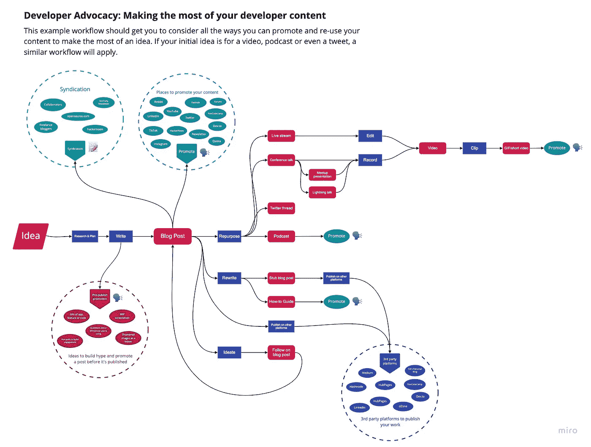

充分利用软件开发博客帖子

该工作流程基于一篇博客文章。对于视频、播客、会议演讲等，情况会略有不同。，但原则是相同的—在内容制作的每个阶段，你都应该考虑如何有效地重用内容，以及如何推广内容。

在本文中，我将使用示例工作流作为指南。我们来分解一下。

# 发布前提升

首先，你应该在发布内容之前推广它。如果你在社交媒体上有粉丝，不管数量有多少，或者你在某个社区很活跃(想想 Reddit、T21、不和谐的工作场所等等)。)，那么你甚至可以在内容完成之前就开始推广它。你会惊讶有多少人对你的工作感兴趣。

假设你正在写一篇关于如何使用 API 的博文教程，你可以发布一个贵由构建的与 API 交互的工作示例。

或者，问问人们对内容的某个方面有什么看法。进行一次投票，询问应用程序设计 A 和 B 哪个更好，他们最感兴趣的是什么特性，或者他们在使用 API 时面临什么常见问题。

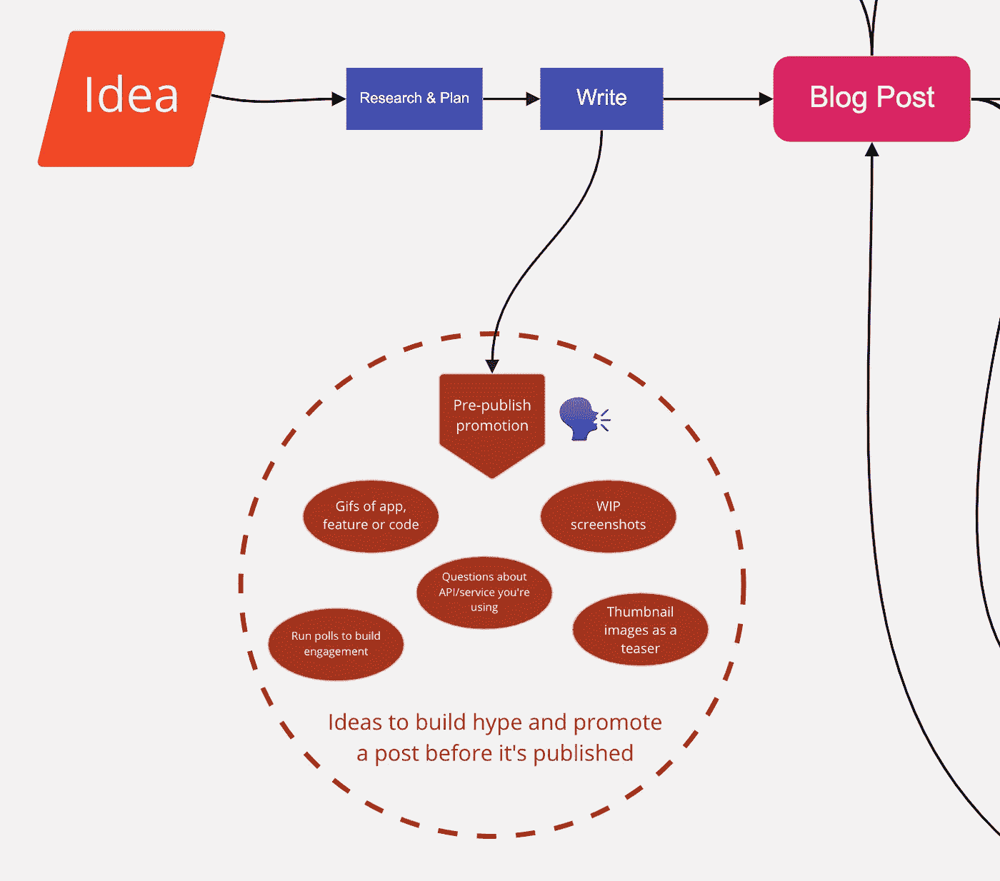

博客文章内容工作流程的发布前推广部分

在出版前宣传和吸引读者的另一个好处是，它可以在你的作品完成之前给你反馈。

## 先推广后发布的例子

一个在 YouTube 视频上做得很好的人是尼古拉斯·雷诺特。在视频完成之前，他们会在频道上发布他们正在做的东西。他们发布预览和截屏，并且他们经常向他们的订阅者征求意见。

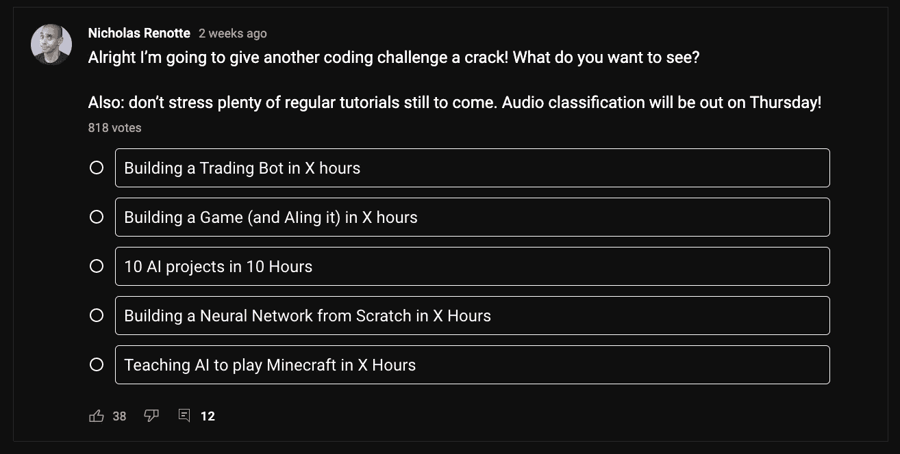

寻求反馈，告诉他们下一步应该做些什么

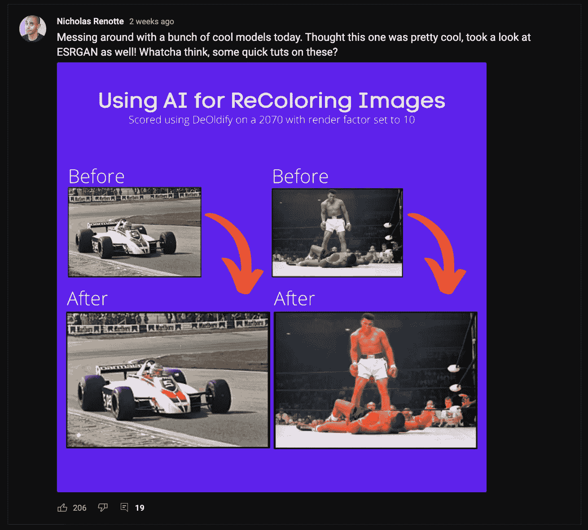

通过张贴他们的结果戏弄一个新的教程

> 给你一个警告:如果你在某样东西完成或出版之前推广它，一定要完成它。没有什么比言过其实更让观众沮丧的了！

在你完成内容之前推广它是一种快速获得成功的方式，并且富有想象力地思考如何吸引你的观众是一件有趣的事情。

# 重写内容

一旦内容发布，就该考虑重写了。重写内容是一个简单有效的方法来最大化你的影响力。对于我们的博文示例，我们可以将博文转换成一篇[的存根文章](https://en.wikipedia.org/wiki/Wikipedia:Stub#:~:text=A%20stub%20is%20an%20article%20that%2C%20although%20providing%20some%20useful,are%20not%20regarded%20as%20stubs.)或者一个操作指南。通常，你可以保留原作品的大部分内容，只需稍微重新格式化或编辑即可。

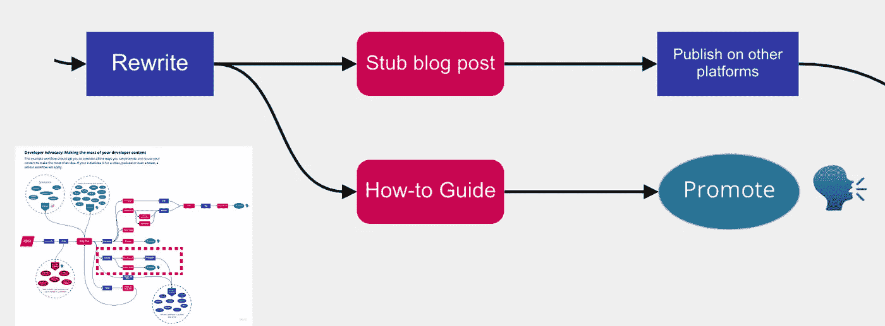

重写工作流程的一部分

## 重写内容的示例

[升级教程](https://leveluptutorials.com/)非常擅长改写自己的内容。查看他们的博客文章，[用 JavaScript 时态 API](https://leveluptutorials.com/posts/get-current-date-with-javascript-temporal-api) 获取当前日期。这是从 [API 文档](https://tc39.es/proposal-temporal/docs/#Temporal-Now)中创建一篇简单的简短博客文章的一个很好的例子。

# 发布到第三方平台

现在你已经发布了内容，是时候考虑还可以在哪里发布了。有很多平台可以发布你的内容。

像 [Medium](https://medium.com/) 、 [dev.to](http://dev.to/) 和 [Hashnode](https://hashnode.com/) 这样的网站是发布开发者内容的好地方。

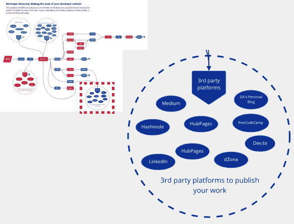

用于重新发布的第三方平台

> 出于 SEO 原因，发布到第三方平台时，记得使用[规范链接](https://bloggingguide.com/canonical-link/)。

## 向第三方平台发布内容的示例

Scott Galloway 非常擅长确保他的内容在尽可能多的地方发布。他的[网站](https://www.profgalloway.com/)上的所有内容都一丝不苟地发布在[其他平台](https://medium.com/@profgalloway)上，以吸引广泛的受众。

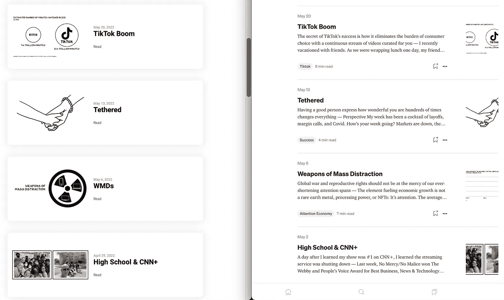

加洛威教授的博客和他的媒体博客

# 改变内容用途

重新调整内容用途就是将内容从一种格式转换为另一种格式。谁说你的博客文章不能形成一个伟大的 YouTube 视频的脚本？它能成为你在会议上演讲的基础吗？试着想出所有你可以使用的方法，以不同的形式重新利用你已经完成的工作，以达到更广泛的受众。

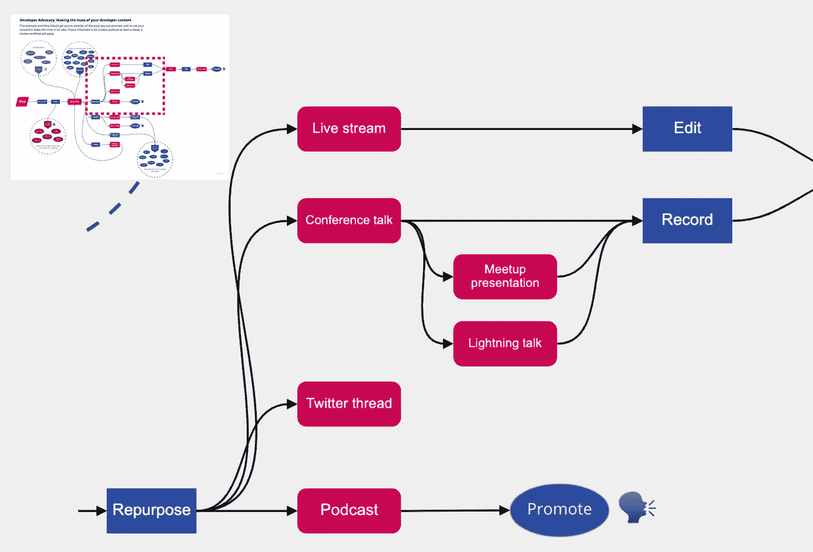

工作流程的重新调整部分

在工作流中，我给出了几个通过重新利用博客文章可以创建内容的例子。以下是我能想到的所有不同内容格式的列表:

*   博客帖子
*   录像
*   会议谈话
*   播客或音频片段
*   现场直播
*   Twitter 线程
*   时事通讯

我敢肯定还有很多！

改变内容用途的一个好处是，它让你能够利用你的好想法和成功。比方说，你发了一篇很棒的博文，被广泛分享，成为了一篇常青树。

它很棒，被整个开发者社区作为资源使用。如果它作为一个博客帖子如此成功，你可以相当肯定它将成为一个受欢迎的视频或会议演讲。

## 改变内容用途的示例

由[蒂姆·费里斯](https://tim.blog/)撰写的《泰坦的工具一书是重新利用内容的一个极好的例子。书中 90%的采访都来自他非常成功的同名播客。不是每个人都会用重用的内容来创作一整本书，但这是一个很好的例子，说明了什么是可能的。

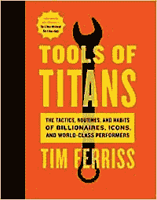

蒂姆·费里斯的《泰坦的工具》

# 构思和跟进

写一个主题可以激发你写一个相邻的主题，或者更详细地写主题的一个方面。当你正在写作或已经发表时，要时刻留意那些出现在你面前的想法。为后续行动保留想法可以帮助你利用你的成功，并找到一个核心受众。

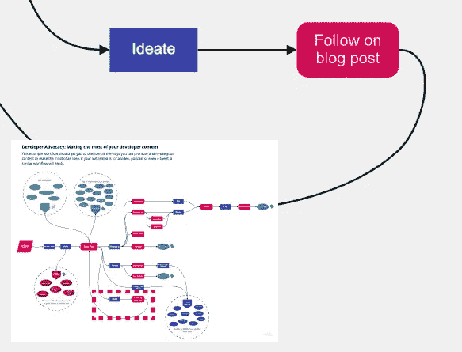

工作流程的后续部分

假设您写了一篇关于单点登录如何用于 web 应用程序身份验证的博文。这篇博文做得很好，很明显你的读者想要更多。您的下一篇文章可能是关于 OAuth、SAML 或无数其他授权主题的。

我们已经看到了一些重写、重新利用和构思内容的想法。接下来，我们来看看如何在不同的网站和平台上重用内容，以及如何推广开发者内容。

# 企业联合组织

辛迪加是将发布或广播的控制权交给多个网站、时事通讯或出版商的行为。

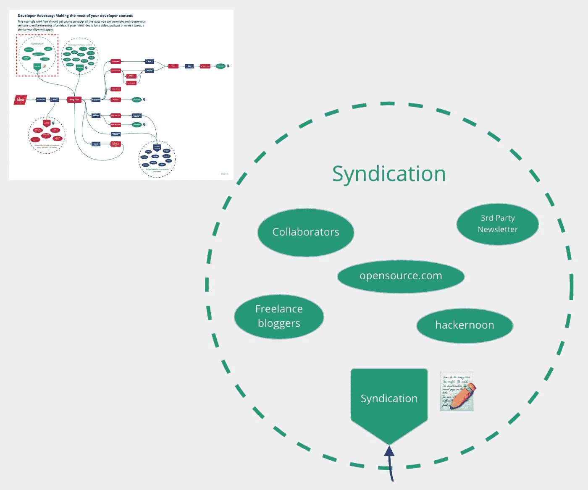

工作流的联合部分

这是内容工作流程中很小但很重要的一部分。本质上，你想尝试从别人那里借用观众。有无数的网站、时事通讯和第三方博客可供你选择——每一个都有自己的定位或专业。

这里有几个大牌可以考虑:

*   [哈克农](https://hackernoon.com/)
*   [走向数据科学](https://towardsdatascience.com/)
*   [GeeksforGeeks](https://www.geeksforgeeks.org/)
*   [更好的编程](https://betterprogramming.pub/)
*   [DZone](https://dzone.com/)

理想情况下，如果你想与联合伙伴建立关系，你会经常找到定期向出版商投稿的内容创建者。

辛迪加是一个双赢的局面:与你辛迪加的组织/个人获得了额外的内容，而你的内容得到了更广泛的分享。

# 促进

对许多人来说，为自己辩护并为自己的工作大声疾呼并不是自然而然的事情。然而，可以说推广和内容本身一样重要，而且随着时间的推移，你会做得更好。

有很多方法可以推广你的内容。在示例工作流中，我包含了一些您可以使用的社交媒体站点、社区和平台。

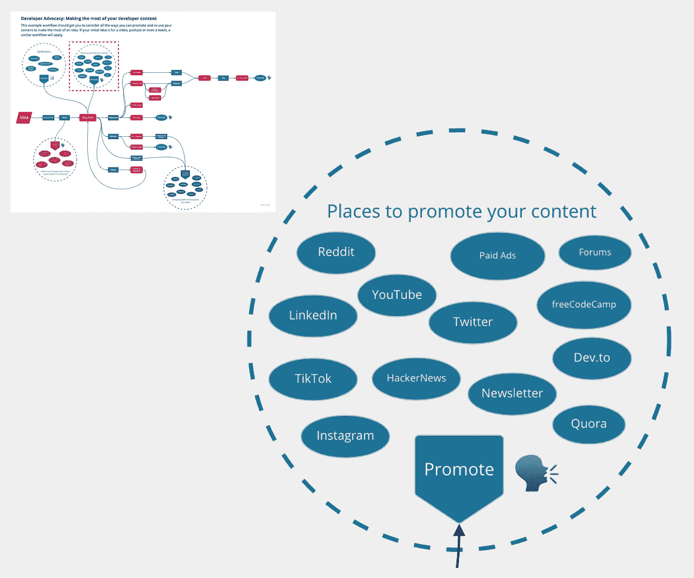

你应该试着在我提到的所有地方推广你的内容。

让我们来看看一些能让你的推广更有效的事情。

## Clickbait 有效

我们都讨厌 clickbait，但它的存在是有原因的。平台使用的算法优化点击，最终，它的工作！

你不必创造陈词滥调或低质量的标题和缩略图，但你应该考虑如何最大限度地提高点击量。问问你自己，为什么有人会点击我的帖子？

还有，一张图胜过千言万语。确保你的帖子有一个大小合适、易读、醒目的缩略图。创建高质量的缩略图需要时间和练习，但好处是巨大的。

[Clickbait 非常有效](https://www.youtube.com/watch?v=S2xHZPH5Sng)作者 [Veritasium](https://www.youtube.com/channel/UCHnyfMqiRRG1u-2MsSQLbXA) 是一个精彩的视频，描述了缩略图和标题对你的内容有多么重要——**我强烈推荐观看！**

[Clickbait 不合理的有效](https://www.youtube.com/watch?v=S2xHZPH5Sng)

## 一次次推广！

在推广某个东西的时候要记住的一点是，它不一定是一次性的。你可以多次推广同一条内容——尤其是在 Twitter 这样的平台上，那里的提要移动得非常快。你不想一遍又一遍地用相同的链接向你的观众发送垃圾邮件，但是为什么不发布几个月前的内容呢？

## 向他人伸出援手

如果你认识一个有很多追随者的人，并且你认为他们会感兴趣，那就和他们分享你的内容，并询问他们的想法。他们甚至可能会与观众分享！创作者通常乐于帮助他人，你的内容可能会引起他们的观众的兴趣。

如果作为你内容的一部分，你在推广他们的作品，这种方式会特别有效。也许你在你的博客文章中引用了一位安全研究员，他们可能会更乐意与他们的追随者分享你的内容，因为这显示了他们的工作正在产生的积极影响！

## 成功需要时机

不要为此过于烦恼，但是在合适的时间发布和推广你的内容会有真正的好处。如果你的大部分观众都睡着了，推广你的内容就没有意义了！

我的大多数读者都在美国和欧洲，所以我经常在格林威治时间下午 2 点左右发帖。这意味着每个人都醒了，而且美国的早间读者和欧洲的午间读者都很早。

## 时事通讯是经过反复试验的

建立一个邮件列表，并有一个定期通讯是令人惊讶的有效。电子邮件通常有很高的点击率，你的邮件列表是那些有意识地选择跟上你的工作的人。

此外，正如我在示例工作流的联合部分中提到的，尝试将您的工作包含在其他人的新闻稿中。

# 结论和概述

希望这篇文章能够启发您充分利用您的开发者内容。我们已经介绍了以下内容:

*   [发布前推广](#844d)
*   [改写内容](#6ab4)
*   [发布到第三方平台](#34bf)
*   [改变内容用途](#b363)
*   [后续内容](#fad8)
*   [辛迪加](#7a3c)
*   [促销](#4eb8)

感谢阅读！

```
**Don't forget!**[Follow me for more](https://codingwithryan.medium.com/) software development content!
```