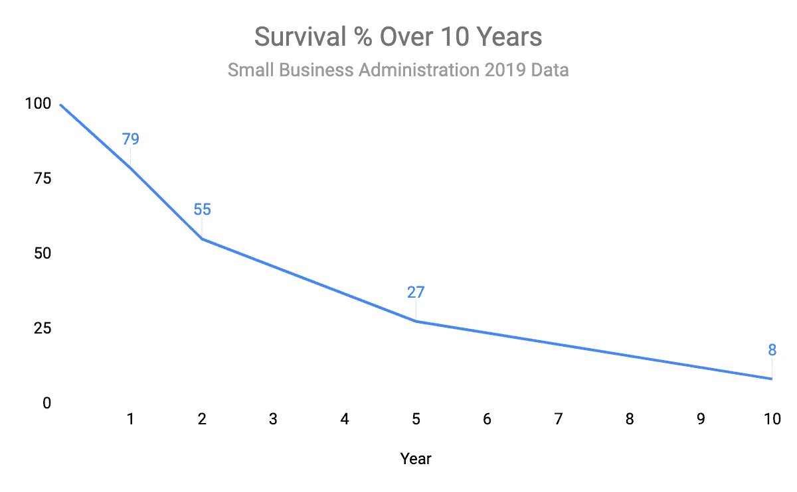

# 摧毁创业公司的 7 个精益错误

> 原文：<https://betterprogramming.pub/7-mistakes-that-destroy-startups-637ce74c851c>

## 以及如何识别和修复它们


由 [Unsplash](https://unsplash.com?utm_source=medium&utm_medium=referral) 上的[记者](https://unsplash.com/@perloov?utm_source=medium&utm_medium=referral)拍摄

2019 年，10 家创业公司中至少有 9 家在第 10 年失败。

与此同时,“精益”运动人气飙升。创始人和公司开始使用他们不懂的流行语，只是为了吸引人才和激发信心。

失败的创业公司和精益运动之间的联系？浪费。

到这篇文章结束时，你会更好地发现公司里最浪费的*活动。首先，我们将讨论什么是失败以及精益的起源*。*我还认为，在了解 7 大错误之前，说出关于精益的常见误区是很有价值的，但你可以随意跳过并直接进入这些误区！*

# 失败

当我听到人们谈论增长黑客、基于 web3 的新商业模式以及加速器/孵化器/风险工作室混搭时，听起来真的像是创业公司在过去十年左右已经成熟了！不幸的是，这些数据讲述了一个非常不同的故事。



2019 年创业公司整体失败率~90%。(*来源:StartupGenome，SBA)* 。这意味着，10 家初创公司中有 9 家在多年工作和花费数百万美元后，最终沦为告别邮件和 Linkedin 帖子。

在创业的世界里，失败是一种荣誉——但是失败不止一种。“快速失败”通常意味着迭代和学习，这是我们通常提倡的。

然后是“关闭公司，卖掉所有东西”这样的失败。那种失败是产生的浪费多于价值的结果。

在一个充满未知的高速发展的组织中，*学习*是关键价值，这就是为什么精益的目标是在学习更多的努力中减少浪费。

# 精益的起源故事

“精益”不是框架或银弹，而是一种心态。这种细微差别可能就是为什么如此多的创始人和创业团队似乎不理解精益。


大野泰一的照片

史蒂夫·布兰克(Steve Blank)被认为创造了精益运动，受到了丰田的大野泰一(Taiichi Ohno)和现有的敏捷开发运动的影响。Eric Ries 在他的书《精益创业》中推广并美化了这个概念。一些关键要点:

*   将实验置于精心计划之上
*   重视客户反馈胜过直觉
*   使用迭代的，而不是“预先”的设计过程

这些听起来可能很简单，但它们非常容易违反，有时作为违反它们所产生的问题的解决方案！

例如，当基于**直觉**构建产品时，第一个版本可能会扩大范围以考虑未知因素。当需要很长时间才能最终交付时，一个**精心策划的**流程作为一个有希望的解决方案被实施。

精益创业中的其他重要概念是“构建、测量、学习”、“旋转”及其与“跑道”的关系。我们将在后面的 7 个错误中更详细地讨论这些。

# 解决精益神话

## “精益意味着做低质量的工作”

没有。质量是相对的，只有客户的意见才是重要的。客户可能需要一个漂亮精致的用户界面，但也许他们更关心的是它的快速和安全，或者它的“前沿”感。无论如何，精益的目标是降低*成本，*而不是*质量*。

既然不能满足客户需求的“高质量”产品基本上是无用的，质量不应该阻止你学习如何最好地解决客户的问题。

## “你还是学到最后……”

也假。人们听说过“构建-测量-学习”这个术语，这是精益创业的一个主要主题，但这个概念并不取决于逆向规划。

例如，假设您想知道您的客户是否希望在您的 SaaS 产品中使用一种新型报告。您可以决定“兴趣”的度量标准，也许可以点击存根报告名称。构建“MVP”、存根报告名称(和必要的分析)可以帮助您了解目标。

## “客户访谈只是询问人们要制造什么”

众所周知，你不能相信客户会说出他们的需求，尤其是在创新方面。那么答案是什么呢？

一些企业家用这种智慧来证明完全避免客户开发的合理性。他们通常引用一句关于“更快的马”的话(亨利·福特可能做过客户访谈，但从未说过)。

客户只有在你让他们*推测*的时候才会撒谎。“这是一个好的产品吗，”“如果是我做的，你会感兴趣吗？”。

此外，如果你没有为面试做好充分准备，客户会很随意地开始面试你！他们会问你关于你的想法或产品，然后他们会祝贺你有这么好的想法。这将是一次愉快而无用的会议。

记得问好问题，“这个过程中最让你沮丧的是什么”，或者“你多久表演一次 X”。《妈妈测试》 这本书是一个关于如何找到潜在客户、与他们交谈并跟进的惊人资源。

长话短说，以下是我见过的扼杀或伤害初创公司的最常见错误。

# 1.在不知道是否有人会使用的情况下开发一个产品

*希望*不要出现在你的商业策略中。在你投入时间和金钱为客户创造产品之前，先找到他们。

我不是说“凭空挑选一个人口统计”，我是说找到真实的人。例如，意向书、销售线索或等候名单。

不要仅仅为了获得承诺而过度承诺早期客户*——*你最终会有一种错误的期望感，这种感觉会在第二阶段回来困扰你。

另一方面，在没有明确价值主张的情况下，不要空泛神秘。我们的目标是找到想要你产品的顾客，而不是尽可能多地吸引顾客。(使用市场营销进行客户开发可能是个例外，但前提是这对你来说是最低的提升)。

如果你不能证明有人会使用你的产品，你就不能证明花在开发上的时间没有浪费。


照片来自梦想之地，凯文·科斯特纳建了一个棒球场后，球员们神奇地出现在那里。

# 2.膨胀(最小可行的)产品

也称为特性蔓延或范围蔓延，这意味着在产品中包含不必要的特性。既然一个 MVP 是*最小*可行的产品，它应该是帮助你实现学习的最小/最便宜的东西。

相比之下，臃肿的 MVP(或成熟的产品)需要更长的时间来创建和发布，这延迟了我们关心的测量和学习。有时这种差异只是额外的几周，但也可能是几个月，甚至几年。显然建造它会花费更多，但是*在学习上的延迟*使得臃肿的 MVP 看起来昂贵。

人们合理化不必要的功能，他们说这是一个*平台 MVP，*或者说他们的客户已经*期待它*(见#1)。这些借口中有一个共同点:恐惧。

对失败的恐惧是一种强大的动力，对产品失败的恐惧也是如此。当要建立你的 MVP 时，记住人们拒绝它是可以的，甚至是必要的。

简而言之，不要让你产品中的所有想法都集中在一个大版本中。建立 MVP，你可以通过了解他们被设计成在某些时候会被拒绝来学习。


有人拿着一个“超级大口”的照片，和我见过的一些“MVP”一样大。

# 3.不旋转

如果你把前两个问题结合起来，你会得到一个功能齐全的产品，但它仍然没有找到市场。

这种情况下只有两种选择。许多创始人选择勇往直前，试图将这个产品变成一个成功。另一个选择是转向。

支点是基于你所学到的东西，对你的整体战略的改变。那可能是发现一个你可以服务的相关市场，或者你认为你可以解决的新问题。

很多时候，创始人认为旋转是软弱的表现，好像他们的工作就是从一开始就猜对。也许这是因为我们崇敬那些取得最大成功的创始人，而不是承认和处理他们的失败。

事实上，只要你的观点是基于信息的，这就表明你在集中注意力，而不是被自我所驱使。当你有新的信息时，不要害怕改变方向。


由[马克·加勒](https://unsplash.com/@markgaler?utm_source=medium&utm_medium=referral)在 [Unsplash](https://unsplash.com?utm_source=medium&utm_medium=referral) 上拍摄(whippets 运行和旋转)

# 4.沉没成本→死亡行军

这可能是一个公司最后的失误。沉没成本谬误是指加大投资，希望挽回已经失去的东西。这是“投其所好”。

在最后一个阶段，我们根据蟋蟀的声音推出了一款产品，然后决定不做 pivot。如果我们为我们缺少客户找借口，并继续建造*东西*，我们就是在接受沉没成本谬论。

在这个阶段，创始人可能会告诉他们的投资者，他们正在“为扩大规模做准备”，同时告诉他们的团队“相信他们”和“相信产品”。与此同时，他们会做任何可能让这些客户凭空出现的事情。

## 死亡行军

当团队*接受*沉没成本谬论时，死亡行军就开始了。

接受沉没成本谬论的团队是不理性的。他们现在使用轶事、感觉和政治来验证他们的想法，而不是硬数据。他们可以愉快地证明浪费的行为是正当的，比如镀金、重建偏好等等。

解决方案是**用数据来验证你的产品**甚至证明它的发展。不要接受轶事/感觉/直觉作为验证——跟进它们。

承认“一夜成功”是什么样子的，并让每个人都有责任找出如何实现这一目标。即使你*不会，*你也可以学到一些更有价值的东西，可以用来做支点。

如果做不到这一点，你应该愿意离开/拔掉插头。你不想靠借口生存，10 个创业公司中有 9 个失败，你可能会走在曲线的前面。


迈克尔在沉船的[挡泥板](https://unsplash.com?utm_source=medium&utm_medium=referral)上拍照

# 5.移动错误的指针

前四个错误形成了通往失败的明确路径，但有些错误只会阻碍公司的成功。其中之一是依靠**虚荣指标。**

虚荣指标*看起来*令人印象深刻，但与产品的健康没有直接关系。想想访客数量或总注册账户，当这些数字较高时，人们往往对整体产品感觉良好。

然而，如果它不能被解释，它也不能被控制，所以它不会成为商业决策的有用驱动力。相比之下，像 CAC 和 LTV 这样的指标也许能够描绘出一幅更有意义的企业健康状况的图画。

衡量转化率通常比查看给定州的用户总数更有用。关注业务的目标成果和已知的先兆。

[精益分析](https://leananalyticsbook.com/)是将您的业务模式映射到您应该关注的分析和指标的绝佳参考。此外，戴夫·麦克卢尔的《盗版指标》及其续篇《产品导向的增长》，都是利用数据构建增长产品的宝贵视角。

# 6.跑道优先于周期时间

当创始人获得资金时，他们通常会感到被认可，甚至是成功的。明白资金不是目的，而是达到目的的手段。

初创公司创始人的工作是在资金耗尽之前创造价值。现金和当前消耗率之间的关系通常被称为“跑道”。这是一个重要的概念，但它只解决了现有*的成本，而没有解决*改变*的成本。*

如#3 中所讨论的，衡量支点让我们理解时间、金钱和*变革成本之间的关系。*如果我们了解旋转的成本，我们可以用旋转来衡量我们的跑道，有效地衡量我们可以根据新信息改变策略的次数。

如果筹集资金暂时延长跑道，**降低旋转成本** 意味着需要更少的跑道，*永久*。就像能够更快地起飞。

# 7.说出你自己的最后期限！

大多数科技公司遇到的另一个主要问题是广泛的计划、估计和(隐含的)期限。这是一个典型的精益错误，但是我已经超出了我的预期，所以如果您有兴趣了解它，请订阅并尽快回来！

```
**Want to Connect?**Max Weinbrown is a principal engineer with experience at pre-seed through post-IPO companies. His opinions are his own, but you can borrow them or tear them to shreds.
```

## 参考

*   [精益创业](http://theleanstartup.com/book)
*   [精益分析](https://leananalyticsbook.com/)
*   [妈妈测试](http://momtestbook.com/)