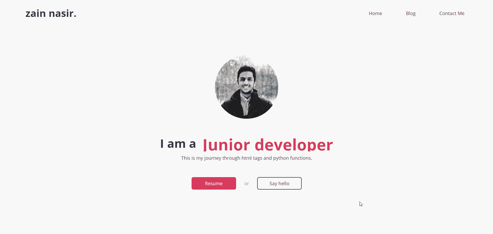
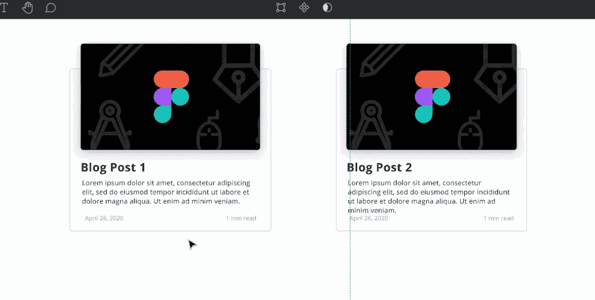
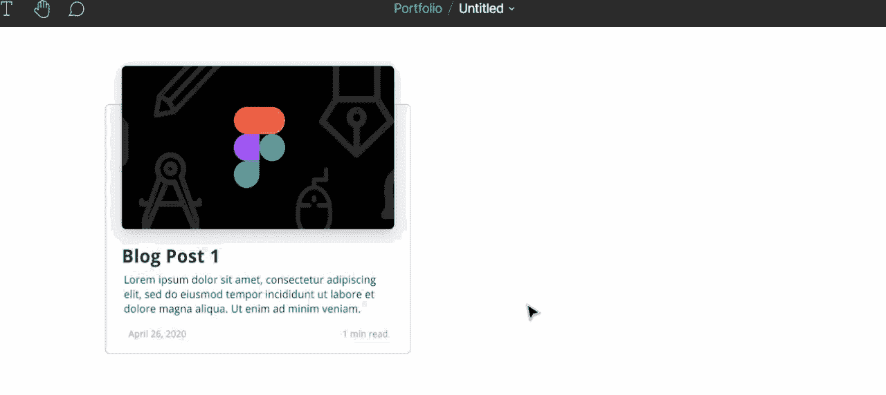
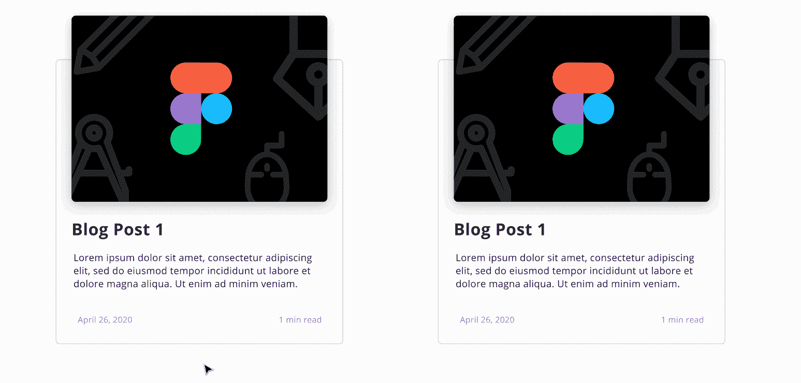
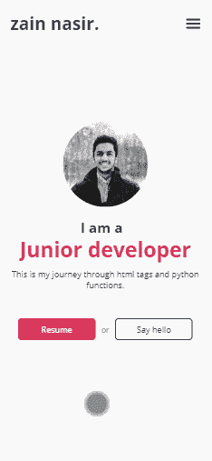
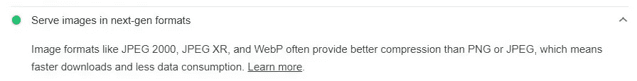
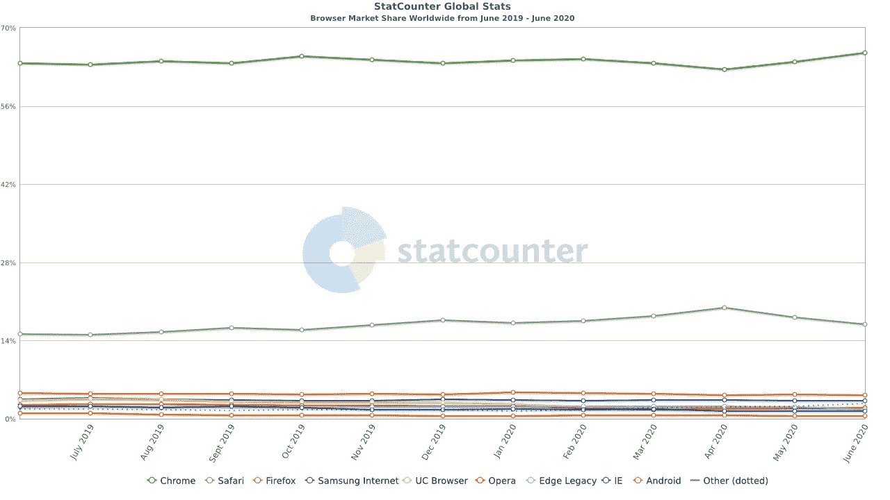

# 在你的第一个网络应用中要避免的 7 个错误

> 原文：<https://betterprogramming.pub/7-mistakes-to-avoid-in-your-first-web-app-2e4a74758030>

## 从设计到部署，尽最大努力避免这些错误

乔治·贝克从[派克斯](https://www.pexels.com/photo/addition-black-and-white-black-and-white-chalk-374918/?utm_content=attributionCopyText&utm_medium=referral&utm_source=pexels)拍摄的照片。

几年前，我创建了我的第一个全功能网站。这是一个朋友的作品集:

内容因隐私而更改。

我花了两个月的时间在 [Figma](https://www.figma.com/) 中设计，在没有任何框架的情况下使用 SASS 编写前端代码(我仍然不喜欢 Bootstrap，但那是改天再讨论)，使用 [Django](https://www.djangoproject.com/) 开发后端，并在 [Heroku](https://www.heroku.com/) 上部署。为什么一个单页的作品集花了我两个月的时间？因为我大部分时间都在修代码。

回顾这个项目，这些是我本可以用不同方式做的事情。

# Figma 中的设计

## 1.使用组件而不是复制/粘贴元素

Figma 有一个强大的特性叫做组件。它允许您复制重复的元素，使它们保持连接，从而更容易、更快地更改它们。

没有设置组件，我不得不单独调整每个元素的大小:

单独更改每个元素既费时又低效。

有效的方法是将其转换成一个组件。选择元素并单击工具栏中的“创建组件”操作。接下来，按住 alt 键并拖动组件以创建实例:

要创建组件，请选择元素，单击“创建组件”，按住 alt 键，然后拖动。

创建组件后，对父组件所做的任何更改都会反映到所有子实例中:

调整组件的大小和形状可以节省时间，并确保我们所有的实例都是相同的。

## 2.设置颜色样式来制作您自己的调色板

由于当时不熟悉颜色样式，我复制/粘贴十六进制代码来给组件着色，这又是一件费时低效的事情。

要更快地应用颜色，请通过设置不同的颜色样式在 Figma 中创建一个调色板。

要创建颜色样式，请选择一种颜色。转到“颜色样式”并添加颜色:

添加后，颜色会显示在“本地样式”下

现在，在组件中使用这种颜色样式要高效得多:

如果设置了颜色样式，只需一次单击即可将颜色应用于组件。

# 前端编码

## 3.从 CSS 中移除多余的样式

移除多余的样式以避免增加 CSS 文件的重量:

冗余样式的示例:在块元素上设置 100%的宽度是多余的，因为默认情况下它们占据 100%的宽度。

冗余样式是一个常见的错误，即使对于有经验的开发人员也是如此。因为冗余样式不会产生任何错误，所以很难被注意到。Chrome 的开发者工具可以用来检测 CSS 文件中未使用的代码行。如果你因为 CSS 文件太大而不想手动测试每个样式，可以考虑使用像[未使用的 CSS](https://unused-css.com/) 或者 [PurifyCSS](https://github.com/purifycss/purifycss) 这样的工具。

## 4.在移动到下一个组件之前，使一个组件做出响应

永远不要认为让你的网站响应的任务是你以后可以做的事情。

该网站的移动版本。

我一完成桌面版就意识到了自己的错误，并试图让导航栏有所反应。“能有多难？”我以为。毕竟把`flex-direction`设为`column`就能解决一切。事实证明不是这样。当我在导航栏中添加媒体查询时，我发现其他组件的位置已经错位，迫使我重写了数百行代码。

一个网站是从上到下排列的一系列连续的组件。摆弄系列中的第一个组件必然会改变后面的组件。为了避免重写代码，在开始下一个组件之前，完成一个组件的响应方面。

## 5.以 WebP 格式而不是 PNG/JPEG 格式加载图像

使用像 WebP 这样的现代图像格式来缩短加载时间和减少带宽使用。

根据谷歌的 Lightroom 报告，WebP 优于 PNG 或 JPEG。

如果你的网站是可视化的，有很多图片，考虑把它们转换成 WebP 格式，让网站在较慢的连接上加载得更快。要将 WebP 用作主要图像格式，将 PNG 用作不支持它的浏览器(如 Safari)的备用选项，请使用多个 URL:

对图像使用 WebP，但为不受支持的浏览器添加后备 PNG 格式。

# 部署

## 6.测试跨浏览器兼容性

对你的网络应用程序来说，最糟糕的事情就是把它限制在一个浏览器上。

跨浏览器兼容性是维护访问者和确保统一用户体验不可或缺的一部分。

确保你的网站与流行的浏览器兼容。

如果一个网站简单到可以手工测试，那么下载不同浏览器的更新版本并在上面运行是最好的选择。这需要时间，但却是免费的。然而，对于更复杂的网站，有多种资源可供使用——付费的和免费的——允许在不同设备上进行跨浏览器测试。比较流行的一个是 [LambdaTest](https://www.lambdatest.com/) 。

## 7.实施输入验证

如果您正在构建一个用户通过表单进行交互和共享数据的站点，那么您需要在客户端和服务器端验证这些数据。

在用户输入得到验证之前，不要相信它。

电子邮件字段的客户端验证示例。

输入验证是一项复杂的任务，它因框架而异。对于初学者来说，[基本表单验证](https://developer.mozilla.org/en-US/docs/Learn/Forms/Form_validation)可以使用内置客户端错误处理的 HTML5 来完成。一个例子是将电子邮件字段的`type`属性设置为`email`。在这种情况下，如果电子邮件的格式不是 example@email.com，表格会出错并阻止提交。

# 结论

感谢您阅读我的文章。我希望它能帮助你在下一个项目中更有效率。编码快乐！