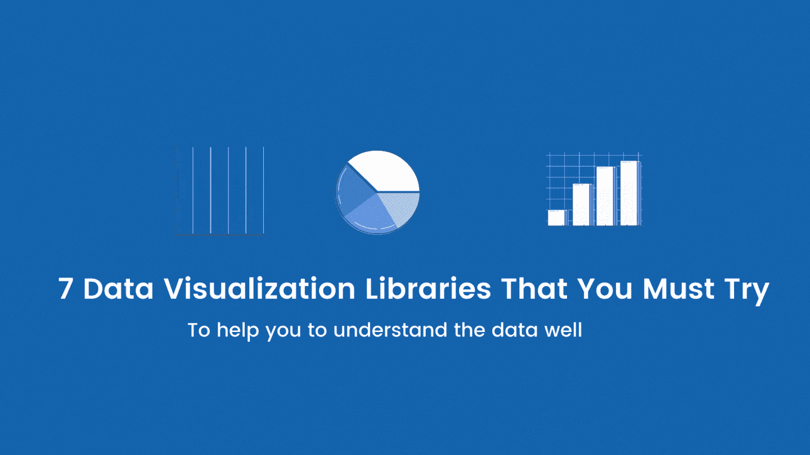
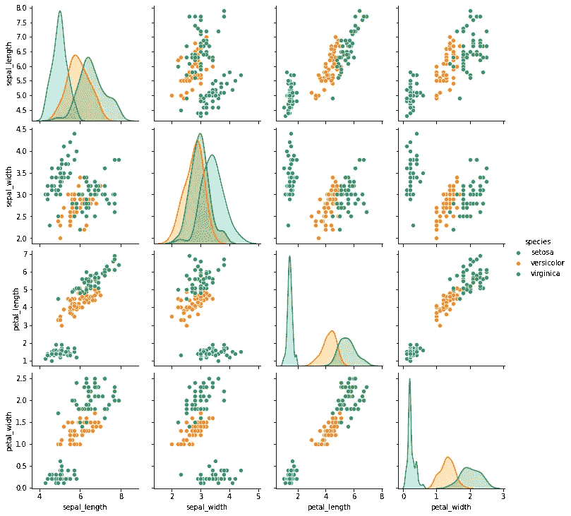
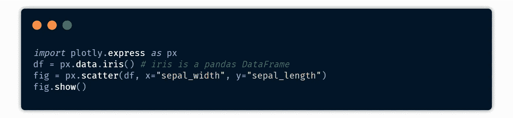
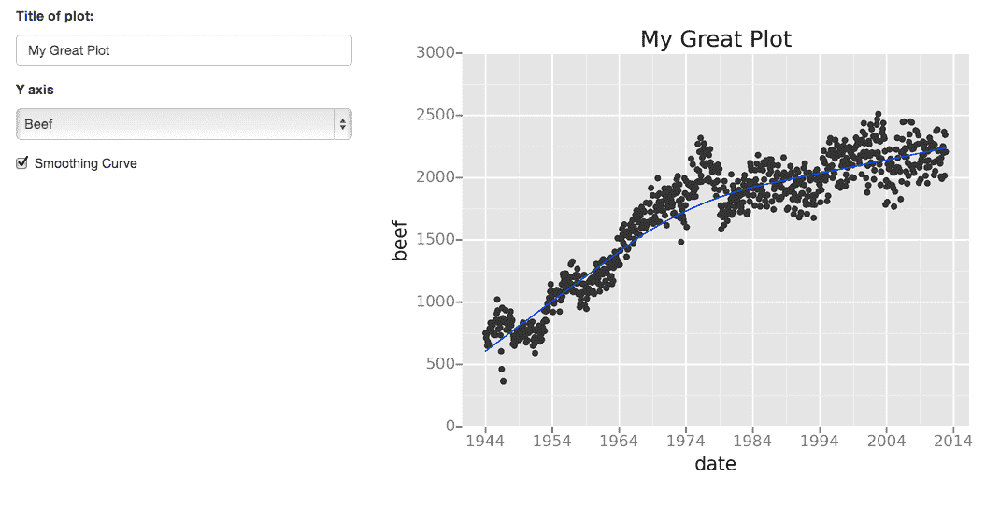
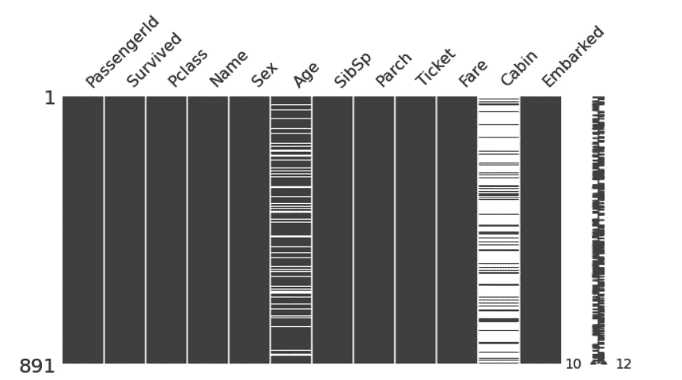

# Python 中 7 个必试的数据可视化库

> 原文：<https://betterprogramming.pub/7-must-try-data-visualization-libraries-in-python-fd0fe76e08a0>

## 帮助您更好地理解数据的工具

数据可视化是使用一些图表更详细地理解数据的过程。Python 中有许多库可以帮助我们做同样的事情。最著名的库之一是 matplotlib，它可以绘制你能想象到的几乎所有类型的图。这个库的唯一问题是对于初学者来说很难掌握。在这篇博客中，我将介绍七个数据可视化库，您可以尝试使用它们来代替 matplotlib。

## 1.海生的

Seaborn 构建于 matplotlib 库之上。它有许多内置功能，使用这些功能，您只需简单的几行代码就可以创建美丽的情节。它用简单的语法提供了各种高级可视化图形，如`box plots`、`violin plots`、`dist plots`、`Joint plots`、`pair plots`、`heatmap`等等。

**主要特点** :
1。它可以用来确定两个变量之间的关系。
2。分析单变量或双变量分布时要区分。
3。绘制因变量的线性回归模型。
4。提供多网格绘图

**安装** : `pip install seaborn`

使用 seaborn 对图显示 iris 数据集中数据趋势和分布的简单代码:

使用 Seaborn 库对虹膜数据集作图

这里有完整的[文档](https://seaborn.pydata.org/)供你开始使用这个库。

## 2.Plotly

Plotly 是一个高级 Python 分析库，有助于构建交互式仪表盘。使用 Plotly 构建的图表是交互式图表，这意味着您可以很容易地在图表的任何特定点或时段找到值。Plotly 使得生成仪表板并在服务器上部署它们变得非常容易。它支持 Python、R 和 Julia 编程语言。

您可以使用 Plotly 创建各种图表:

1.  基本图表
2.  统计图表
3.  科学图表
4.  财务图表
5.  地图
6.  支线剧情
7.  转换
8.  Jupyter Widgets 交互

**链接** : [**剧情文档**](https://dash.plotly.com/)

使用官方文档中的 Plotly 编写的简单散点图代码:

## 3.Geoplotlib

它是一个用于可视化地理数据和制作地图的 Python 工具箱。您可以使用此库创建各种地图。您可以用它创建地图的一些例子是热图、点密度图、地理图等等。

[来源](https://github.com/andrea-cuttone/geoplotlib)

**安装** : `pip install geoplotlib`

**文档**:[geo plotlib 用户指南](https://github.com/andrea-cuttone/geoplotlib/wiki/User-Guide)

## 4.闪光

Gleam 的灵感来自于 R 的[闪亮](https://shiny.rstudio.com/)包。它可以让你只用 Python 代码就能把你的图表转换成令人惊叹的网络应用。这对于没有 HTML 和 CSS 知识的人来说是有益的。它不是一个真正的可视化库，但可以与任何可视化库一起工作。

**官方文件和入门指南** : [Gleam Github Repo](https://github.com/dgrtwo/gleam)

[来源](https://github.com/dgrtwo/gleam)

## 5.ggplot

ggplot 的工作方式与 matplotlib 不同。它允许您添加多个组件作为层，以在最后创建一个完整的图形或绘图。例如，在开始时，您可以添加一个轴，然后添加点和其他组件，如趋势线。

他们总是说，在使用 ggplot 获得更简单有效的结果之前，应该将数据存储在数据框中。

**安装** : `pip install ggplot`

要了解更多关于这个库的信息，你可以访问他们的 [Github Repo](https://github.com/tidyverse/ggplot2) ，他们也有一个单独的官方文档的网页。

## 6.散景

散景库由 [Continuum Analytics](https://www.continuum.io/bokeh) 创建，用于生成对 web 界面和浏览器友好的可视化效果。由散景库生成的可视化效果本质上是交互式的，这让您可以传达更多信息。

**正式文件** : [散景文件](https://docs.bokeh.org/en/latest/)

帮助您开始使用该库的教程。

1.  [使用散景的交互式数据可视化](https://realpython.com/python-data-visualization-bokeh/) —真正的 Python
2.  [用 Python 实现 Python 数据可视化](https://www.youtube.com/watch?v=2TR_6VaVSOs) — Traversry Media(Youtube)

## 7.米辛戈

数据科学就是从给定的数据中找到有用的信息，并让每个人都能看到。最好的方法是将数据可视化。这个软件包可能会成为所有数据科学家爱好者的热潮。它可以帮助您找到所有缺失的值，并在真实世界的数据集中以漂亮的图形方式显示它们，没有任何麻烦，只需一行代码。它支持条形图、图表、热图、树状图等图形表示。

**安装** : `pip install [missingno](https://github.com/ResidentMario/missingno)`

让我们用这个包来显示著名的`[titanic dataset](https://www.kaggle.com/c/titanic/data)`中所有的空值。代码如下:

titanic 数据集上使用缺失号的缺失值可视化

## 了解你的作者

要阅读更多阿沛的博客，你可以关注他的[出版物](http://medium.com/pythoneers)。

 [## 回答了 30 个基本的机器学习问题

### 检查并增加您的 ML 知识🤔

medium.com](https://medium.com/pythoneers/30-basic-machine-learning-questions-answered-692acd10841f)  [## 没有控制台的 Python

### 在没有控制台的情况下在 Windows 中运行所有 Python 脚本的简单技巧，最后还有一个额外的提示

medium.com](https://medium.com/pythoneers/python-without-console-330be0c288ac)