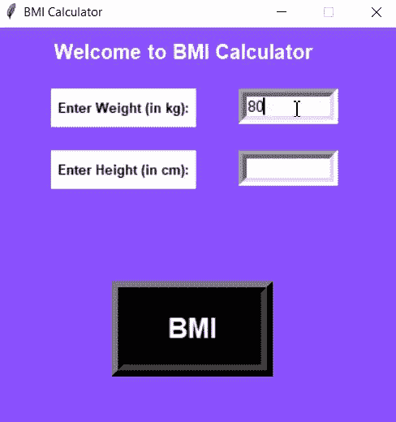
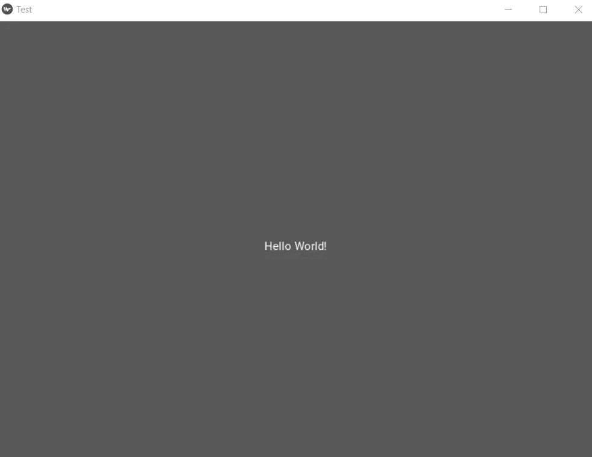

# Python 中的 7 个必试 GUI 库

> 原文：<https://betterprogramming.pub/7-must-try-gui-libraries-in-python-34c8f6266363>

## 帮助您构建交互式图形用户界面的工具

[UX 店](https://unsplash.com/@uxstore?utm_source=unsplash&utm_medium=referral&utm_content=creditCopyText)在 [Unsplash](https://unsplash.com/s/photos/design?utm_source=unsplash&utm_medium=referral&utm_content=creditCopyText) 上拍照

GUI 或图形用户界面是用户打开应用程序时看到并与之交互的东西。一个好看的图形用户界面会增加你的产品的声誉。在本文中，我将向您介绍 Python 中的七个 GUI 库，您必须尝试一下。

# 1.PyQt5

[PyQt5](https://www.riverbankcomputing.com/software/pyqt/) 由河岸计算公司开发。它是围绕 Qt 框架构建的，Qt 框架是一个跨平台框架，用于为各种平台创建应用程序。PyQt 集合了 Qt 和 Python。它不仅仅是一个 GUI 工具包。它包括线程、Unicode、正则表达式、SQL 数据库、SVG、OpenGL、XML 和一个全功能的 web 浏览器，以及许多丰富的 GUI 部件集合。

**安装** : `pip install PyQt5`

让我们看一个使用这个库的 GUI 窗口的简单例子。

一个使用 PyQt5 的简单窗口代码

PyQt5 简单图形用户界面(图片由作者提供)

这里有[完整文档](https://riverbankcomputing.com/software/pyqt/intro)和一个[教程链接](https://www.guru99.com/pyqt-tutorial.html)让你开始使用这个库。

# 2.Tkinter

Tkinter 是 Python 中最流行的 GUI 库之一。由于其简单易学的语法，它是 GUI 开发初学者的首选之一。Tkinter 提供了不同的小部件，如标签、按钮、文本字段、复选框和滚动按钮。它支持网格系统，使得复杂的设计变得非常容易开发。

**安装** : `pip install tkinter`

这是一个使用 Tkinter 的简单 GUI，它将体重和身高作为输入，并在弹出框中返回身体质量指数作为输出。

使用 Tkinter 的身体质量指数计算器 GUI 代码

显示计算器工作的 GIF(图片由作者提供)

# 3.基维

[Kivy](https://kivy.org/#home) 是另一个开源 Python 库，用于快速开发利用多点触控应用和创新用户界面的应用。Kivy 运行在不同的平台上，包括 Windows、OS X、Android 和 Raspberry Pi。它可以免费使用，并得到麻省理工学院的许可。该工具包附带了 20 多个小部件。

**安装** : `pip install Kivy`

Kivy 基本窗口代码

Kivy 基本窗口与你好世界！消息

# 4.wxPython

wxPython 是一个用于 Python 的跨平台 GUI 工具包，它允许以较少的努力创建高度健壮的功能 GUI。是用 C++写的。目前它支持 Windows、Mac OS X、Mac OS 和 Linux。

**安装** : `pip install wxPython`

**文档链接** : [wx Python 官网](https://www.wxpython.org/)

**教程** : [Hotboytrue YouTube 播放列表](https://www.youtube.com/watch?v=RHvhfjVpSdE&list=PLejTrt5hn2r1uzZ53GDeUElXRkRFbUmQd)

下面是一个使用 wxPython 的基本 GUI 示例。下面的代码将创建一个简单的空窗口。

基本 wxPython 窗口代码—适合您的入门模板

# 5.PySimpleGUI

PySimpleGUI 是一个支持 Python 3 的 Python GUI 框架。它使得定制和吸引人的图形用户界面变得如此容易。它采用了四种最流行的 GUI 框架——QT、Tkinter、WxPython 和 Remi——并通过实现大部分样板代码降低了它们的难度。

安装:`pip install PySimpleGUI`

阅读 [PySimpleGUI 文档](https://pysimplegui.readthedocs.io/en/latest/)以深入了解这个库。

# 6.PyGUI

PyGUI 是一个 GUI 框架，最著名的是它的简单 API，允许开发人员使用本地元素创建用户界面。这是一个非常轻量级的 API，使您的应用程序运行更流畅和更快。它是一个开源的跨平台项目，目前运行在基于 Unix 的系统、Windows 机器、s 和 Mac OS 设备上。它对 Python 2 和 Python 3 都可用。

**安装** : `pip install PyGUI`

**文档** : [PyGUI 官方文档](https://www.cosc.canterbury.ac.nz/greg.ewing/python_gui/)

下面是一个使用 PyGUI 创建的简单窗口。

使用 PyGUI 构建的 GUI 的简单样板模板

这里有一个完整的[教程](https://realpython.com/pysimplegui-python/)让你开始使用这个库。

# 7.Pyforms

Pyforms 是一个用于开发 GUI 应用程序的跨平台框架。它提供了一个基于 PyQt、OpenGL 和其他库的桌面表单 Python 层，允许应用程序在桌面、web 和终端上运行，而不需要修改任何代码。

**安装** : `pip install PyFroms`

**文档** : [Pyforms 正式文档](https://pyforms.readthedocs.io/en/v4/)