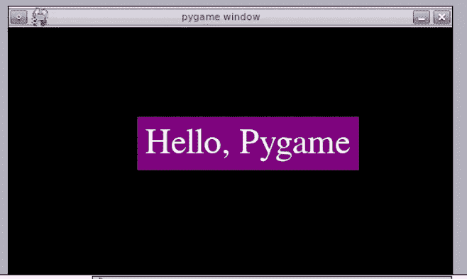
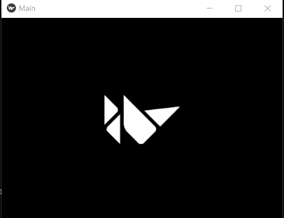

# 构建应用和手机游戏的 7 个必试 Python 库

> 原文：<https://betterprogramming.pub/7-must-try-python-libraries-to-build-apps-and-mobile-games-7e3f849721a>

## 促进移动开发的库

由[卡尔·劳](https://unsplash.com/@carltraw?utm_source=medium&utm_medium=referral)在 [Unsplash](https://unsplash.com?utm_source=medium&utm_medium=referral) 上拍摄

Python 新手最大的误解之一是它不能用于移动应用程序开发。在我开始 Python 之旅的时候，我对 Python 也有同样的想法。事实是那不是真的。Python 中有许多库可以帮助我们创建跨平台的应用和游戏，并且可以在 Android 和 iOS 设备上使用。在本文中，您将看到十个用于游戏和移动开发的 Python 库。

如果你愿意，Python 可以做任何事情。

# 1.Pygame

它是最古老和最著名的游戏开发 Python 库之一。Pygame 是一组 Python 模块，旨在开发令人惊叹的游戏。

该库是 C、Python 和 Open GL 的组合。您可以使用这个库创建功能齐全的游戏。它是一个跨平台的库，可以在几乎所有的操作系统上运行。在使用这个库之前，请确保您对 Python 有很好的理解。

**安装** : `pip install pygame`

**py game 的特点:**

*   跨平台库
*   适合创建客户端应用程序
*   可以使用多核 CPU
*   用少量代码产生大量结果

让我们创建一个简单的窗口，并使用 Pygame 向其中添加一些元素和文本。

输出(在 [Repl.it](https://replit.com/@Abhayparashar31/Pygamedemo) 上运行脚本)——作者图片

查看[文档](https://pygame.readthedocs.io/en/latest/1_intro/intro.html)和这个 [YouTube](https://www.youtube.com/watch?v=FfWpgLFMI7w) 教程来快速了解这个库。

# 2.PyOpenGL

PyOpenGL 是最常用的跨平台库之一，也是开发人员的最爱。可以在 Windows，Mac，Linux 等上运行。PyOpenGL 是一个绑定到 OpenGL 的 Python，使用标准 ctypes 库创建。

这个库是 Python 和 OpenGL 之间的桥梁。它是创建图形和 3D 游戏的最佳库之一。通过将这个库与 Pygame 结合，可以创建游戏。

**安装:**

该库还有一个更加稳定和优化的版本，名为 PyOpenGL-accelerate，也可以使用 pip 安装。

有时使用 PyPI 安装可能不起作用。那么你应该考虑从[官方套装网站](http://pyopengl.sourceforge.net/)手动下载。

**功能:**

*   跨平台库
*   兼容许多其他 GUI 库，如 PyQt、Pygame 等。

让我们创建一个基本的结构和窗口，让您开始使用 PyOpenGL。

运行代码，你会看到一个窗口出现

从[这个 GitHub 教程、](https://github.com/jcteng/python-opengl-tutorial) [这篇文章](https://pythonprogramming.net/opengl-rotating-cube-example-pyopengl-tutorial/)和[这个 YouTube 教程](https://www.youtube.com/watch?v=R4n4NyDG2hI&list=PLQVvvaa0QuDdfGpqjkEJSeWKGCP31__wD)中了解更多关于 [PyOpenGL](http://pyopengl.sourceforge.net/) 的信息。

# 3.拱廊

Arcade library 是一个现代 Python 框架，用于构建具有引人注目的图形和声音的游戏。这是一个简单易学的 2D 视频游戏库。

构建游戏是接触 Python 的好方法。这个库包含简单的语法和许多预构建的组件供您使用。

该库的文档是真正的瑰宝。它包含一个详细的、结构良好的代码指南。这些文档还包括许多示例，其中一些还附带了指导教程视频。

您可以简单地使用`pip install arcade`安装它，或者按照官方的安装说明[安装](https://arcade.academy/installation.html#installation-instructions)。

看看这个[视频](https://vimeo.com/167449640)看看图书馆有没有你需要的。

# 4.基维

Kivy 是一个开源 Python 库，用于制作创新的用户界面、移动应用和游戏。它是一个跨平台的库，可以运行在 Windows、Linux、OS X、Android、IOS、Raspberry Pi 上。

它是 100%免费使用的，并得到了麻省理工学院的许可。这个库是稳定的，并且有一个文档最好的 API 和一个编程指南。

Kivy 的图形引擎是使用现代的快速图形管道在 OpenGL 上构建的。该工具包附带了 20 多个高度可扩展的小部件。该库的许多部分都是用 C 语言编写的，使用的是 Python 的一个版本 CPython。它还有一个 [Python-to-Android](https://python-for-android.readthedocs.io/en/latest/) 项目，可以让你把你的 Python 应用移植到 Android 上。

**安装** : `pip install kivy`

Kivy 网站有[文档](https://kivy.org/doc/stable/)和[教程](https://kivy.org/doc/stable/tutorials-index.html)。

让我们看看如何在 Kivy 中插入图像:

输出图像

# 5.Panda3D

Panda3D 是一个开源的免费引擎，用于实时 3D 游戏、可视化、模拟等。它是用 Python 和 C++编写的，包含一组用于处理和优化源代码的命令行工具。

它是为商业游戏开发而创建的，现在仍然用于开发商业游戏。Panda3D 是迪士尼为他们的多人在线游戏《卡通镇在线》开发的。它于 2002 年首次作为自由软件发布。

根据开发人员的说法，它不是初学者的工具。您必须对编程、API 和请求有很好的理解。它是专业开发人员的工具。

你可以查看这个库的[文档](https://docs.panda3d.org/1.10/python/index)和这个[教程](https://www.youtube.com/watch?v=LNMz52Pkl_U&list=PL1P11yPQAo7oEAGuPcqMnn9ZWHLWP3-Lc)来深入了解这个库。

# 6.皮格莱特

pyglet 也是 Python 的跨平台多媒体库。它旨在开发游戏和其他可视化应用程序。它易于使用，可以在 Windows、Mac OS 和 Linux 上运行。

它支持许多功能，如窗口，甚至处理，操纵杆干扰，加载图像和视频，OpenGL 图形，添加声音，等等。

**安装** : `pip install pyglet`

**优点:**

*   可以操作多个窗口和监视器
*   无外部安装

让我们用 pyglet 创建一个当按键时改变颜色的窗口。

作者创作的 pyglet GIF

阅读[文档](https://pyglet.readthedocs.io/en/latest/)了解更多详细知识。

# 7.蜂产品

[BeeWar](https://docs.beeware.org/en/latest/index.html) e 是另一个流行的跨平台应用开发库。标语“一次编写，随处部署”证明了该库的工作和应用。

BeeWare 可以帮助您在 iOS、Android、Windows、macOS、Linux 以及 web 和本地用户界面上发布 Python 应用程序。

安装:`pip install beeware`

他们的网站上有一些非常简单的教程来帮助这个库的新手入门。

# 其他类似的库

*   [**PyKyra**](http://freshmeat.sourceforge.net/projects/pykyra) **:** 这个库基于 SDL 和基拉引擎。它被认为是最快的游戏开发库之一。
*   [**Cocos2d**](http://cocos2d.org/)**:**它是一个开源框架，可以用来构建游戏和跨平台 GUI。Coco2d 系列由 Cocos2d-x、Cocos2d-js、cocos3d-XNA 和 Cocos2d 组成。
*   [**Qpython**](https://www.qpython.org/)**:**是 python 的一个版本。它允许你在你的 Android 设备上运行你的 Python 脚本。