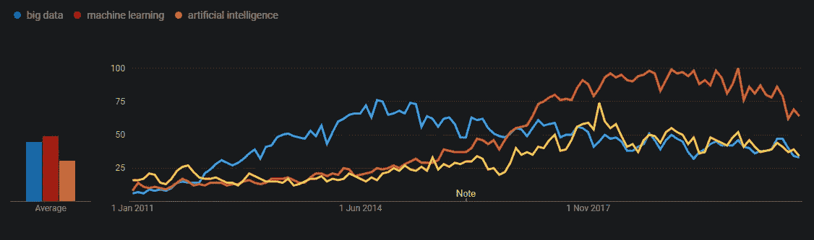

# 7 本非数据科学书籍，让你成为更好的数据科学家

> 原文：<https://betterprogramming.pub/7-non-data-science-books-that-will-make-you-a-better-data-scientist-1e2844d75fa1>

## 在从事数据科学工作和大规模应用机器学习时，这些书籍将为您提供更广阔的视角

在[重拍](https://www.reshot.com/free-stock-photos/photo/reading-a-book-and-having-a-coffee-on-3wxbWw/)中由[拉尔斯·珀克](http://ig-fotografie.de/en/learning-photography/10-killer-tips-improve-photography)拍摄的照片。

我第一次开始编程是在 2010 年的一次长期住院期间。我告诉自己，“如果我被困在这里，我想学点有用的东西。”像大多数敢于冒险的人一样，我很快就被这种新发现的力量冲昏了头脑！即使是我能用 C++做的难以置信的简单的事情也让我看到了它的可能性和奇妙之处。

我第一次接触机器学习是在我读博士期间。我正在研究用于优化高功率激光防御系统的工具和技术，无意中发现了强化学习。这些技术可以很快超越并胜过优化这些难以置信的复杂系统的更传统的方法——它们提出了挑战一些传统设计的全新方法。

在过去的十年里，术语*数据科学*已经得到了广泛的使用和极大的欢迎。我们已经看到大量的工作被重新命名为“21 世纪最性感的工作”的不同风格，并见证了上升(和峰值？)大数据、机器学习、人工智能等时髦词汇。

最近十年大数据、机器学习、人工智能的 Google 趋势数据(图片由作者改编自 [Google 趋势](https://trends.google.com/trends/explore?date=2011-01-01%202021-01-01&geo=US&q=big%20data,machine%20learning,artificial%20intelligence))。

数据科学以高薪和自治的前景吸引了许多人进入这个领域。使用数学和统计数据来推动业务成果和交付价值的概念很吸引人，而且预测未来的想法有一种浪漫的诱惑力。对于许多开始接触数据科学的人来说，很容易被所有的可能性冲昏头脑。最新的云技术和机器学习工具有很多值得探索的地方。

不过，我们开始看到这一趋势的阴暗面。从医疗保健中的种族偏见和[司法系统](https://www.propublica.org/article/machine-bias-risk-assessments-in-criminal-sentencing)到[世界上最大的公司之一招聘过程中的性别歧视](https://www.reuters.com/article/us-amazon-com-jobs-automation-insight-idUSKCN1MK08G)，尽管一些行业中最聪明的人做出了努力，偏见的模式还是蔓延开来。

但是我们很清楚信任模型和机器来预测现实世界的混乱的代价。2008 年金融危机的影响今天依然真实存在。我们已经亲眼目睹了在没有深刻理解细微差别、限制和隐含假设的情况下遵循复杂模型做出大规模决策所造成的损害。我很高兴看到机器学习和人工智能社区已经在采取措施避免这些错误。

数据科学家有广泛的课题要学，这是这个角色最令人兴奋的方面之一。这种学习也不仅限于技术知识。数据科学家需要学会交流发现，并帮助组织从他们的数据中获取价值。

社区喜欢分享技术信息，但经常陷入关于哪些工具是最好的或云平台战争的争论中。在许多情况下，数据科学家应该更担心是否应该使用这些工具，以及它们可能产生的影响，包括积极和消极的影响。你能自信地说你的数据是无偏的吗？如果不是，你知道如何解释吗？

鉴于这次讨论，我想推荐几本我认为颇有见地的书。这两本书要么从近代历史的背景中汲取教训，要么从不同的角度看待边缘群体。每本书都改变了我的思维方式，并最终提高了我为工作带来价值的能力。

希望，当你思考工作的输入和输出以及它所处的更广阔的背景时，你会带走一种新的哲学。

# 1.被纳西姆·尼古拉斯·塔勒布的随机性所愚弄

这本书从概率和风险的角度提出了一种非常规的思考方式。与类似的材料相比，这本书严厉、固执己见的风格和详细、深思熟虑的内容都令人耳目一新。纳西姆·塔勒布从衍生品交易员、数学家和哲学家的角度写作。他是风险、不确定性和定量建模方面的专家。

这本书的主要观点是不要被事后的随机事件所愚弄。[生存偏差](https://en.wikipedia.org/wiki/Survivorship_bias)是一个非常值得考虑的重要教训，它让我在建立模型时更深入地考虑我的特征的因果关系。

前几章提到了关于俄罗斯轮盘赌的一个观点，这是一个生动有力的提醒，提醒人们在观察历史事件时要考虑所有可能的结果。

> “概率不仅仅是计算骰子上的赔率或更复杂的变量；它是接受我们的知识缺乏确定性，并发展出处理我们无知的方法。”

# 2.卡罗琳·克里亚多·佩雷斯的《看不见的女人》

[这本书](https://www.amazon.com/Invisible-Women-Data-World-Designed/dp/1419729071)对一个我知道但完全不熟悉的问题提供了难以置信的洞察力。现代世界在很大程度上是为男人建造的，这立即将一半人口置于显著的不利地位。

在数据和人工智能的世界里，我们开始听到这方面的恐怖故事。不管你是什么性别(这些问题对于非二元个体来说会更复杂)，从这本书里可以学到很多东西。它暴露了数据中一个非常真实的性别差距——我们知识中的差距导致了对妇女的系统性歧视，这种歧视导致了一种普遍的、无形的偏见，将对妇女的生活产生负面影响。

> “这种深深的男性主导文化的结果是，男性的经验，男性的观点，已经被视为普遍的，而女性的经验——毕竟是全球一半人口的经验——被视为小众的。”

# 3.凯茜·奥尼尔的《摧毁数学的武器》

这本书主要讲述了如此多的决策工具的规模和自动化是如何加剧不平等的。我们已经在新闻中看到了几个这样的例子，例如脸书的新[趋势主题算法](http://qz.com/769413/heres-how-facebooks-automated-trending-bar-probably-works/)和[数据驱动的警务](https://medium.com/equal-future/predictive-policing-is-happening-now-and-police-could-learn-a-real-lesson-from-minority-report-e105a592eda0#.h90q9xoqx)，这导致了下面的问题:还有多少没有被报道？

这本书认为，这些工具都有三个共同点:不透明，规模和损害。其中许多是专有的，或者在某种程度上免受审查。即使最近的趋势是可解释的方法，许多模型仍然是一个黑箱。如果你不能解释，你怎么知道你的模型是否有偏差？

大规模部署后，它们可以影响大部分人口，这只会增加一些人出现高度负面结果的可能性。这可能是由于通过基础数据将种族主义或其他偏见编码到模型中，或者使掠夺性公司能够针对弱势个人。

这本书应该让你质疑你的预测中潜在的偏见和不公正。

> “大数据流程整理了过去。他们没有发明未来。做到这一点需要道德想象力，而这是只有人类才能提供的。我们必须明确地将更好的价值嵌入到我们的算法中，创建符合我们道德标准的大数据模型。有时这意味着将公平置于利润之上。”

# 4.斯科特·帕特森的《黑暗池塘》

这本书讲述了股票市场相对近期向我们现在所知的高度计算系统的转变。如今，预测模型被部署在高频交易领域，每秒钟做出数百万个决定。

这本书揭露了这个庞大复杂的生态系统背后的一些丑陋。它经常谈到，通过使用这些工具，我们如何让系统变得难以理解。这本书还强调了如何使用计算方法来解决各种各样的问题，而不需要对主题有深刻的理解——这是一种危险的能力。

> “多么昂贵和不必要的混乱。如果你重新分配所有聪明人，他们正在研究这个人为制造的无用问题，你可能会在一年内找到癌症的治疗方法。”

# 5.监控资本主义的时代

许多人推荐这本书，这是理所当然的。这篇文章写得很精彩，触及了一个日益增长的、迫在眉睫的事实:许多大公司比以往任何时候都更强大，比我们最亲密的朋友和家人更了解我们。以利润的名义预测和控制我们的行为符合这些组织的利益。对于那些与这些系统互动的人来说，所有这一切的最终影响可能是人性的前所未有的变化。

随着时间的推移，随着这些组织中更成功的人集中优势，对我们了解得越来越多，信息的不平等也在加剧。更糟糕的是，几乎没有来自立法者或更广泛社会的阻力。

这本书有望让你质疑你的工作是如何被应用的，或者至少让你意识到这些工具是如何被用来改变和塑造行为的。

> *“监视资本主义单方面宣称人类经验是转化为行为数据的免费原材料。”*

# 6.詹姆斯·格雷克的《混沌》

[这是另一本书](https://www.amazon.com/Chaos-Making-Science-James-Gleick/dp/0670811785/)深入探讨我们与未知和不可知事物的关系。作为对混沌科学的回顾，这本书解释了我们在理解上的局限性和对真实世界精确建模的无能。

这本书为模型失败提供了很好的背景，提醒我们现实世界总是要复杂得多。

> “直到你有了合适的隐喻来让你感知它，你才会看到它。”

# 7.查尔斯·惠兰的《裸体统计》

在这个针对数据科学家的建议列表中，一本关于统计数据的简单读物似乎不合适，但它提供的视角是有价值的。在许多情况下，数据科学家需要对非技术利益相关者进行培训并交流他们的工作。因此，重要的是要记住，不是每个人都像你一样理解(甚至关心)统计学、数学或技术方面。

总的来说，作为数据科学家和技术专家，我们经常会犯迷失在细节和复杂性中的错误，因为这正是我们所热衷的。我经常看到，当一位同事开始解释他们的模型的内部运作时，满会议室的人都呆若木鸡。

整本书的交流方式和例子的质量都达到了恰到好处的水平。此外，在阅读这篇文章时，我一直在思考目标受众。对你的目标受众有一个清晰的认识将会增强你的沟通，提高你增加价值的能力。

> “用统计数据说谎很容易，但没有统计数据就很难说出真相。”

# 结论

这个列表中的七本书应该成为拓宽数据科学工作者视野的坚实基础。记住这些见解和观点会给你更大的背景来理解你的决定的潜在影响。

如果有你认为会大大补充这个列表的书，请让我知道。