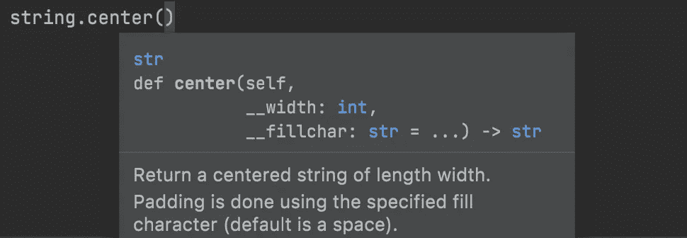
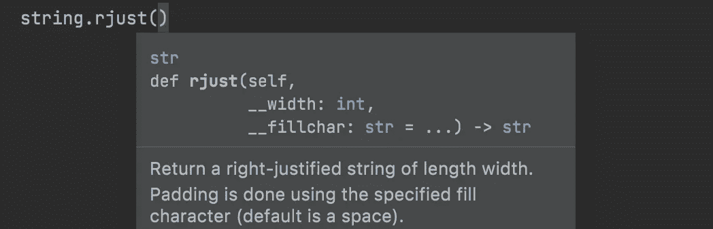
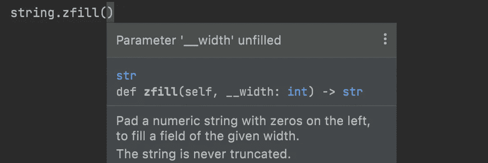
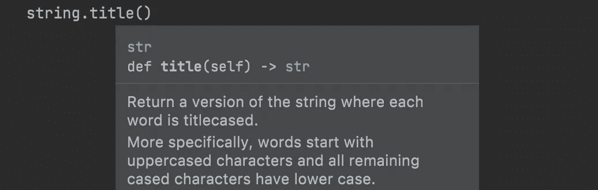
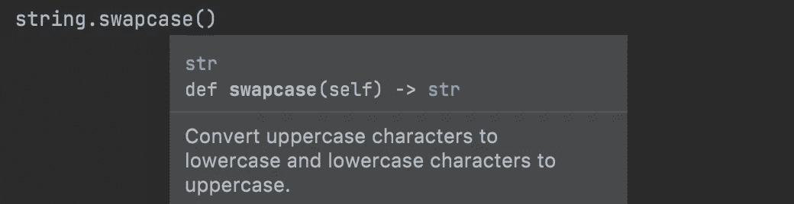
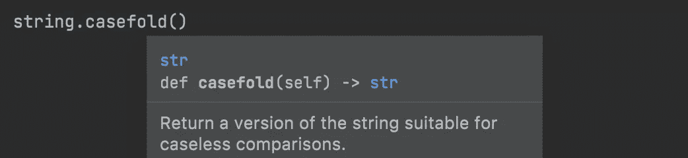

# 用 Python 格式化字符串的 7 个老方法

> 原文：<https://betterprogramming.pub/7-old-school-string-methods-to-format-your-strings-in-python-b791f880c048>

## 你不必总是使用 f 弦。标准库仍然很强大


照片由[安德鲁·尼尔](https://unsplash.com/@andrewtneel?utm_source=medium&utm_medium=referral)在 [Unsplash](https://unsplash.com?utm_source=medium&utm_medium=referral) 上拍摄

Python 有很多优点，在数据科学、web 开发、自动化等不同技术中都有应用。开发者在这些技术中选择 Python 的一个原因是 Python 真的节省了你的时间。另外，用 Python 开发程序真的很有趣！

字符串操作是我开发生涯中使用 Python 最愉快的时刻之一。当我第一次学习如何使用 f 弦时，我真的很喜欢，有一段时间没有足够重视弦乐方法。然后，我重新探索了字符串方法的强大之处，如果我正确地使用它们，可以缩短程序的行数。

在本文中，我们将学习如何用内置的字符串方法格式化字符串，我们不会使用任何 f-string 技巧。

首先，我们将讨论字符串对齐，并学习如何对齐字符串。然后，我们将继续填充，但棘手的填充。最后，我们将学习最独特和优雅的方法，在我看来。

让我们开始学习如何对齐字符串。

# 1.居中()



center()-按作者分类的图像

`center()`方法有两个参数:

*   宽度
*   用*(可选)*填充字符

并返回

*   给定长度的居中字符串

宽度是定心后字符串的最终长度。如果 width 小于或等于原始字符串的长度，则不进行居中，并返回原始字符串。

```
>>> **"Python"**.center(20)
'       Python       '>>> **"Python"**.center(21)
'        Python       '>>> **"Python"**.center(5)
'Python'
```

现在让我们试着用破折号填充我们的字符串。

```
>>> **"Python"**.center(26, **'-'**)
'----------Python----------'
```

这么好用。对吗？

# 2.ljust()


ljust() —作者图片

可以用`ljust()` string 方法生成左对齐的字符串。它还接受两个参数:

*   宽度
*   用*(可选)*填充字符

并返回

*   给定长度的左对齐字符串

同样的规则也适用于 width 参数。

```
>>> **"Python"**.ljust(20)
'Python              '>>> **"Python"**.ljust(26, **'n'**)
'Pythonnnnnnnnnnnnnnnnnnnnn'
```

# 3.rjust()



rjust() —按作者绘制图像

你大概估计现在要来的是什么。`rjust()`和`ljust()`有相似的功能，但是让你的字符串右对齐。同样，它需要两个参数:

*   宽度
*   用*(可选)*填充字符

并返回

*   给定长度的右对齐字符串

```
>>> **"Python"**.rjust(20)
'              Python'>>> **"Python"**.rjust(26, **'.'**)
'....................Python'
```

# 4.零填充()



zfill() —作者提供的图片

`zfill()`方法需要一个论证:

*   宽度

并返回

*   左边用零填充的字符串

同样，我们之前看到的`width`仍然有效。

**例如:**

```
>>> **"python"**.zfill(10)
'0000python'
```

如果字符都是字母，这种方法就不那么有用了。是啊！如果字符是数字，这就很方便了。

```
>>> **"1234"**.zfill(10)
'0000001234'
```

它在数字前加 6 个零。

但是让这种方法令人惊奇的是它的另一个特点。如果字符串以`-`或`+`(减号或加号)开头，它会将零放在第一个符号字符之后，而不是之前。

```
>>> **"-729"**.zfill(8)
'-0000729'>>> **"+54372"**.zfill(11)
'+0000054372'>>> **"+positive"**.zfill(10)
'+0positive'>>> **"-negative"**.zfill(10)
'-0negative'>>> **"++python"**.zfill(10)
'+00+python'
```

# 5.标题()



title() —作者图片

`title()`方法返回一个标题格式的字符串。换句话说，它大写每个单词的第一个字母，降低其余的字母。

```
>>> **"i love python"**.title()
'I Love Python'>>> **"pyTHoN IS awesOMe"**.title()
'Python Is Awesome'
```

如果单词的第一个字符是一个数字，数字字符后的第一个字母大写。

```
>>> **"21sT cEntURy"**.title()
'21St Century'
```

值得一提的是`title()`方法有一个缺点。它也将撇号后的第一个字母大写。

```
>>> **"I'm a python developer"**.title()
"I'M A Python Developer"
```

所以使用`title()`的时候要小心。请记住，这可能会导致不良后果。

# 6.交换情况()



swapcase() —作者图片

它使下层字符上层，反之亦然。

```
>>> **"pyTHoN IS awesOMe"**.swapcase()
'PYthOn is AWESomE'
```

所以它基本上交换了字符的大小写。下层人物变上层，上层人物变下层。

# 7.casefold()



casefold() —作者图片

现在，我们来看我最喜欢的一个！女士们先生们，我自豪地向你们展示`casefold()`。在这里！

`casefold()`是本文中最有趣的方法。它使字符串中的所有字符都变成小写。

```
>>> **"I love Python"**.lower() == **"I love Python"**.casefold()
True
```

不，`casefold()`和`lower()`不是一回事！其实`casefold()`就是咄咄逼人的`lower()`法！让我们看看另一个例子会发生什么:

```
>>> **"die Straße"**.lower()
'die straße'
```

现在，让我们使用`casefold()`:

```
>>> **"die Straße"**.casefold()
'die strasse'
```

*(注:straß是德语单词，意为“街道”。“σ”在德语中代表“ss”[两个小写字母 s']。)*

`lower()`不改变'**'的'**，而`casefold()`将'**'的'**转换为 **'ss '。**

通常，`lower()`和`upper()`用于进行字符串比较，以检查是否满足条件，但它们可能无法正常工作，尤其是当字符串包含非英语字符(非 ASCII 字符)时。因此，您可以用`casefold()`来验证您的字符串，以便执行无案例匹配。假设您有一个程序，它以不区分大小写的格式获取用户的地址，并尝试获取街道的名称。

我们将把`"Reinhardtstraße"`传递给这个函数，并期望得到`"reinhardt"`:

```
>>> get_street_name(**"Reinhardtstraße"**)
'reinhardtstraße'
```

如你所见，这不是我们想要的！我们的验证失败了。正确的做法是用`casefold()`代替`lower()`。

让我们使用它:

```
>>> get_street_name(**"Reinhardtstraße"**)
'reinhardt'
```

总之，`casefold()`把一个字符串转换成小写。比如我们要比较 Unicode 标准而不是 ASCII 的字符串，就要用`casefold()`的方法。它将字符串转换为大小写折叠字符串，以便进行无大小写匹配。所以它使得字符串在比较时完全不区分大小写。但是，如果字符串的语言是英语或者字符串只包含标准的 ASCII 字符，那么继续使用`lower()`是有意义的。`lower()`习惯上以开发人员制作小写字符而闻名。如果您打算进行无大小写的字符串比较，应该使用`casefold()`。最后一件事，字符串比较是一口深井。推荐大家从另一个角度看 StackOverflow 上这个[答案](https://stackoverflow.com/a/41316018/4476073)和那个[答案](https://stackoverflow.com/a/45745761/4476073)覆盖`casefold()`。

# 奖金

**输出:**

```
Thank you...............................
..............for reading...............
..............................my article
```

如果你愿意，你可以看看我关于 f 弦的文章。

[](https://python.plainenglish.io/get-better-at-python-f-strings-83b123bb4ce0) [## 更好地掌握 Python f 字符串

### 泡一杯咖啡，坐下来，享受这篇文章。

python .平原英语. io](https://python.plainenglish.io/get-better-at-python-f-strings-83b123bb4ce0)