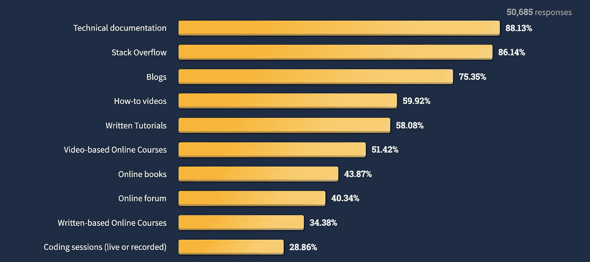
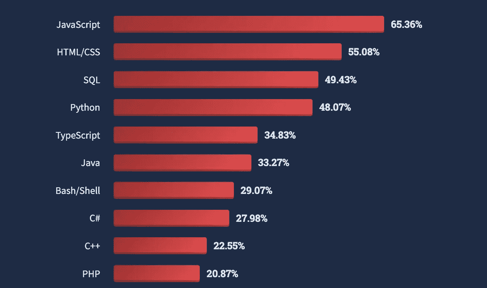
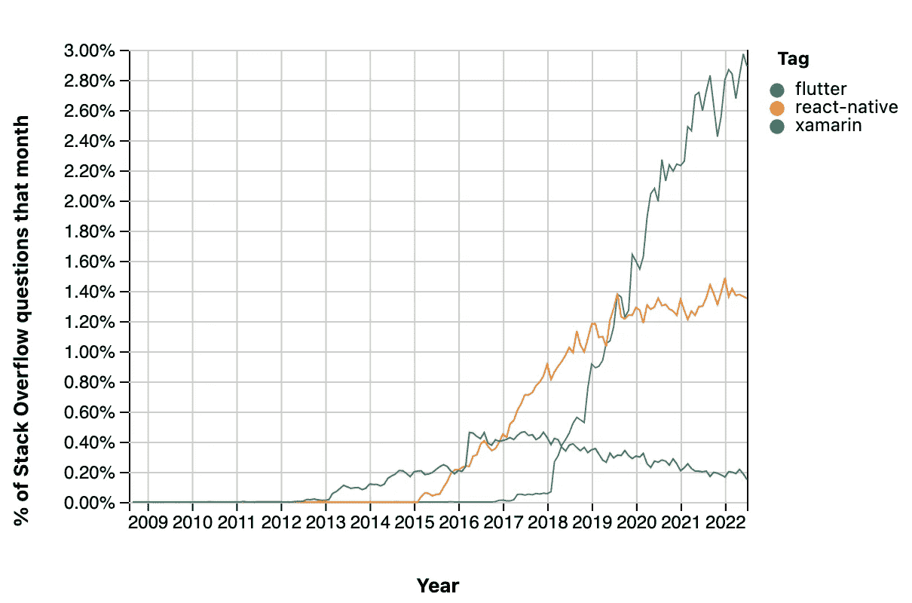
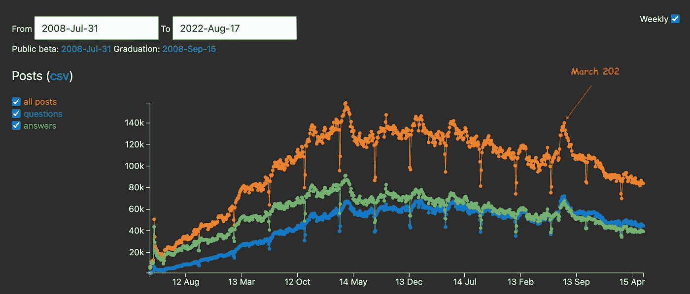
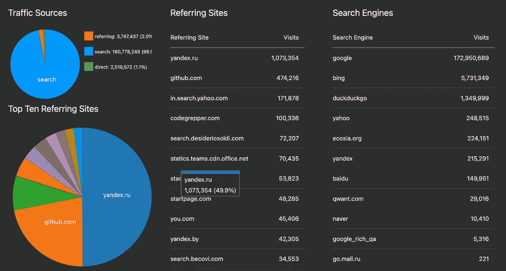
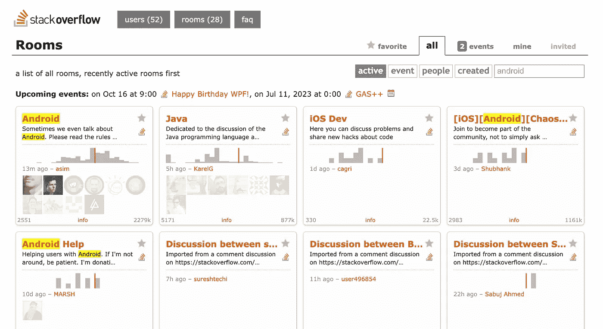
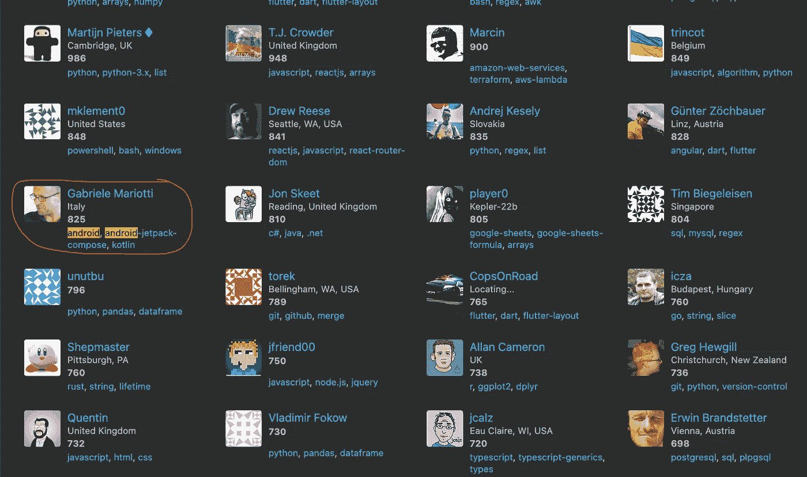
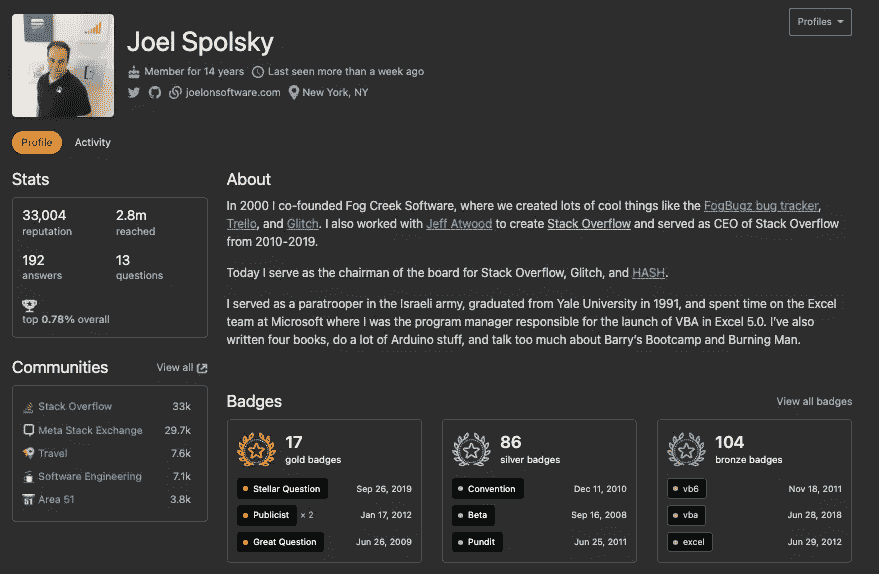
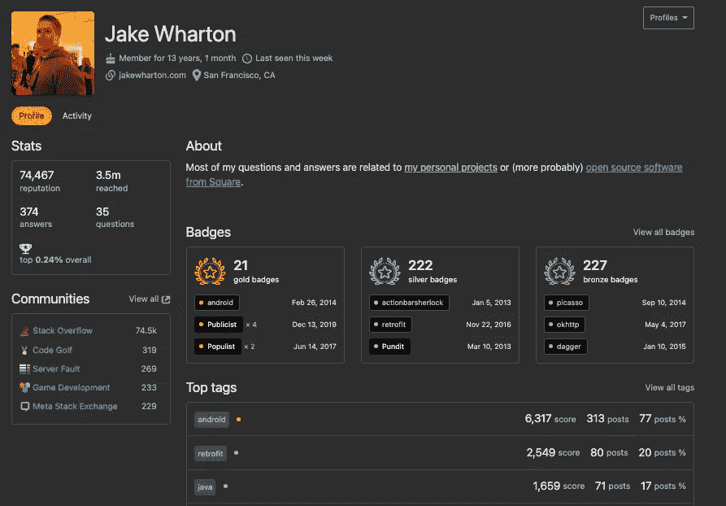

# 7 您可能不知道的堆栈溢出的其他用途

> 原文：<https://betterprogramming.pub/7-other-uses-of-stack-overflow-you-might-not-be-aware-of-f12b2f40b72b>

## 软件世界

## 它不仅仅是程序员问答的地方

罗伯特·科林斯在 [Unsplash](https://unsplash.com?utm_source=medium&utm_medium=referral) 上拍摄的照片

谁不知道什么是栈溢出？它是数百万编程问题的源答案(根据维基百科，2021 年[有 2100 万个问题)。如果你是一个程序员，很有可能你以前参考过它。](https://en.wikipedia.org/wiki/Stack_Overflow)

基本用法分享如下:

 [## 程序员使用 Stackoverflow.com 的 7 种方式

### 你以前用过 Stackoverflow.com 吗？你当然有！但是你充分利用它了吗？你可能没有…让我…

elye-project.medium.com](https://elye-project.medium.com/7-uses-of-stackoverflow-com-for-programmer-3ce09a39d2ee) 

但是除了问答之外，你知道堆栈溢出还有其他用途吗？以下是其中的七个:

# 1.开发者调查

每年，Stack Overflow 都会对数千名开发人员进行调查，以深入了解我们的开发人员统计数据。

[2022 年，已有超过 7 万名开发者接受调查](https://survey.stackoverflow.co/2022/)。以下是一些有趣的见解。

## 学习如何编码的在线资源

来源:[https://survey . stack overflow . co/2022/# online-resources-to-learn-how-to-code](https://survey.stackoverflow.co/2022/#online-resources-to-learn-how-to-code)

## 最流行的技术语言

来源:[https://survey . stack overflow . co/2022/# most-popular-technologies-language](https://survey.stackoverflow.co/2022/#most-popular-technologies-language)

还有更多…来看看吧

# 2.堆栈溢出活动的趋势

以上调查只是对某一特定年份的洞察。然而，有时我们想知道这些年来的变化趋势

在堆栈溢出中，我们可以检查堆栈溢出问题上各种标签的趋势。

例如，我想知道一年来移动开发平台(如 Xamarin、React Native 和 Flutter)的受欢迎程度

我只需要添加标签，数据图如下所示。

来源:[https://insights.stackoverflow.com/trends?tags = flutter % 2c react-native % 2c xamarin](https://insights.stackoverflow.com/trends?tags=flutter%2Creact-native%2Cxamarin)

该图显示 Xamarin 正在减速，React Native 正在变平，而 Flutter 正在变得相对较高。

# 3.理解开发人员的宏观行为

有一个名为[站点分析](https://stackoverflow.com/help/privileges/site-analytics)的特权特性，只有当你在堆栈溢出上获得 25k 时才可以使用。

鉴于大多数开发者使用堆栈溢出，从解析上，我们可以大致了解开发者在宏观层面的趋势。

下面是两个最新数据的例子

## 历史趋势

来源:https://stackoverflow.com/site-analytics

从这些数据中，我们可以了解到

*   堆栈溢出从 2008 年增长到 2014 年
*   自 2014 年以来停滞并缓慢下降
*   2020 年 3 月，新冠肺炎疫情席卷全球
*   从 2020 年开始，答案的数量略有下降，低于问题的数量

## 分析数据

来源:https://stackoverflow.com/site-analytics/traffic-sources

从数据中，我们可以看到开发者大多使用 Google，并远远落后于 Bing(>比 Google 小 30 倍)和 Duckduckgo(>比 Google 小 150 倍)。

看来俄罗斯网站 yandex.ru 引用栈溢出最高，其次是 Github。

# 4.聊天画廊

如果我们对某个问题/答案使用堆栈溢出中的注释特性，我们可能不会注意到。如果评论是来回多次，Stack Overflow 会自动建议你使用它的聊天功能。

要直接访问聊天室，堆栈溢出提供如下:

 [## 所有客房| chat.stackoverflow.com

### 旧问题的新答案被记录下来。如果您有任何问题，请在 Sobotics 室联系我们…

chat.stackoverflow.com](https://chat.stackoverflow.com/) 

它有许多聊天室。我搜索 Android 专用房间，如下图所示:

来源:[https://chat.stackoverflow.com/](https://chat.stackoverflow.com/)

> 注意:你需要有一定的点数才能在聊天中交谈，创建聊天或聊天画廊。

# 5.寻找有信誉的开发商

Stack Overflow 列出了用户，并根据他们在一周、一个月、一年、一个季度或所有时间获得的声誉对他们进行排名。

如果你想找到最近的知名开发者，像我一样，我会列出本周排名最高的开发者，并找到我感兴趣的关键词，例如 Android。我从以下列表中找到一名开发人员:

来源:[https://stackoverflow.com/users?tab=Reputation&过滤=周](https://stackoverflow.com/users?tab=Reputation&filter=week)

点进去。我可以联系他的 LinkedIn，Twitter，或者 GitHub。如果我想从意大利雇用有安卓经验的人，我得到了联系！

# 6.建立个人开发人员档案

专业上，很多人用 LinkedIn。各行各业都用。每个人都可以写下自己的经历，并让其他人认可。内容的可信度还有待考证。

但是如果一个概要文件在栈溢出，它就自动肯定了一个人的开发热情。没有堆栈溢出配置文件并不意味着一个人不是好的开发人员，但是有一个可靠的堆栈溢出配置文件是有其价值的。

下面是 Stack Overflow 创始人乔尔·斯波尔斯基的简介，他在他的 VB6 和 VBA 方面很扎实。

来源:https://stackoverflow.com/users/4/joel-spolsky

自 2014 年以来，Android 社区的著名名人杰克·沃顿(Jake Wharton)在 Android 中拥有一枚金质徽章

来源:https://stackoverflow.com/users/132047/jake-wharton

因此，使用堆栈溢出，并建立您的开发人员档案！出类拔萃！

# 7.作为对帮助你的人的奖励

这有点打破常规的想法。

如果你有一个泛型编程的查询，你可以问你的同事。如果他们设法帮助你，你可以说谢谢！多牛逼啊！

如果你还能在他们的堆栈溢出概要中给他们一些奖励点数，那不是更好吗？

这可以很容易地通过向你的同事提问并在堆栈溢出中发布问题来完成。如果他们很好地回答了你的问题，你可以投赞成票，为他们赢得 10 分。

如果他们的答案是最好的，你可以打勾，它会再给他们 15 分。选出你最喜欢的答案，你会得到两分。

一句谢谢很好，但是栈溢出点是有形的。除了几次额外的鼠标点击，您甚至不会丢失任何东西，相反，您将得到以下内容:

*   更多的人可以回答你的问题(除了你的同事)
*   一个可以帮助你验证答案的社区(确定最佳答案，不要有偏见)
*   将来你也有一个容易搜索的问题和答案(栈溢出内容在谷歌搜索中被很好地索引)
*   当您键入问题时，您可能会发现堆栈溢出中已经有一个问题有您正在寻找的答案

这不是很好吗？

# 可能还有更多…

这就是我所看到的。除了答案和问题，Stack Overflow 在许多其他领域仍然是一个很好的开发人员社区构建工具。充分利用它，因为它就在那里。

如果您发现堆栈溢出的其他有趣用法，请分享。我很想收到你的来信。

> 附注:我与 Stack Overflow 没有任何关系。只是分享我的经历，想法，以及对它给我带来的好处的欣赏。希望对别人有所裨益。