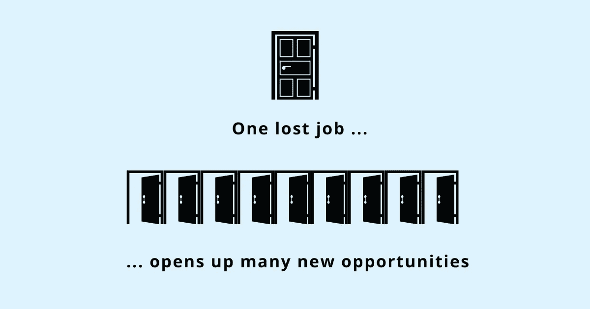

# 处理裁员和反弹的 7 种做法

> 原文：<https://betterprogramming.pub/7-practices-to-handle-lay-offs-and-bounce-back-f098234ea769>

## 如果你自己被困在故事的消极版本中，那么在外面编造一个积极的前景是行不通的

鸣谢:作者

被解雇和丢掉工作是很难的。这不仅在经济上伤害了你，也伤害了你个人。感觉就像有人把你推下一辆行驶中的公共汽车，告诉你车上已经没有你的位置了，或者被留在茫茫大海中，没有人告诉你如何回到岸边。

不管有多少人在同一旅程中，这种经历都是孤独和令人沮丧的。当一股强烈的情绪冲击着你时，成百上千的问题在你的脑海中闪过:

*为什么是我？*

*我的朋友和家人会看不起我吗？*

这会如何影响我的简历？

我会找到另一份工作吗？

如果不处理或处理不好，裁员会让你采取有害的行为，摧毁你的自信。把自己当成受害者不会让你重新得到这份工作。或者，如果你是一个喜欢自我批评的人，为一些你无法控制的事情责备自己只会让事情变得更糟。

处理好裁员不仅仅是找一份新工作。除了找工作，处理情绪高涨也需要精神力量。

随着裁员成为当今就业市场的普遍现象，公开谈论裁员不仅是可以接受的，这样做的人最终会获得更好的机会。

> “你可能会遇到很多失败，但你一定不能被打败。事实上，可能需要遭遇失败，这样你才能知道你是谁，你能从什么中崛起，你还能如何走出困境。”—玛娅·安杰洛

# 做好准备

如果你的工作有危险，你的经理不会明确地说出来，直到公开的时候。你需要领会言外之意。

寻找潜在的裁员迹象——招聘冻结、成本削减、增长缓慢或者你的经理突然对你失去兴趣。

不要以为你不会成为被解雇的那个人，仅仅因为你是一个顶级的执行者或者是他们领域的专家。决定你是留下来还是被要求离开的因素有很多。记住这一点，你不是碰不得的。发生在这么多人身上的事也可能发生在你身上，尽管这不是你的错。

当你被解雇时，根据工作的性质，你可能会被要求立即离职，或者被告知你的预期离职日期。假设最糟糕的情况——没有任何形式的访问——并做好相应的准备。

提前收集有用的信息——同事的联系信息、以后可能对你有帮助的文件(法律允许的)、了解你的权利等。等。收集这些信息会花费你很少的时间，但是如果真的裁员的话，对你回到正轨会有很大的帮助。

如果你措手不及，你就无法做到这一点，但如果有哪怕是最轻微的暗示或可能性，做好准备也无妨。

## 不要过河拆桥

即使你被要求离开，也没有必要以不好的方式结束这段关系。指责组织或者说别人坏话对你没有任何好处。只会导致双方更受伤的感情。

> “我敢肯定，你面临的大部分情况都超出了你的控制。你对此无能为力。但是这个比例不可能是 100%。一定会有一部分——假设只有 2%——在你的控制范围之内。你可以在这方面努力。谁知道会有什么不同！”—理查德·博尔斯

相反，看看你如何利用你的冷静获得优势——要求更多的遣散费，进入他们的网络联系其他工作机会，协商健康福利，获得可靠的推荐或者讨论你可以利用的其他失业福利。

即使在失业后保持这种关系也会对你有利。你永远不知道未来谁会与你相遇。妥善处理裁员会让你与那些在离职时过河拆桥的人区别开来。

> "记住，得不到你想要的东西有时是一种奇妙的幸运。"—达赖喇嘛

# 不要否认自己的情绪

忽略这段糟糕的经历不会让事情变得更好，也不会让你对它们有什么感觉。你越是推迟处理甚至承认事情不对劲，事情就变得越糟糕。心理学家称之为情绪回避。避免负面情绪会让你感觉更好。回避可以暂时缓解负面情绪，这在短期内是有效的，但从长远来看，它会让你回避的事情变得更严重。

当你不承认负面情绪时，你身体的内置防御机制会将它们视为一种威胁。一旦被激活，你的身体就会释放压力荷尔蒙，如皮质醇和肾上腺素，这使你以下列方式之一行动:

你对抗威胁:试着对抗你的情绪，这会让你的情绪更加强烈。

你逃避这种情况:努力消除这种情绪，经常浪费精力，而这些精力最好花在一些建设性的行动上。

这种战斗或逃跑的反应对我们在其他情况下的生存至关重要，当真的有危险时，因为它使我们能够快速应对威胁生命的情况——逃离燃烧的建筑物或当高速公路上的一辆疾驰的汽车驶入我们的车道时。然而，由于你的大脑无法区分真实和感知的威胁，即使只是情绪攻击，它也可以发出警报，并在此过程中限制对前额叶皮层的访问，这是大脑的思维部分，在你最需要的时候抑制有目的的行动。

忽视或回避会让这些感觉更加难以克服，而承认它们会带来真正的个人成长。不要压抑或推开它们，要学会接受你的情绪。接受并不意味着它们是真实的。它只是让你的情绪保持原样，而不去评判或试图改变它们。看到情绪的本来面目而不试图摆脱它，会让你从情绪回避转变为情绪接受。

奥特拜因大学心理学教授、专门治疗焦虑症的临床心理学家诺姆·施潘瑟(Noam Shpancer)称，情绪接受是一种远比回避更好的策略，因为接受、承认和吸收你的情绪会让你在赶走情绪方面花费更少的精力，而是追求与你的目标和价值观一致的行为。

此外，当你情绪激动，没有时间让它们稳定下来时，别人会感觉到你声音中的恼怒和苦涩。想象一下，在面试过程中，所有的消极情绪都准备好了要倾泻而出。未处理情绪的影响可能是毁灭性的——小的失望可能变成大的挫折。

例如，假设你在最初的几份工作申请中没有得到回应。没有加倍努力，未解决的情绪可能会妨碍你——你可能会花更多的时间反思和自我感觉不好，而不是用这些时间接触你的人际网络，寻求介绍或填写更多的工作申请。

不要否认你的情绪或被情绪消耗，要寻求一种平衡。

# 与信任的人交谈

与亲近的人、支持你的人和你毫不犹豫信任的人分享你的真实感受——能够表达你的真实情感——可以缓解压力。

不是发泄或者让别人同情你。而是分享你对这种情况的真实感受，而不需要脚本。把它说出来，让别人不加评判地听到它，会让你更好地准备好面对你的真实情绪。

谈论你的感受会在你和这种情绪之间制造一种心理距离。这有助于分散他们的电荷，减轻他们造成的负担。

# 把它重新定义为一个机会

你需要掌握两个故事——你告诉自己的故事和你告诉未来潜在雇主的故事。

你给自己讲的故事排在第一位。因为如果你自己被困在故事的消极版本中，那么在外面编织积极的前景是行不通的。当你的内心世界与你展现在外面的世界发生冲突时，其他人可以看到这种不连贯。

找出这次裁员的任何好处——把你的视角从你缺乏的东西转移到它带来的机会上。

*   你做这份工作很久了吗？这是一个开始新事物或探索你从未有机会使用的技能的好机会。
*   你的经理或你的[组织的文化有毒吗](https://www.techtello.com/office-politics/)？现在你可以找到一份没有毒性的工作了？
*   你的组织缺少你感兴趣的项目吗？去找一份有机会做这些事情的工作吧。

> “你可以想象一个不存在的事业和生活；你可以塑造未来自己，结果你的生活将会改变。”—比尔·伯内特

将你的视角从你不再拥有的东西转移到裁员带来的可能性上，打开你的思维去寻找解决方案，而不是陷入无休止的沉思。当你内心有一个积极的故事时，很容易让别人相信这个故事。

在重新构思你告诉自己的故事后，着手构思你要告诉未来雇主的故事。

不要用太多的词语来描述所发生的事情——保持信息简短。更多地关注未来——你能给他们的组织带来什么技能和能力。你不必隐瞒你被解雇了。与此同时，你不应该把这种经历放在消极的角度，分享你的沮丧。少花点时间在奋斗上，多花点时间在自己的优势上。

例如，你可以说*“我的组织最近经历了裁员。这给了我一个重新思考和评估我下一步想做什么的机会。我现在对下一份工作的期望是[ABC]……然后谈谈你的优势。”*

当你给人留下的印象是，尽管面临裁员，你依然冷静自信，其他人会钦佩你的韧性。他们认为你能够应对工作环境中的挑战和复杂性；能适应变化的人。

> “我从惨痛的教训中学到的一件事是，气馁是没有好处的。保持忙碌，让乐观成为一种生活方式，可以让你恢复对自己的信心。”—露西尔·鲍尔

# 不要匆忙做出决定

在处理裁员时，这个世界可能看起来很稀缺——有限的工作，有限的机会，有限的可能性。

但是，认为世界是稀缺的会让你匆忙做出决定——你担心别人会更快到达那些位置，你会失去机会，或者如果你不接受第一份给你带来的工作，就再也不会有第二份了。

稀缺心态会导致最终伤害你的决定；他们让你满足于平庸，而不是追求卓越。从富足的角度来思考——每个人都有足够的东西——给你足够的空间来评估你的选择是否符合你的目标和你想要的生活。他们让你等待并追求长远来看更有益的选择(经济上和精神上)。

做出正确决定的一个重要部分是控制你的财务状况，这样它们就不会给已经很紧张的过程带来额外的压力和焦虑。识别:

*   你的财务状况如何？
*   你有多少时间去找工作？
*   有你能削减的费用吗？
*   如果你是养家糊口的人，你需要多少钱？

做出一个好的决定需要耐心地权衡不同的选择，选择一个最符合你的兴趣和目标的。

## 开始工作

一旦你在情感上准备好与他人分享你的故事，而没有被解雇的情感包袱，准备一份潜在雇主的名单。不要在没有做好调查的情况下就匆忙参加面试——在公司网站、招聘信息和社交媒体上查找信息。联系过去曾在那里工作过或现在任职的人，了解他们对公司和职位的看法。根据[什么对你最重要](https://www.techtello.com/how-to-decide-if-a-company-is-right-for-you/)——工作文化、项目、学习、成长、薪酬，准备好一份问题清单？

只有在你做了功课之后，才能和招聘人员交谈。你会给人一种清楚知道自己想要什么的感觉。招聘人员会钦佩你的自信，认为你配得上你所寻求的职位。

此外，联系你的关系网——以前的同事，或者在这些机构工作的朋友。如果他们不在这些机构工作，但认识在这些机构工作的人，不要犹豫要求介绍。

LinkedIn 是找到这些信息的好地方。不要说“如果你认识某人”，直接提那个人的名字。说“你能帮我接 XYZ 吗？我注意到他们在你的关系网中，为一个我感兴趣的组织工作。”

得到你渴望的工作并不是一件孤独的事情。向他人寻求帮助是明智之举——这不仅能恢复你过去的关系，还能让你找到自己喜欢的工作。

当你不把裁员视为世界末日，而是把它视为你新旅程的开始时，好事就会发生。不要陷入对你的不幸的思考，把这次失业看作是道路上的一个小颠簸——它会困扰你一会儿，但不会阻止你到达目的地。

> “路的转弯处不是路的尽头……除非你没能转弯。”——海伦·凯勒

# 摘要

1.  被解雇是一种情感体验。处理好它不仅能建立弹性，还能带来更好的机会。
2.  如果你还没有被解雇，但认为这是一种可能性，现在就开始准备。收集下岗后需要的数据。
3.  离开公司时，优先考虑关系而不是工作。从长远来看，回报会高得多。
4.  给你的情绪一些时间来适应，而不是否认或匆忙处理它们。
5.  与你亲近的人分享你的真实感受。它会减少你负面情绪的影响。
6.  将裁员从一件发生在你身上的坏事重新定义为一个打开新可能性的机会。
7.  当你被解雇时，找份工作可能会成为你的优先考虑。但是匆忙做出决定会导致你日后可能会后悔的糟糕选择。对你的下一任雇主要有意识。
8.  一旦你在情感上准备好接受这个挑战，做你的功课。

在 Twitter 上关注我，了解更多故事。

*这个故事最初发表于*[*【https://www.techtello.com】*](https://www.techtello.com/bounce-back-after-getting-laid-off/)*。*