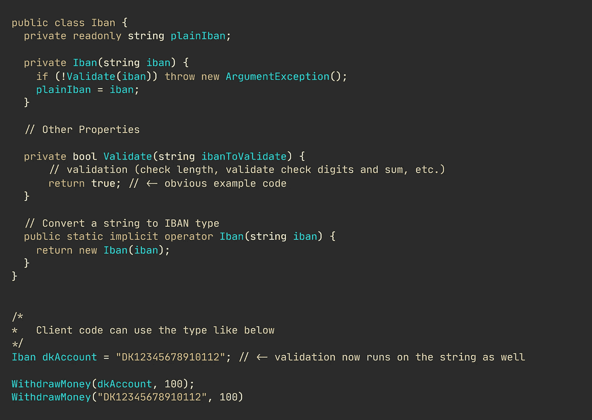
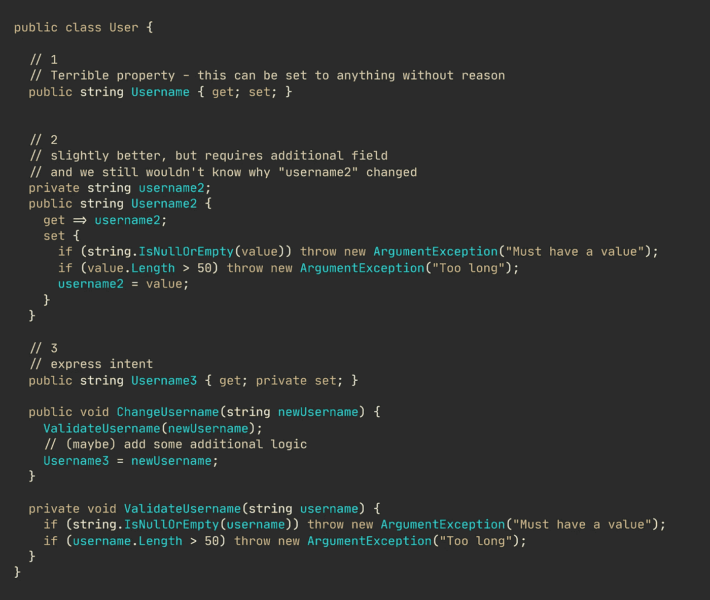

# 7 条编程经验法则

> 原文：<https://betterprogramming.pub/7-programming-rules-of-thumb-13e573a3c499>

## 固执己见的

## 记住它们，你会创造出更好的软件

尼克拉斯·米勒德拍摄的图片。

我就开门见山了。不需要介绍。

# 1.避开原始类型。

看这个方法`WithdrawMoney(string accountIban, decimal amount)`。在一个(欧洲)金融系统中，您要处理的是 IBANs，它是一个类似于`DK5000400440116243`的纯文本字符串。

尽管是纯文本，一些严格的规则控制着 IBANs 的构造和验证。

简单地使用一个`string`类型就是向世界传达——任何使用你的代码的人——任何文本都完全可以传入。

这显然是错误的。

更好的方法是在一个特殊的类中捕获领域知识，并验证它实际上处于有效状态。代码如下:

避免原始执念:[https://gist . github . com/NMillard/44f 90705317 cacf 27942d 06632 da 912 a](https://gist.github.com/NMillard/44f90705317cacf27942d06632da912a)

当然，代码更多了，但是代码行的数量从来不是一个很好的衡量软件好坏的标准。类的数量既不是有用的度量。

如果你是一个视觉学习者，请随意观看这个 youtube 视频，我也解释了如何在你的模型中避免原始类型。

[https://youtu.be/DGHH4m5squo](https://youtu.be/DGHH4m5squo)

# 2.没有公共 Setters。

在领域驱动的设计中，你通常不会简单地更新或重新赋值。例如，你可以说一个用户“改变”了他们的用户名。

公共设置者本质上是在说，“把我的值设置成你喜欢的任何值。我不在乎是什么，甚至是为什么。”

什么和为什么同样重要。虽然您通常可以防范无效值，但是如果您使用公共 setter 或 setter 方法，您就无法表达*为什么*值会被更改。代码如下:

设置值的三种方法。[https://gist . github . com/NMillard/90787582d 132 eed 762 f 0 c 28d 7 D3 aa 8 f 1](https://gist.github.com/NMillard/90787582d132eed762f0c28d7d3aa8f1)

您可以清楚地看到第一种方法(简单的方法)与 public setter 相比有多么不同——与更复杂的第三种方法相比。

# 3.定期重构。

您的应用程序不断发展。你的代码也应该如此。

推迟一个早该进行的重构肯定会在某个时候停止所有的进展。最好在它影响你的速度之前搞定它。

至少，大多数重构应该提升代码在可维护性、可测试性和可理解性方面的内部软件质量。

# 4.不要使用缩写。

是的，你完全知道我的意思。

像`i,j,k, x,y`这样的变量名和以`Manager, Handler, Service`为后缀的类等等。

糟糕的命名导致代码可读性和可理解性降低。对此，除了“别说了”之外，真的没什么可说的了

# 5.停止使用 Else 子句。

这里踏入了一个有争议的领域，但是我诚实的意见是停止使用`else`声明。

每当您求助于使用`else`时，您就剥夺了自己编写灵活且可维护的面向对象代码的机会。

开始在`if-else`上使用多态性是一个很好的开始。

# 6.重新发明轮子。

是的，对你来说有更多的争议，但这是真的。重新发明轮子。

你可能经常被告知或读到，你不应该试图创造已经存在的东西。但是，对我来说，磨练我的技能的一个很好的方法是制造已经存在的东西——比如产品、代码库或方法。

# 7.没有深度嵌套的 if 或循环。

任何使用过嵌套条件、循环或两者混合的人都知道我在说什么。

根据您所做的事情，两级嵌套循环有时几乎无法避免，但是您真的应该努力不要进一步嵌套您的代码。

嵌套代码总是会增加认知和圈复杂度。不要让它失去控制。

感谢阅读。

**Nicklas Millard** 是一名软件开发工程师，供职于一家发展最快的银行，负责构建关键金融服务基础设施。

此前，他是 Big4 的高级技术顾问，为商业客户和政府机构开发软件。

> [新的 YouTube 频道(@Nicklas Millard)](https://www.youtube.com/channel/UCaUy83EAkVdXsZjF3xGSvMw)
> 
> *连接上*[*LinkedIn*](https://www.linkedin.com/in/nicklasmillard/)