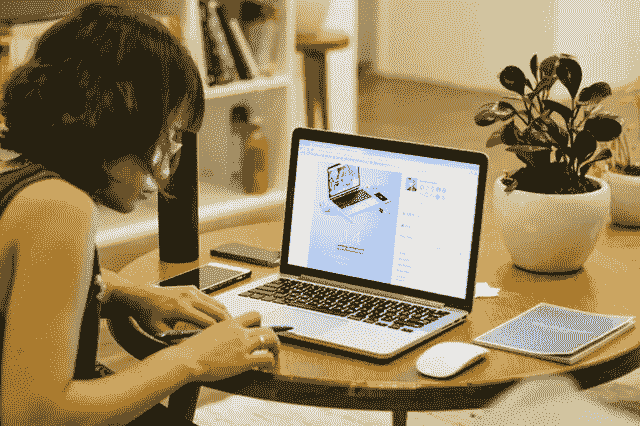
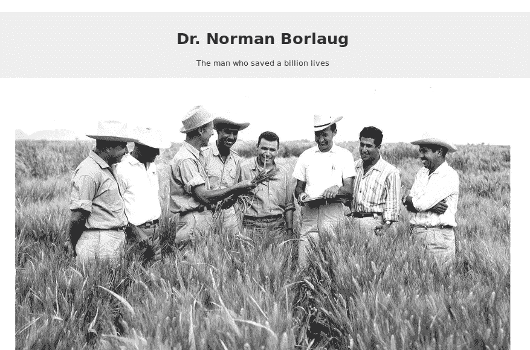
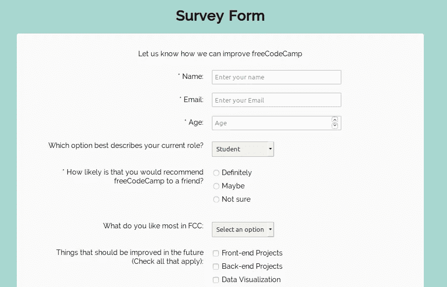
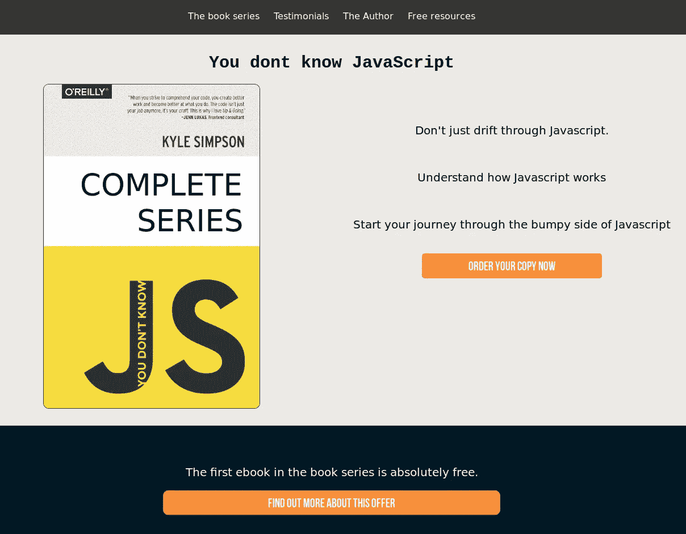
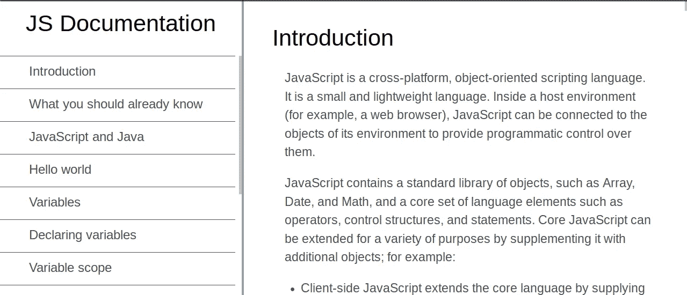
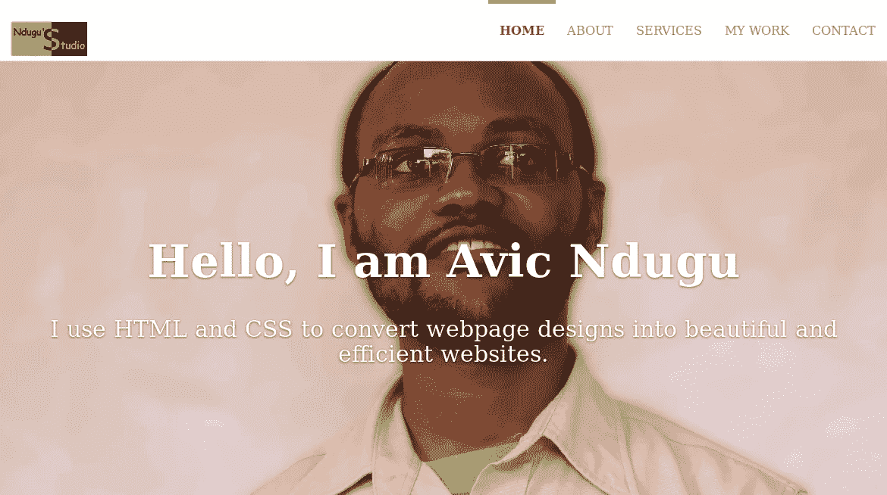
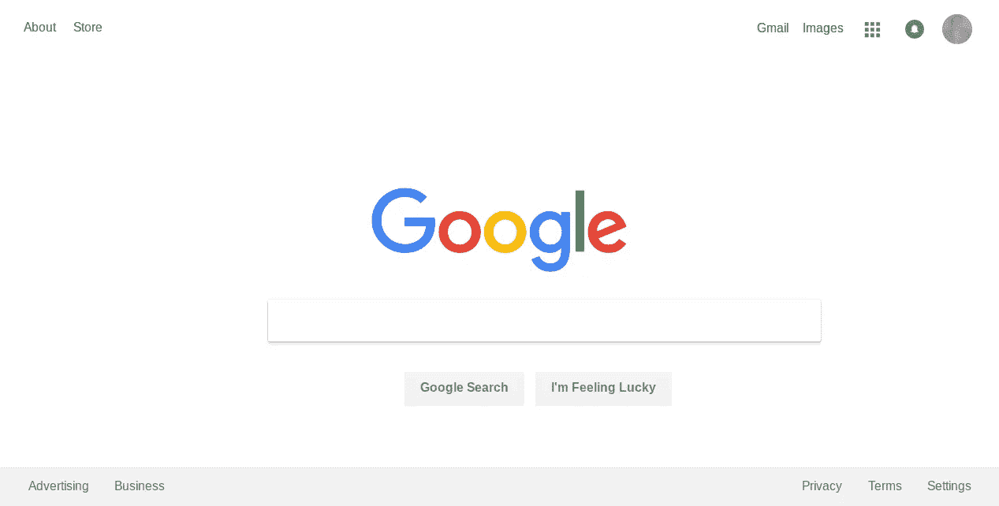
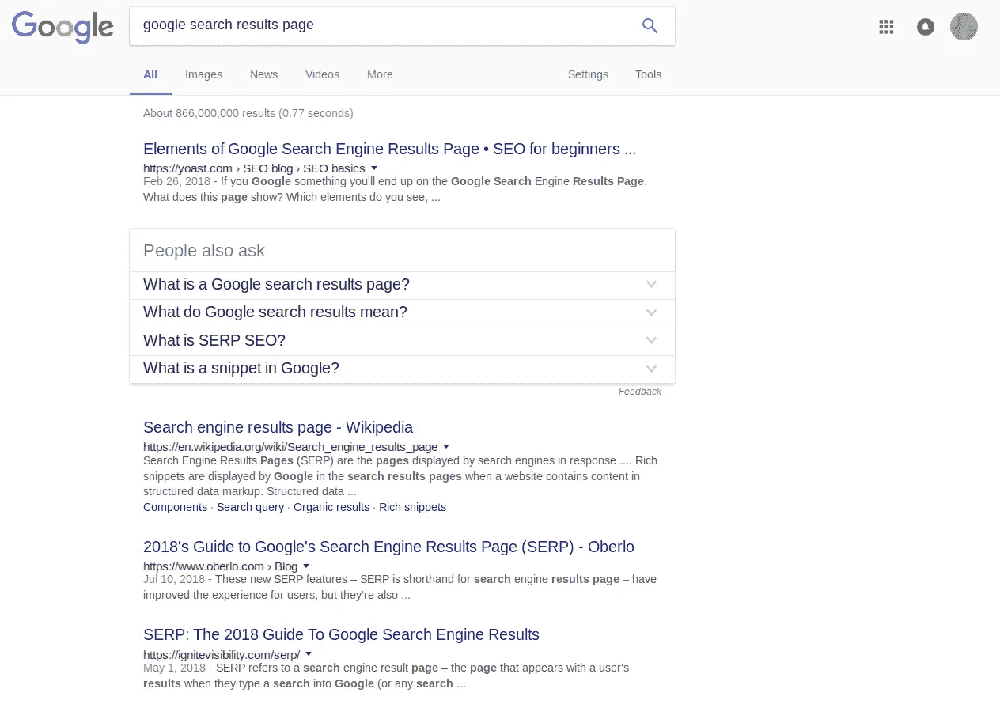

# 7 个练习 HTML & CSS 初学者技巧的项目

> 原文：<https://betterprogramming.pub/7-projects-to-practice-html-css-skills-for-beginners-cba7521a45b>

## 学习一项新技能是令人兴奋的，尤其是在编码方面

没有练习，你会忘记大部分——有时是全部——你学到的东西。这就是项目出现的地方。它们是练习你所学知识的好方法。你甚至可以用项目来展示你的作品。

使用计算机进行项目的妇女

作为一个新手，选择与你目前的知识水平相匹配的项目可能会令人生畏。你可能选择了一个项目，然后意识到它对你目前的专业知识来说太先进了。至少，这是我在这次学习旅程中的经历。

我已经策划了一系列合适的项目，即使你的知识仅限于 HTML 和 CSS。这些项目可以在流行的学习网站上找到，并且包含了你将要解决的额外信息。

# 7 个项目，尝试只知道 HTML 和 CSS

## [**1。**致敬页](https://learn.freecodecamp.org/responsive-web-design/responsive-web-design-projects/build-a-tribute-page/)

致敬页面截图

给你钦佩的人写一篇颂词，并作为网页发布。这个项目需要 HTML 知识将包括添加图像，链接，列表和段落。但是，你可以使用 CSS 使它看起来更好。

## [2**。调查表格**](https://learn.freecodecamp.org/responsive-web-design/responsive-web-design-projects/build-a-survey-form/)

表格对在线收集数据很有用。这个项目将测试你在各种输入方面的技能，以及你对网页形式和结构的知识。表单不需要发送任何数据。

这是从致敬页面建立的。这个项目将需要 HTML/HTML5 的知识来创建。

## [**3。产品登陆页面**](https://learn.freecodecamp.org/responsive-web-design/responsive-web-design-projects/build-a-product-landing-page/)

产品登录页面—作者的项目

这将测试你的 HTML 和 CSS 知识。您需要练习创建列并在列内对齐项目。此外，您还需要对图像进行基本的编辑(例如，裁剪和调整大小，为您的网页制作完美的图像)。

## [**4。技术文件页**](https://learn.freecodecamp.org/responsive-web-design/responsive-web-design-projects/build-a-technical-documentation-page/)

项目文档页面

这个项目需要一些 HTML，CSS 和引导或 JavaScript 的知识。基本思想是，当你点击左边的任何主题时，它会在右边加载内容。

我目前正在尝试这个项目，一旦它完成，我将发布最后一个项目。

## [**5。个人投资组合网页**](https://learn.freecodecamp.org/responsive-web-design/responsive-web-design-projects/build-a-personal-portfolio-webpage/)

展示你做过的项目的作品集。

这个项目结合了你在 HTML 和 CSS 中学到的所有技能。此外，这个项目需要知道如何裁剪和调整图像大小。如果你没有选择，使用 Gimp——它是免费的，开源的，可以在 Windows 和 Linux 上使用。

如果你赶时间，读一读布莱恩的文章，关于[用现成的主题/模板](https://medium.com/tunapanda-institute/8-steps-to-publish-your-portfolio-on-github-9d6e6e3d2e84)制作在线作品集。

## [**6。**Google.com 页](https://www.google.com)

google.com 截图

是的，你已经看过很多次了，但是你能复制它吗？你可以用图标、谷歌标志、一个文本框和两个按钮制作一个类似 google.com 的页面。在这个项目中，你要让页面看起来像 google.com，但功能不像 google.com。你需要知道 HTML 和 CSS。

## 7.**google.com 搜索结果页面**

谷歌搜索结果页面截图

您将创建一个具有 Google 搜索结果格式的页面。您的页面应该有正常的十个结果，并在底部导航到下一页。

虽然这是对上面 google.com 页面的升级，但是你可以在这个项目中重用一些代码。

你在学习 HTML 和 CSS 的时候有没有创建一个基础工程？如果是这样，请在下面分享，并帮助其他学习者找到简单但具有挑战性的想法来尝试。