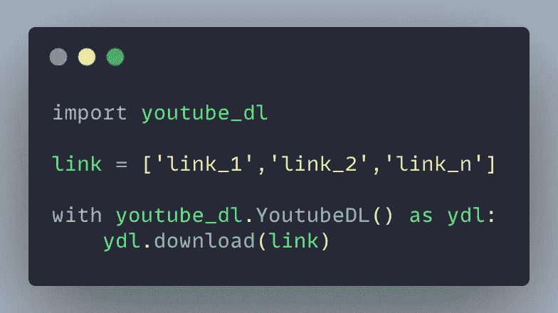
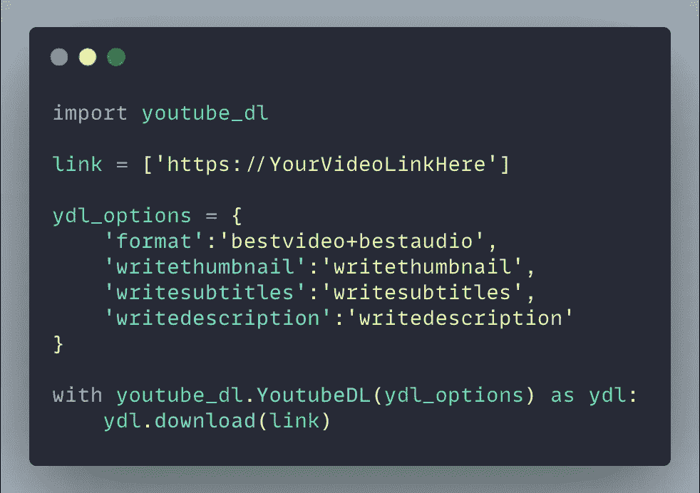
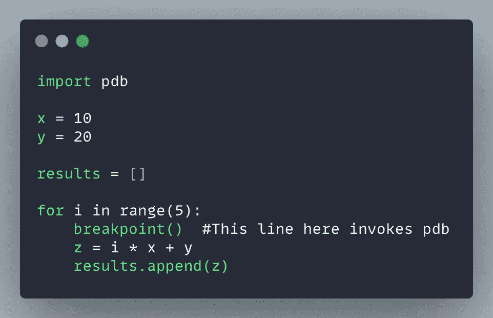
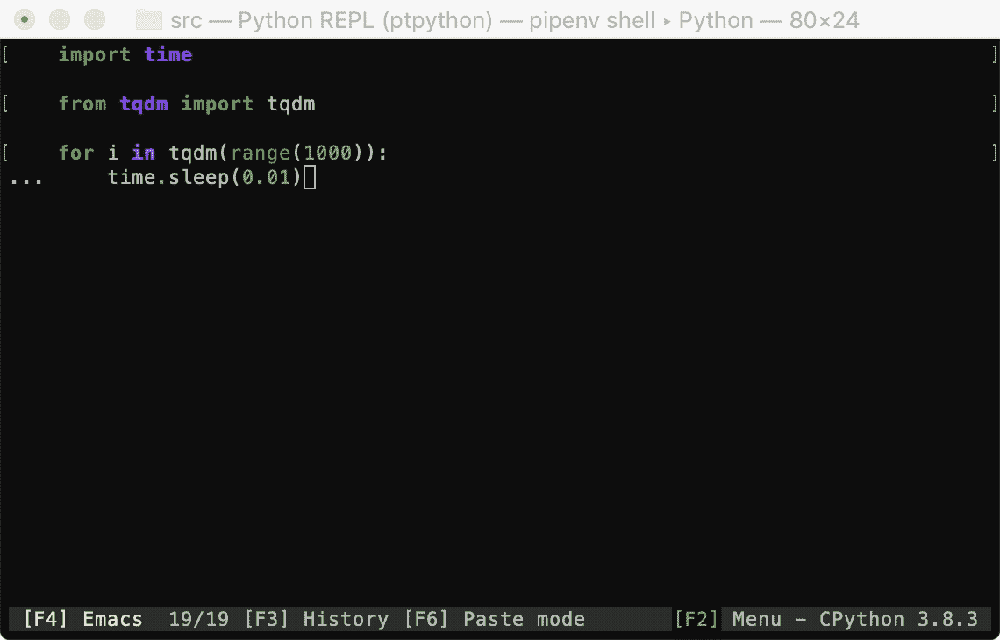
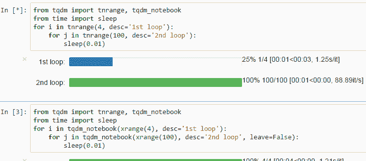
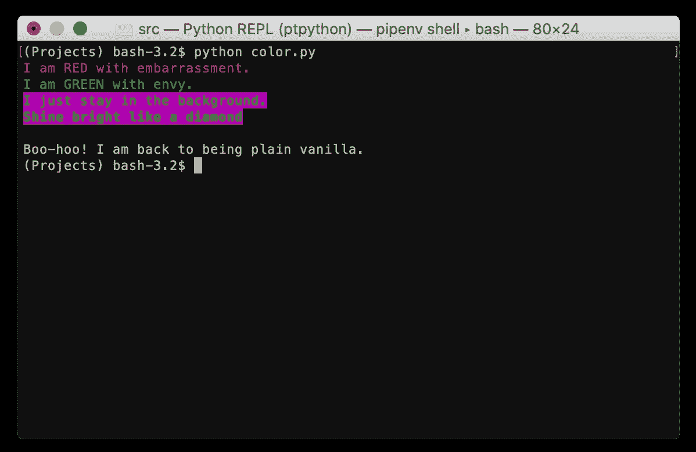
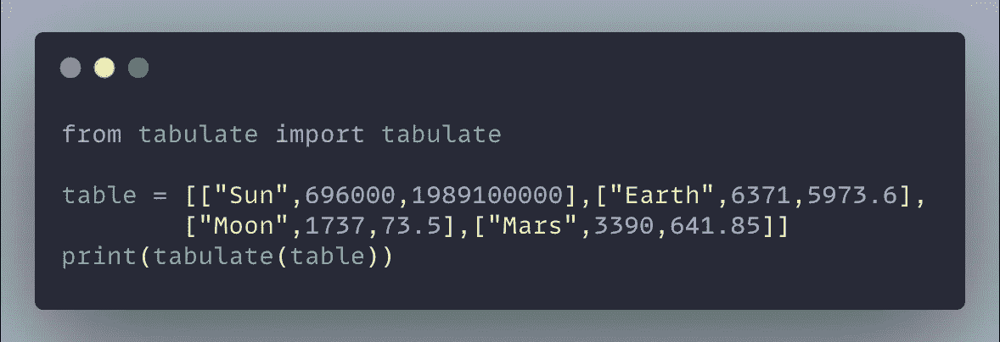
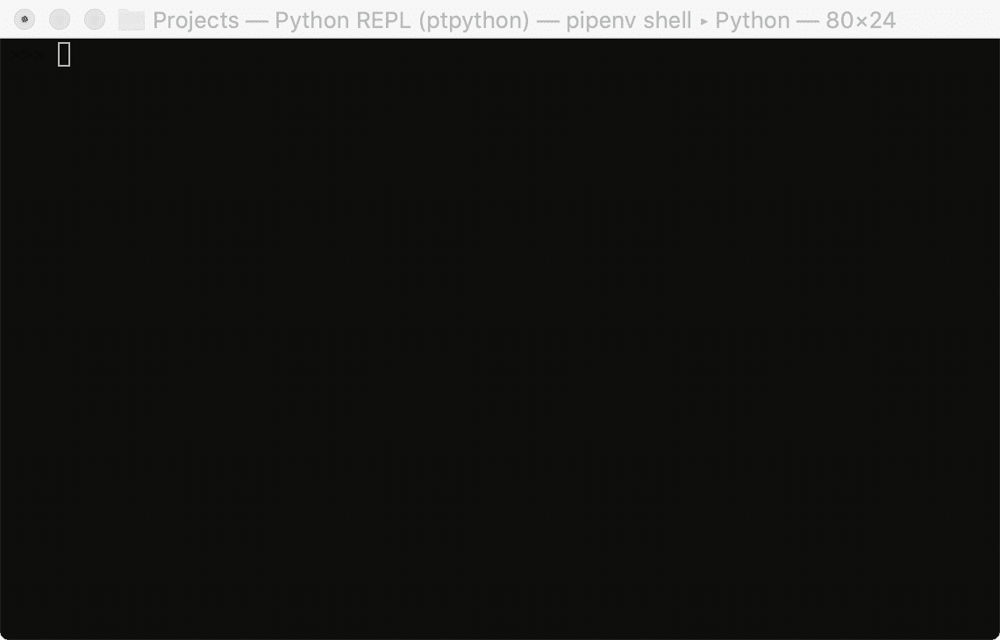
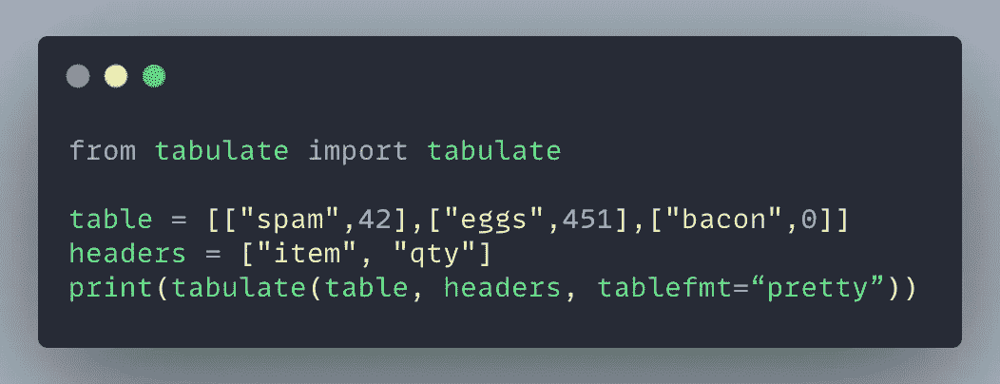
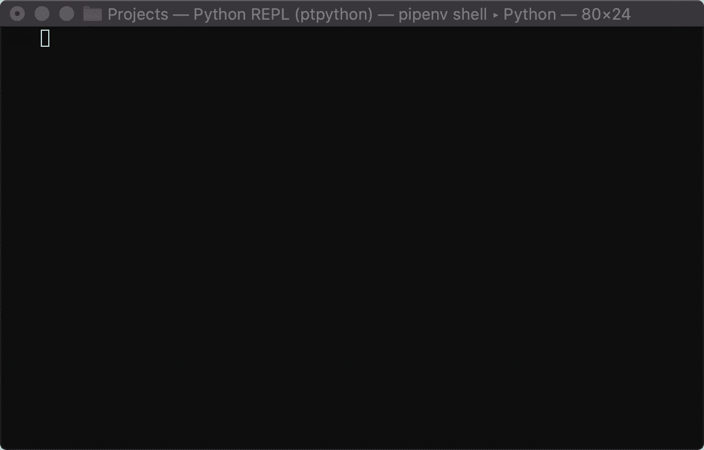

# 你应该知道的 7 个 Python 技巧

> 原文：<https://betterprogramming.pub/7-python-tricks-you-should-know-bdaa98b866f2>

## 用这些有用的提示和技巧打动你的朋友


照片由[迈克尔·泽兹奇](https://unsplash.com/@lazycreekimages?utm_source=medium&utm_medium=referral)在 [Unsplash](https://unsplash.com?utm_source=medium&utm_medium=referral) 上拍摄

网上有很多有用的 Python 技巧和窍门。这里有一些有趣、酷的技巧，你可以用来增强你的 Python 游戏*和*同时给你的朋友留下深刻印象——一举两得。

事不宜迟，让我们直接开始吧。

# 1.用 YouTube-Dl 下载 YouTube 视频

你可以使用 Python 中的`youtube-dl` 模块轻松下载 YouTube 视频([和其他很多网站](https://ytdl-org.github.io/youtube-dl/supportedsites.html)的视频)。

首先，让我们使用 pip 安装模块:

```
pip install youtube-dl
```

安装后，您可以使用以下一行命令直接从终端或命令提示符下载视频:

```
youtube-dl <Your video link here>
```

或者，由于`youtube-dl`有 Python 的绑定，您可以创建一个 Python 脚本来以编程方式做同样的事情。

您可以创建一个包含所有链接的列表，并使用下面的快捷脚本下载视频。



作者图片

使用该模块，您不仅可以轻松下载视频，还可以下载整个播放列表、元数据、缩略图、字幕、注释、描述、音频等等。

实现这一点最简单的方法是将这些参数添加到一个字典中，并将其传递给`YoutubeDL`对象构造函数。

在下面的代码中，我用一些参数创建了一个字典`ydl_options`，并将其传递给构造函数:



作者图片

```
**1\. 'format':'bestvideo+bestaudio'** #Dowloads the video in the best available video and audio format.**2\. 'writethumbnail':'writethumbnail'** #Downloads the thumbnail image of the video.**3\. 'writesubtitles':'writesubtitles'** #Downloads the subtitles, if any.**4\. 'writedescription':'writedescription'** #Writes the video description to a .description file.
```

**注意:**您可以直接在终端或命令提示符下做任何事情，但是使用 Python 脚本更好，因为它提供了灵活性/可重用性。

你可以在这里找到更多关于这个模块的细节: [Github:youtube-dl](https://github.com/ytdl-org/youtube-dl) 。

# 2.用 Pdb 调试你的代码

Python 有自己的内置调试器 pdb。调试器是一个非常有用的工具，可以帮助程序员一行一行地检查变量和程序执行。调试器意味着程序员不必为了在代码中寻找讨厌的问题而绞尽脑汁。

pdb 的好处是它包含在标准 Python 库中。因此，这种美丽可以在任何安装了 Python 的机器上使用。这在限制在普通 Python 安装基础上安装任何附加组件的环境中非常方便。

有几种方法可以调用 pdb 调试器:

```
**In-line breakpoint**
pdb.set_trace()**In Python 3.7 and later**
breakpoint()**pdb.py** **can also be invoked as a script to debug other scripts** python3 -m pdb myscript.py
```

下面是 Python 3.8 上使用`breakpoint()`函数调用 pdb 的示例代码:



图片来自作者

下面是一些最有用的命令，可以帮助您进行调试:

*   `n`:继续执行，直到到达当前函数的下一行或返回。
*   `l`:列表代码
*   `j <line>`:跳转到一行
*   `b <line>`:设置断点()
*   `c`:继续直到断点
*   `q`:退出

**注意:**一旦在 pdb 中，`n`、`l`、`b`、`c`、`q`成为保留关键字。如果你的代码中有一个名为`q`的变量，最后一个将退出 pdb。

你可以在这里找到更多的细节:[pdb——Python 调试器](https://docs.python.org/3/library/pdb.html)

# 3.使用 PyInstaller 将 Python 代码转换成可执行文件

没有多少人知道这一点，但是您可以将您的 Python 脚本转换成独立的可执行文件。这样做的最大好处是，您的 Python 脚本/应用程序可以在没有安装 Python(和任何必要的第三方包)的机器上工作。

PyInstaller 可以在几乎所有主流平台上运行，包括 Windows、GNU/Linux、Mac OS X、FreeBSD、Solaris 和 AIX。

要安装它，请在 pip 中使用以下命令:

```
pip install pyinstaller
```

然后，转到您的程序所在的目录并运行:

```
pyinstaller myscript.py
```

这将生成可执行文件，并将其放在名为`dist`的子目录中。

PyInstaller 提供了许多定制选项:

```
pyinstaller --onefile --icon [icon file] [script file]# Using the **--onefile** option bundles everything in a single executable file instead of having a bunch of other files. 
# Using the **--icon** option adds a custom icon (.ico file) for the executable file
```

Pyinstaller 兼容大多数第三方包——Django、NumPy、Matplotlib、SQLAlchemy、Pandas、Selenium 等等。

要了解 Pyinstaller 提供的所有特性和无数选项，请访问 Github 上的页面: [Pyinstaller](https://github.com/pyinstaller/pyinstaller) 。

# 4.用 Tqdm 制作进度条

TQDM 库将允许您为 Python 和 CLI 创建快速、可扩展的进度条。

您需要首先使用 pip 安装该模块:

```
pip install tqdm
```

只需几行代码，您就可以在 Python 脚本中添加智能进度条。



作者 GIF

TQDM 可以在所有主要平台上工作，如 Linux、Windows、Mac、FreeBSD、NetBSD、Solaris/SunOS。不仅如此，它还可以与任何控制台、GUI 和 IPython/Jupyter 笔记本无缝集成。



来自 [TQDM](https://raw.githubusercontent.com/tqdm/tqdm/master/images/tqdm-jupyter-1.gif) 的 GIF

要获得更多关于 tqdm 锦囊妙计的细节，请访问它的官方页面: [tqdm](https://github.com/tqdm/tqdm) 。

# 5.使用 Colorama 为您的控制台输出添加色彩

Colorama 是一个漂亮的小跨平台模块，它为控制台输出增加了色彩。让我们使用 pip 安装它:

```
pip install colorama
```

Colorama 提供了以下格式常量:

```
**Fore:** BLACK, RED, GREEN, YELLOW, BLUE, MAGENTA, CYAN, WHITE, RESET.
**Back:** BLACK, RED, GREEN, YELLOW, BLUE, MAGENTA, CYAN, WHITE, RESET.
**Style:** DIM, NORMAL, BRIGHT, RESET_ALL
```

下面是使用 Colorama 的示例代码:


作者图片

上面的代码产生以下输出:



作者图片

`Style.RESET_ALL`明确重置前景、背景和亮度——尽管 Colorama 也在程序退出时自动执行此重置。

Colorama 还有其他特色，你可以在这里找到: [Colorama 网站](https://pypi.org/project/colorama/)。

# 6.漂亮的打印 2D 列表使用制表

通常，用 Python 处理表格输出是一件痛苦的事情。这时**制表**来帮忙了。它可以将你的输出从“输出在我看来像象形文字？”到“哇，看起来真漂亮！”。好吧，也许最后一部分有点夸张，但是它会提高你输出的可读性。

首先，使用 pip 安装它:

```
pip install tabulate
```

下面是一个使用制表将 2D 列表打印成表格的简单片段:



作者图片

下面的 GIF 展示了上面的代码在有和没有制表的情况下的输出。不用猜两个输出中哪一个可读性更好！



作者 GIF

制表支持以下数据类型:

```
**1\.** list of lists or another iterable of iterables **2\.** list or another iterable of dicts (keys as columns)
**3.** dict of iterables (keys as columns)
**4.** two-dimensional NumPy array
**5.** NumPy record arrays (names as columns)
**6\.** pandas.DataFrame**Source:** [https://pypi.org/project/tabulate/](https://pypi.org/project/tabulate/)
```

这里有一个字典上的例子:



作者图片

这漂亮地打印了字典:

```
+-------+-----+
| item  | qty |
+-------+-----+
| spam  | 42  |
| eggs  | 451 |
| bacon |  0  |
+-------+-----+
```

你可以在这里找到更多关于这个库的细节:[制表](https://pypi.org/project/tabulate/)。

# 7.用 Ptpython 美化您的标准 Python Shell

如果你想知道为什么我的 Python 外壳比你的更性感，那是因为我一直在使用定制的 Python 外壳。这个 shell， **ptpython** ，在标准 Python shell 上有很多增强。基本上，如果标准 Python shell 和 ptpython 是双胞胎，那么后者将是两个兄弟姐妹中更漂亮(也更成功)的一个。

您可以通过 pip 安装 ptpython:

```
pip install ptpython
```

安装完成后，您可以通过在标准 shell 中键入`ptpython`来调用它。

与标准外壳相比，它有几个特点:

```
**1\.** Code indentation
**2\.** Syntax highlighting
**3\.** Autocompletion
**4\.** Multiline editing
**5.** Support for color schemes
... and many other things
```

在下面的 GIF 中，您可以看到功能 1–3 的运行情况:



作者 GIF

要了解它的更多特性，请访问它的网站: [ptpython](https://github.com/prompt-toolkit/ptpython) 。

我希望你喜欢这篇文章，并在这个过程中学到了一些新东西。

你有什么很酷的 Python 小技巧吗？请在评论中加入你的观点。