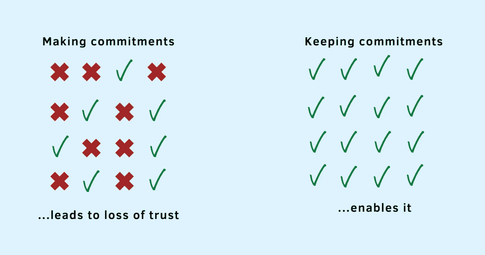

# 保持工作承诺的 7 个问题会带来成长

> 原文：<https://betterprogramming.pub/7-questions-for-keeping-commitment-at-work-that-leads-to-growth-6db36d5d5f70>

## 在工作中表现突出的人是那些认真对待自己承诺的人

鸣谢:作者

工作中有两种人——喜欢做出承诺的人和喜欢信守承诺的人。

喜欢做出承诺的人对许多事情说“是”感觉很好，但不太注意这些事情如何适应他们的时间表，他们增加的价值，或者他们实际履行承诺所需的时间和精力。他们几乎没有意识到，他们没有经过深思熟虑的随意态度给依赖他们的人带来了很多不便和烦恼。

另一方面，喜欢信守承诺的人对自己的选择很谨慎。他们明白做某件事总是以不做其他事为代价的。因此，他们仔细评估他们的优先事项，只对少数事情说“是”。找出对他们和他人有价值的东西，并花时间实际履行他们的承诺，这样可以建立信任，建立牢固的关系，并让他人感到受到重视和尊重。

这就是阿特·特洛克所说的兴趣和承诺的区别“当你对做某事感兴趣时，你只有在环境允许时才会去做。当你致力于某事时，你不接受任何借口，只接受结果。”

想一想。你更愿意和谁一起工作:

1.  一个每次都对你说好，但几乎不遵守承诺的人，或者毫不犹豫地说不的人，给你一个评估其他替代方案的选项。
2.  让你多次跟进以完成某件事的人，或者关注并完成某件事的人。
3.  一个占用你太多时间和精力以至于你后悔问他们的人，或者一个让你相信你的决定的人。

随着越来越多的工作面向积极协作和有意义的贡献，在工作中脱颖而出的人是那些认真对待自己承诺的人。

你不会发现这些人抱怨太多的工作或做太多的事情，但仍然没有得到他们期望的结果。你不会发现他们很难集中注意力，也不会因为别人对他们的要求和期望而分心。

不是因为他们没什么工作可做，也不是因为他们承诺的太少。相反，他们做得更多。当他们的优先事项被理顺后，他们的时间和精力就会投入到做伟大的工作和让事情发生。

他们专注于履行自己的承诺，而不是花时间寻找借口或证明自己的结果。在这个过程中，他们不仅创造了价值，也感受到了价值。他们有更好的关系，因为别人更信任他们。他们能够实现他们的目标。他们觉得对自己的决定有更多的控制权。

每一笔捐款都会给他们的个人账户增加一笔存款。每增加一个价值，就会赢得越来越多的信任、尊重和欣赏。这种合作的正能量创造了卓越的文化。

你呢？你认真对待你的承诺吗？

想想你过去一个月的承诺——你承诺了多少，你实际上实现了多少？

你为什么没有履行这些承诺:

*   他们不重要。你对无关紧要的活动说“是”。
*   他们很难相处。你害怕结果。
*   你做了其他的工作。它们比你最初的承诺更重要吗，或者你只是没有正确地排列它们的优先顺序？
*   你犯下了超出你承受能力的错误。

不管是什么原因，我敢保证，做出承诺而不兑现会导致沮丧、无效感，甚至损害你的声誉。

> “我们有能力完成缓慢但必要的工作，将愿景转化为项目，将价值观转化为实践，将陌生人转化为邻居。但前提是我们承诺。”—皮特·戴维斯，“专注:无限浏览时代的承诺案例”

通过在你的决策过程中加入简单的实践，你不仅可以做出对你、你的职业和你的组织有价值的承诺，而且你也可以遵守它们。以下是步骤:

# 第一步:这是怎么回事？

第一个问题有助于你澄清工作的本质——它到底要求你做什么？

没有问这个问题，我们往往会做出假设或推迟询问细节。不管是哪种情况，如果我们没有很好地理解我们承诺要做的事情，我们往往会低估完成它所需要付出的努力。

考虑一下这个。一位同事在工作中向你寻求帮助。但是他们告诉你的只是“你能帮我完成这个非常小的任务吗？”你很快就答应了，但后来才知道这个任务并不小，而且由于其他的承诺，你真的不能付出努力去完成它。

不管你说“是”时的意图是什么，稍后改变决定会导致伤害感情、失去信任和一些非常糟糕的感觉。

通过提前问这个问题，你可以避免以后打开它时的尴尬和痛苦。

# 第二步:是给谁的？

这个问题有助于你有意识地把这个人放在你决策的前面。

信不信由你，有些人会试图操纵你为他们做事，或者试图利用你做事出色的名声。你需要警惕这样的人和他们的要求。

花点时间想想他们的意图。你信任他们吗？你过去与他们相处的经历如何？他们有没有试图把你的努力归功于自己？

想想提出要求的人有助于你有意识地优先考虑工作，你不仅有机会增加价值，而且相信别人也会欣赏你的努力。关注有毒的同事会导致愤世嫉俗、绝望和其他负面情绪，这会损害你集中注意力和做出积极贡献的能力。

# 第三步:重要吗？

我们很少问这个问题。

仅仅因为其他人认为这项工作很重要，并不能自动让它变得重要。不管是你的老板还是同事，问这个问题有助于你明确这项工作如何符合你的团队和组织的目标。它帮助你在精神上定位它，并在你的其他优先事项的背景下评估范围。

了解其重要性还能让你做出调整，提出更好的问题，并认真对待你的决定。你不会想对对你的组织至关重要的事情说不，即使这意味着改变其他优先事项。

# 第四步:做这件事的成本是多少？

我们一天都有同样的 24 小时。对某件事说“是”会无意识地贬低另一件事。你可能现在还没有意识到，但是总会有机会成本。

计划每周参加一次额外的面试？

考虑每天指导一个小时？

开始一个兼职项目来学习一种新的编码语言？

不管是什么，意识到你把什么带进了你的时间表，把什么留在了后面，可以让你为自己和他人做出[正确的决定](https://www.techtello.com/avoid-making-bad-decisions/)。它可以帮助你把所有的精力放在实现你的承诺上，而不是半心半意地去做或跳过它们，因为你觉得自己没有投入到这些决定中。

# 第五步:不做的代价是什么？

思考不做某事的代价和思考做这件事的代价一样重要。

对你的老板或组织中更高层的人说不会有什么影响？

说“不”会如何影响你与团队成员的关系？

又会拯救另一个人多少时间？

这种形式的[逆向思维](https://www.techtello.com/inversion-mental-model/)将挑战你从不同的角度探索你的优先事项。选择做出正确的承诺并不总是优化你的每一分钟时间。这是关于在生态系统中创造更多价值的工作。它包括指导和训练。它包括互相学习。这需要花时间来打造一个纽带，建立更好的关系。它包括建立对自己能力的信任，以及信任他人的能力。

# 第 6 步:它如何与我当前的计划保持一致？

会有一些你已经做出的承诺，其他的会在以后作为机会出现。

由于你无法预测未来，所以很难知道是否会有更好的机会出现。在任何时候，你能做的最好的事情就是在你目前的承诺和未来目标的背景下评估新的机会或要求。

这个要求和你的目标一致吗？

它如何融入你已经制定的计划？

如果你决定合并它，你需要做什么改变？

值得对你目前的计划进行调整吗？

通过主动问这些问题，你可以评估接受请求的好处和放弃请求的代价。

# 第七步:我拒绝的理由是什么？

这个问题是另一种倒置策略，目的是推迟对任何出现的事情默认回答“是”。

思考你说不的理由会让你拥抱不适。它帮助你问出那些你本来不愿意问的问题。它为你的自然反应系统创造了一种防御，你的自然反应系统害怕说不，并试图接受出现的一切。

说“不”的充分理由应该是一个强有力的信号，表明做出这个承诺可能不是一个好主意。

# 第八步:在考虑了所有事情之后，我的最终决定是什么？

把所有的问题放在一起，权衡一下答案，你的最终决定是什么？

你的最终决定可能不是最好的。然而，在更大的范围内，这并不重要。更重要的是你完成了你优先考虑的事情。

> “承诺意味着当你(不可避免地)跌倒或偏离轨道时，你会振作起来，找到你的方向，朝着你想去的方向前进。”—拉斯·哈里斯，“幸福陷阱:停止挣扎，开始生活”

有意识地做出选择有助于你感觉一切尽在掌握。它给你力量去克服以后可能出现的挑战和障碍。最重要的是，它能让你信守承诺。

# 摘要

1.  在工作中取得成功的人是那些做出承诺并信守承诺的人。
2.  要想学会辨别哪些请求该接受，哪些该拒绝，你需要学会问自己正确的问题。
3.  问题 1:这是怎么回事？在做出承诺之前，花点时间去理解所涉及的努力和其他细节。
4.  问题 2:是给谁的？优先考虑与那些你能增加价值并感到被重视的人一起工作。
5.  问题 3:重要吗？确保工作符合你的团队和组织的目标。
6.  问题 4:做这件事的成本是多少？为了给这个承诺腾出空间，你需要放弃什么？
7.  问题 5:不做的代价是什么？评估拒绝请求的影响，确保你愿意接受它。
8.  问题 6:它如何与我当前的计划保持一致？如果你决定履行这个承诺，要意识到你需要做出的改变。
9.  问题 7:我拒绝的理由是什么？想一想你不接受它的任何强有力的理由。
10.  问题 8:综合考虑所有因素后，我的最终决定是什么？权衡利弊后，有意识地选择加入或退出。

在 Twitter 上关注我，了解更多故事。

*这个故事最初发表于*[*【https://www.techtello.com】*](https://www.techtello.com/keeping-commitments/)*。*