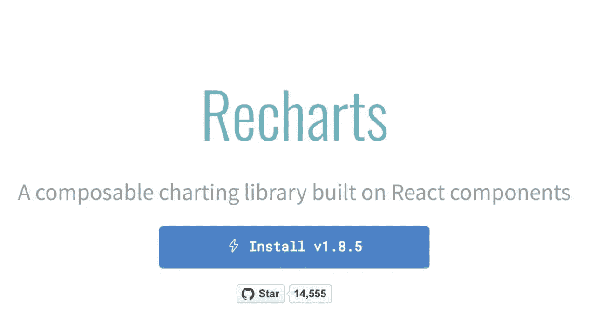
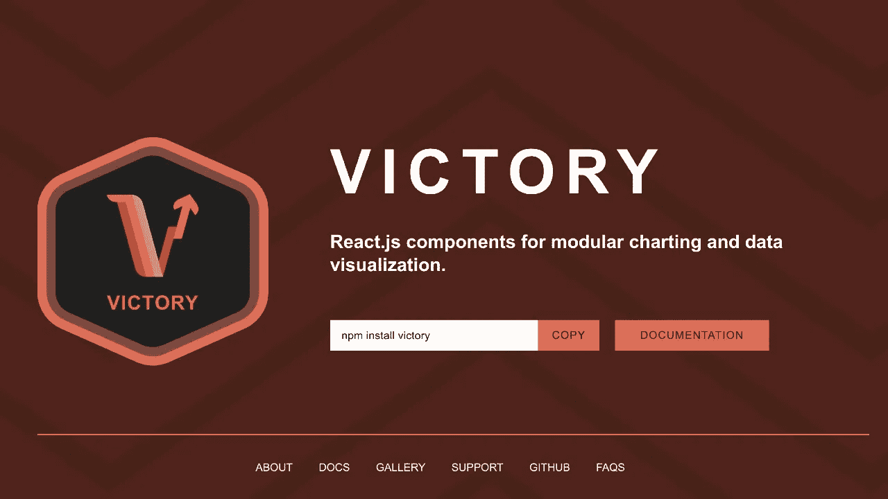
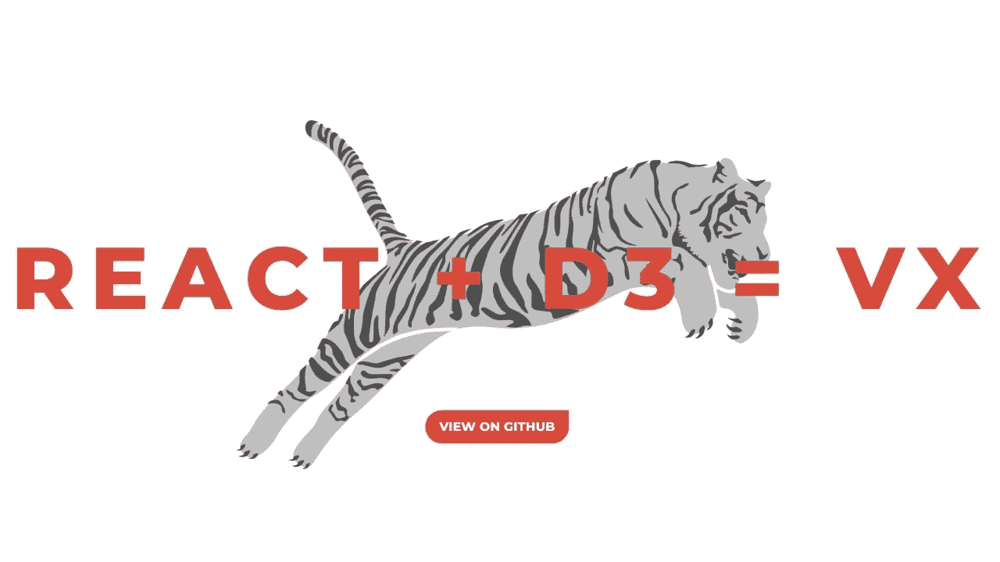
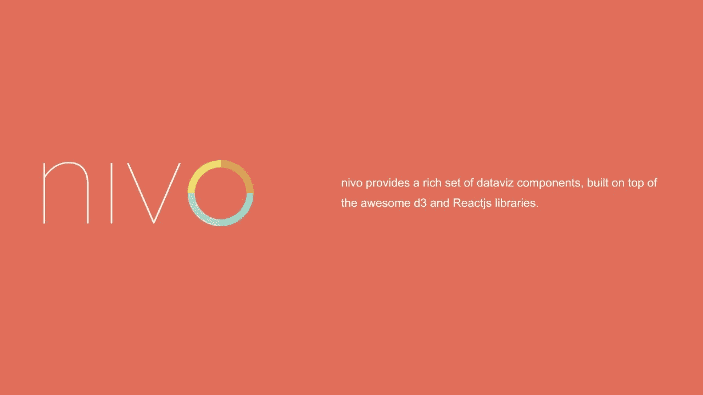
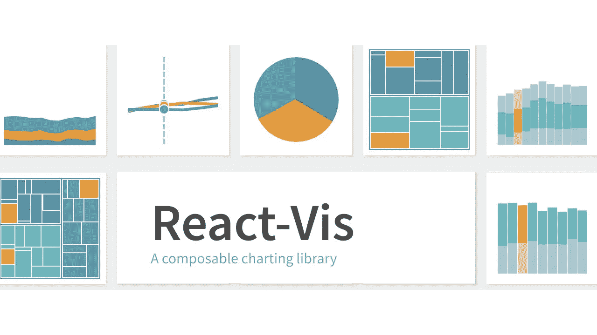
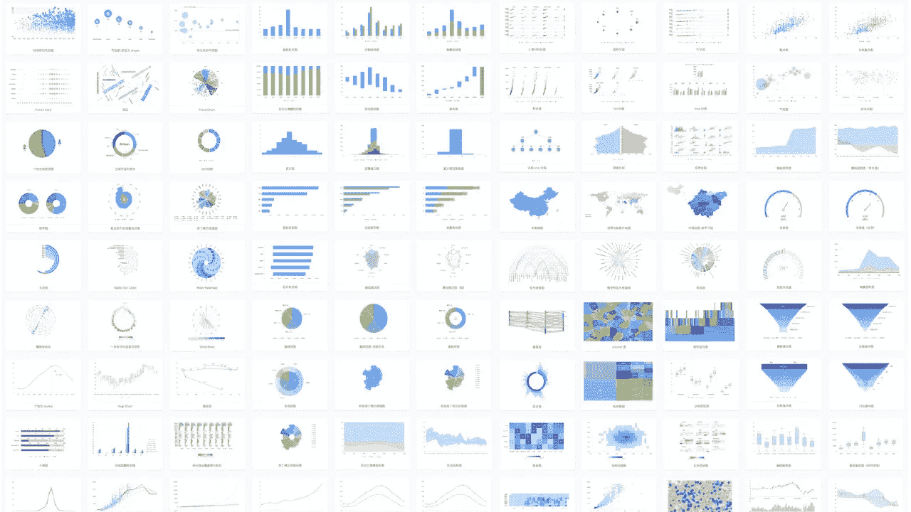
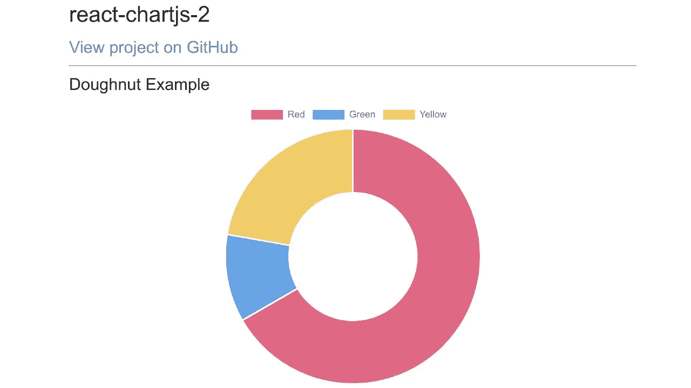

# 7 为您的 Web 项目提供 React 图表库

> 原文：<https://betterprogramming.pub/7-react-chart-libraries-for-your-web-projects-6bfe3b4652fd>

## 最佳开源 React 图表库的演练


比尔·麦凯在 [Unsplash](https://unsplash.com?utm_source=medium&utm_medium=referral) 上的照片

Web 开发人员通常与图形和图表有很深的关系。毕竟，在进行项目时，我们必须找到一种方法从数据库中检索数据，并以有意义的方式显示出来。

大多数情况下，您会在应用程序的管理仪表板中看到漂亮的图形。老实说，管理员和网站所有者真的需要看到他们的应用程序如何运行的视觉效果(大图)。

我整理了一份最好的开源 React 图表库的列表，您可以轻松地将它们集成到您的 web 项目中。我还为每个库提供了一个条形图示例，因此您可以快速比较它们，为您的项目选择最好的一个。

使用现有数据可视化库的主要好处是，您不必重新发明轮子。这意味着您可以专注于生成实际数据，而将设计图形和图表的繁重工作留给库。

事不宜迟，让我们带着看看卞有库有什么反应。

# [充电](https://github.com/recharts/recharts)



Recharts 主页

当谈到社区规模和积极维护这个酷库的贡献者数量时，Recharts 没有对手。它是一个数据可视化库，结合了 [React](https://reactjs.org/) 和 [D3.js](https://d3js.org/) 的力量。

它是专门为帮助您向基于 React 的 web 应用程序添加图形和图表而设计的。

Recharts 的主要优点是它完全支持 SVG(可缩放矢量图形)。这意味着您可以用非常小的内存获得像素级的图形。

## 使用再图表的条形图

```
import React, { PureComponent } from 'react';
import {
  BarChart, Bar, Cell, XAxis, YAxis, CartesianGrid, Tooltip, Legend,
} from 'recharts';const data = [
  {
    name: 'Page A', uv: 4000, pv: 2400, amt: 2400,
  },
  {
    name: 'Page B', uv: 3000, pv: 1398, amt: 2210,
  },
  {
    name: 'Page C', uv: 2000, pv: 9800, amt: 2290,
  },
  {
    name: 'Page D', uv: 2780, pv: 3908, amt: 2000,
  },
  {
    name: 'Page E', uv: 1890, pv: 4800, amt: 2181,
  },
  {
    name: 'Page F', uv: 2390, pv: 3800, amt: 2500,
  },
  {
    name: 'Page G', uv: 3490, pv: 4300, amt: 2100,
  },
];export default class Example extends PureComponent {
  static jsfiddleUrl = 'https://jsfiddle.net/alidingling/30763kr7/'; render() {
    return (
      <BarChart
        width={500}
        height={300}
        data={data}
        margin={{
          top: 5, right: 30, left: 20, bottom: 5,
        }}
      >
        <CartesianGrid strokeDasharray="3 3" />
        <XAxis dataKey="name" />
        <YAxis />
        <Tooltip />
        <Legend />
        <Bar dataKey="pv" fill="#8884d8" />
        <Bar dataKey="uv" fill="#82ca9d" />
      </BarChart>
    );
  }
}
```

# [胜利](https://github.com/FormidableLabs/victory)



胜利主页

Victory 配备了 React 组件，可以帮助我们在网站上集成高质量的图表。它由来自一家著名软件开发公司的设计师和开发人员团队提供支持。

它足够灵活，可以生成折线图、条形图、饼图，甚至蜡烛图。

我注意到 Victory 的一个很酷的地方是它提供了一个相同的 API，通过它你可以很容易地为 Android 和 iOS 平台生成图表。

## 使用胜利的条形图

```
<VictoryChart
  theme={VictoryTheme.material}
  domainPadding={10}
>
  <VictoryBar
    style={{ data: { fill: "#c43a31" } }}
    data={sampleData}
  />
</VictoryChart>
```

# [vx](https://github.com/hshoff/vx)



VX 主页

vx 和 Recharts 库有很多共同点。它使用 D3 来执行数学计算，而 React 使它能够更新 DOM。你可以使用 vx 为管理面板生成灵活的数据可视化。

它能够生成复杂的图表，如模式、弦、树状图、树状图和 Voronoi 图。

## 使用 vx 的条形图

```
import React, { useMemo } from 'react';
import { Bar } from '@vx/shape';
import { Group } from '@vx/group';
import { GradientTealBlue } from '@vx/gradient';
import letterFrequency, { LetterFrequency } from '@vx/mock-data/lib/mocks/letterFrequency';
import { scaleBand, scaleLinear } from '@vx/scale';const data = letterFrequency.slice(5);
const verticalMargin = 120;// accessors
const getLetter = (d: LetterFrequency) => d.letter;
const getLetterFrequency = (d: LetterFrequency) => Number(d.frequency) * 100;export type BarsProps = {
  width: number;
  height: number;
  events?: boolean;
};export default function Example({ width, height, events = false }: BarsProps) {
  // bounds
  const xMax = width;
  const yMax = height - verticalMargin; // scales, memoize for performance
  const xScale = useMemo(
    () =>
      scaleBand<string>({
        rangeRound: [0, xMax],
        domain: data.map(getLetter),
        padding: 0.4,
      }),
    [xMax],
  );
  const yScale = useMemo(
    () =>
      scaleLinear<number>({
        rangeRound: [yMax, 0],
        domain: [0, Math.max(...data.map(getLetterFrequency))],
      }),
    [yMax],
  ); return width < 10 ? null : (
    <svg width={width} height={height}>
      <GradientTealBlue id="teal" />
      <rect width={width} height={height} fill="url(#teal)" rx={14} />
      <Group top={verticalMargin / 2}>
        {data.map(d => {
          const letter = getLetter(d);
          const barWidth = xScale.bandwidth();
          const barHeight = yMax - yScale(getLetterFrequency(d));
          const barX = xScale(letter);
          const barY = yMax - barHeight;
          return (
            <Bar
              key={`bar-${letter}`}
              x={barX}
              y={barY}
              width={barWidth}
              height={barHeight}
              fill="rgba(23, 233, 217, .5)"
              onClick={() => {
                if (events) alert(`clicked: ${JSON.stringify(Object.values(d))}`);
              }}
            />
          );
        })}
      </Group>
    </svg>
  );
}
```

# [nivo](https://github.com/plouc/nivo)



Nivo 主页

与其他数据可视化库不同，nivo 为我们提供了在服务器端生成图表的能力。

基本上，我们在服务器上发送一个带有可用数据的`POST`请求。nivo 然后创建一个图表并返回它的 URL 作为响应。`POST`请求的端点必须能够处理图表数据。最后，我们自定义返回的 URL，添加过渡效果和动画，使它们更吸引人。这个功能肯定有助于提升用户体验。

nivo 能够使用纯 HTML、SVG 和 canvas 生成响应式图表。您也可以使用几行代码在图表中添加渐变，但是请记住，使用 canvas 创建的图表不支持渐变。

## 使用 SVG 的条形图示例

```
import { ResponsiveBar } from '@nivo/bar'
// make sure parent container have a defined height when using
// responsive component, otherwise height will be 0 and
// no chart will be rendered.
const MyResponsiveBar = ({ data /* YOUR DATA HERE */ }) => (
    <ResponsiveBar
        data={data}
        keys={[ 'hot dog', 'burger', 'sandwich', 'kebab', 'fries', 'donut' ]}
        indexBy="country"
        margin={{ top: 50, right: 130, bottom: 50, left: 60 }}
        padding={0.3}
        colors={{ scheme: 'nivo' }}
        defs={[
            {
                id: 'dots',
                type: 'patternDots',
                background: 'inherit',
                color: '#38bcb2',
                size: 4,
                padding: 1,
                stagger: true
            },
            {
                id: 'lines',
                type: 'patternLines',
                background: 'inherit',
                color: '#eed312',
                rotation: -45,
                lineWidth: 6,
                spacing: 10
            }
        ]}
        fill={[
            {
                match: {
                    id: 'fries'
                },
                id: 'dots'
            },
            {
                match: {
                    id: 'sandwich'
                },
                id: 'lines'
            }
        ]}
        borderColor={{ from: 'color', modifiers: [ [ 'darker', 1.6 ] ] }}
        axisTop={null}
        axisRight={null}
        axisBottom={{
            tickSize: 5,
            tickPadding: 5,
            tickRotation: 0,
            legend: 'country',
            legendPosition: 'middle',
            legendOffset: 32
        }}
        axisLeft={{
            tickSize: 5,
            tickPadding: 5,
            tickRotation: 0,
            legend: 'food',
            legendPosition: 'middle',
            legendOffset: -40
        }}
        labelSkipWidth={12}
        labelSkipHeight={12}
        labelTextColor={{ from: 'color', modifiers: [ [ 'darker', 1.6 ] ] }}
        legends={[
            {
                dataFrom: 'keys',
                anchor: 'bottom-right',
                direction: 'column',
                justify: false,
                translateX: 120,
                translateY: 0,
                itemsSpacing: 2,
                itemWidth: 100,
                itemHeight: 20,
                itemDirection: 'left-to-right',
                itemOpacity: 0.85,
                symbolSize: 20,
                effects: [
                    {
                        on: 'hover',
                        style: {
                            itemOpacity: 1
                        }
                    }
                ]
            }
        ]}
        animate={true}
        motionStiffness={90}
        motionDamping={15}
    />
)
```

# [做出反应](https://github.com/uber/react-vis)



React-Vis 主页

react-vis 是由优步开源开发者创建的库。它由可重用的 React 组件组成，用于生成不同种类的图表。例如，您可以将数据显示为热图、圆环图、雷达图、桑基图和许多其他常见的数据可视化格式。

## 条形图示例

```
import React from 'react';
import ShowcaseButton from '../showcase-components/showcase-button';
import {
  XYPlot,
  XAxis,
  YAxis,
  VerticalGridLines,
  HorizontalGridLines,
  VerticalBarSeries,
  VerticalBarSeriesCanvas,
  LabelSeries
} from 'index';const greenData = [{x: 'A', y: 10}, {x: 'B', y: 5}, {x: 'C', y: 15}];const blueData = [{x: 'A', y: 12}, {x: 'B', y: 2}, {x: 'C', y: 11}];const labelData = greenData.map((d, idx) => ({
  x: d.x,
  y: Math.max(greenData[idx].y, blueData[idx].y)
}));export default class Example extends React.Component {
  state = {
    useCanvas: false
  }; render() {
    const {useCanvas} = this.state;
    const content = useCanvas ? 'TOGGLE TO SVG' : 'TOGGLE TO CANVAS';
    const BarSeries = useCanvas ? VerticalBarSeriesCanvas : VerticalBarSeries;
    return (
      <div>
        <ShowcaseButton
          onClick={() => this.setState({useCanvas: !useCanvas})}
          buttonContent={content}
        />
        <XYPlot xType="ordinal" width={300} height={300} xDistance={100}>
          <VerticalGridLines />
          <HorizontalGridLines />
          <XAxis />
          <YAxis />
          <BarSeries className="vertical-bar-series-example" data={greenData} />
          <BarSeries data={blueData} />
          <LabelSeries data={labelData} getLabel={d => d.x} />
        </XYPlot>
      </div>
    );
  }
}
```

# [商业图表](https://github.com/alibaba/BizCharts)



BizCharts 主页

BizCharts 是由科技巨头阿里巴巴开发的数据可视化库。它拥有最大的图表设计集合，使它成为几乎所有用例的理想选择。

我向从未使用过任何图表库的初学者推荐 BizCharts。BizCharts 有一个非常简洁的代码，可以帮助新手快速入门。

## 条形图示例

```
import { Chart, Interval, Tooltip } from 'bizcharts';const data = [
  { year: '1951 年', sales: 38 },
  { year: '1952 年', sales: 52 },
  { year: '1956 年', sales: 61 },
  { year: '1957 年', sales: 45 },
  { year: '1958 年', sales: 48 },
  { year: '1959 年', sales: 38 },
  { year: '1960 年', sales: 38 },
  { year: '1962 年', sales: 38 },
]; function Demo() {
  return <Chart height={400} autoFit data={data} interactions={['active-region']} padding={[30, 30, 30, 50]} >
    <Interval position="year*sales" />
    <Tooltip shared />
  </Chart>
}ReactDOM.render(<Demo />, mountNode);
```

# [react-chartjs-2](https://github.com/jerairrest/react-chartjs-2)



React ChartJS 2 主页

你听说过流行的 JavaScript 图表库 [Chart.js](https://www.chartjs.org/) 吗？

就像是这个库的包装器，使它能够在 React 应用中无缝工作。基本上，它为您提供了 Chart.js 库的所有特性，您可以使用 React props 和组件来访问这些特性。

## 条形图示例

```
import React from 'react';
import {Bar} from 'react-chartjs-2';const data = {
  labels: ['January', 'February', 'March', 'April', 'May', 'June', 'July'],
  datasets: [
    {
      label: 'My First dataset',
      backgroundColor: 'rgba(255,99,132,0.2)',
      borderColor: 'rgba(255,99,132,1)',
      borderWidth: 1,
      hoverBackgroundColor: 'rgba(255,99,132,0.4)',
      hoverBorderColor: 'rgba(255,99,132,1)',
      data: [65, 59, 80, 81, 56, 55, 40]
    }
  ]
};export default React.createClass({
  displayName: 'BarExample', render() {
    return (
      <div>
        <h2>Bar Example (custom size)</h2>
        <Bar
          data={data}
          width={100}
          height={50}
          options={{
            maintainAspectRatio: false
          }}
        />
      </div>
    );
  }
});
```

# 结论

如今，数据在决定企业成败的过程中扮演着关键角色。作为 React 开发人员，我们应该为自己配备数据可视化库，帮助网站所有者有效地查看他们的性能报告。

我上面提到的 React 图表库将对企业如何分析数据产生重大影响。

如果你经常阅读我的文章，你可能知道我喜欢反应。如果你喜欢这篇文章，我写了一些我认为你会感兴趣的其他文章。请点击此处查看:

[](https://medium.com/better-programming/10-productivity-tools-for-react-developers-in-2020-3eca8d0e8caa) [## 2020 年 React 开发人员的 10 个生产力工具

### 借助这 10 款 React 工具，提高您的工作效率和应用质量

medium.com](https://medium.com/better-programming/10-productivity-tools-for-react-developers-in-2020-3eca8d0e8caa) [](https://medium.com/better-programming/7-awesome-react-hooks-38b81f3cbd0a) [## 7 个很棒的反应钩

### React 挂钩，你可以每天使用，以提高你的生产力

medium.com](https://medium.com/better-programming/7-awesome-react-hooks-38b81f3cbd0a) 

感谢阅读！