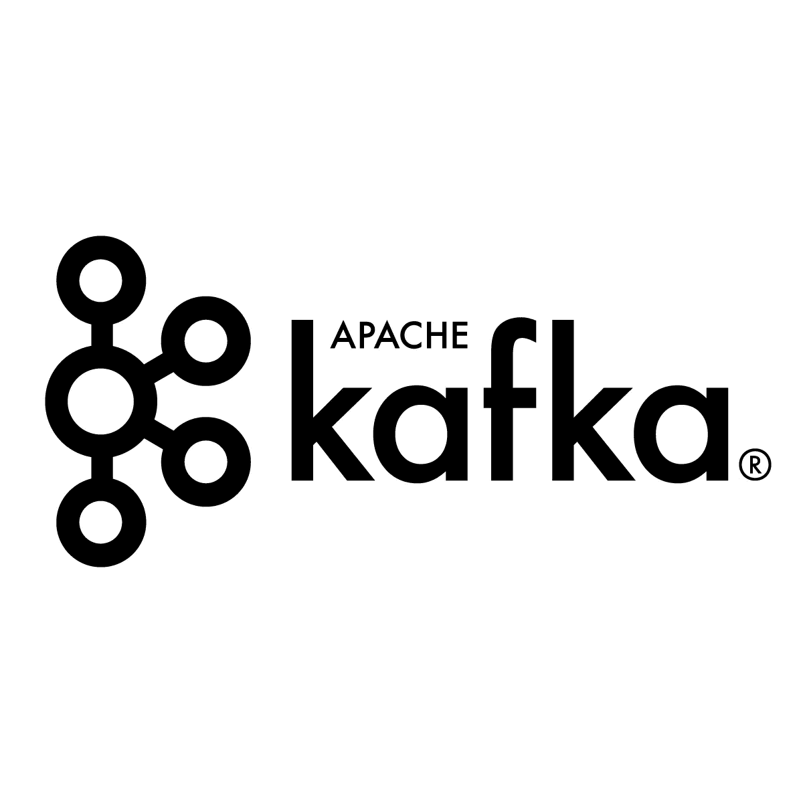
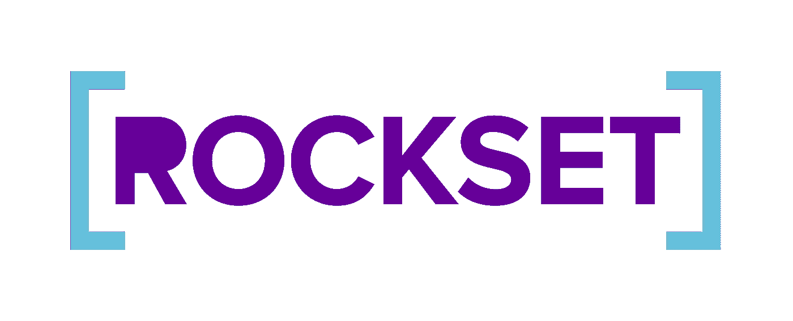
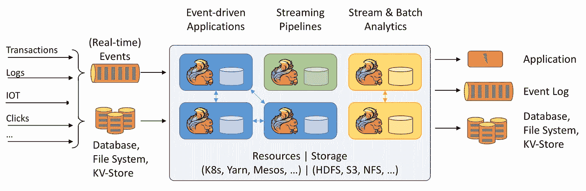

# 7 个实时数据流工具

> 原文：<https://betterprogramming.pub/7-real-time-data-streaming-tools-68907be5ac4b>

## 选择一个适合你的

丹尼斯·库默在 [Unsplash](https://unsplash.com/s/photos/data?utm_source=unsplash&utm_medium=referral&utm_content=creditCopyText) 上拍摄的照片。

在现代，每个人都希望自己的数据在第一时间更新(如果不是在数据出现之前神奇地更新的话)。

大公司和财富 500 强公司依靠这些数据来预测消费者的口味或估计市场的供求力量。实时数据是[现代数据战略](https://www.theseattledataguy.com/how-to-modernize-your-data-architecture-part-1-data-analytics-strategy-consulting/#page-content)的一部分。

反过来，许多公司正在努力将它们的批处理式数据管道改造成实时数据流。实时数据流为分析师、机器学习研究人员和数据科学家提供了开发指标和模型的能力，这些指标和模型在新数据创建后立即运行。

对于管理制造运营、电影流和检测系统日志中的问题的公司来说，这已经成为一个有用的解决方案。

随着云提供各种可以快速实施的工具，实时分析变得越来越受欢迎，对各种规模的公司来说也越来越可行。

我们稍后将讨论其中的一些公司，但让我们先从其中的两家经典公司开始。

# 经典数据流解决方案

## 1.AWS 室壁运动

[Kinesis](https://aws.amazon.com/kinesis/) 是 AWS 上的托管流媒体服务。与列表中的其他工具相比，AWS Kinesis 管理提供了几个优势。它允许您的团队花费更少的时间来管理基础设施组件和服务，而是将更多的精力放在开发上。Kinesis 允许您实时摄取视频、物联网遥测数据、应用程序日志和几乎任何其他数据格式的所有内容。这意味着，当数据流经您的系统时，您可以在数据上运行各种流程和机器学习模型，而不必先去传统的数据库。

AWS Kinesis 也得到了网飞等公司的明确支持。他们每天使用 Kinesis 处理数 TB 的日志数据。由于 Kinesis 是一项托管服务，这一点变得更加容易。

## 2.卡夫卡

图片来自[阿帕奇卡夫卡](https://kafka.apache.org/)。

Apache Kafka 框架是一个分布式发布-订阅消息传递系统，它从不同的源系统接收数据流。

这个软件是用 Java 和 Scala 编写的。它用于实时大数据流，可用于进行实时分析。该系统不仅可扩展、快速、耐用，而且具有容错能力。

由于其更高的可靠性和吞吐量，Kafka 被广泛用于跟踪服务呼叫和物联网传感器数据。

那么谁用卡夫卡呢？嗯，它起源于 LinkedIn，提供了一种在 Hadoop 系统中加载并行数据的机制。后来在 2011 年成为 Apache 旗下的开源项目。现在 LinkedIn 正在用它来跟踪运营指标和活动数据。Twitter 也使用它——与 Storm 配对——来建立一个流处理基础设施。

Kafka 是我们个人最喜欢的分布式数据流系统，因为它操作简单。此外，对于 Amazon 来说，Kafka 的托管服务版本使其更容易在 AWS 堆栈中实现。

较新版本的 Kafka 不仅提供了灾难恢复来改进客户端的应用程序处理，还减少了对 Java 进行数据流分析的依赖。总的来说，感觉这是最容易管理的服务。

# 实时创业公司

抛开更多经典的实时数据解决方案，我们想看看一些试图进入流媒体领域的新兴创业公司。特别是，这些实时流解决方案提供了使用 SQL 轻松与流中的数据进行交互的能力。

Kafka 和 Kinesis 还提供了使用 SQL 形式与它们的数据进行交互的方法。然而，下面的工具从一开始就被开发成 SQL 兼容的。

## 3.实现

来自[的照片物化](https://materialize.com/)。

[Materialize](https://materialize.com/) 是一个建立在开源及时数据流项目之上的 SQL 流数据库初创公司。

它允许用户询问实时流数据的问题，直接连接到现有的事件流基础设施(如 Kafka)和客户端应用程序。

工程师可以使用标准 PostgreSQL 接口与 Materialize 进行交互，实现现有工具的即插即用集成。

当 SQL 查询运行时，它们被重新转换为数据流。这可以让用户针对实时关系数据执行交互式数据探索和类似数据仓库的分析，而这通常是不可能的。

在幕后，Materialize 使用[及时数据流](https://github.com/TimelyDataflow/timely-dataflow) (TDF)作为流处理引擎。这允许 Materialize 利用分布式数据并行计算引擎。使用 TDF 的好处在于，它自 2014 年以来一直处于开源开发阶段，并在大型财富 1000 强公司的生产中经过了实战考验。

> “我们的目标是帮助任何企业理解流数据并构建智能应用程序，而无需使用或需要任何专业技能。从根本上说，这意味着您必须使用企业了解的技术和工具，即标准 SQL。”— [Arjun Narayan(通过 TechCrunch)，Materialize 的联合创始人兼首席执行官](https://techcrunch.com/2020/11/30/materialize-scores-40-million-investment-for-sql-streaming-database/)

Materialize 也刚刚获得了另一轮资金，所以他们可能很快就会有更大更好的东西。

## 4.岩石集

照片来自 [Rockset](https://rockset.com/) 。

> [“Rockset](https://rockset.com/)是一款实时分析解决方案，支持对大规模半结构化数据进行低延迟搜索、聚合和连接，没有运营负担。”— [Rockset 的文档](https://docs.rockset.com/what-is-rockset/)

那些花哨的流行词是什么意思？

与列表中的其他一些实时数据库不同，Rockset 是一个数据库和一种 SQL 引擎的组合，允许您实时查询多个数据源。例如，您可以将 Rockset 置于 DynamoDB、Kafka stream 和 MongoDB 数据库之上，并在所有这些数据库之间进行查询/连接。

实时的。

根据 [Rockset 的文档](https://docs.rockset.com/what-is-rockset/)，它“自动索引你的数据——结构化、半结构化、地理和时间序列数据——用于实时搜索和大规模分析。”

此外，Rockset 为运行查询提供了一个很棒的 UI，以及其他几个更适合开发人员的特性。

与 Materialize 一样，Rockset 也获得了新一轮资金，目前正在大举招聘。这些都是进步的好迹象。

## 5.矢量化

来自[的照片矢量化](https://vectorized.io/)。

[矢量化](https://vectorized.io/)仍然是流媒体工具中较新的一方，因为它刚刚在 2021 年 1 月获得了 1550 万美元的资金。

这家初创公司进入拥挤的数据管理市场的是一个名为 Redpanda 的开源流处理平台。它旨在为行业标准的 Apache Kafka 引擎提供一种替代方案。

如果你想得到更深入的解释，你可以听听矢量化的创始人亚历山大·加莱戈在[数据工程播客](https://www.dataengineeringpodcast.com/vectorized-red-panda-streaming-data-episode-152/)中的讨论。

在这个播客中，他讨论了 Redpanda 是如何被设计成卡夫卡的替代者的。他还分享了他们发现的一些创新领域，这些领域有助于在现有 Kafka 界面的限制下培养下一波流媒体应用程序。

如果您想了解这项技术背后的驱动因素，这是一次很好的聆听。

# 一些开源选项

在选择正确的实时解决方案时，有很多选择。这里还有一些你的团队可能会感兴趣的。下面的工具需要更多的技术知识。

## 6.阿帕奇风暴

图片来自[阿帕奇风暴](https://storm.apache.org/)。

[Storm](https://storm.apache.org/) 是一个流行的分布式实时计算系统，它使用简单的处理模型来处理大数据，以实现强大的抽象。这个框架——由 Twitter 开发的开源项目——被[吹捧为实时 Hadoop](https://stackoverflow.com/questions/11250028/apache-storm-compared-to-hadoop) 。

它可以用于处理新数据或更新数据库。Storm 的分发功能等待调用消息。在接收时，它们在查询中被计算以构造结果。

这款软件由 Nathan Marz 于 2011 年开发，旨在利用更高的吞吐量，同时在几秒钟内处理多个节点。

Storm 软件在微批处理上的延迟只有几毫秒，这使它成为一个可靠的数据处理器。可靠性是帮助 Storm 作为实时计算数据处理系统脱颖而出的一个因素。

阿帕奇风暴是基于‘故障快，自动重启’的现象。这使它能够在某个节点出现故障的情况下重新启动流程，而不会中断整个操作。这种方法使它具有容错能力。

Storm 的标准配置使其非常适合生产。这种技术是用户友好的和健壮的，这使得它在中小型企业和大型组织中很受欢迎。

## 7.弗林克

图片来自[阿帕奇 Flink](https://flink.apache.org/) 。

[Apache Flink](https://flink.apache.org/) 是另一个流行的开源分布式数据流引擎，它对有界和无界数据流执行有状态计算。这个框架是用 Scala 和 Java 编写的，非常适合复杂的数据流计算。

通过连续流处理，Flink 以键控或非键控窗口的形式处理数据。

该系统易于安装，只需在[命令行界面](https://ci.apache.org/projects/flink/flink-docs-stable/ops/cli.html)上发出一条命令即可开始工作。

Flink 在机器学习和数据分析领域最受欢迎，它与 Gelly 一起创建数据流编程模型。Flink 支持时间戳，这使得回滚或重放作业非常方便。

它使用保存点来帮助系统操作，以确保在节点崩溃时跨故障提供正确的结果。这个框架既处理实时数据，也处理流数据，因此它是记录和数据批处理的理想选择。

Flink 也被认为是`MapReduce`的一个很好的替代品，因为它被设计成可以在任何规模上运行状态流。这个框架独立于 Hadoop，但它可以与 Hadoop 集成，以存储、写入或处理数据。

# 你应该选择哪种实时分析工具？

这是困难的部分:你应该选择哪种实时分析工具？在不了解团队需求和目标的情况下，很难给出一个具体的答案。

但我会提供一些观点。

如果您是一家小公司，那么如果这些工具中的一个因为任何原因消失了，您可能没有时间或金钱来迁移您的解决方案。也就是说，如果你选择一家初创公司，你可能会面临其中一个解决方案消失的风险，然后不得不迁移到另一个工具。

这可能会非常昂贵。

因此，如果你决定选择一家初创公司，我会努力在你的初始利率上获得一笔不错的交易——直到有足够的资金或另一家公司收购它们。

大公司可以更容易地利用这些初创公司，因为如果初创公司消失了，他们可以让一些工程师迅速解决问题。

在一天结束的时候，我确信一些创业公司会成功。但是你要确保你准备好了以防他们消失。

# 流媒体值得吗？

根据使用情况，流数据工具可以提供很多好处。它们可以帮助提供管理和处理实时数据的能力。

这可以导致更好的通知和决策。

此外，流式传输和分析数据的能力可以让机器学习模型提供更好的输出。

尽管与[日常批处理作业/ETL](https://seattledataguy.substack.com/p/what-are-etls-and-why-we-use-them)相比，这些系统通常更难实现，但在许多情况下，投资回报是值得的。

我们希望这有助于你为不同的流媒体工具做好准备。

祝你发展顺利。