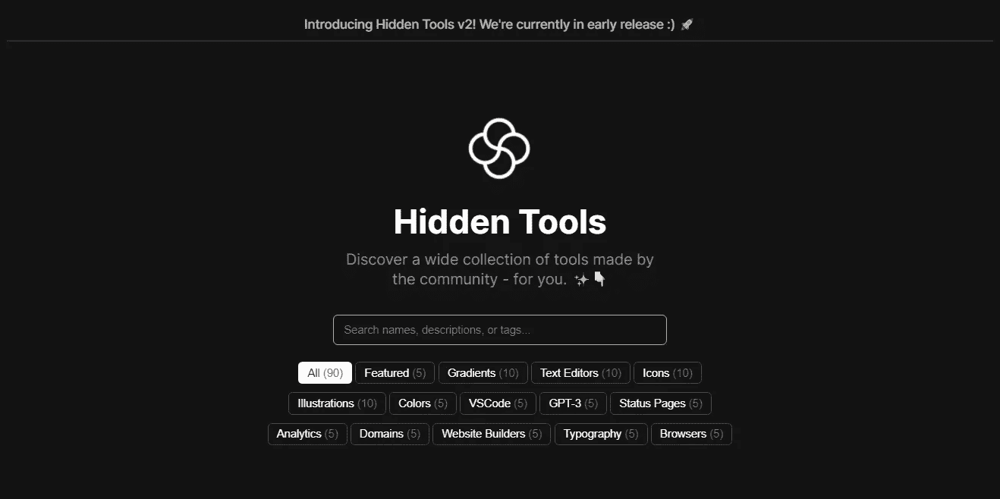
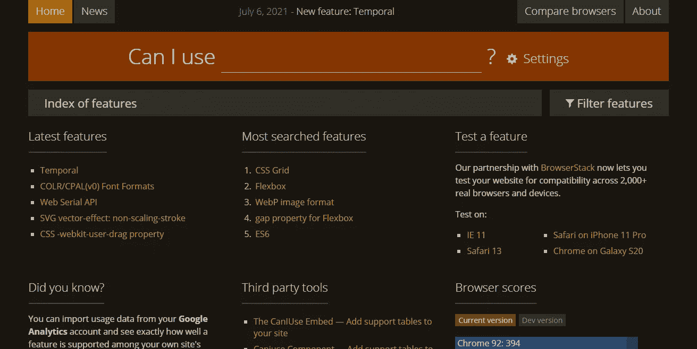
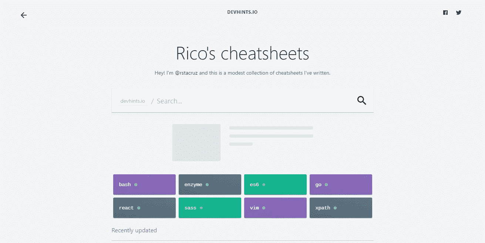
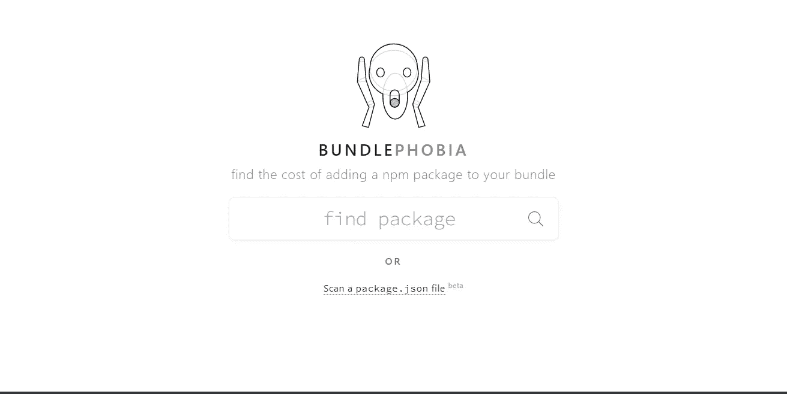
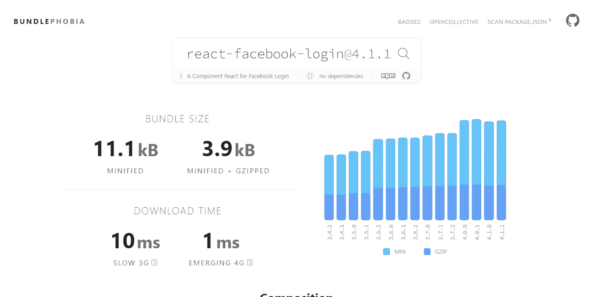

# 4 个可靠的网站为您节省数小时的开发时间

> 原文：<https://betterprogramming.pub/7-reliable-websites-to-save-you-hours-of-development-time-db861b8f62fb>

## 愿原力与你同在

由[维里·伊万诺娃](https://unsplash.com/@veri_ivanova?utm_source=medium&utm_medium=referral)在 [Unsplash](https://unsplash.com?utm_source=medium&utm_medium=referral) 拍摄的照片

开发很好玩！但是创建项目呢？

不管你现在在做什么项目，我希望它进展顺利。但是最初，它是如何开始的？

创建项目需要很多时间。尽管有许多可重复使用的模板来启动类似的项目，但创建新项目时会非常耗时。

不只是你，连我都讨厌在创建项目时浪费时间。所以，这里有一些对我有帮助的网站，可能会帮你节省一些额外的开发时间。

# 隐藏工具

[作者](https://umayir10.medium.com/)截图

[Hidden Tools](http://hiddentools.dev) 是一个单页网站，由他们的社区贡献的有价值的工具组成。无论您的项目是什么，您几乎可以在这里找到任何您需要的工具，来帮助提高效率和速度。

这个网站并不局限于开发工具的列表，还包括对生产力和写作有帮助的工具。

我遇到的一个很棒的工具是`[ray.so](https://ray.so)`隐藏工具中的特色工具。它允许美化代码片段添加到您的故事中。你也应该去看看！

# 我能用吗

[作者](https://umayir10.medium.com/)截图

[我能用吗](https://caniuse.com)是一个功能齐全的网站。我主要用它来查找哪些功能兼容哪些浏览器。

作为一个开发者，这个网站带来了大量的开发成果。

作为开发人员，我们构建了许多跨平台的 web 应用程序。然而，在开发过程中，我们意识到某些浏览器不支持某些功能。这是我在 IE 和 Safari 上注意到的大部分情况。所以这个网站告诉我们哪些是支持的，哪些是不支持的。

例如，让我们在搜索框中输入内容，看看会得到什么。

[作者](https://umayir10.medium.com)截图

这个帮助我在创建网站和网络应用程序时节省了很多时间。通过这种方式，我可以找到其他选择，或者为即将到来的事情做好准备。

# 开发提示

[作者截图](https://umayir10.medium.com/)

[Dev Hints](https://devhints.io) 是一个汇集了 [Rico](https://ricostacruz.com) 的小抄的网站。您可以在几秒钟内找到任何概念、功能或代码的任何文档。

假设你想快速查阅 MySQL 的备忘单，只需输入 MySQL 并点击第一个选项。它会将所有相关文档压缩到一个易于阅读的备忘单中，这样您就可以选择自己的逻辑开始工作。如果你是初级开发人员，这可能是你遇到的最有资源的网站。

# 捆绑恐惧症

[作者](https://umayir10.medium.com/)截图

[捆绑恐惧症](https://bundlephobia.com)是一个精确描述你需要的 npm 包大小的网站。

想知道为什么 node_modules 文件夹在？gitignore，从不推送到资源库。是啊！这是因为 npm 包占用了大量空间。

下面的例子是搜索 react-facebook-login:

[作者](https://umayir10.medium.com/)截图

使用更大的 npm 包会显著增加项目的权重，并且可能需要更长的编译时间。尤其是在服务器上部署时，对于较大的包，冷启动时间可能会更长。

因此，这个网站将帮助您选择一个更轻，性能更好的包。

# 结论

任何项目的初始阶段都会严重拖延时间。然而，有了这些随时可用的在线工具，我们可以打开通往创造力和更有活力的解决方案的大门。

分享知识是获得知识的唯一途径。对于那些可能从这个故事中受益的人，请随意添加并通过评论做出贡献。

玩得开心！享受编码！