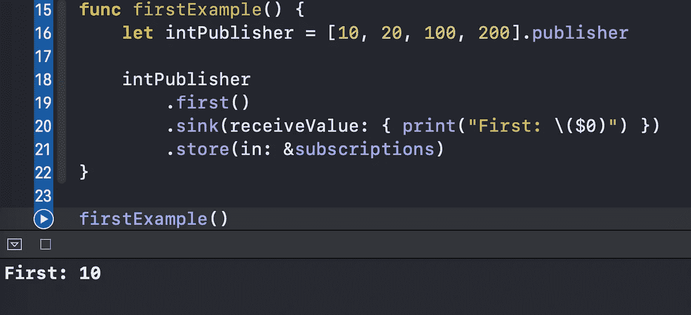
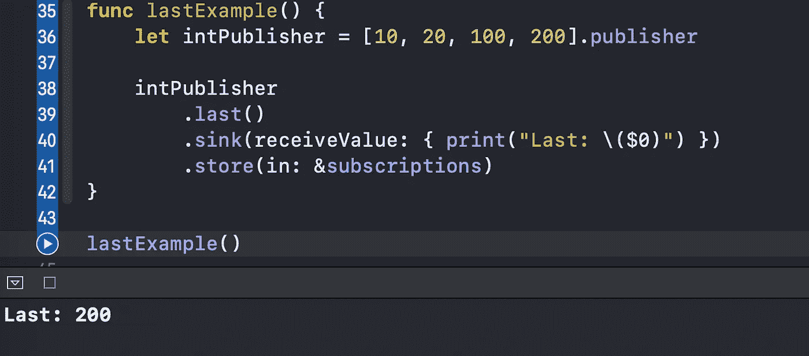
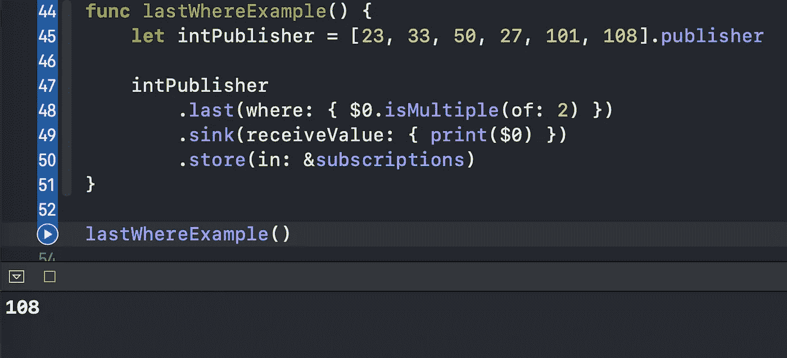
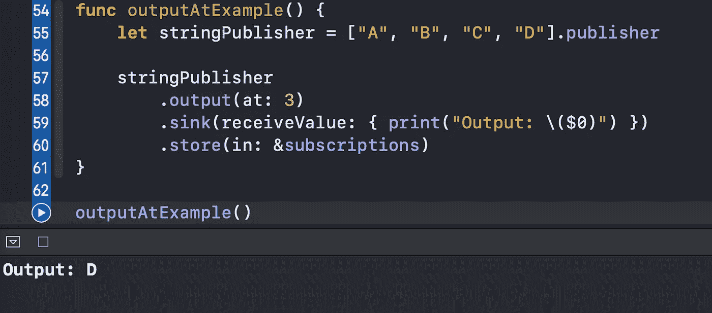
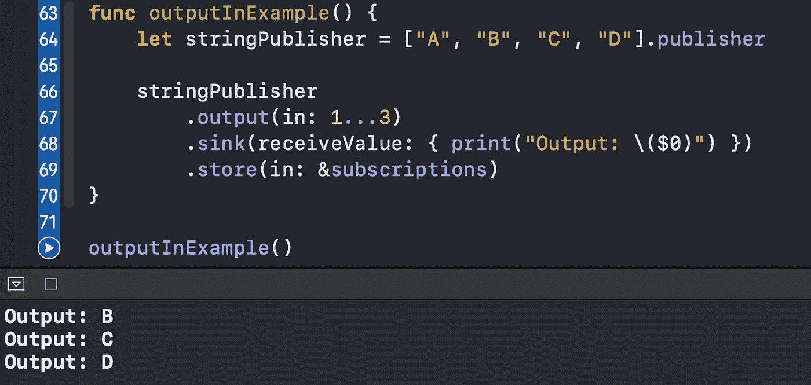
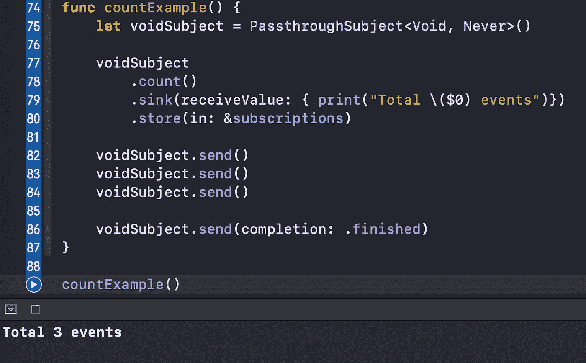
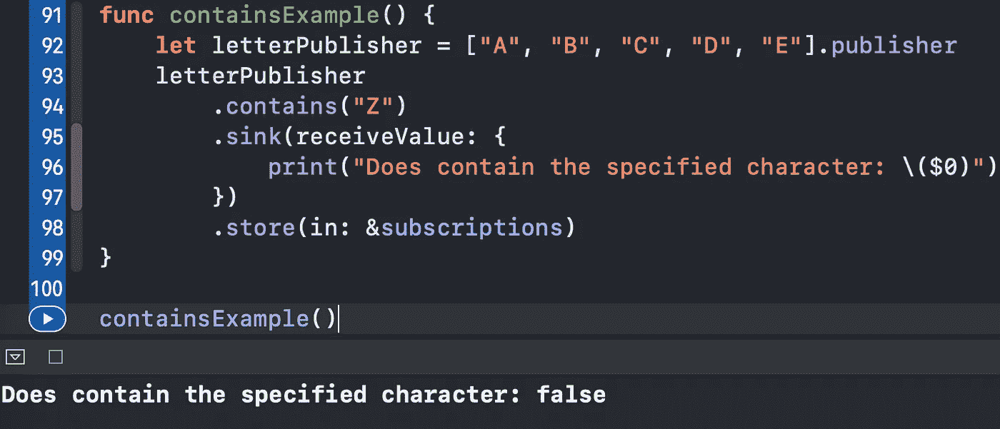
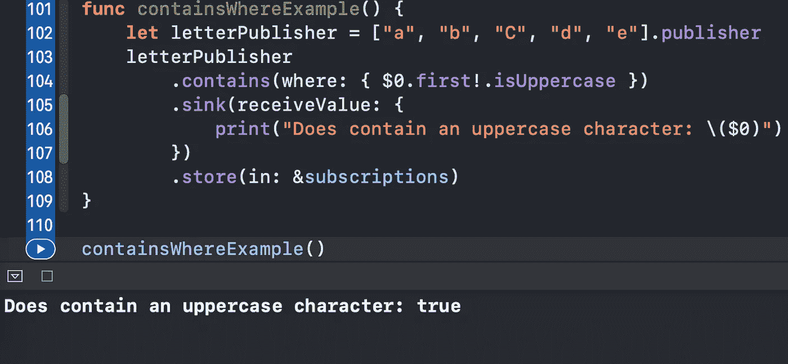
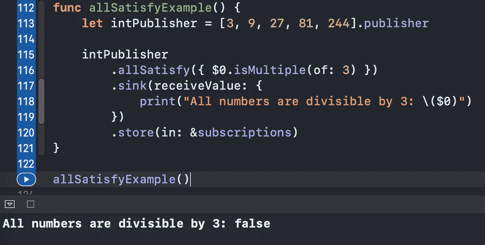
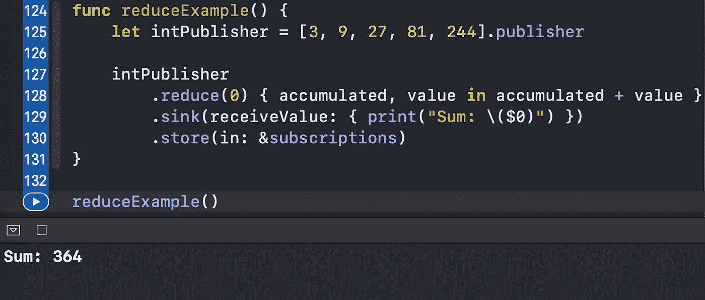

# Swift Combine 中您应该知道的 7 个顺序运算符

> 原文：<https://betterprogramming.pub/7-sequential-operators-you-should-know-from-swift-combine-1775ce3c47c8>

## 第一个、最后一个、计数、包含、全部满足、减少等等

Daniele Levis Pelusi 在 [Unsplash](https://unsplash.com?utm_source=medium&utm_medium=referral) 上的照片。

在本文中，我们将掌握七个有用的序列合并操作符。我们将使用 Xcode Playground 来快速试验一些例子。

所有示例的源代码都可以在文章的底部找到。

# 我们开始吧

这些是我们将要探讨的运算符:

*   `.first`和`.first(where:)`
*   `.last`和`.last(where:)`
*   `.output(at:)`和`.output(in:)`
*   `.count`
*   `.contains`和`.contains(where:)`
*   `.allSatisfy`
*   `.reduce`

事不宜迟，让我们开始与他们合作。

# 1.第一

顾名思义，`.first`操作符组允许我们获得序列的第一个元素:

结果是`10`打印出来的:

我们还可以使用操作符的`.first(where)`版本指定一个谓词:

正如您可能已经猜到的，我们在控制台中打印了`50`:

# 2.最后的

就像我们获得了一个序列的第一个元素一样，我们也可以获得最后一个元素:

同样，我们可以提供一个条件:

我们看到`108`被打印出来，因为它是满足谓词的最后一个元素:

# 3.输出

该操作符的`.output(at:)`版本在指定的索引处获取某个元素:

指数是`3`。因此，`“D”`被打印出来:

我们还可以使用`.output(in:)`版本获得属于指定范围的所有元素:

# 4.数数

就像它的 Swift 标准库对应物一样，`.count`操作符返回一个序列的已发布值的数量:

正如我们所看到的，我们发送了三个`Void`事件，所以我们打印了`Total 3 events`:

# 5.包含

`.contains`操作符返回`true`或`false`，这取决于是否在序列中找到了特定的元素:

在这里，我们搜索一个`“Z”`。由于没有找到，我们收到`false`:

我们还可以使用`.contains(where:)`协变提供一个谓词:

`letterPublisher`有一个大写的`“C”`字符，所以`true`被打印出来:

# 6.全部满足

与前面的`.contains`操作符类似，这个操作符返回一个`Bool`值。然而，只有当每个元素都满足所提供的条件时，它才返回`true`:

在这种情况下，除了一个元素之外，所有元素都满足条件。因此，我们获得一个`false`值:

# 7.减少

最后一个操作符`.reduce`提供了一个强大的机制来累加序列的元素，并在完成后返回一个最终值:

这里，我们计算所有元素的总和。当我们接收更多的元素时,`accumulated`属性会增加。结果是`364`，所有提供的整数之和:

我们甚至可以将`.reduce`语句缩短如下:

这产生了相同的结果。

# 资源

源代码可在 [a gist](https://gist.github.com/zafarivaev/1eef54f15e62c25c87ed84fdca497e1b) 中找到。

# 包扎

对不同类型的联合运算符感兴趣？欢迎访问我的其他相关文章:

 [## 5 你应该知道的变换组合运算符

### 用清晰的例子

medium.com](https://medium.com/better-programming/5-transforming-combine-operators-you-should-know-4603fe112d74)  [## 你应该知道的 9 个过滤组合运算符

### 用清晰的例子

levelup.gitconnected.com](https://levelup.gitconnected.com/9-filtering-combine-operators-you-should-know-9c1ef2911352) 

感谢阅读！