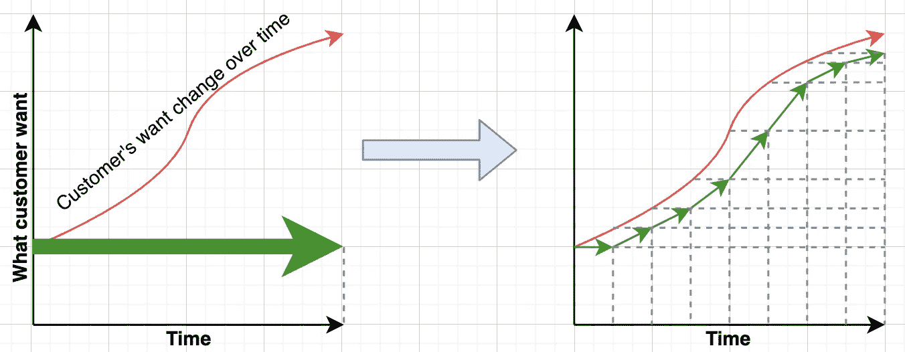
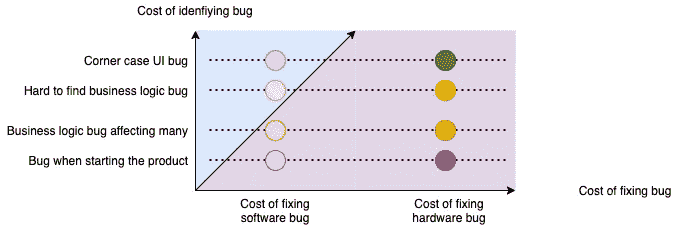
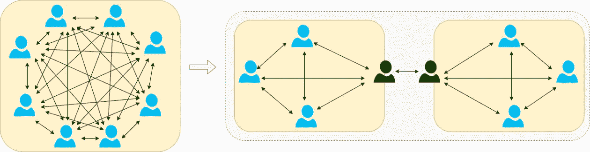

# 7 种可能不实用的软件开发实践

> 原文：<https://betterprogramming.pub/7-software-development-practices-that-might-not-be-practical-12eb2e0e5e12>

## 人们曾经认为开发软件只有几种方法

查尔斯·德鲁维奥在 [Unsplash](https://unsplash.com?utm_source=medium&utm_medium=referral) 上拍摄的照片

软件被归类为“工程”领域。我们曾经试图把我们在工程中学到的东西应用到软件中。虽然它能工作，但它没有意识到软件能提供什么的本质。

下面是我们在软件开发中可以放弃的 7 个实践。

# 1.记录一切

当我刚开始做软件工程师时，我们有一些文档流程要遵循。在开始编码之前，有 4 个文档需要按照顺序编写。需求计划、功能描述、详细描述和测试计划。这些文档中的每一个都至少有 7-8 页长。我们正在遵循一个与硬件产品相似的流程。

至于写代码。我喜欢评论，并依赖它们来提供背景。作为一个天真的工程师，我曾经认为没有注释的代码是未完成的代码。我甚至与一位来访的高级软件主管分享了我的观点，在那里我有幸进行了一对一的交流。

令我惊讶的是，他礼貌地对我说，“也许，最好的注释是代码本身。”

在软件开发中，虽然我们仍然需要某种程度的文档，但它更多的是一种初始交流的方式。我们并不总是需要所有的文档，只要我们有方法在团队中调整期望和想法。真相的最后一个来源将是代码本身。

即使是代码注释也应该尽量少用，因为代码本身应该尽可能自给自足。

> 对代码进行注释就像一个重复的代码，总是需要手动维护两者之间的一致性。改变其中一个而不改变另一个可能会引起混乱。三思而后行。
> ——[推特](https://twitter.com/elye_project/status/1466242656422400002)

当我们尽可能简化需要文档的过程时，我们加快了开发周期。这使得软件变更的迭代更快，并更快地交付给市场。

# 2.一切完成前不得放行

瀑布模型是软件工程的方式。我们从适当的计划、实现、测试和发布开始。这是我们生产任何硬件产品的复制模型。整个周期有时可能是 6 个月到一年。在这个初始周期完成之前，不应开始任何新的开发。

在实施周期结束时，我们将根据初始规划要求进行验证。如果他们不符合要求，我们不会释放他们。如果我们发现任何错误或问题，我们不会发布它们。即使还有 5%的项目没有完成，软件的发布也会被推迟。否则，我们将冒延迟 5%撤销功能 6 个月的风险。

与实体产品不同，软件的每个版本都只是现有软件的升级。这并不是一个全新的产品，相反，它是同一个实体，但增加了更多的增强功能。随着时间的推移，可以对产品进行增量更改。

因此，只要我们完成了一组最小的需求，我们就可以开始发布它了。对于未完成的特性，我们可以使用切换来临时关闭它们，并在发布后继续开发。

事实上，尽早定期发布是首选。也许每周一次。在软件中这样做有很多好处。

 [## 软件越早发布越好

### 频繁发布软件如何让每个人受益

better 编程. pub](/software-release-early-release-often-is-really-good-b4acb017e79) 

其中之一是能够获得用户更频繁的反馈，随着市场的不断发展，我们可以更快地改变。

如果一个人使用瀑布模型，到发布的时候，我们可能已经与客户想要的有所不同，这已经随着时间而改变了。但是随着频繁的发布和反馈，我们将密切关注客户变更的需求，如下所示

图片来自[敏捷软件开发的另一个视角](https://levelup.gitconnected.com/another-view-of-agile-software-development-263590cd16b8)

# 3.测试直到完美

我曾经被要求负责部门软件产品的质量。我管理的团队被称为“看门人”，以确保没有软件漏洞漏网。软件发布后，如果用户在外部发现任何 bug，我就要做好解释的准备。

因此，我试图给所有的开发团队制定严格的规则。例如 100%的测试覆盖率、性能测试标准、UI 友好性、内存效率、完美的代码林挺，我能想到的任何东西。

然而，问题是，我没有办法自动化所有这些。使用清晰的测量标准手动执行这些操作会导致含糊不清且不一致的结果。花费的时间并不等于我们得到的收获。开发团队反抗了。

软件产品与硬件产品非常不同。虽然质量很重要，但它是有代价的。

由于在软件中引入变化要容易得多，所以软件中特性的变化通常比硬件多得多。在某些情况下，如果我们对所有可能的变化都使用蛮力测试，这可能会导致测试的无限变化。并且在软件中引入变化的速度要快得多。因此，对所有版本的软件进行完美的测试，即使不是不可行，也是不切实际的。

此外，软件中大多数错误的风险明显低于硬件中的风险。修复它的成本也显著降低，尤其是在远程更新的帮助下。当修复一个 bug 的成本低于发现它的成本时，我们必须权衡什么是最优的。

图片来源于 [7 条非常规编码建议](/7-unconventional-pieces-of-coding-advice-17f0cfc0220f)

质量不仅仅是测试。实现质量的手段有很多。所有这些实践应该放在一起，这将减少在保证质量中只有测试的负担。

 [## 除测试之外的 14 种提高软件质量的方法

towardsdatascience.com](https://towardsdatascience.com/14-ways-to-improve-software-quality-other-than-testing-a62d14936575) 

# 4.修复所有发现的错误

对于任何硬件产品，在开发过程中发现的与产品需求的偏差应该立即解决。因为当产品发货后，就再也没有办法整改了。

当软件开始发挥作用时，我们遵循同样的做法，但只是有一个不同的名称，即错误。

我们虫子可以被发现有很多阶段

*   在开发过程中，如果发现了 bug，就需要修复它。
*   在最后的测试阶段，如果发现了一个 bug，就需要修复它。
*   软件发布后，如果发现 bug，需要打补丁。

除非我们意识到软件开发的规模随着快速变化的发生而显著增长，否则修复所有发现的 bug 是不切实际的。

事实上，并不是所有的软件缺陷都是障碍。当然，有一些会导致生产延迟——这些应该得到解决。但是在更大的范围内，还有其他一些无关紧要的小问题。

因此，我们需要权衡修复 bug 的成本与开发能给用户带来更多价值的新功能的成本。这就是 bug 分类和优先级排序发挥作用的地方。对于优先级较低的错误，当我们有时间时，只有我们会去处理它们。有些甚至可能没有修复，因为它们可能会被以后的新特性和新代码所取代。他们不应该阻止重要的下一个迭代特性。

# 5.严格遵循流程

工业化的成功在一定程度上归功于标准流程的建立，所有工人都毫无疑问地严格遵守这些流程，以确保每件产品都是完全相同的，并且是以高效率完成的。

很明显，拥有一个合适的过程对任何产品开发都有很多好处，因此我们也应该有软件开发的过程。

例如，没有代码可以被合并，除非我们有两个审查者。在总监批准之前，任何软件补丁都不能发布。

有一天，发现了一个严重的错误，我们设法修复并修补了它。但是导演在世界的另一边，在不同的时区。这是他的午夜。

在发布补丁之前，我打电话给主管请求批准。他对我说，“非常时期需要非常措施”。

软件开发不是生产线。编写的每个代码不应该与其他代码完全相同，否则我们应该共享代码。因此，不可能一个开发者做的和另一个完全一样。

即使在开发过程中，由于软件变化的速度，我们也应该始终质疑现有的过程，理解背后的意图，而不是盲目地跟随它们。它们可能已经过时，不再相关。

过程只有在带来价值时才是好的。有时流程会阻碍创新和创造力。因此，并不是软件中的一切都应该由过程控制。在某些领域，让开发人员自由决定一些做的方式，将会产生一些令人惊讶的更好的结果。

# 6.爱上“一致性是关键”

为了确保事情的可重复性、可伸缩性和可维护性，我们应该尽可能地保持一致性。举个例子，

*   如果一个组织正在使用某种编程语言，那么所有的软件开发都应该使用这种语言。我们可以为每个人开一个学习班。
*   如果我们使用一种架构方法进行开发，所有的团队都应该采用这种架构，这样我们就可以很容易地从一个团队过渡到另一个团队
*   如果我们在工作过程中使用某个工具，我们希望所有团队都使用这个工具，因为除了每个人都可以熟悉这个工具之外，我们还可以节省成本。

虽然一致性带来了很多好处，但代价是组织无法有效地探索新技术的变体或引入的学习和敏捷。与较小的组织相比，这通常是大组织的劣势。他们被视为大象，移动非常缓慢。

还是那句话，软件不是生产线。一致性确实有很多好处，但是随着软件发展的速度，我们应该权衡一致性的成本和灵活性的好处

与硬件不同，软件开发更灵活，适应性更强。我们需要的不是一致性，而是一致的自主性。

我们不应该让每个人都以同样的方式做事，而是应该将团队划分开来，每个团队都有一定程度的自主权来决定什么是最好的，同时在更高的层面上保持一致。

图片来自[为什么雇佣更多的开发人员会阻碍生产力](/why-hiring-more-developers-can-impede-team-productivity-831362ba243)

换句话说，我们应该[更喜欢互操作性而不是一致性](/why-i-prefer-imperfect-software-development-practices-b13cfdcf85bf)。这允许产品/代码/组织的不同部分在独立工作的同时，仍然保持良好的一致性和相互依赖性。

即使在软件设计领域，也有许多模式应用这种独立依赖的方法，使软件更具适应性。

 [## 改进任何软件设计解决方案的 ID 原则

### 导致其他伟大软件设计思想的单一原则

better 编程. pub](/the-id-principle-for-improving-any-software-design-solution-b375db8cc823) 

# 7.寻找最佳解决方案

运输产品的成本很高。为了确保投资回报是值得的，它需要以最佳状态运输。不仅它不应该有任何缺陷，而且我们还需要确信，无论运送的是什么，都应该最好地满足用户的需求。

任何实验都应该提前进行，直到我们有高度的信心它会是一个成功的产品。否则，我们应该继续研究，努力找到最佳解决方案。

这也是应用于软件的心态。我们应该使用的最佳算法是什么？什么样的用户界面最能满足用户的需求？我们试图找到最有效的架构，这是坚实的，以便在未来我们只需要最小的变化来发展。

不久之后，我们意识到，无论我们把软件做得多么坚固，我们都无法预测未来。仍然需要变革。

 [## 为什么坚实的原则不是软件设计的坚实的解决方案

### 应用坚实的原则是一个目标，而不是命运

towardsdatascience.com](https://towardsdatascience.com/why-solid-principles-are-not-a-solid-solution-for-software-design-fa71b6017ed6) 

与硬件相比，运送软件的成本可以忽略不计。复制或替换产品只是一个复制过程，除了复制时间和磁盘空间之外，成本几乎为零。

软件的伟大不在于它的解决方案，而在于它的灵活性。虽然获得最佳解决方案是理想的，但这并不总是可能的，因为只有在产品经过市场测试后，人们才能知道最佳解决方案。

因此，在软件领域，由于它的灵活性，我们可以快速地发布最小的产品，并获得一些市场响应。从那里

1.  我们可以据此学习和调整。市场反应比任何实验都要准确。我们可以执行 A/B 测试，以获得市场决策，从而找到更好的解决方案。
2.  这也将为我们争取时间来改进我们正在进行的工作。如果我们增量地发布改进，这也将从用户那里获得更多的牵引力，期待更新的改进到来。

上市时间比在第一个版本中获得最佳解决方案更重要。软件敏捷性允许一个人快速交付和增量改进。

# 硬件是为了留下来；软件是用来改变的

软件被发明的原因，是因为它使我们的产品变得更加可行。以前的工程实践都是为了限制变化。

因此，如果我们在软件中盲目地采用这些工程实践，可能会阻碍软件开发，使我们无法获得软件所能提供的全部好处。几十年来，许多人都经历了惨痛的教训。我很高兴我们已经学习和进步。可能会有更多的发现，但我们肯定是在正确的方向上。