# 7 个软件开发原则可以归结为迷因

> 原文：<https://betterprogramming.pub/7-software-development-principles-boiled-down-to-memes-768589c71a81>

## “吻”，“干”，“YAGNI”，还有更多有趣的解释

由 [kazuend](https://unsplash.com/@kazuend?utm_source=medium&utm_medium=referral) 在 [Unsplash](https://unsplash.com?utm_source=medium&utm_medium=referral) 拍摄的照片

不久前，我写了一篇文章，讲述了坚持应用一些软件原则会让任何人成为更好的工程师。今天我重写了我的文章，但试图通过迷因展示编程的好处。正如亨利克·易卜生曾经说过:“一幅画胜过千言万语。”

# 1.你不会需要它的——YAGNI

不要因为你认为以后可能会有用而让代码挂起。

信用:[匿名](https://memegenerator.net/instance/74880464/sam-elliot-big-lebowski-really-interesting-feature-yagni)

信用:[匿名](https://memegenerator.net/instance/74644829/matrix-neo-deflects-bullets-when-someone-adds-to-the-packagejson-yagni)

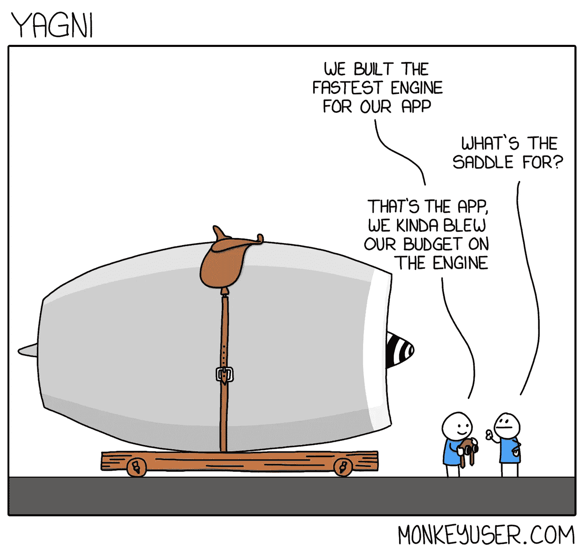

信用:[monkeyuser.com](https://www.monkeyuser.com/2019/yagni/)

# 2.不要重复你自己——干

不要因为你认为以后可能会有用而让代码挂起。

拥有重复的代码是一种浪费。你必须在两个地方保持相同的逻辑，在两个地方做测试，当一个地方改变时，你必须记得改变另一个地方。

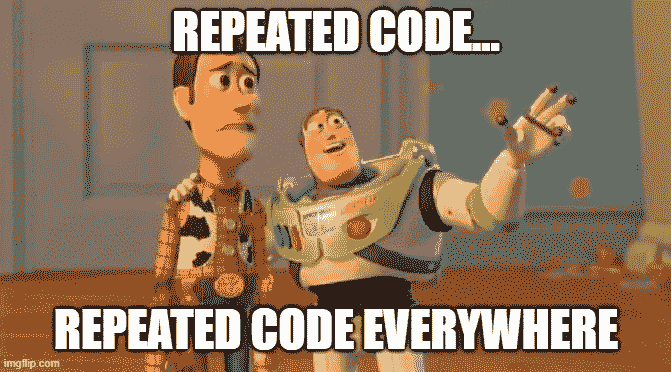

信用:[匿名](https://memegenerator.net/instance/81706803/x-x-everywhere-duplicate-code-duplicate-code-everywhere)

信用:[匿名](https://makeameme.org/meme/as-i-said-rpw3ws)

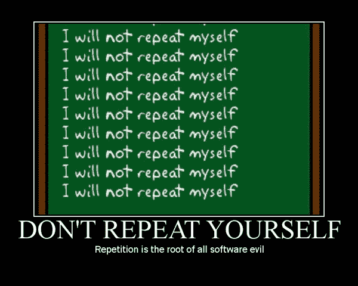

信用:[泰勒·克拉克](https://www.pinterest.com/pin/229472543488333834/)

# 3.简单点，笨蛋——接吻

有时候最聪明的解决方案也是最简单的。构建简单高效的代码是美好的。

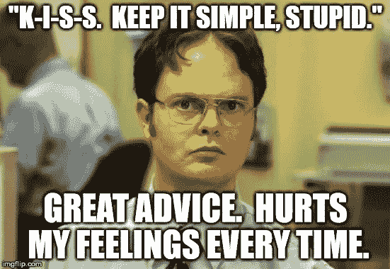

信用: [DanielLopez1](https://imgflip.com/user/DanielLopez1)

信用:[匿名](https://memegenerator.net/instance/52963170/confused-jackie-chan-wft-keep-it-simple-stupid)

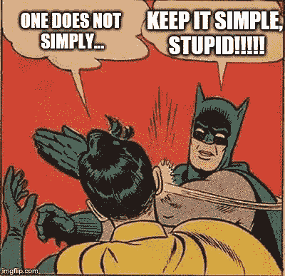

亨利·克林基

# 4.预先的大设计

在进入实现部分之前，请确保一切都经过深思熟虑。通过制定一个具体的计划，你可以避免可能不得不从零开始。

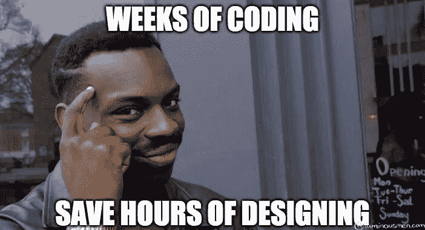

信用:[luminousmen.com](https://luminousmen.com/post/what-are-the-best-engineering-principles)

信用:【everydayunittesting.com 

信用:[匿名](https://miro.medium.com/max/500/1*bTI1rr7d_UfWyTzDB3wOTg.jpeg)

# 5.固体

这是最著名的软件原理。Solid 是以下单词的首字母缩写:

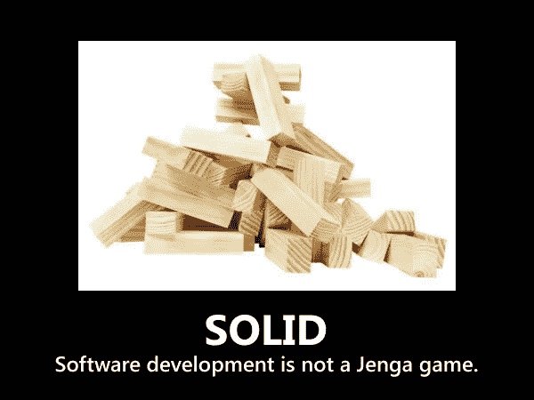

鸣谢:*马克·尼霍夫，推特*

# s)单一责任原则

每个对象、类和方法都需要有一个单一的职责。如果你的对象/类/方法做得太多，你最终会得到众所周知的意大利面条代码。

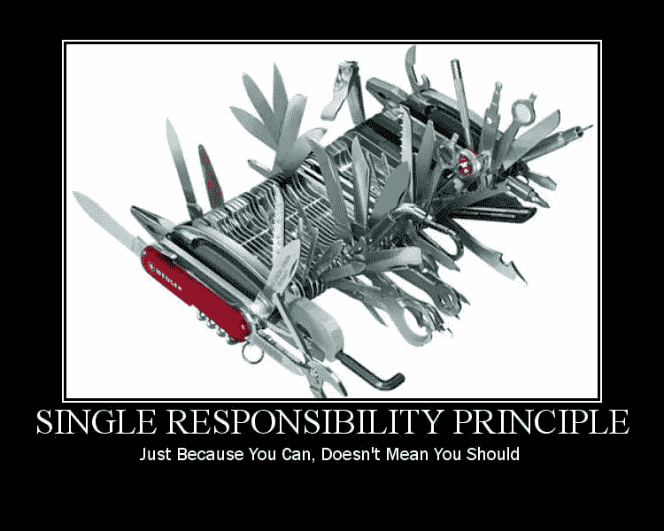

信用*:吴镇男贝利，CC-SA 3.0*

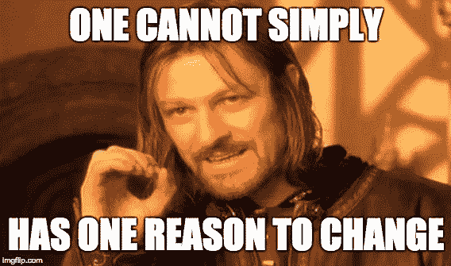

信用:[匿名](https://miro.medium.com/max/568/1*Pu_GVWxhVhxqm1qzHglskA.jpeg)

# o)开闭原则

软件实体应该对扩展开放，但对修改关闭。我的意思是，我们不应该仅仅通过添加更多我们需要的功能来覆盖方法/类。

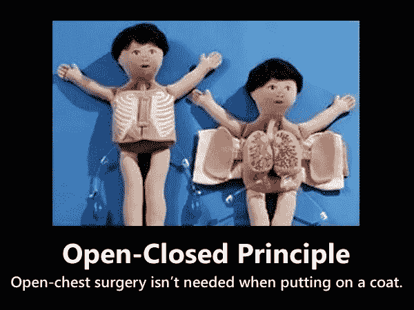

鸣谢:开发者 Kafas，Twitter

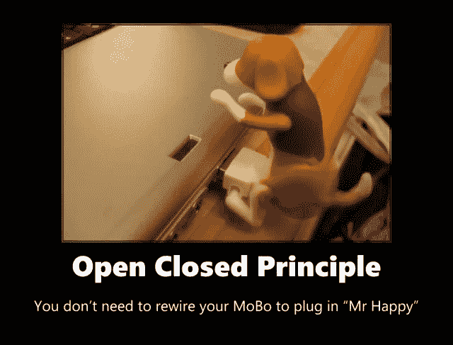

信用:[abhishekshukla.com](https://www.abhishekshukla.com/net-2/solid-design-principles-open-closed-principle-ocp/)

# l)利斯科夫替代原理

这个原则说，超类的对象必须可以被它们的子类的对象替换，并且应用程序应该仍然像预期的那样工作。

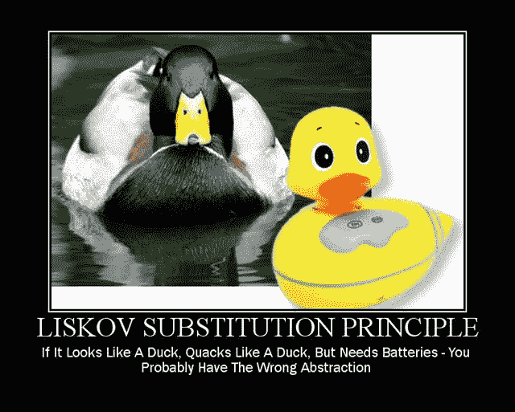

致谢:[安东尼奥·莱瓦](https://devexperto.com/principio-de-sustitucion-de-liskov/principio-sustitucion-liskov-meme/)

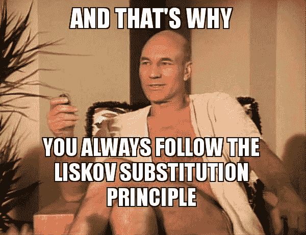

信用:[匿名](https://makeameme.org/meme/and-thats-why-5bfa7d)

# I)界面分离原则

软件应该被分割成多个独立的部分。应尽可能减少副作用，以确保独立性

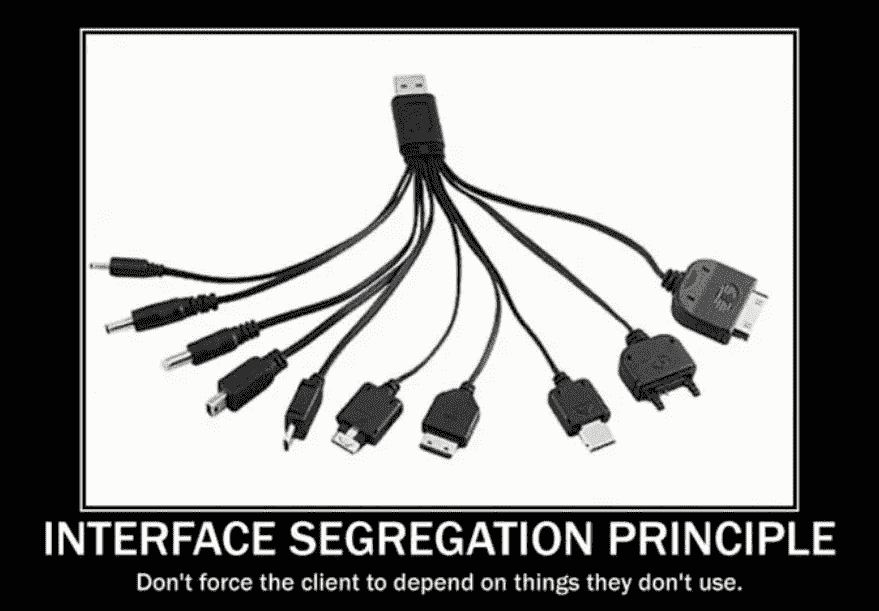

信用:[匿名](https://blog.larapulse.com/clean-code/solid-in-simple-words)

[匿名](https://www.coengoedegebure.com/solid-design-principles/)

# d)依存倒置原则

我们应该依靠抽象，而不是具体的实现。软件要低耦合，高内聚。

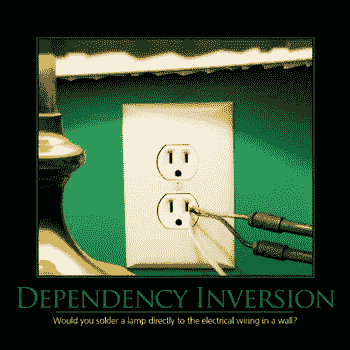

信用:[匿名](https://deviq.com/principles/dependency-inversion-principle)

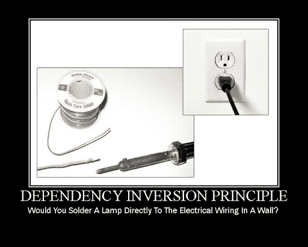

信用:[阿布舍克·舒克拉](https://www.abhishekshukla.com/net-2/dependency-inversion-principle-dip/)

# 6.避免过早优化

过早优化是鼓励开发人员在证明有必要之前执行不必要的优化的做法。我认为，如果你申请亲吻和 YAGNI，你不应该爱上这个

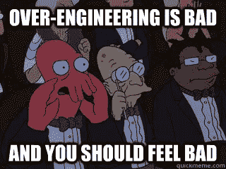

信用:[匿名](https://ponyfoo.com/articles/the-architecture-of-productivity)

信用:[productivieprogrammer . io](https://productiveprogrammer.io/premature-optimization-embarrassing-problem/)

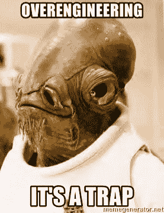

信用:【memegenerator.net】T4

# 7.奥卡姆剃刀

在编程界是什么意思？不要创建不需要的实体。务实一点。

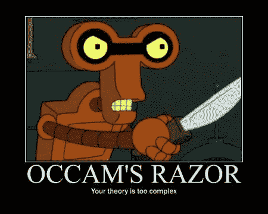

信用:[匿名](http://astrorhysy.blogspot.com/2016/03/youll-have-your-eye-out-with-that.html)

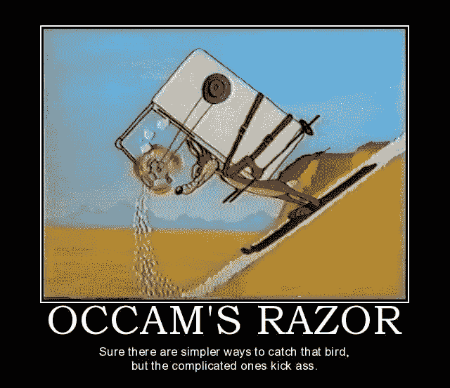

信用:[凯特米其林](https://www.pinterest.com/pin/307652218275093236/)

# 包裹

希望你玩得开心，在学习一些软件原理的同时享受这些迷因。有人说过你不能在娱乐的同时学习吗？

如果你想深入了解这些概念，请查看我下面的原始文章:

 [## 每天都应该遵循的 7 个软件开发原则

### 《吻》、《干》、《YAGNI》等等

better 编程. pub](/7-software-development-principles-that-should-be-embraced-daily-c26a94ec4ecc) 

干杯！