# 下一次面试前要修改的 7 个 SQL 查询

> 原文：<https://betterprogramming.pub/7-sql-queries-to-revise-before-your-next-interview-18ba3fc4b5c>

## 带有示例和示例查询


照片由 [Pexels](https://www.pexels.com/photo/woman-standing-while-carrying-laptop-1181354/?utm_content=attributionCopyText&utm_medium=referral&utm_source=pexels) 的[克里斯蒂娜·莫里洛](https://www.pexels.com/@divinetechygirl?utm_content=attributionCopyText&utm_medium=referral&utm_source=pexels)拍摄

结构化查询语言(SQL)用于与关系数据库管理系统(RDBMS)交互，帮助用户创建和维护关系数据库。

这篇文章是关于 SQL 的。这是一个回顾，在你去面试之前复习你的 SQL 技能，因为每个编程面试至少有一个关于 SQL 查询的问题。

这是我为自己和其他想要回顾所有 SQL 查询的人创建的指南。我使用 SQL Server Management Studio (SSMS)进行查询。

**注:**

*   一些 SSMS 版本不需要分号结尾。如果您的数据库需要分号，请在末尾添加。
*   SQL 保留字不区分大小写— `create`与`CREATE`相同。

# 1.创建、更改和删除数据库

数据库的创建是 SQL 查询的开始。数据库包含一个或多个表，每个表包含行和列形式的数据。

## **创建新的 SQL 数据库**

```
**Syntax:****CREATE DATABASE** DatabaseName;**Example:**CREATE DATABASE sample;
```

## **将数据库名称**更改为`lab1`

```
**Syntax**: **ALTER DATABASE** DatabaseName **MODIFY** name = NewDatabaseName;**Example:** ALTER DATABASE sample MODIFY name = lab1;
```

## 删除数据库

现在，我们必须删除`lab1`数据库。因此，在删除数据库时，请记住:

*   您不能删除当前正在使用的数据库。
*   如果多个用户同时使用数据库，您需要将数据库置于单用户模式下以删除它。
*   您不能删除系统数据库。

```
**Syntax:** **DROP DATABASE** DatabaseName;
**Example:** DROP DATABASE lab1;**Syntax for deleting the muti-users database:**(If you are on production, server- alter database should be used carefully):ALTER DATABASE DatabaseName SET SINGLE_USER WITH ROLLBACK IMMEDIATE;
```

# 2.创建带约束的表

是时候在我们的数据库中创建一个表了。我们已经删除了`lab1`数据库，但是您可以用`lab2`创建另一个数据库，并开始在其中创建表。

SQL 约束可用于列和表级别。您可以向每列添加约束，也可以不添加。这取决于您想要为该表中的特定列指定的规则。SQL 中使用了以下约束:

*   **NOT NULL** :确保该列不能有空值。
*   **唯一:**确保一列中的所有值都不同。
*   **主键:**非空且唯一的组合。每个表只能有一个主键。
*   **外键:**它是一个表中字段的集合，引用另一个表中的主键。有外键的表称为子表，有主键的表称为父表。外键防止在外键列中输入无效数据。
*   **检查:**确保在列中输入值时满足特定条件。
*   **默认值:**如果没有提到值，则为该列设置一个默认值。

```
**Syntax:**
CREATE TABLE TableName (
column1 datatype constraint,
column2 datatype constraint,
column3 datatype constraint,
……
);
```

## a.创建具有主键和外键约束的表

我们将创建两个表`personTable` 和`genderTable` ，并用主键和外键约束将它们链接起来。下面是我们将要添加的两个表:

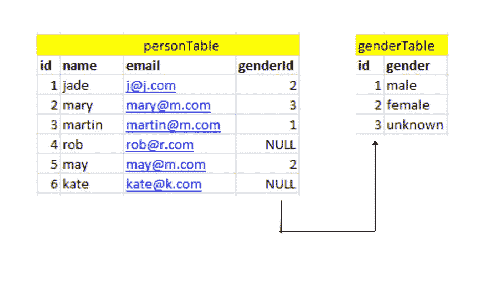

按作者分类的表格图像

让我们首先创建这个带有查询的表，并将数据插入其中:

```
**personTable**
CREATE TABLE personTable(
id INT NOT NULL PRIMARY KEY,
name NVARCHAR(20) NOT NULL,
email NVARCHAR(20) NOT NULL,
genderId INT 
);**genderTable** CREATETABLE genderTable(
id INT NOT NULL PRIMARY KEY,
gender NVARCHAR(20) NOT NULL
);
```

创建了两个表，我们将两个表的`id`列标记为`primary key`。现在，我们将在表中插入以下条目:

```
**Syntax for inserting data into table:****INSERT INTO** tableName (column1, column2, column3,...columnN)
**VALUES** (value1, value2, value3...valueN);
```

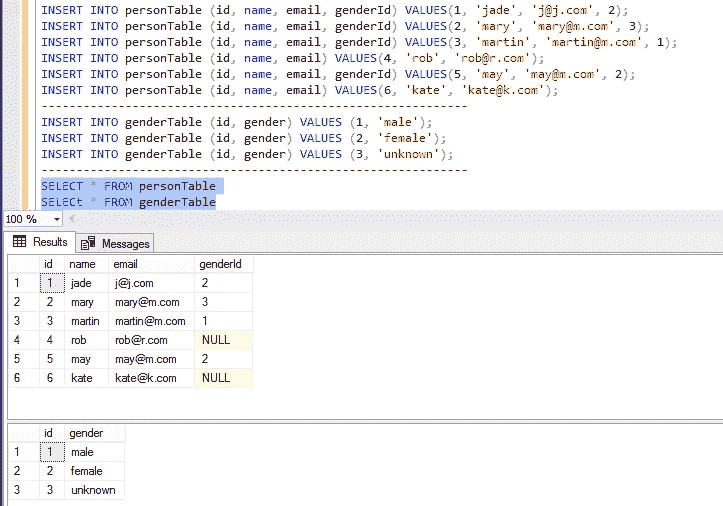

现在我们必须将`personTable`的`genderId`列标记为外键，因为这将防止用户输入无效数据。我们在外键列中输入的值必须是`genderTable.`的`id`列的值

这意味着:
person table:gender id =外键
gender table:id =主键

所以，现在我们的**主键** **表**会是`genderTable`，而**外键表**会是`personTable`。

```
**Syntax for adding foreign key constraint:****ALTER TABLE** foreignkeyTable 
**ADD** **CONSTRAINT** constraintName
**FOREIGN KEY** (foreignkeyColumn)
**REFERENCES** primarykeyTable (primarykeyColumn);**Query:To enter foreign key constrant into personTable**ALTER TABLE personTable
ADD CONSTRAINT FK_persongender 
FOREIGN KEY (genderID)
REFERENCES genderTable (id);
```

因此，现在数据库完整性将得到维护，因为一个表中的外键指向另一个表中的主键。这样我们就不能在`genderId`列中输入任何值；我们只能输入`genderTable`的 `id`列的值。

## b.添加默认约束

正如您在`personTable`中看到的，我们在`genderId` 列中有空值。因此，当我们不添加任何`genderId`值时，我们希望用默认值 3 填充它，因为它指定了来自`genderTable`的未知性别。

```
**Syntax:**
**ALTER TABLE** tableName
**ADD CONSTRAINT** constraintName
**DEFAULT** defaultValue **FOR** existingcolumn_name;**Example:**
ALTER TABLE personTable
ADD CONSTRAINT DF_person_genderId
DEFAULT 3 FOR genderID;
```

因此，从现在开始，当您不提供任何`genderId`值时，它将显示默认值 3 而不是 NULL。

## c.唯一键约束

当我们不想在列中允许重复值时，使用 unique key 约束。我们知道主键也强制唯一性。那么，主键和唯一键的**区别是什么:**

1.  一个表只能有一个主键，但可以有多个唯一键。
2.  主键不允许空，而唯一键允许一个空。

当我们希望在一个表中维护不同的列(如电子邮件、护照号码唯一性)时，可以使用唯一键。我们可以在电子邮件栏的`personTable`中使用它，这样就不会添加重复的电子邮件。

```
**Syntax:****ALTER TABLE** tableName
**ADD CONSTRAINT** constraintName
**UNIQUE KEY** (columnName)**Query:**
ALTER TABLE personTable
ADD CONSTRAINT uq_person_email
UNIQUE KEY (email)
```

## d.添加检查约束

假设我们有以下人员表:

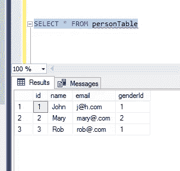

现在，如果我们想在这个现有的表中添加一个年龄列，我们将执行以下查询:

```
**Syntax: For adding a new column to an existing table****ALTER TABLE** tableName
**ADD** columnName datatype;
```

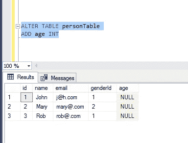

因为我们增加了年龄一栏。现在，如果我们在其中输入值并点击以下查询:

```
**INSERT** **INTO** personTable
**VALUES** (4, ‘kate’, ‘kate@.com’, 1, -221);
```

它表明，我们甚至可以添加负的年龄值，但年龄不能为负。因此，如果我们只希望年龄在 1 到 100 之间，此时我们可以使用 CHECK 约束。

```
**Syntax for CHECK constraint:****ALTER TABLE** tableName
**ADD CONSTRAINT** constraintName
**CHECK** (Boolean Expression);
```

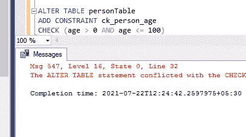

当我们点击上面的查询时，我们得到了一个错误，因为我们已经添加了-221 负年龄。因此，在执行检查约束查询删除年龄为负的行之前，使用以下代码:

```
**DELETE** **FROM** personTable **WHERE** age =-221;
```

现在，你可以走了。再次执行 CHECK 约束查询，从现在开始只能输入 1 到 100 之间的年龄。

# 3.使用标识列创建一个表

当我们不想指定列的值时，可以使用标识列。例如，当客户通过网站注册时，他们不必记住服务器自己记住的记录号。这就是为什么如果一个列被标记为标识列，那么当您插入新记录时会自动生成值。

下图描述了新的`tblperson2`表，其中`personId`作为标识列，identity(1，1)描述为从 1 开始列，并按 1 递增。

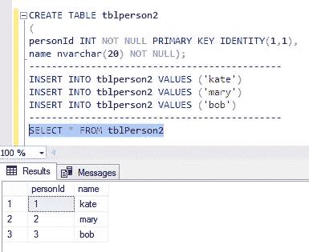

假设我们删除了第一行`personId=1`

```
**DELETE** **FROM** tblperson2 **WHERE** personId=1;
```

结果:

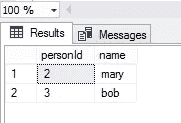

当我们使用以下查询向表中输入另一个人时:

```
**INSERT** **INTO** tblperson2 **VALUES** (‘sara’);
```

结果:

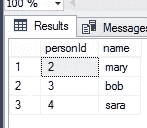

它显示新的人使用了记录 4，并且没有重用 personId 1 的位置。因此，如果您必须重用被删除的那个，那么您必须使用以下查询打开 IDENTITY_INSERT:

```
SET IDENTITY_INSERT tblperson2 ON;
```

然后，添加以下查询来添加特定的`personId`:

```
**INSERT** **INTO** tblperson2 (personId, name) **VALUES** (1, ‘aby’);
```

结果:

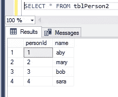

因此，现在自动递增并继续序列—关闭 IDENTITY_INSERT，您就可以开始了。

```
SET IDENTITY_INSERT tblperson2 ON
```

# 4.关于“选择”语句的所有内容

## 显示表中的所有数据

```
**SELECT** * **FROM** tableName;
```

## **从下面的人员表中显示不同的城市:**

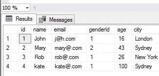

```
**SELECT DISTINCT** city **FROM** personTable;**Result:**
London
New York
Sydney
```

# 使用“WHERE”子句

例如，您想要检索居住在伦敦的人的数据:

```
**SELECT** * **FROM** personTable **WHERE** city = 'London’;
```

在 WHERE 子句中，可以使用不同的运算符，如:

*   =:等于
*   ！=或<>:不等于
*   >:大于
*   ≥:大于或等于
*   :小于
*   ≤:小于等于
*   在:指定值列表
*   介于:指定一个范围
*   喜欢:指定模式
*   不在列表、范围等中
*   %:指定 0 个或更多字符
*   _:请指定一个字符
*   []:括号内的任何字符

**使用 WHERE 子句解决这四个查询:**

1.  选择年龄在 16、26 和 100 岁的人
2.  选择年龄在 10 到 30 岁之间的人
3.  选择以“S”开头的城市
4.  选择@符号前后各有一个字符的电子邮件地址

先试着解决。如果你没有得到它，那么看看下面的结果:


# 使用 AND 和 OR 运算符

选择居住在伦敦或悉尼且年龄大于 25 岁的所有人:

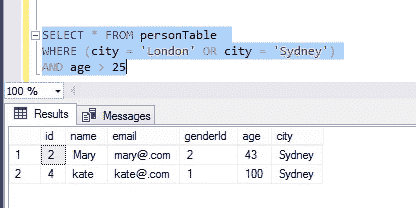

# Order By 子句

Order by 子句用于按升序或降序显示数据。默认情况下，它以升序显示。

我们将解决以下问题:

1.  按降序选择人们的年龄。
2.  按降序选择名称，按升序选择城市。
3.  按降序只选择城市列。

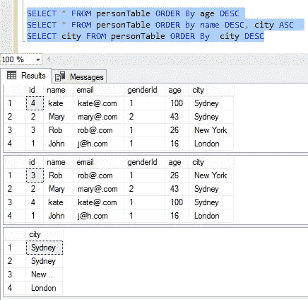

# 使用 TOP 关键字

当您想要指定表的有限数据时，使用 TOP 关键字。我们可以解决以下问题:

1.  从人员表中选择前三行。
2.  选择带有姓名及其电子邮件的前两行。
3.  选择桌子上最老的人。


# 5.更新表格

当您想要更改该列的某些数据时，可以使用 update。假设在上面的人员表中，您必须替换约翰·托·john@j.com 的电子邮件 id。要更改这一点，请尝试以下查询:

```
**Syntax:****UPDATE** tableName
**SET** column1=value1, column2=value2,…
**WHERE** condition,
```


## 删除表格

```
**DROP TABLE** tableName;
```

## 删除整列

如何从人员表中删除城市列:

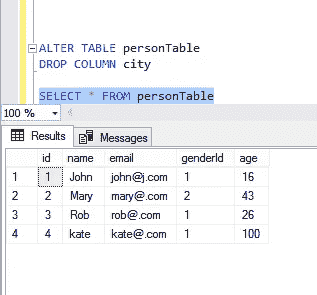

# 6.Group by 语句

Group by 语句对具有相同值的行进行分组。它通常与 COUNT()、SUM()、AVG()、MIN()、MAX()等聚合函数一起使用。

首先，让我们使用 SQL 中的聚合函数。我们将使用下面的`employeeTable`:

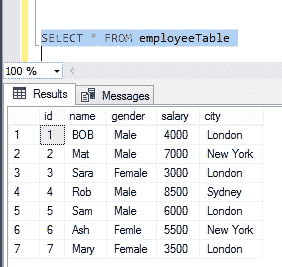

我们将解决以下聚合函数查询:

1.  求单位工资总额。
2.  求单位最低工资。
3.  求单位最高工资。

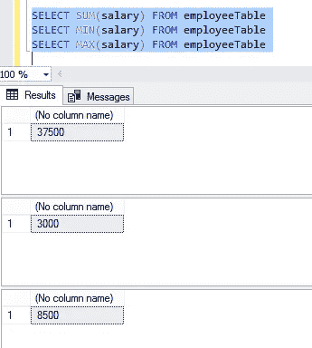

现在，我们将使用 GROUP BY 对行进行分组。让我们解决以下问题:

1.  把所有的`city` 和它的`salary`组合在一起。
2.  将所有`gender`、`city`和所有薪水分组在一起，并按升序排列城市。

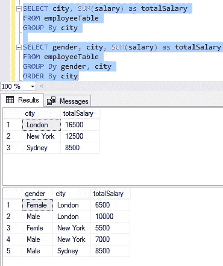

**筛选分组:**求解—将所有`gender`、`city`分组，只显示`Male`工资。我们也可以使用 HAVING 子句来解决这个查询，如下所示:

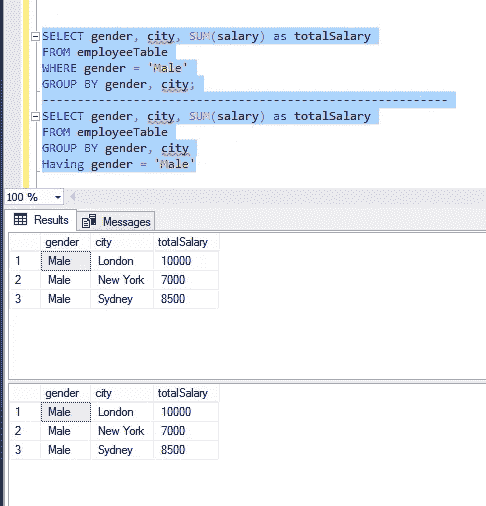

**WHERE 和 HAVING 子句的区别在于:** WHERE 子句用于在聚合前筛选行，而 HAVING 子句用于在聚合后筛选组。

# 7.连接

联接用于从两个或多个表中检索数据。有四种类型的连接:

*   内部联接或联接
*   左外部联接或左联接
*   右外部联接或右联接
*   完全外部连接或完全连接

我们将使用以下两个表来学习连接:

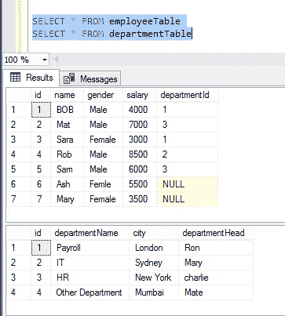

## 内部连接

内部联接只返回两个表之间匹配的行。不匹配的行将被删除。

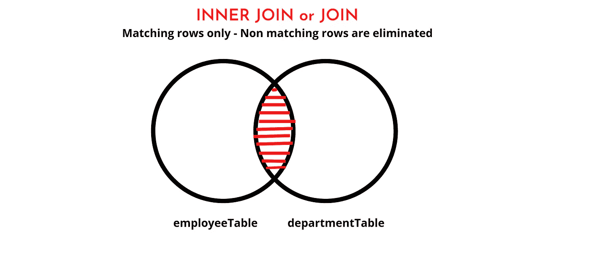

```
**Syntax:****SELECT** columnName(s)
**FROM** table1
**INNER JOIN** table2
**ON** table1.columnName = table2.columnName;
```

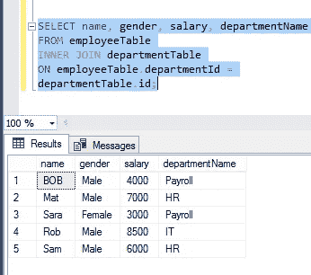

## 左连接

Left Join 或 Left Outer Join 返回左表中所有匹配的行和不匹配的行。编写查询时，可以使用 Left Outer Join 或 Left Join。

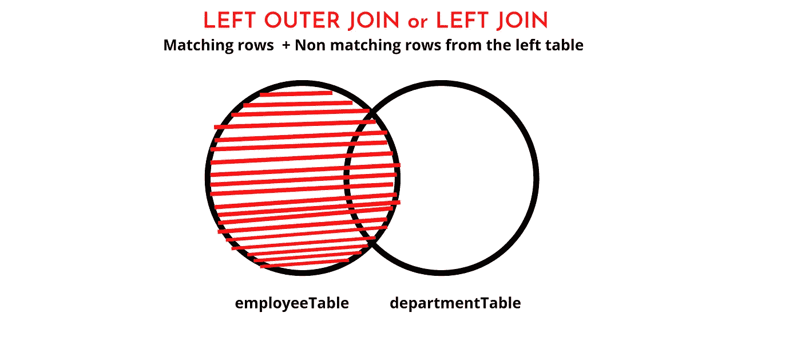

```
**Syntax:****SELECT** columnName(s)
**FROM** table1
**LEFT OUTER JOIN** table2
**ON** table1.columnName = table2.columnName;
```

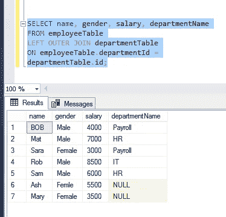

## 右连接

Right Join 或 Right Outer Join 返回右表中所有匹配的行和不匹配的行。编写查询时，可以使用右外连接或右连接。

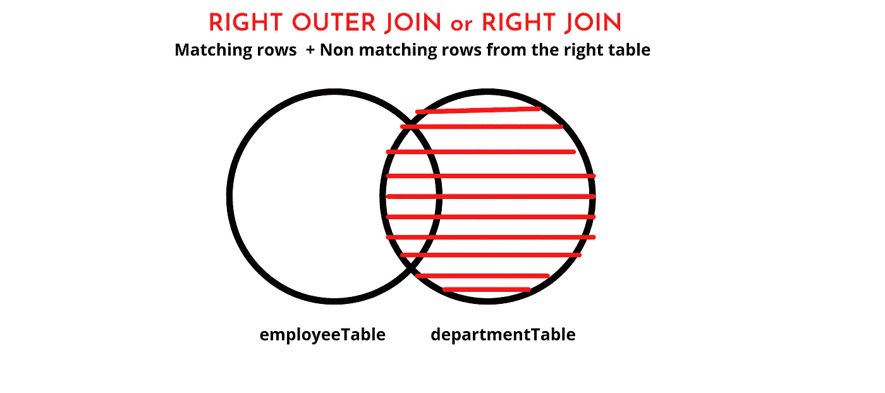

```
**Syntax:****SELECT** columnName(s)
**FROM** table1
**RIGHT OUTER JOIN** table2
**ON** table1.columnName = table2.columnName;
```

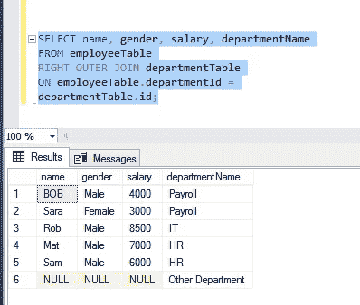

## 完全连接

完全连接返回左表和右表中的所有行，以及两个表中不匹配的行。编写查询时，可以使用完全外部联接或完全联接。

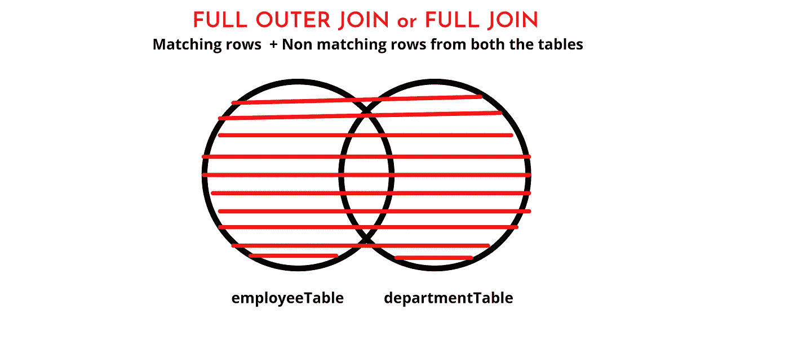

```
**Syntax:****SELECT** columnName(s)
**FROM** table1
**FULL OUTER JOIN** table2
**ON** table1.columnName = table2.columnName;
```

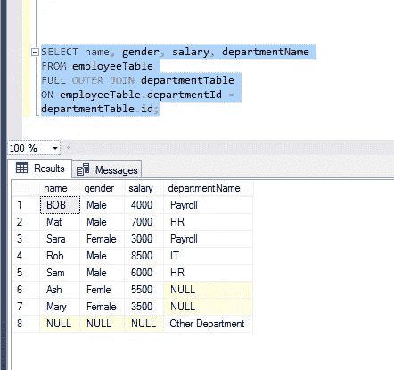

## 交叉连接

交叉连接给出了两个表的笛卡尔积。

例如，如果`employeeTable`有七行，而`departmentTable`有四行。因此，交叉连接将产生 28 行。

**注意:**交叉连接没有 ON 子句。

```
**Syntax:****SELECT** columnName(s)
**FROM** table1
**CROSS JOIN** table2
```

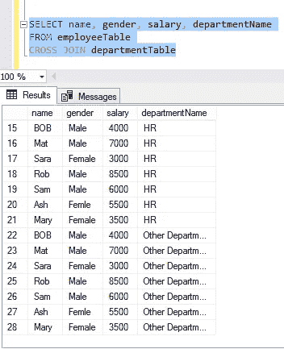

作者的更多故事:

[](/7-websites-to-help-crack-your-next-coding-interview-af3f17ad8d92) [## 帮助你破解下一次编码面试的 7 个网站

### 通过实践来学习、训练和提高自己

better 编程. pub](/7-websites-to-help-crack-your-next-coding-interview-af3f17ad8d92) [](/the-12-best-chrome-extensions-for-developer-productivity-4c60ec613840) [## 提高开发人员效率的 12 个最佳 Chrome 扩展

### 每个开发人员都应该考虑使用这些

better 编程. pub](/the-12-best-chrome-extensions-for-developer-productivity-4c60ec613840)