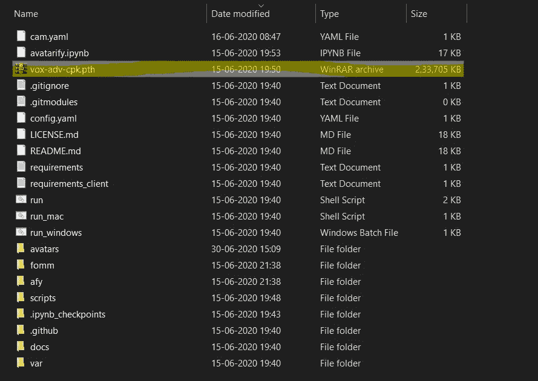
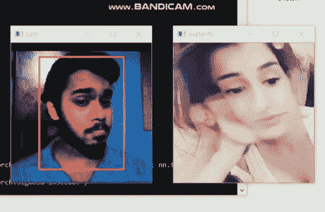
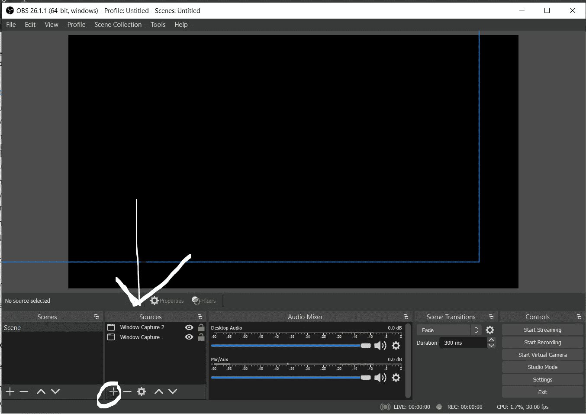
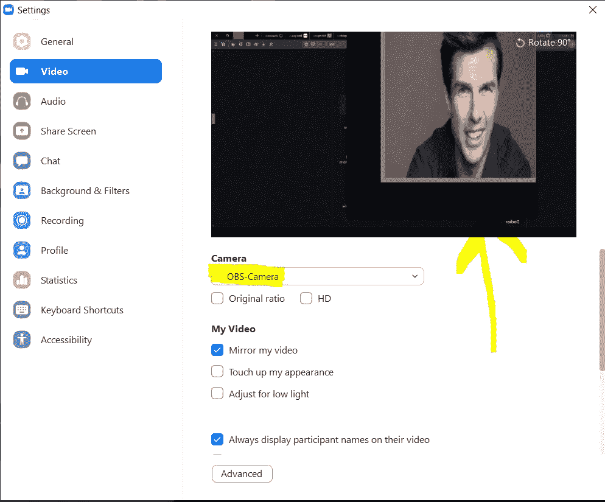

# 使用 Python 在 Zoom 会议中添加虚拟角色的 7 个步骤

> 原文：<https://betterprogramming.pub/7-steps-to-adding-artificial-characters-in-zoom-meetings-using-python-b2303d5e21b6>

## 虚拟化库使它变得容易多了


图片由[瑞安·迈奎尔](https://pixabay.com/users/ryanmcguire-123690/?utm_source=link-attribution&utm_medium=referral&utm_campaign=image&utm_content=371238)从[皮克斯拜](https://pixabay.com/?utm_source=link-attribution&utm_medium=referral&utm_campaign=image&utm_content=371238)拍摄。

*注意:本文仅用于教育目的，主要关注深度学习和 Python 编程的积极方面。*

[虚拟化](https://avatarify.ai/)基于[一阶运动模型](https://github.com/AliaksandrSiarohin/first-order-model)，该模型利用了深度学习的图像动画和人脸交换方法。这个模型的主要目标是制作用于视频会议的真实感头像。

它基于[样式和](https://heartbeat.fritz.ai/create-a-style-transfer-snapchat-lens-with-snapmls-ml-component-361ca2c10573)。风格转移有助于通过视频转移输入图像特征。Avatarify 将任何输入人脸转换为任何其他视频。输入图像可以是任何动画角色、人脸或任何看起来像脸的东西。

本文将介绍如何使用 Python 编程，利用`avatarify`模型在缩放会议中添加人工角色。

*注意:要在本地运行 Avatarify，您需要支持 CUDA 的(NVIDIA)显卡。否则会跑得很慢。可以在*[*Colab*](https://colab.research.google.com/)*上面测试一下，性能更好。*

# 1.使用 Python 3.8 安装 Miniconda

[迷你蟒蛇](https://docs.conda.io/en/latest/miniconda.html#windows-installers)是[蟒蛇](https://www.anaconda.com/)的缩小版。这是一个数据科学家的环境，具有数据科学任务的大部分要求。

要安装 Miniconda，请前往[文档](https://docs.conda.io/en/latest/miniconda.html#windows-installers)并下载适合 Python 3.8 的安装。

# 2.安装 Git

Git 将帮助我们从 GitHub 克隆 Avatarify 模型。要安装 Git，去它的官网[下载 Git 安装的安装文件](https://git-scm.com/download/win)。

这一步是可选的，因为 Avatarify 的 repo 可以直接从 GitHub 下载。

# 3.从 Git 下载 Avatarify

如果您已经安装了 Git，那么运行下面的命令从 GitHub 下载 Avatarify:

```
git clone https://github.com/alievk/avatarify.git
```

如果你没有安装 Git，点击“Code”下拉列表中的[“Download zip”选项](https://github.com/alievk/avatarify.git)

# 4.使虚拟化环境就绪

一旦从 GitHub 克隆了 Avatarify，下一步就是设置 Avatarify 环境。

使用命令提示符，使用以下命令进入克隆的 Avatarify 文件夹:

```
cd avatarify
```

现在，在命令提示符下运行以下命令:

```
scripts\install_windows.bat
```

此`.bat`文件将在您的机器中执行以下操作:

1.  创建一个名为`avatarify`的`conda`环境。
2.  激活 Miniconda 中名为`avatarify`的环境。
3.  安装所需的库。

# 5.下载预先训练的模型权重

一旦环境设置成功，我们就可以[下载预先训练好的模型权重文件](http://here)。

下载后，我们可以将重量文件保存在`avatarify`文件夹中:



作者照片。

# 6.使用网络摄像头检查输出

现在，我们可以走了。我们可以通过在命令提示符下运行以下文件来尝试执行模型:

```
run_windows.bat
```

默认情况下，它将使用您的网络摄像头。您可以在第 198 行的`camfomm.py`文件中对此进行更改，如下所示:

```
#cam_id = select_camera(config)
cam_id = 3
```

`cam_id`您的相机 ID 是否已在机器上设置。`0`是内置网络摄像头的默认 ID。

将弹出一个窗口。您可以使用 X 键重置框架。

这是我收到的输出。我们可以将模型的输入图像保存在名为`avatars`的文件夹中。使用数字键在图像之间切换。



由作者记录。

# 7.使用 Zoom 应用程序设置一切

最后，我们到了有趣的部分:在 Zoom 应用程序中使用这种方法。

在执行这些步骤之前，请确保 Avatarify 正在通过命令提示符运行(如步骤 6 中所述):

1.  安装 [OBS Studio](https://obsproject.com/) 来捕获 Avatarify 的输出。
2.  安装[虚拟摄像头插件](https://obsproject.com/forum/resources/obs-virtualcam.949/)。选取“仅安装和注册 1 台虚拟摄像机”
3.  启动 OBS Studio。
4.  单击源代码面板中的+号。



作者截图。

5.选择“Windows 捕获”并单击“确定”

6.在出现的窗口中，选择“[python.exe]: avatarify”，然后单击“确定”

7.现在，点击“编辑”->“变换”->“适合屏幕”

8.最后，进入“工具”->“虚拟摄像头”选中“自动开始”，然后将“缓冲帧”设置为 0，并按“开始”

仅此而已！现在 OBS-Camera 将在 Zoom 应用程序中提供。



最终缩放屏幕

# 结论

在本文中，我们看到了如何利用 Avatarify(一个支持 Python 的模块)来改变视频通话的缩放屏幕。更多精彩文章敬请期待。

感谢阅读！