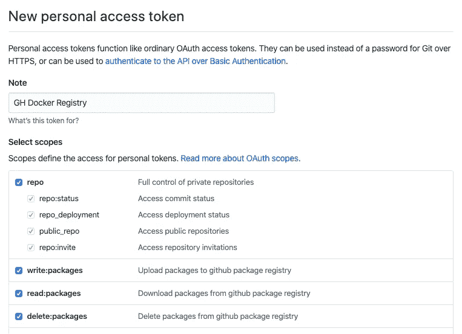
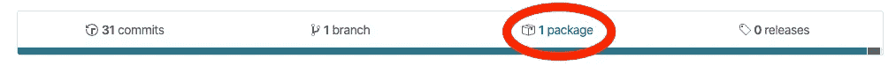

# 使用 Nginx 对 Angular 9 应用程序进行分类的 7 个步骤

> 原文：<https://betterprogramming.pub/7-steps-to-dockerize-your-angular-9-app-with-nginx-915f0f5acac>

## 在 Docker 环境中设置 Angular 9 应用程序，并立即进行部署


德里克·托尔萨尼在 [Unsplash](https://unsplash.com/s/photos/seven?utm_source=unsplash&utm_medium=referral&utm_content=creditCopyText) 上拍摄的照片

在本教程中，我想向你展示如何将你的 Angular 9 应用程序 dockerize，并让它立即上线！

了解 Angular 和 Docker 的一些基本知识会很有用，因为我不会深入介绍 Docker 和 Angular 9 的本质细节。

我将向您展示一个实用的方法来将您的 Angular 9 应用程序 dockerize，这样您就可以将它部署在您选择的 web 主机上。

> 最初发布于: [ByRayRay.dev](https://byrayray.dev/posts/2020-02-17-7-steps-to-dockerize-your-angular-9-app-with-nginx-915f0f5acac)

# 工具作业

在本教程中，我们将使用以下工具。如果您还没有安装它们，我将带您浏览一遍，但是如果您的机器上已经安装了它们，速度会更快。

1.  节点. js
2.  npm 或[纱线](https://yarnpkg.com/)
3.  角度 CLI
4.  您选择的代码编辑器。(我倾向于 Visual Studio 代码。)
5.  码头工人

# 1.安装 Angular CLI

如果你还没有安装 Angular CLI，我建议你安装。

打开你的终端，运行`npm install -g @angular/cli`，或者如果你使用 Yarn，运行`yarn global add @angular/cli`。

# 2.使用 CLI 创建新的角度项目

如果您已经创建了一个角度项目，您可以跳过这一步。

运行`ng new`命令创建一个新的 Angular 9 项目。请确保您回答了终端中的所有问题，因为这将使设置变得非常简单。

## 命令

*   npm: `ng new project-name`
*   纱线:`ng new project-name --packageManager=yarn`

为了测试一切是否正常，在终端中导航到您的`project-name`文件夹并运行`ng serve`。当一切按预期运行时，您可以使用 [localhost:4200](http://localhost:4200) 打开您的浏览器。

当然，您将构建一个对用户非常有用的出色的角度应用程序。但是你可以以后再做。

# 3.安装 Docker

当我们想要使用 Docker 来构建我们的 Docker 映像并运行我们的容器时，我们必须安装 Docker。

如果你已经安装了 Docker，你可以继续下一步。

[为您的平台下载安装程序](https://docs.docker.com/install/)并运行安装程序。应该很简单。

要测试安装是否成功，运行命令`docker -version`。如果你看到一个版本号，一切都好，可以进入下一步。

# 4.创建多阶段 Docker 映像

如果你有一点 Docker 的经验，你应该知道什么是 Docker 图像，你可以用它做什么。对于不了解的，我简单解释一下。

## 什么是 Docker 图像？

Docker 映像是您希望在 Docker 容器中运行的应用程序的蓝图。在蓝图中，您必须决定 Docker 需要采取什么样的步骤来构建您的应用程序、获取依赖项以及复制所需的文件。

例如，使用 Docker 映像，您可以旋转 Docker 容器来运行它，并使它在浏览器中可见。

## 什么是 Docker 容器？

Docker 容器是一种虚拟(小型)服务器，您可以用一个命令启动、停止或删除它。Docker 容器可以很容易地启动该容器的多个实例，这样您就可以在它们之间分配流量。

## 让我们构建 Docker 图像的第一部分

创建一个文件，`Dockerfile`，注意没有文件扩展名。(没错。)

首先，我们要告诉它，我们希望我们的图像基于哪张图像。该映像将自动安装 Node.js 的所有依赖项，以便在其上构建我们的 Angular 9 应用程序。

```
FROM node:13.3.0 AS compile-image
```

我们正在使用`node:13.3.0`，如果你想使用另一个版本或更小的基础图像，请查看 [Node.js Docker 页面](https://hub.docker.com/_/node/)。我们称这个图像为`compile-image`，这在以后会变得很方便。

```
RUN npm install -g yarn
```

下一步，我们为使用纱线的人安装纱线。如果要使用 npm，可以跳过这一步。

```
WORKDIR /opt/ng COPY .npmrc package.json yarn.lock ./
```

我们将我们的`WORKDIR`设置为`/opt/ng`，这样我们就知道所有内容将被复制到哪个目录下。

对于 Yarn，我们像在本地计算机上一样运行`yarn`命令。

```
RUN npm install
```

使用 npm 时，运行`npm install`命令来安装所有的依赖项。

```
COPY . ./ RUN ng build --prod
```

复制所有其他角度文件，以便能够运行`ng build --prod`。建议在创建 Docker 映像之前在您的计算机上运行此命令，这将使您免于不断构建失败的 Docker 映像。

大部分 Docker 图片都会停在这里。但这会让你的 Docker 形象比需要的大。

## 构建 Docker 映像的第二部分

要运行我们的 Angular app，我们不需要用 Node.js 来运行，我们可以选择一个更轻量级的变种来运行。

Docker 映像的第二个阶段从`FROM`语句开始，在那里我们指定我们想要使用`nginx`。

```
COPY docker/nginx/default.conf /etc/nginx/conf.d/default.conf 
COPY --from=compile-image /opt/ng/dist/app-name /usr/share/nginx/html
```

第一个`COPY`语句将`default.conf`文件从`nginx`基础映像复制到我们正在构建的 Docker 映像。

第二个`COPY`语句告诉它我们想要来自`compile-image`的一些文件。因此，在水下，它已经在一个单独的 Docker 图像中建立了图像的第一部分。

我们将构建好的 Angular app 从`compile-image`中的`/dist`文件夹复制到 [NGINX](https://www.nginx.com/) 的`html`文件夹中。

使用 NGINX 的原因是，它将使运行 Angular 应用程序成为可能，而不需要大的`node_modules`文件夹。我们只使用应用程序的文件。这将在 Docker 映像上节省一些字节。

## 最终 Docker 图像

这是最终 Docker 图像的外观。

# 5.建立码头工人形象

现在我们已经创建了`Dockerimage`文件。我们准备运行命令来构建我们的映像。

```
docker build -t angular-9-app .
```

当运行这个命令时，Docker 将创建您的映像。这可能需要一段时间，取决于您的计算机的能力。所以，要有耐心。

当命令没有任何错误时，当它以类似这样的方式结束时，它就成功地构建了。

```
Successfully built 1c40cf9e92e3 
Successfully tagged angular-9-app:latest
```

如果您想查看电脑上的所有 Docker 图像，请运行以下命令:

```
docker image ls
```

结果应该是类似这样的。在顶部，您会发现新创建的 Docker 图像带有标签、图像 ID、日期和大小。

```
REPOSITORY     TAG     IMAGE ID      CREATED             SIZE 
angular-9-app  latest  1c40cf9e92e3  About a minute ago  130MB
```

# 6.使用 Docker 映像运行 Docker 容器

为了让我们的 Angular 应用程序运行，我们必须启动一个使用 Docker 图像的 Docker 容器。

```
docker run --name ng-app-container -d -p 8080:80 angular-9-app
```

当运行上面的命令时，终端将用一个 ID 来响应。

```
8ef42069eaaf0e70aceebddcd0131c3b670464dd62cf8a78c19cb074e84ad750
```

这个 ID 与您的 Docker 容器相对应。

让我们打开浏览器并启动 [http://localhost:8080](http://localhost:8080) 来查看我们的 Angular 应用程序的运行情况。

如果您对 Angular 应用程序进行了更改，您需要创建一个新的 Docker 图像。

```
docker container stop 8ef42 
docker container rm 8ef42
```

使用此命令停止并删除 Docker 容器。(如果您不知道您的 Docker 容器 ID，请运行`docker container ls`。)不需要长 ID，只需要输入前三四个字符，就够了。

当新的 Docker 映像创建后，您可以使用上面的`docker run`命令启动一个新的 Docker 容器。

# 7.将 Docker 图像添加到 GitHub

现在我们已经创建了一个 Docker 映像，并使用它在本地计算机上的 Docker 容器中运行，我们已经测试过这是可行的。

如果你想在你的主机上使用这个应用(它必须是一个支持 Docker 的主机平台，我推荐 [DigitalOcean](https://www.digitalocean.com/) )你必须将这个 Docker 图像存储在 Docker 注册表中。

Docker 注册表是 Docker 映像的存储提供者。GitHub 是存储私有和公共 Docker 图像的好方法。

## 登录 GitHub Docker 注册表

在推送我们的图片之前，我们需要登录到您计算机上的 Github Docker 注册表。

```
docker login -u USERNAME -p TOKEN docker.pkg.github.com
```

将`USERNAME`替换为您的用户名，将`TOKEN`替换为您通过 [GitHub 网站](https://github.com/settings/tokens)创建的令牌。给令牌命名，选择回购、`write:packages`、`read:packages`和`delete:packages`。

复制令牌并在命令中传递它。



要推送 Docker 映像，您必须创建 GitHub repo。如果你在 GitHub 上托管你的代码，你可能已经这么做了。如果你还没有，先这样做。

## 发布 Docker 图像

我们从 Angular 应用程序中创建的 Docker 图像将被发布到注册表中。

```
docker image ls
```

为了发布，我们需要知道 Docker 图像 ID，您可以使用上面的命令找到它。

现在您知道了 Docker 图像 ID，您可以用您的图像 ID 替换`IMAGE_ID`。接下来，用您的信息替换 URL 中的所有内容。对于`VERSION`，你可以从`0.0.1`或者其他对你有意义的东西开始。

当一切顺利时，在浏览器中打开你的 GitHub repo。你应该看到在分支数旁边有一个包。



单击链接并选择您的图像。这将导航到您的 Docker 图像页面。在此页面上，您将看到指向您的图像的链接。

现在你可以在你的虚拟主机上使用 Docker 图片了。我不打算解释你如何在你的主机上安装 Docker(因为有一百万种可能性)。如果你使用的是 Digital Ocean，你可以手动安装或者使用市场上的 [Docker 安装程序](https://marketplace.digitalocean.com/apps/docker)。

使用这个命令，您可以将刚刚发布的图像拉至 GitHub Docker 注册表。

```
docker run --name ng-app-container -d -p 8080:80 angular-9-app
```

当您想在容器中运行它时，您可以像以前一样运行相同的命令。

# 谢谢

希望本教程能帮助您用 Angular 9 创建 Docker 映像，在 Docker 容器中运行它，并在 GitHub Docker 注册表中发布它。

> 在这篇文章中，我要感谢弗兰克·斯皮克曼，他帮助我创建了这个快速的 Docker 图像设置。🙏

如果你有任何问题，请在评论中告诉我。如果没有，编码快乐！

# 阅读更多

[](/7-web-development-guidelines-to-speed-up-page-loading-e8f0e13a53b) [## 加速页面加载的 7 个 Web 开发指南

### 为了你的访问者的爱，改善用户体验

better 编程. pub](/7-web-development-guidelines-to-speed-up-page-loading-e8f0e13a53b) [](https://medium.com/dev-together/use-cli-tools-from-mac-linux-on-windows-subsystem-for-linux-37d16f012489) [## 在适用于 Linux 的 Windows 子系统上使用 Mac/Linux 中的 CLI 工具

### WSL2 如此强大，使得从 Mac 到 wsl 2 的转换轻而易举。

medium.com](https://medium.com/dev-together/use-cli-tools-from-mac-linux-on-windows-subsystem-for-linux-37d16f012489) [](https://medium.com/dev-together/3-todos-before-applying-for-a-junior-developer-job-26fc0d8ba2b9) [## 申请初级开发人员工作前的 3 件事

### 我见过很多初级开发人员的求职申请。大多数申请都是出于好意…

medium.com](https://medium.com/dev-together/3-todos-before-applying-for-a-junior-developer-job-26fc0d8ba2b9) [](https://medium.com/better-programming/why-tutorials-wont-make-you-a-professional-developer-271108c74ddb) [## 为什么教程不能让你成为专业的开发者

### 精通不仅仅来自于做教程。尝试，失败，学习，重复！

medium.com](https://medium.com/better-programming/why-tutorials-wont-make-you-a-professional-developer-271108c74ddb) [](https://medium.com/better-programming/tips-to-create-developer-tutorials-62cb3a25b8e5) [## 创建开发人员教程的技巧

### 想写更多的教程，但你不知道从哪里开始？从这里开始

medium.com](https://medium.com/better-programming/tips-to-create-developer-tutorials-62cb3a25b8e5)