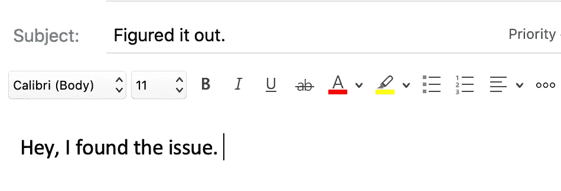

# 找出代码中最棘手的错误的 7 个策略

> 原文：<https://betterprogramming.pub/7-strategies-for-finding-the-toughest-bugs-in-your-code-19b40573b4c2>

## 2.让程序告诉你一个故事


伊万·阿列克西奇在 [Unsplash](https://unsplash.com?utm_source=medium&utm_medium=referral) 上的照片

如果你是一个经验丰富的开发人员，你可能会一次又一次地与错误搏斗。如果你是 web 或应用程序开发的新手，请耐心等待。

这些是你的眼中钉。

那些让你晚上睡不着觉的，或者在早上你检查售票系统时问候你的。

您可能在课程项目、迁移或修改新版本时遇到过这种情况。这些 bug 的共同点是找到并修复它们就像试图爬上一堵不可逾越的石墙。

但是还是有希望的，因为这条路已经走过很多次了。下面是一些策略，可以帮助你消灭最阴险的 bug，无论它们出现在哪里。

# 1.离开机器

如果你已经工作了一段时间，离开你的工作区，散散步，呼吸一下新鲜空气。如果您觉得自己大部分时间都在以同样的方式进行故障诊断，并且看到了类似的结果，这一点就尤为重要。如果是这样的话，它不会帮助你留在那个机器上。

连续几个小时不间断地研究一个问题可能会让你觉得有必要，但这会让你保持同样僵化的思维模式——最终你可能会拒绝新的想法。如果你发现很难摆脱，那就把自己限制在特定数量的测试上，然后休息一下。

做一些让你的思维进入不同空间的事情。例如，散步可以帮助你集中精力，从新的角度来解决问题。当你回到问题上时，你的思维可能会很灵活，你会准备尝试一种新的方法。


照片由[丹尼·豪](https://unsplash.com/@dannyhowe?utm_source=unsplash&utm_medium=referral&utm_content=creditCopyText)在 [Unsplash](https://unsplash.com/s/photos/walk-away?utm_source=unsplash&utm_medium=referral&utm_content=creditCopyText) 上拍摄

能够休息一段时间的部分原因在于能够接受渐进的成功。如果你不再看到一个死亡的白屏，而是看到一个完全混乱的布局和难以辨认的文字，那么看——这就是进步。也许是时候休息了。

# 2.让程序告诉你一个故事


好吧，代码，告诉我一个故事。[农旺](https://unsplash.com/@californong?utm_source=unsplash&utm_medium=referral&utm_content=creditCopyText)在 [Unsplash](https://unsplash.com/s/photos/story?utm_source=unsplash&utm_medium=referral&utm_content=creditCopyText) 上的照片

有时，由于代码运行时缺乏实时反馈，很难确定 bug。

如果你觉得可能是这种情况，想办法让代码告诉你发生了什么。

## 实时检查调试消息

在程序的每个阶段，努力更好地理解函数被调用的顺序，以及在关键阶段关键变量的值是什么。

*   打印出特定变量的值。如果有些是对象，找到深入它们的属性的方法。
*   如果需要，暂时注释掉代码的特定部分，以确定它们是否是罪魁祸首。
*   根据你用什么语言编码，使用像 GDB 这样的工具在你的代码中尝试断点。然后，您可以遍历您的代码
*   如果您正在从命令行运行一个进程，请尝试在`--verbose`或`--debug`模式下运行它。

## 让您的浏览器工具发挥作用

对于前端问题，浏览器开发工具是你的盟友。

*   使用“网络”选项卡查看没有传入的请求。
*   使用“inspect element”检查 DOM 结构，并深入到有样式问题的元素。
*   尝试使用浏览器的开发工具来监控重画的次数，衡量浏览器重新渲染 DOM 的频率。

## 检查所有存在的日志

特别是对于网站或应用程序，会有日志可以为你指出正确的方向。

*   像 Drupal 这样的一些内容管理系统将数据库日志放在一个特定的 URL 上。在调试 Drupal 问题时，我会定期检查这一点。
*   对于连接到数据库的网站，你也可以查看服务器日志文件。
*   对于应用程序，你可以查看 Android 的 ADB 日志或 iOS 的 CLU 工具，看看幕后发生了什么。

检查日志和实时调试消息可以帮助您了解情况。

# 3.检查你的语法

有时它可能是 C 程序中缺少的&符号。或者，如果您试图深入 JavaScript 对象的属性，您可能已经添加了一个方括号所属的句点。

您可能不认为这个问题是语法上的，但是为了覆盖您的基础，尝试使用允许您检查语法的验证器。对于 JavaScript，我特别喜欢 [Esprima](http://esprima.org) 和 [JSHint](http://jshint.com) 。

试试看。有时候，你会发现虫子一直盯着你的脸。


[黎允文](https://unsplash.com/@henrylaiphotography?utm_source=unsplash&utm_medium=referral&utm_content=creditCopyText)在 [Unsplash](https://unsplash.com/s/photos/bugs-camelflauge?utm_source=unsplash&utm_medium=referral&utm_content=creditCopyText) 上拍照

# 4.向同事伸出援手

有时候，仅仅阐明问题将有助于你大脑的语言部分和编码部分合作，足以阐明问题。这也可以缓解谈论这个问题的压力。

当我开始作为一名开发人员工作时，我有一个同事，他是一个非正式的导师。我经常给他发电子邮件，告诉他我面临的一个棘手问题。在我的电子邮件中，我会写下对问题的描述，我已经尝试了什么，我怀疑可能会发生什么，以及我下一步想尝试什么。

通常情况下，在描述了问题并点击发送后，我会奇迹般地解决它。

松了一口气后，我会给他发一封电子邮件，主题是“想通了”



最终，他告诉我他停止了回复，让邮件堆积如山。看了我的工作后，他认为我最终会找到答案的。

这让我意识到，即使只是*解释*这个问题也能帮助你找到答案。阐明它有助于我更好地理解它。

直到今天，如果我在处理一张棘手的罚单，我会在罚单系统中给其他人写一些笔记——部分是为了让他们了解情况，记录我的方法和已经尝试过的方法，并保持我大脑的语言和编码部分同步工作。

# 5.了解有关您的系统的更多信息

解决问题的一部分是尝试新的方法。也就是说，确保你尝试的大部分都是基于可靠的推理，而不是随意的猜测。如果你发现你只是在尝试，花些时间更好地理解你的系统是如何工作的。

尝试一些事情只是为了看看它们是否会起作用，这可能很有诱惑力，尤其是如果你已经做了几个小时，而你没有像你希望的那样清晰地思考。但是尝试没有合理理由的事情不是最有效的方法——而且会导致更多的挫败感。

如果是你已经有一段时间没有处理的代码，研究一下你的文件。如果需要，可以创建图表来了解系统的各个部分是如何协同工作的。如果它是一门新语言，了解更多关于它如何处理你的 bug 可能来自的领域，比如内存、异步回调、依赖冲突或线程。


由[万花筒](https://unsplash.com/@kaleidico?utm_source=unsplash&utm_medium=referral&utm_content=creditCopyText)在 [Unsplash](https://unsplash.com/s/photos/analysis?utm_source=unsplash&utm_medium=referral&utm_content=creditCopyText) 上拍摄的照片

努力识别和理解与问题相关的关键代码块或依赖关系。

这样做的时候，回过头来注释掉一些函数、变量或方法会有所帮助，让你更好地理解它们是如何工作的。如果您正在使用 Git，通常最好创建一个单独的分支，将这个实验与您的主开发工作流隔离开来。

如果您在可修改的代码中发现晦涩的变量或函数，请考虑对它们进行重命名。如果有一些关键概念不是很明显，可以考虑把它们记录下来。如果有您尚未查看的现有文档，请尝试查看。

# 6.与早期版本相比


由 [Unsplash](https://unsplash.com/s/photos/git?utm_source=unsplash&utm_medium=referral&utm_content=creditCopyText) 上的 [Roman Synkevych](https://unsplash.com/@synkevych?utm_source=unsplash&utm_medium=referral&utm_content=creditCopyText) 拍摄

如果您使用的是 Git，并且问题是在上次提交后出现的，请尝试回滚到上次没有看到错误的时候。如果您正在使用 Git，它会派上用场，如果您正在使用，我有几个快速步骤可以尝试。

首先，尝试运行`git log`来检查您最近的提交。

然后，确定代码工作的最后一次提交。它将有一个与此类似的提交散列:`c824575dc0ceae8906dad848cf3649d7fc1140eb`。

为了一目了然地比较您的错误版本和以前的版本，您可以尝试运行您的错误分支和工作提交的 diff。

```
git diff <buggy-branch-name>..<commit-hash>
```

这会让你很好的感觉到这两个分支之间的区别。

或者，您也可以检查它工作的最后一次提交。

```
git checkout c824575dc0ceae8906dad848cf3649d7fc1140eb
```

这将使你处于一种“超脱的头脑”状态，在这种状态下你可以遍历你的代码。如果需要，您可以从这个提交中创建一个新的分支，这样您就可以对它进行进一步的比较。

```
git checkout -b working-past-version
```

# 7.搜索可能的修复和其他上下文

如果您有一个或多个泄密的错误消息，或者如果您的代码告诉您一个连贯的故事，它可以帮助您尝试将关键信息输入到搜索引擎中，以查看其他人已经尝试了什么以及它是如何解决的。

## 在讨论线索中搜索可能的解决方案

有时候答案会比你想象的来得更快。如果你正在使用快速发展的框架，你可能会发现你的一部分代码已经过时，或者你正在使用一个已经过时的插件。

如果你进入了一个有希望的页面，在快速找到答案之前，花一分钟了解一下这个令人激动的事件。并尝试检查整个线程，以选择最佳的可能补救措施。在某些情况下，你可能会发现这是一个插件未解决的问题，你必须找到一个解决方法。

## 在资源中搜索附加上下文

除了在您的特定错误消息中搜索讨论线索之外，您可能还想研究您一直在使用的语言、应用程序、框架或工具的更多背景知识。我在 Composer 中采用了这种方法，Composer 是一个 PHP 依赖管理工具，可以在命令行运行。

在 Drupal 安全更新期间，我一直在与 Composer 问题作斗争，所以我暂时离开了代码，试图继续我的生活。由于我仍然全神贯注于这个问题，我决定在收拾碗碟的时候收听 Composer 网上研讨会的录音。听背景音乐帮助我更好地理解了它的角色——以及它为什么会对我大喊大叫。额外的上下文帮助我最终解决了这个问题。

# 解构捕虫

在尝试了这些策略之后，您将有希望找到 bug 并开发出一种让您的代码按预期工作的方法。很长一段时间后，它可能会完全出乎你的意料，让你带着疲惫的泪痕看着这个补丁，完全不相信它会起作用。

一旦你最终解决了问题，想想下次你能做些什么来防止它发生。一定要详细记录你的方法，以便以后参考。

在解决一个具有挑战性的 bug 后的几天、几周或几个月里，如果你需要大幅度修改你的方法来防止类似的 bug 发生，不要感到惊讶。很多时候，在理解了如何解决某个问题之后，我会重新编写大量的代码——要么让我的程序可读性更好，更不容易出错，要么尝试一种完全不同的方法，我逐渐明白这种方法会更好。这都是进化您的实践并使您的代码更有弹性的一部分。

我们都时不时地与阴险的虫子打交道。一旦你站到了另一边，你会成为一个更好的开发者。

# 在别处

下面是我写的其他几篇文章，你可能也会喜欢。

[用普通的 JavaScript 捕获并显示您的 JSON 数据](https://medium.com/geekculture/capture-and-display-your-json-data-with-vanilla-javascript-4675f81cfb54)

[用 CSS 分 9 步构建一个星级小工具](https://medium.com/codex/create-a-star-rating-widget-with-css-in-9-steps-fe323352dba4)

感谢阅读。