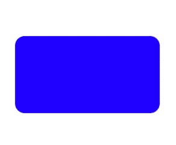
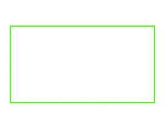
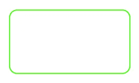
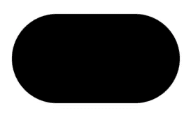
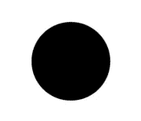
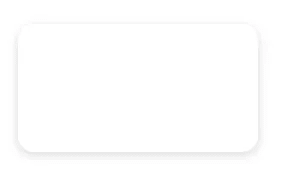
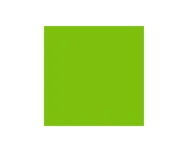
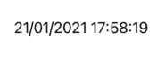
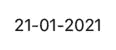

# 每个 iOS 开发者都应该使用的 7 个 Swift 扩展

> 原文：<https://betterprogramming.pub/7-swift-extensions-every-ios-developer-should-use-834a1254074c>

## 如果你喜欢扩展，这是给你的。如果没有，我会改变你的想法


照片由 [Unsplash](https://unsplash.com?utm_source=medium&utm_medium=referral) 上的 [PolaroMagnet](https://unsplash.com/@polaromagnet?utm_source=medium&utm_medium=referral) 拍摄

# 为什么我们需要扩展？

您需要扩展，因为它们可以节省您一次又一次重复创建相同内容的时间。你不觉得有时候一遍又一遍地打字很累吗？

在我看来，使用扩展几乎相当于同时努力工作和聪明工作。稍微理解一下，你就会喜欢使用扩展。

扩展就像项目中的一个模块组件，可以从一个项目移动到另一个项目。所以，如果这能让你的生活更轻松，为什么不使用它们呢？

我已经开发了多个应用程序，我将与你分享一些在我的大部分项目中使用的扩展。我希望它对你的帮助和对我的帮助一样多。

# 设置 XIB 视图

如果您总是在创建 XIB，这将特别有用。将以下代码插入到您的扩展中，只需编写一行代码，您就完成了 XIB 的实例化。

# 例子

您将创建一个新的 XIB 视图和一个 Swift 类。姑且称之为`HeaderView`。

给你。您刚刚避免了键入大约 50 行代码。我肯定是夸大其词了。但实际上，每次你需要实例化你的视图时。你现在可以使用`xibSetup()`

# 刀尖圆弧半径

你现在看到的大部分设计，要么是圆角，要么是阴影，要么是边框线，甚至是圆角。

这些设计无处不在，但你必须承认它美化了你的应用程序，用户喜欢这些设计。代码如下:

```
extension UIView {
    func addCornerRadius(_ radius: CGFloat = 4) {
        layer.cornerRadius = radius
        layer.masksToBounds = true
    }
}
```

# 例子

拐角半径的默认值始终是 4，但是如果您需要 4 以外的值，您可以插入任何数字。在下面的例子中，您将使用 16。



# 边界线

这段代码将添加一条宽度可调的边框线。您可以选择想要的边框颜色类型。

```
extension UIView {
	func addBorderLine(width: CGFloat = 1, color: UIColor) {
        layer.borderWidth = width
        layer.borderColor = color.cgColor
    }
}
```

# 例子

和往常一样，宽度的默认值是 1.0，但是你可以随意使用这个数字。这里我将宽度设置为 2.0。

```
parentView.addBorderLine(width: 2.0, color: .green)
```



你甚至可以先用`addCornerRadius`，然后再用`addBorderLine`。这是`combination`效应的结果。如此美丽。

```
parentView.addCornerRadius(16)
parentView.addBorderLine(width: 2.0, color: .green)
```



# 轮次

为了使视图完全呈圆形，宽度和高度需要相互匹配。

如果没有，你可能会看到一些胶囊形状或怪异的形状。代码如下:

```
extension UIView {
    func makeRounded() {
        layer.masksToBounds = false
        layer.cornerRadius = self.frame.height / 2
        clipsToBounds = true
    }
}
```

# 例子

这一行代码将使一个圆形。

```
parentView.makeRounded()
```



这就是我的意思，当你看到一个胶囊形状。在这里，宽度和高度是不等价的。

另一个例子，你可以看到一个完美的圆形，因为宽度和高度都分别是 100。



# 阴影

这可能是应用程序中最常用的设计，但一定要谨慎使用，因为这会影响应用程序的性能。

# 例子

你可能明白为什么它最常被使用，因为它肯定会改变应用的外观。这让这个应用程序更有吸引力。设计师喜欢这样，但他们不知道我们要经历什么才能让这个作品成功。

请记住:您必须调整`shadowOffset`、`shadowOpacity`、`shadowRadius`和`shadowColor`以符合设计师的标准。

```
parentView.addShadow()
```



# 颜色

有时，你在 Xcode 上找不到你需要的颜色类型，因为你的设计师有一个他们随机选择的十六进制代码列表。下面的代码将对此有所帮助。

# 例子

您可以添加十六进制代码来获得您需要的颜色。

```
parentView.backgroundColor = UIColor.init(hexFromString: "#7dbf0d")
```

如果颜色列表继续增长，将很难保持。您可以看到，我静态地创建了一个变量，我只需要用下面的代码来访问颜色。

```
parentView.backgroundColor = UIColor.peaGreen
```



# 日期

如果你的应用程序处理日期，你可能需要处理许多不同格式的日期。但是，您怎么知道哪种日期格式符合您的标准呢？

我使用这个网站[https://nsdateformatter.com](https://nsdateformatter.com/)来帮助我理解我需要的格式。

通过下面的代码，您将得到一个`String`类型，而不是`Date`类型，您可以像在标签上一样广泛使用它。

```
extension Date {
    func getCurrentDate(_ format: String = "dd/MM/yyyy HH:mm:ss") -> String {
        let dateFormatter = DateFormatter()
        dateFormatter.dateFormat = format
        dateFormatter.timeZone = .current
        return dateFormatter.string(from: Date())
    }
}
```

# 例子

您可以使用下面的代码创建`Label`并实例化`Date`来利用扩展:

```
dateLabel.text = Date().getCurrentDate()
```

该结果采用以下格式:`dd/MM/yyyy HH:mm:ss`



如果您需要其他东西，您可以更改格式。接下来，您将看到`dd-MM-yyyy`的一个例子。一定要记住，这封信是按照它的标准写的，否则你会得到别的东西。



在此之前，我希望这将提高您构建应用程序的效率。至少对我来说是这样。

谢谢你的阅读。