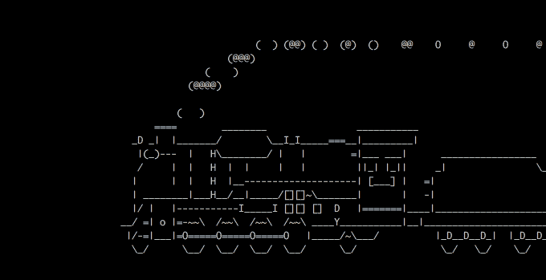
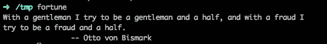
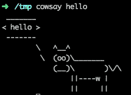
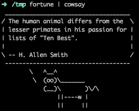
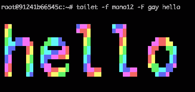

# 让你会心一笑的 7 个终端命令

> 原文：<https://betterprogramming.pub/7-terminal-commands-that-will-just-make-you-smile-3f5bc8778080>

## 这些教程不一定总是实用的


照片由[蜜桃红·坎波斯·菲利佩](https://unsplash.com/@matfelipe?utm_source=medium&utm_medium=referral)在 [Unsplash](https://unsplash.com?utm_source=medium&utm_medium=referral) 上拍摄。

Shell 命令是提高开发人员工作效率的强大工具。还有一些非常有趣的命令工具，会让你在工作一整天后会心一笑。

你可以在终端中玩文字游戏，创建一个漂亮的 ASCII 图片，等等。让我们看一看。

# 1.海平面

这不是打印错误。命令确实是`sl`。

```
$ sudo apt-get install sl  # Linux
$ brew install sl          # MacOs
```

如果你跑过去，你会看到一列火车从右向左驶来。结果看起来像这样:



# 2.命运

```
$ sudo apt-get install fortune  # Linux
$ brew install fortune          # MacOs
```

`fortune`会在终端显示语录，搞笑预测，笑话，甚至诗歌。



你可以在《财富》杂志的网页上找到更多细节。

# 3.考赛

```
$ sudo apt-get install cowsay  # Linux
$ brew install cowsay          # MacOs
$ cowsay hello
```

`cowsay`会显示一条牛，上面有你输入的单词作为参数。



通过一个管道把它和`fortune`结合起来就更搞笑了:



# 4.厕所

`toilet`可以用来制作一个美丽的 ASCII 图片与您的输入。各种颜色都有。



# 5.oneko

`oneko`是我在这个列表中最喜欢的命令。该计划将显示猫追逐你的鼠标光标，如在这个视频中看到的。我找不到 macOS 的版本。

```
$ sudo apt-get install oneko  # Linux
```

Linux / Unix 桌面趣味应用 Oneko:猫捉老鼠的追逐

# 6.xeyes

这是一个带有 x11 应用程序包的应用程序。也不仅仅是为了好玩。如果你有一个大屏幕和一个小光标，它也是一个有用的工具。

```
$ sudo apt-get install x11-apps  # Linux
$ xeyes
```


# 7.矩阵

`cmatrix`在终端显示飞行文字，就像你在*矩阵*中看到的一样！源代码[可在 GitHub](https://github.com/abishekvashok/cmatrix) 上获得。


开心快乐编码！