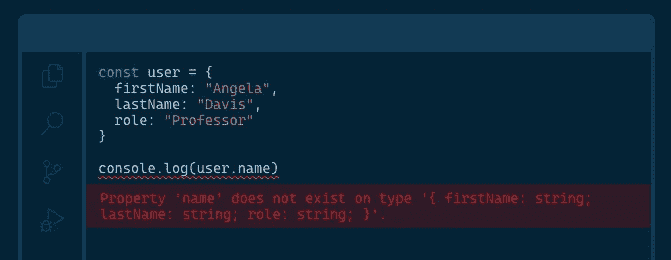

# 每个 React 项目应该从 7 件事开始

> 原文：<https://betterprogramming.pub/7-things-every-react-project-should-start-with-21f7570a7a4b>

## 从一开始就让您的项目变得简单

由 [Ashutosh Dave](https://unsplash.com/@ashu?utm_source=medium&utm_medium=referral) 在 [Unsplash](https://unsplash.com?utm_source=medium&utm_medium=referral) 拍摄的照片。

有了合适的工具，我们可以更快更好地编写代码。本文讨论了在从事 React 项目时应该考虑使用的一些工具，以使您作为开发人员的生活更加轻松。

# 1.以打字打的文件

来源:[https://www.typescriptlang.org/](https://www.typescriptlang.org/)

基本上，TypeScript 是带有静态类型的 JavaScript。换句话说，TypeScript 是带有您和编译器都能理解的文档的 JavaScript。

为什么这很重要？

*   您将拥有编译时错误检查。不再需要在应用程序投入生产后才发现错误。
*   可以像经典的`'undefined' is not a function`一样避免隐藏的错误。
*   在不严重破坏代码的情况下，重构代码更容易。
*   让自己适应复杂的大规模系统不再是一场噩梦。

 [## 任意比例的输入 JavaScript。

### TypeScript 通过向语言中添加类型来扩展 JavaScript。TypeScript 通过以下方式加速您的开发体验…

www.typescriptlang.org](https://www.typescriptlang.org/) 

# 2.埃斯林特

根据 [Perforce](https://www.perforce.com/blog/qac/what-lint-code-and-why-linting-important) 的说法，“一个 linter 根据它所知道的规则来分析你的代码的风格和编程错误。”

为什么这很重要？

*   编写代码时，您将遵循标准，使代码对您和他人来说更具可读性和可理解性。
*   通过自动化和执行这些规则，您将在代码审查中节省大量时间。
*   一些像 ESLint 这样的 linters 可以自动修复这些错误，所以你不需要这么做。

 [## 可插入的 JavaScript

### ESLint 静态分析你的代码，快速发现问题。ESLint 内置于大多数文本编辑器中，您可以运行…

eslint.org](https://eslint.org/) 

最流行的一套规则来自 Airbnb:

 [## airbnb/javascript

### JavaScript 风格指南。通过在 GitHub 上创建帐户，为 airbnb/javascript 开发做出贡献。

github.com](https://github.com/airbnb/javascript) 

# 3.较美丽

另一个工具是格式化程序，它可以帮助您获得可读性更好的代码，从而使代码更易于维护。像 linter 一样，它通过基于规则识别格式问题来工作。一些例子包括对字符串、行的长度等使用单引号或双引号。

为什么这很重要？

*   整个项目中的标准化代码。
*   您也将节省代码审查的时间。
*   通过自动套用格式编写代码可以节省时间。

 [## 更漂亮的固执己见的代码格式化程序

### 固执己见的代码格式化程序

固执己见的代码格式](https://prettier.io/) 

# 4.故事书

Storybook 是一个独立开发 UI 组件的工具。这意味着 Storybook 允许您以隔离的方式查看组件并与之交互，类似于单元测试如何确定组件代码的测试范围。

为什么这很重要？

*   您可以在编写容器之前构建并手动测试您的组件。
*   您不需要担心您的组件将生活在哪里。你只需要遵守它的行为规则。
*   您可以为您的组件测试许多不同的场景，从而更容易识别问题。

 [## 故事书:面向前端开发人员的 UI 组件浏览器

### Storybook 是一个开源工具，用于独立开发 React、Vue、Angular 等 UI 组件。它使…

storybook.js.org](https://storybook.js.org/) 

# 5.样式组件

与组件的主题保持一致，CSS-in-JS 是您希望在项目中探索的东西。它允许你解决一些用纯 CSS 不容易解决的复杂情况。

为什么这很重要？

*   当代码中出现复杂的 CSS 情况时，您将节省时间。
*   您将很容易地支持动态样式。
*   通过消除使用`classNames`，你的代码将更具可读性，这可能是压倒性的。

 [## 样式组件

### 组件时代的视觉原语。使用 ES6 和 CSS 的精华来设计你的应用，没有压力💅🏾

styled-components.com](https://styled-components.com/) 

很难在文章中提出这一点。我认为这是列表中唯一可以省略的，因为你并不总是需要 CSS-in-JS。然而，我也认为了解它的存在是值得的，这样你就可以决定它是否给你的项目增加了价值。

# 6.反应测试库

如果你想拥有一个可维护的代码，测试是不可避免的。有很多测试代码的库，但是我认为 RTL 是一个很好的起点，因为它专门研究 React。

为什么这很重要？

*   您将能够重构代码，而不必太担心破坏东西。
*   你会更自信地发展。
*   您可以自动化测试场景，否则您将不得不手动完成。

 [## 测试库简单完整的测试工具，鼓励良好的测试实践

### 测试库系列是一个非常轻量级的测试解决方案，不需要所有的实现…

testing-library.com](https://testing-library.com/) 

# 7.强壮的

通过拥有 TypeScript、linter 和 formatter，您将在开发代码时有更好的体验。但是这些工具并不是完全自动化的。有时，您需要在控制台中运行命令来运行它们。我们有时会忘记这样做，最终将一些糟糕的代码推到我们的存储库中，这就是这个工具的亮点。

Husky 是一个工具，它允许我们在提交或推送代码之前运行一些脚本。

为什么这很重要？

*   您不会将糟糕的代码推送到您的存储库中。
*   您将避免拥有一个不必要的包含琐碎更改的 Git 历史树。

 [## typicode/husky

### Git 挂钩使哈士奇容易提高您的提交和更多🐶汪汪！您正在查看 husky v5 的文档，它是…

github.com](https://github.com/typicode/husky) 

# 结论

我已经把所有这些工具放在一起，组成了一个 GitHub 库。随意看看玩玩吧。

 [## drac 94/react-ts-s b-sc-样板文件

### 这个项目是用 Create React App 引导的。在项目目录中，您可以运行:在…中运行应用程序

github.com](https://github.com/drac94/react-ts-sb-sc-boilerplate)