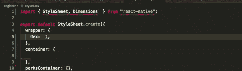
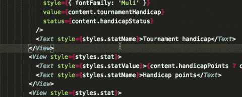
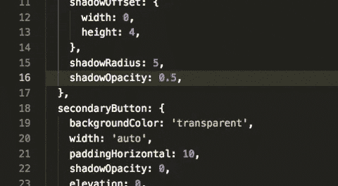
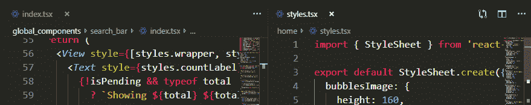
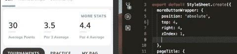
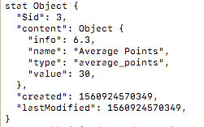

# React Native 中最大化编码效率的 7 个技巧

> 原文：<https://betterprogramming.pub/7-tips-for-maximum-coding-efficiency-in-react-native-ec36adc97937>

## React Native 写起来很快，但是我们能让它更快吗？


克里斯托夫·高尔在 [Unsplash](https://unsplash.com/search/photos/coding?utm_source=unsplash&utm_medium=referral&utm_content=creditCopyText) 上拍摄的照片

(这篇文章的更新版本可以在 RNTricks 上找到:[https://www . rn tricks . com/article/7-tips-for-maximizing-efficiency-when-writing-react-native-apps](https://www.rntricks.com/article/7-tips-for-maximizing-efficiency-when-writing-react-native-apps))

[React Native](http://www.reactnative.com/) 很棒。它允许我们创建漂亮的、本地的、跨平台的应用程序。采用率一直在不断提高，尤其是在初创企业领域。

如今，研究和文章的主要焦点似乎都集中在它的性能、可伸缩性或它与其他选项之间的比较上。

我是一个速度迷，我想看看我们如何将这项惊人的技术从“如果”和“如何”发展到“有多快”。

所以，在 React Native 中编码两年多之后，我决定编译并分享七个****帮助过我，也将帮助你在 React Native 中最大化编码速度的小技巧。****

# ******1。买一台苹果电脑******

****如果你真的习惯了 Windows，并认为使用你习惯的操作系统会更好(正如我最初所想的)，那么我只能说，我认为这是没有商量余地的——MAC OS 无疑是应对本地开发的最佳选择。****

****这有两个主要原因。****

1.  ****这个可能是显而易见的——它允许你为 iOS 构建。所有教程都认为你使用 Mac 是理所当然的，这不是巧合——如果你想进行跨平台开发，你迟早会需要 Mac。****
2.  ****一般性能和稳定性。React Native 最初是一个 iOS“东西”，它显示。模拟器、构建过程、实时/热重新加载特性、远程 JS 调试——它们在 macOS 上都工作得很好。在 Windows 上， [npm](https://www.npmjs.com/) ，React Native 本身，甚至 Windows 命令行都是各种 bug。****

****在 Mac 上开发 React Native 的过程至少要快两倍，所以如果你想有个好的开始，确保你是(或将会是)macOS 用户。****

# ****2.**获得更好的 Mac 电脑******

****React Native 是一个在资源允许的情况下可以发展到最高并且真正从中受益的科技。该工作流可以处理多达三个或四个不同的 iOS/Android 模拟器同时打开。****

****越多越好——能够实时查看你的应用程序在所有目标平台上是否好看，这不仅很棒，也为以后节省了大量时间。不再有“修复一个平台，同时在另一个平台引入错误”。****

****此外，由于 IDE 中的每一个`CMD+ S`都是包的重新构建，最小化构建时间意味着最小化编写一段代码和看到其效果之间的等待时间。那些一天几十上百次真的加起来。****

****另外，没有什么比立即看到代码结果更令人满意的了。****

****我发现从旧的 Mac mini 过渡到完全成熟的 2018 MacBook 产生了巨大的变化，让我的工作速度加快了约 50%。****

****结论:尽可能给自己买最好的苹果电脑。****

# ****3.让 IDE 为您工作****

****每个 IDE 都带有某种格式化特性，你可能认为这就足够了。但是今天的 IDE 已经变得越来越智能，而且远远不止于此。****

****缩进代码、删除变量、排序导入、转换引号，以及使您的代码更整洁、更一致的所有其他事情——这些都可以由您的 IDE 来完成，并且应该由您的 IDE 来完成！****

****到了你甚至不记得上次按下`tab`键是什么时候的时候。****

********

****Echobind 有一篇很棒的文章关于[如何让你的 beauty+Eslint+Airbnb 规则融入 VS 代码](https://blog.echobind.com/integrating-prettier-eslint-airbnb-style-guide-in-vscode-47f07b5d7d6a)。****

****[](https://blog.echobind.com/integrating-prettier-eslint-airbnb-style-guide-in-vscode-47f07b5d7d6a) [## 在 VSCode 中集成 beauty+ESLint+Airbnb 风格指南

### 花在阅读(代码)和写作上的时间比远远超过 10 比 1 …(因此)让它易于阅读会让…

blog.echobind.com](https://blog.echobind.com/integrating-prettier-eslint-airbnb-style-guide-in-vscode-47f07b5d7d6a) 

它对你的开发时间和满意度有很大的影响，就我而言，没有它我就活不下去——我使用`format`键和`save`键一样多。**** 

# ******4。摘录一切******

****将干燥原则发挥到极致。你觉得自己手动写`<View></View>`或`<Text></Text>`太频繁了吗？把它们变成片段！****

****不要止步于此——也许您还想对刚刚创建的视图应用一种样式，那么为什么不就这样做呢？****

********

****我喜欢把它看作是对我写的代码“应用压缩算法”。识别重复的内容，并用“标识符”(片段)替换它们。找到你的习惯，并根据它们和你的项目指南来创造。****

****在 React Native 开发期间，我已经创建了超过 25 个代码片段。你可以在这里 得到他们[(我用的是](https://pastebin.com/9zJRdHLs) [VS 代码](https://code.visualstudio.com/))。请随意使用它们作为灵感的来源，或者照原样使用。****

********

****请确保不要让 IDE 成为您的绊脚石。学习如何简单有效地创建它们，这样你就不会觉得自己在浪费节省下来的时间。****

****另外，写三个字符，生成 30 个字符，总会让你觉得自己很专业。****

# ****5.两倍的窗户，两倍的速度？****

****不完全是…但还是很有帮助。****

****每当你发现自己一遍又一遍地处理相同的两个文件时，养成将窗口一分为二的习惯。****

********

****起初，这可能看起来有点令人困惑或不知所措，但是，特别是如果你有房地产，这是编码效率的面包和黄油。****

****与你的热键友好相处有助于把它变成一种习惯。找到并绑定最适合您的 IDE 命令。****

****对我来说，做我需要的事情(在 VS 代码中)的是`workbench.action.focusSecondEditorGroup`。它消除了打开一个新标签页，移动文件，然后聚焦标签页的麻烦，只需要一个组合键(在我的例子中是`CMD + 2`)。****

****例如，在创建 UI 时，将标记和样式都显示在屏幕上是一种更舒适的体验，也能节省时间。****

# ******6。使用热重装。明智地。******

****React Native 的*热重载*特性是预览代码变更时“最热门”的实现之一。****

****然而，这是假设你答对了。目前，React Native 的 repo 上有[超过 130 个与热重装相关的问题，原因很简单——热重装相当脆弱。](https://github.com/facebook/react-native/issues?utf8=%E2%9C%93&q=is%3Aissue+is%3Aopen+hot+reloading)****

****它崩溃的原因通常很难发现，但是我注意到大多数时候它并不是固有的“坏”代码，而是对它没有吸引力的代码。****

****例如，经过几个小时的调试，我意识到将我的代码从:****

```
****componentDidMount** = async() => {}**
```

****到****

```
**async **componentDidMount**() {}**
```

****热重装又工作了。****

****当然，它并不总是箭头函数；它因代码库而异。但让它持续工作的诀窍是关注导致它崩溃的代码，然后将其重构为通常更简单的版本。****

****务必花必要的时间保持热重装处于工作状态。它对创建更快的 UI 很有帮助，而且，正如我们接下来将看到的，它也是调试 UI 和业务逻辑的强大工具。****

# ******7。使用热重装。潇洒地。******

****当从 Web 过渡到 React Native 时，人们抱怨的一个主要问题是它的布局系统——主要是缺少一个合适/有用的“检查”UI，该 UI 允许您直观地检查元素的大小、形状和边框。****

****热重载，除了有助于更快、更有效的开发流程之外，也是一个非常有用的元素检查工具。****

****让我们来看看。****

********

****将热重装的强大功能与快速代码片段相结合，您可以在不到一秒钟的时间内获得您所需要的内容。无需离开您的 IDE。****

****制作一个创建红色边框的`bred`片段，在任何元素中使用它，点击`CMD+ S`并看到你的元素在屏幕上弹出。然后，您可以根据自己的喜好调整或增强元素的样式。这可能看起来简单而有限，但实际上 90%的情况下这正是你所需要的。****

****这种方法也意味着你不必打开检查弹出窗口和菜单，也不必中断你的编码工作流程。用这个简单的技巧进行调试。****

****使用热重载时，一个更有用的技巧是能够检查当前帧中任何变量的值。考虑这个例子:****

********

****几周前，我制作了这个“球员统计”屏幕，它…应该显示一个球员的统计数据。但从那以后好像有什么东西坏了，我需要找出是什么。****

****我的代码如下所示:****

****在我的截图中，stat 值总是“-”。这表明`stat`变量的结构不太正确，所以我们需要检查它。****

****在 React Native 中检查数据的一种方法是启动远程调试器，取消 Chrome 窗口的标签(否则 RN 会抱怨背景标签)，打开开发工具，打开当前文件，在`render`函数的`return`之前设置一个断点，重新加载应用程序，在应用程序中导航到这个确切的屏幕和场景，祈祷没有源地图错误，然后检查您收到的数据。****

****如果我们记录我们的`stats`变量，导航到这个屏幕，然后检查记录的数据，我们可以更容易地做到这一点。****

****但是热重装使我们能够更进一步:****

```
**<View>
  {stats.map(stat => 
    <Stat **dog={console.log(stat)}** {...stat} />
  )}
</View>**
```

****由于`render`函数的性质，每次它被调用时，每个元素的每个属性都会被求值，然后作为道具发送下去。****

****然而，在我们的例子中，我们不关心“作为道具被发送”的部分，我们只关心“被评估”的部分。****

****将`console.log(stat)`赋给一个完全任意且不存在的属性(在本例中是“dog”——一个我发现很方便的随机字符串)，然后保存以触发热重载，这将评估我们的整个`render`函数和我们的`dog`属性。****

********

****这是我们的数据。不重装，不检查，不连接远程调试器；这个方法瞬间给我们数据。****

****当然，我们现在可以看到，我们实际上需要展开`stat.content` 而不是`stat`，因为我们的数据被嵌套在`content`下。****

****当你想立刻摆脱困境的时候，使用这个快速简单的热重装技巧！****

# ****结论****

****我希望您的 React 本机编码使用这些技巧会变得更快更有效。请在评论中告诉我你的想法。****

****编码快乐！****