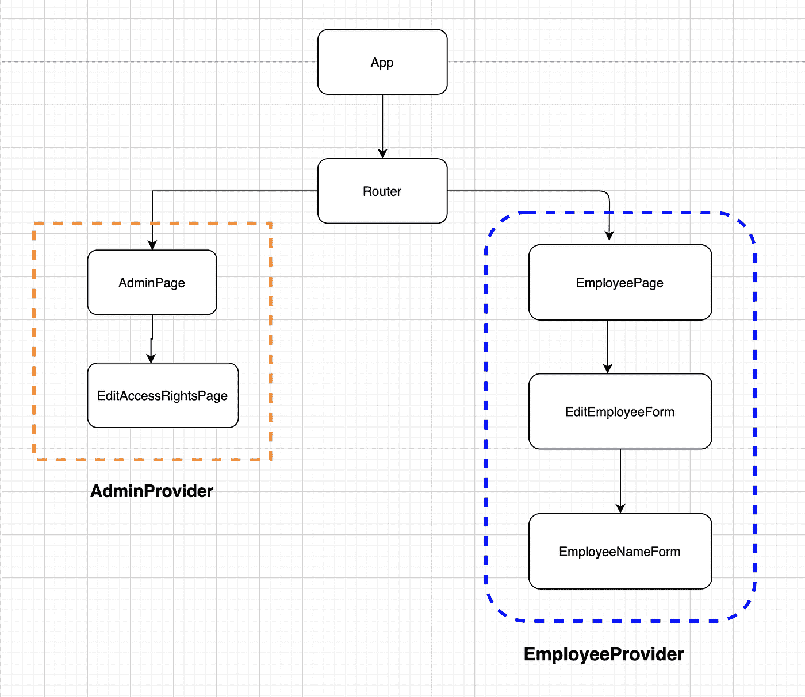

# 在 React 中有效使用上下文进行状态管理的 7 个技巧

> 原文：<https://betterprogramming.pub/7-tips-to-effectively-use-context-for-state-management-in-react-125f5ad904e6>

## 模式、文件提示、团队管理等等

由[摩根·豪斯尔](https://unsplash.com/@morganhousel?utm_source=medium&utm_medium=referral)在 [Unsplash](https://unsplash.com?utm_source=medium&utm_medium=referral) 拍摄的照片。

在本文中，我们将探索一些技巧，帮助您在 React 应用程序中有效地使用[上下文](https://reactjs.org/docs/context.html)。

# 动机

我的目标是提供一些关于在企业环境中有效使用 React 的上下文 API 而不需要依赖外部库的技巧。

状态管理是 React 世界中最有争议和固执己见的话题之一，所以在支持成千上万个库中的一个之前，我建议探索 React 必须提供的工具。如果这还不够，去找外部的。但是，如果您遵循固定的模式，大多数情况下，React 本身就是您所需要的。

# 初步资源

本文假设对 React 生态系统中的上下文有一个基本的理解。如果你不熟悉，我邀请你浏览一下 [React 的文档](https://reactjs.org/docs/context.html#gatsby-focus-wrapper)，然后再回来。

如果你至少读过状态缩减器模式和`[useReducer](https://reactjs.org/docs/hooks-reference.html#usereducer)`的话，那就太好了。

说完了，我们开始吧。

# 1.考虑是否需要在应用程序中引入上下文

在 React 应用程序中引入上下文可能会增加复杂性，并使应用程序更频繁地呈现，所以首先，考虑更简单的解决方案。

## 如果您的目标是在多个组件之间共享状态，请考虑提升和共存状态

[状态托管](https://kentcdodds.com/blog/state-colocation-will-make-your-react-app-faster)是保持应用程序可维护性的伟大策略。

即使不考虑上下文，React 本身就是一个状态管理工具，所以如果您正确地将状态放在一起，那么 [*组件状态*](https://reactjs.org/docs/glossary.html#state) 可能就是您所需要的全部。

为了正确地将状态放在一起，请尝试遵循“将您的*组件状态*尽可能放在相关的地方”的原则您可能知道，将您的状态移动到上层组件以在多个子组件之间共享是很自然的。尽量不要走得太远，把它放在离使用状态的地方最近的公共组件中。更重要的是，每次你的应用程序改变时，只要你有机会，就把状态移到组件树的下面。

## 如果您的目标是修复支柱钻孔，请考虑组件组成

[道具钻取](https://kentcdodds.com/blog/prop-drilling)，是将数据从父级传递到子级的过程，超过一个级别，使中间的组件传递它们根本不使用的道具:

这是一个不必要的复杂的组件树，但是请原谅我，我们有三个组件:`EmployeePage`(父组件，它是一个保存状态的*智能*组件)*、*、`EmployeeNameForm`(呈现一个表单来编辑一个雇员的姓名)、`EditEmployeeForm`(它是位于中间的组件，包装了`EmployeeNameForm`和具有类似目的的其他潜在组件，它本身没有状态，但是我们假设它是出于呈现目的而需要的)。

请注意`EditEmployeeForm`是如何通过 props 从其父节点接收状态并传递给其子节点的，但是它无论如何都不会使用这个状态。这还不算太坏，但是如果我们有更多层次的组件，可能会变得难以维护。

这是在应用程序中引入*上下文*最常见的论点之一(或者像 [Redux](https://redux.js.org/introduction/core-concepts) 这样的外部工具)，但是在此之前，我邀请您尝试应用[组件组合](https://www.pluralsight.com/guides/react-component-composition)，这里，相同的组件树，有一个小的重构:

请注意顶层父组件`EmployeePage`是如何将道具直接传递给它的*孙代* `EmployeeNameForm`，而不是显式地传递给中间的组件`EditEmployeeForm`。

# 2.遵循一致的模式

如果您确实需要在您的应用程序中实现 *Context* ，那么支持约定胜于配置，与您的团队就要遵循的模式达成一致，可以帮助您避免默认使用第三方工具。

我喜欢这篇精彩的[文章](https://kentcdodds.com/blog/how-to-use-react-context-effectively)中提出的模式，但是有一点小小的改变，那就是避免`useReducer`，除非你的状态变得足够复杂。

## 这种模式简而言之:

*   在同一个文件中，我们将创建始终相同的 3 个元素:一个*上下文* `(EmployeeContext)`、一个*提供者* `(EmployeeProvider)`和一个钩子`(useEmployeeContext)`。
*   ***上下文*** `(EmployeeContext)`永远不会被导出，而只是使用带有默认值的`React.createContext`来创建，这个默认值将代表我们的初始状态。
*   ***提供者*** `(EmployeeProvider)`将包装并返回我们的*上下文。提供者*将是我们声明我们想要公开的状态以及修改它的函数的地方，在我们的例子中，它将是`const [name, setName] = useState<string>('');`，它将被用作 [*高阶组件、*](https://reactjs.org/docs/higher-order-components.html) ，因此使用`name`和`setName`的组件必须被包装在这个*提供者中。*
*   **钩子**T10 将是组件在*上下文*中访问状态的(唯一)方式。这个钩子只能从先前定义的*提供者*中包装的组件调用。

如果您的状态增加了它的复杂性，您可能想要考虑使用[*useReducer*](https://reactjs.org/docs/hooks-reference.html#usereducer)*，*的状态缩减器模式，将它应用到我们的示例中，它看起来像这样:

## 什么变了？

本质上，模式保持不变，不同的是我们用简单的`useState`代替了用来保存名称的`useReducer`，这将允许我们用一种优雅的方式更新一个更复杂的状态。组件将能够通过由`useEmployeeContext`钩子导出的`dispatch`属性通过*分派*动作来修改状态。

# 3.和你的团队讨论一下

变化是，你不是一个人在工作，尤其是如果你在一个企业环境中，所以你的团队需要与你决定遵循的任何模式保持一致。

讨论它，和你的团队开一个会议，会上提出了建议的模式(如果有多个模式的话)，一旦你决定了要遵循哪个模式，确保每个人都理解它。

Mob 编程会议是在你的团队中分享知识的一个极好的方式，在你的队友的日程表中预定一些时间，并且有一个会议，在这个会议中你将使用你已经决定实现的模式来编码。

交换控制键盘的人，在进行 mob 编程会议时，通常最雄辩的团队成员会控制会议，交换控制键盘的人会让你的队友参与讨论。

# 4.保持状态接近需要的地方。

这个原则也适用于存储在*上下文*中的状态，而不仅仅是简单的组件状态(如技巧#1 所述)

每次你的*上下文*由于状态更新而改变时，*提供者*下的所有组件都将重新呈现，因此，你可能希望让你的*提供者*尽可能靠近消耗其状态的组件。

请不要默认将您的*提供者*放在您的应用程序的根目录下。

# 5.保持状态逻辑分离

并非应用程序中的所有状态都需要在同一个*提供者*中，您可以创建多组*上下文*和*提供者，*保存应用程序状态的不同部分。

例如，让我们想象一下前面步骤中描述的应用程序，一个小的 web 应用程序，它有一个创建雇员的页面，另外还有一个包含一些“管理”设置的页面。两者可能都需要在*上下文中存储一些状态，但是您可能希望将这两个状态分开，因为一个与另一个无关*

作者图片

在这个例子中，我建议引入两个独立的*提供者，* `EmployeeProvider`和`AdminProvider`。

在一些情况下，如何构建应用程序的路由是划分*上下文*和*提供者*的逻辑方式的初步建议。

更重要的是，尽量避免在`App`组件级别拥有唯一的*提供者*的诱惑。

# 6.保持用户界面状态和服务器状态分离

请允许我介绍一下 *UI 状态*和*服务器状态*之间的区别，对此，Kent C. Dodds 有一个奇妙的定义:

> *"默认情况下，通过 useQuery 或 useInfiniteQuery 的查询实例将缓存的数据视为陈旧数据。*
> 
> *要改变这种行为，您可以使用 staleTime 选项配置您的全局查询和每个查询。指定一个更长的失效时间意味着查询将不会频繁地重新获取数据*
> 
> *在下列情况下，过时的查询会在后台自动重新获取:*
> 
> *查询挂载的新实例*
> 
> *窗口被重新聚焦*
> 
> *网络重新连接。*
> 
> *查询可以选择配置一个重新获取间隔。”*

不要将*服务器状态*与 UI 状态混淆。随着应用程序的增长，您的 *UI 状态*也会增长。

*服务器状态*和*用户界面状态*具有不同的挑战。首先，*服务器状态*通常与通过 *HTTP* 访问的 API 相关，因此它具有异步特性。*另一方面，UI 状态*通常同步工作。在许多情况下，混合它们会不必要地增加应用程序的复杂性，所以我鼓励你将这两者分开。

我已经成功地将 [React Query](https://react-query.tanstack.com/) 用于服务器状态管理，甚至还写了一篇[帖子](https://medium.com/inside-personio/moving-to-react-query-462f8e5811b6)和[另一篇](/7-tips-for-using-react-query-in-large-projects-22ccc49d61c2)，其中有一些关于如何有效使用它的提示。

我知道我在这篇文章中一直建议避免使用第三方工具，但是在这种情况下，React Quey 提供了如此多的功能并消除了如此多的复杂性，所以我愿意破例一次。

# 7.在考虑避免重新渲染之前，先考虑避免慢速渲染。

这里没有秘密，引入*上下文*进行状态管理很有可能会让你的应用*更频繁地重新呈现*。

事实是，只有当渲染本身很慢时，重新渲染才是一个问题，所以让您的应用程序快速渲染将消除重新渲染的顾虑。

这里有一些提示:

*   试着找出你的应用程序的瓶颈，例如，在组件中完成的昂贵的计算:那些将在组件每次运行时被执行，所以试着使用像`[useMemo](https://reactjs.org/docs/hooks-reference.html#usememo)` *，*这样的工具来记忆这些计算，然后测量是否有实际的改进。
*   使用 React 的`key` prop，这个 prop 不仅用于删除浏览器控制台中恼人的警告消息，还通过保留组件实例和减少 DOM 更新来帮助优化应用程序的渲染过程
*   如前所述，尽量保持更小的状态，这将有助于每次重新渲染更少的组件。
*   将组件作为道具传递，在特定的情况下，你可以考虑将昂贵的组件提升到一个他们不经常渲染的父组件，然后将它们作为道具传递下去，这篇[帖子](https://kentcdodds.com/blog/optimize-react-re-renders)详细解释了如何做。

# 结论

*上下文*可以是一个非常强大的状态管理工具，但它需要一点纪律来一致地使用，与您的团队定义一个共同的工作框架，以便以一种干净和可扩展的方式利用它；我希望这里给出的建议能帮助你实现这个目标。