# 有效使用 Linux 手册页的 7 个技巧

> 原文：<https://betterprogramming.pub/7-tips-to-effectively-use-the-man-page-in-linux-3a365c3eb8c5>

## 快速查找选项描述，浏览手册页，等等


由[凯利·西克玛](https://unsplash.com/@kellysikkema?utm_source=medium&utm_medium=referral)在 [Unsplash](https://unsplash.com?utm_source=medium&utm_medium=referral) 上拍摄的照片

# 介绍

页面是 Unix 或类 Unix 操作系统的软件文档。它显示在线手册页。在这里，*在线*的意思是在电脑上，而不是在互联网上。[有些命令](https://unix.stackexchange.com/questions/160130/how-do-i-tell-which-command-has-the-longest-manual-on-my-system)有上万页。仅仅为了找到你需要的信息而阅读一个`man`页面可能会让人不知所措。

在本文中，您将学习如何找到一个选项描述，使用一个脚本来找到一个选项描述，学习如何导航，如何获得帮助，以及了解更多关于`man`页面的信息。

```
**Table of Contents**[1\. How To Navigate the Man Page](#a3e5)
  ∘ [How to jump to an option](#658b)
[2\. How To Get Help](#e48a)
[3\. How To Dump a Man Option Description](#0fdc)
[4\. A Bash Script, manop, to Dump a Command Option Description](#7843)
[5\. Use Help for Built-In Commands](#8658)
[6\. The Number Stands for the Manual Section](#0f08)
  ∘ [Where is the man page located?](#4dc9)
[7\. When the Man Has More Than One Entry](#4d85)[**Conclusion**](#9414)
```

# 1.如何浏览手册页

您可以使用`less`命令浏览`man`页面。

**要向前移动一行**，使用`j`(或`e`、`^E`、`^N`或`Return`键)。如果用数字，比如`5j`(或者`5e`、`5^E`、`5^N`等。)你向前移动五行。(这里，`^E`是指`Ctrl`键加上字母`e`。使用`Ctrl`键时，大写字母和小写字母没有区别。)如果你是 Vim 用户，`5j`适合你。

**向后移动一行**，使用`k`(或`^Y`、`y`、`^K`或`^P`)。又来了。你可以用一个数字，比如`5k`(或者`5^Y`、`5y`、`5^K`、`5^P`、等等。)向后移动五行。

**移动到顶部，**使用`g`。
**移动到手动的末端**。使用`G`。

**向前移动一个窗口，**使用`f`(或`^F`、`^V`或空格)。
**向后移动一个窗口**，使用`b`(或`^B`或`ESC-v`)。

**要向前移动半个车窗**，使用`d`(或`^D`)。
**向后移动半个车窗**，使用`u`(或`^U`)。

**要向右或向左移动视图，**使用左右箭头键。

## 如何跳转到一个选项

在手册上，按下`/`调出输入提示，向前搜索匹配模式。

例如，在`ls`命令中找到选项`-h`:

```
$ man ls
/-h
```

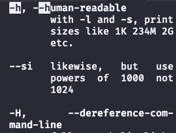

man ls 的输出，并使用/-h 进行搜索。图片由作者提供。

要继续搜索，按下`n`找到下一个匹配。

# 2.如何获得帮助

当您进入`man`页面时，点击`h`显示 LESS COMMANDS 帮助页面，点击`q`退出页面。

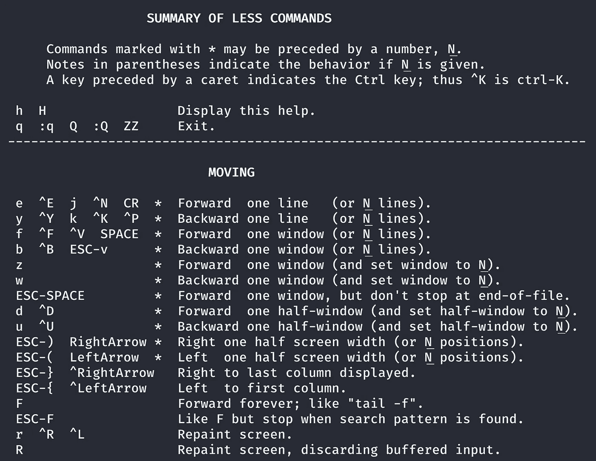

[少页](https://gist.github.com/shinokada/0c8f537d625898704b610f4e15f5137f)。在手册页中点击 h 以显示此页面。图片由作者提供。

多了解[少了解](https://gist.github.com/shinokada/0c8f537d625898704b610f4e15f5137f)。

# 3.如何转储 Man 选项描述

这里有一个 Bash 脚本来显示对`wget`选项`-b`的描述:

```
$ man wget | col -bx | sed -n "/^  *-b/,/^$/p"
       -b
       --background
           Go to background immediately after startup.  If no output
           file is specified via the -o, output is redirected to wget-log.
```

您需要更改命令和您正在寻找的选项。

这个很难记住。下一个技巧将向您展示一个脚本，该脚本创建一个命令来轻松找到选项描述。

# 4.一个 Bash 脚本 manop，用于转储命令选项描述

我创建了一个名为`[manop](https://gist.github.com/shinokada/6ca022157deb2bf7322fda4b0fb8249f)`的 Bash 脚本。该脚本从`man`页面或内置帮助页面找到选项描述。它还能够显示命令描述。

请参见以下文章中的更新版本。

[](https://medium.com/mkdir-awesome/how-to-use-manop-to-print-only-selected-content-from-the-man-page-11309b9efa38) [## 使用 Manop 只打印手册页中选定的内容可以节省时间

### Manop 是一个简单的 Bash 脚本，输出选项和描述

medium.com](https://medium.com/mkdir-awesome/how-to-use-manop-to-print-only-selected-content-from-the-man-page-11309b9efa38) 

在`~/bin`目录下创建一个名为`[manop](https://gist.github.com/shinokada/6ca022157deb2bf7322fda4b0fb8249f)`的可执行文件。

```
$ mkdir ~/bin 
$ cd ~/bin
$ touch manop
$ chmod u+x ~/bin/manop
```

在`PATH` 变量中添加`$HOME/bin`目录。(阅读[更多关于如何设置的细节](/the-ultimate-programmers-guide-to-bash-scripting-2d11d4e6e978#c48e)。)

```
# In your shell config ~/.zshrc or ~/.bashrc
export PATH="$HOME/bin:$PATH"
```

复制粘贴`[manop](https://gist.github.com/shinokada/6ca022157deb2bf7322fda4b0fb8249f)`:

查找帮助:

```
$ manop -h
```

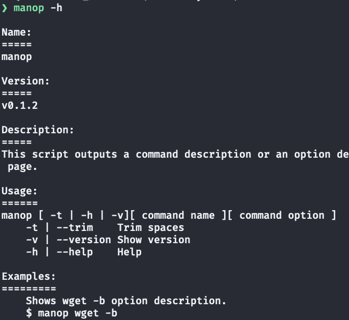

manop 帮助的一部分。图片由作者提供。

使用`manop command-name option`显示选项描述，使用`manop command-name`显示命令描述:

```
$ manop ls -h
       -h, --human-readable
              with -l and -s, print sizes like 1K 234M 2G etc.$  manop col
DESCRIPTION
     The col utility filters out reverse (and half reverse) line feeds so that the output is in the correct order with only forward and half forward line feeds, and replaces white-space characters with tabs where possible. This can be useful in processing the output of nroff(1) and tbl(1).$ manop read -d
      -d delim  continue until the first character of DELIM is read, rather than newline$ manop read
read: read [-ers] [-a array] [-d delim] [-i text] [-n nchars] [-N nchars] [-p prompt] [-t timeout] [-u fd] [name ...]
    Read a line from the standard input and split it into fields...
```

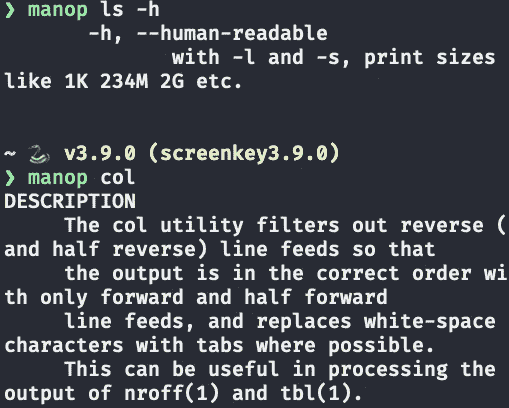

manop 命令的输出。图片由作者提供。

这里的`read`命令是内置命令之一。

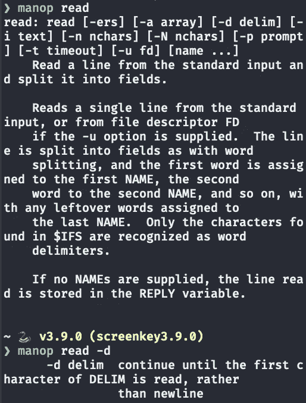

来自作者的 manop read 和 manop read -d. Image 的输出。

使用`-t`标志修剪空格:

```
$ manop -t ls -h
$ manop -t col
```

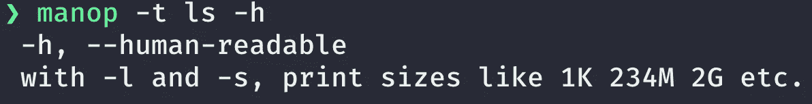

作者输出的 manop -t ls -h. Image。

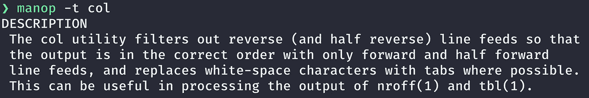

作者输出的 manop -t col. Image。

# 5.使用内置命令的帮助

内置命令不在`man`页面中。让我们找到所有内置命令:

```
$ help
```

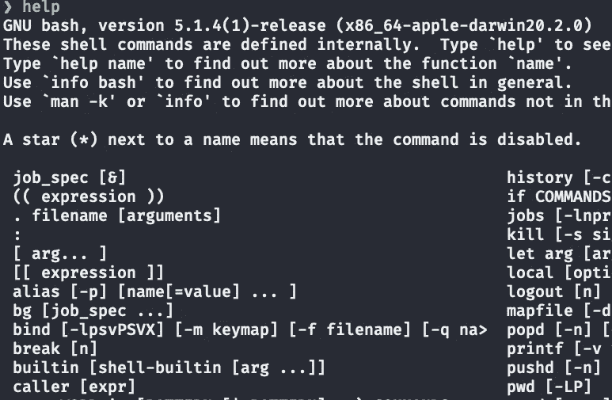

help 命令的输出。图片由作者提供。

使用`help`命令了解关于功能`command`的更多信息:

```
$ help read
```

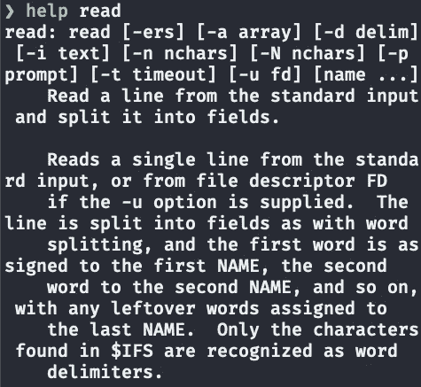

从帮助的输出中读取。图片由作者提供。

# 6.数字代表手动部分

当您点击`man man`时，您将获得`man`命令的手册。

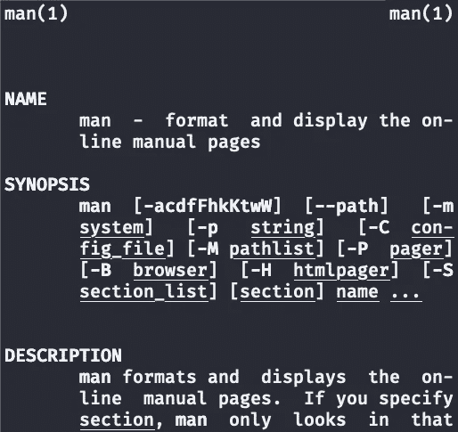

来自曼曼的输出。图片由作者提供。

在上图中，你会在右上角看到`man(1)`。

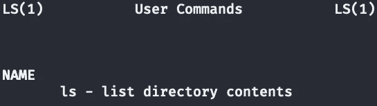

人类的产量。图片由作者提供。

在这里，您可以通过点击`man ls`来查看`LS(1)`:


人类的产量。图片由作者提供。

`cron`手册页的编号为 8，`CRON(8)`。

这些数字是*不是*版本号。它们代表手册部分。

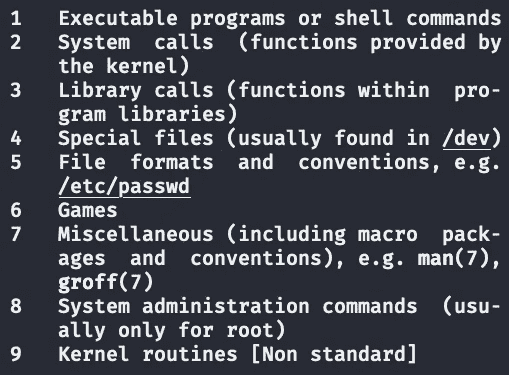

从人类的输出中。图片由作者提供。

`ls`命令位于可执行程序或外壳命令部分，而`cron`位于系统管理命令部分。

## 手册页在哪里？

使用`man -w`命令显示`man`页面的所有路径。

macOS 的输出:

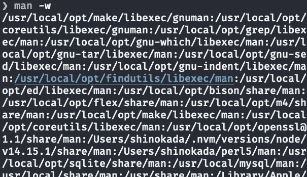

我的苹果电脑的输出。图片由作者提供。

由于我在 macOS 上使用 [GNU/Linux 命令，所以输出更多。](/how-to-make-macos-command-utilities-compatible-with-gnu-core-utilities-87889b266f4b)

Ubuntu 的输出:

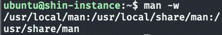

来自 [Ubuntu](https://codeburst.io/run-an-instant-ubuntu-vms-on-mac-windows-linux-ff8421e25db0) 的输出。图片由作者提供。

使用以下命令在 macOS 的`/usr/local/share/man`目录中找到`man`目录:

```
$ ls -al /usr/local/share/man | grep man
```

在 macOS bash shell 上:

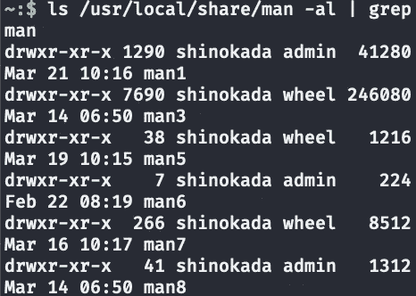

macOS bash shell 的输出。图片由作者提供。

在`/usr/share/man`目录下的 Ubuntu (Multipass)上:

```
$ ls -al /usr/share/man | grep man
```

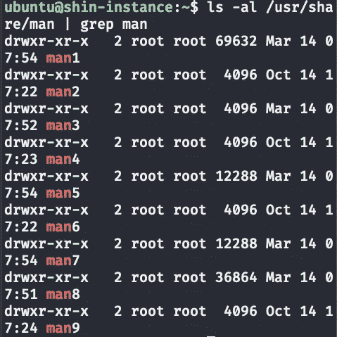

Ubuntu 的输出。图片由作者提供。

`man`后的数字再次为章节号。`man1`目录包含可执行程序或 shell 命令。

# 7.当该男子有不止一个条目时

在`man`页面的不同部分有一些命令。例如，`unlink`在下图中有两个条目。

```
$ whatis unlink
```

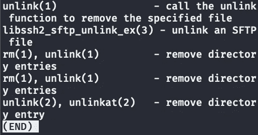

的输出是 unlink。图片由作者提供。

使用`man 1 unlink`查看第一节中的`unlink`:

```
$ man 1 unlink
```

对于第 2 部分:

```
$ man 2 unlink
```

# 结论

页面非常有用，但有时令人不知所措，难以浏览。我每天都使用`manop`命令来查找选项描述和命令描述。希望你也觉得有用。

现在您知道如何导航`man`页面，如何在遇到困难时获得帮助，以及如何找到有多个条目的`man`页面。

我希望这些提示能提高你使用`man`页面的效率。

**通过** [**成为**](https://blog.codewithshin.com/membership) **会员，可以完全访问媒体上的每一个故事。**


[https://blog.codewithshin.com/subscribe](https://blog.codewithshin.com/subscribe)