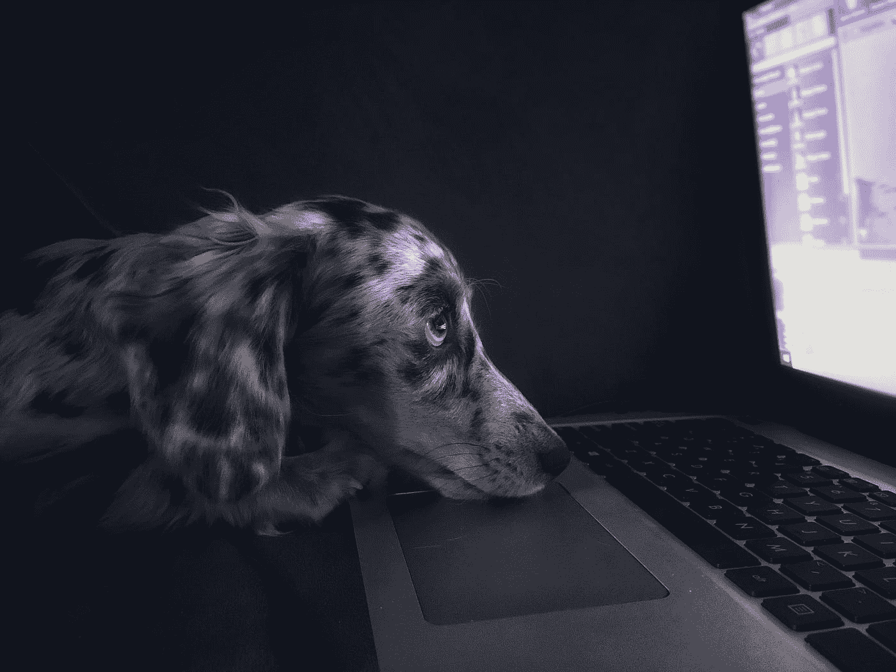
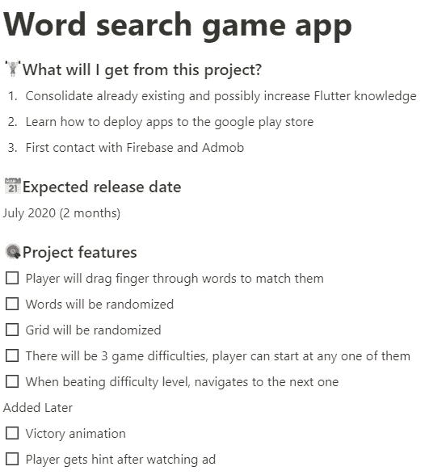
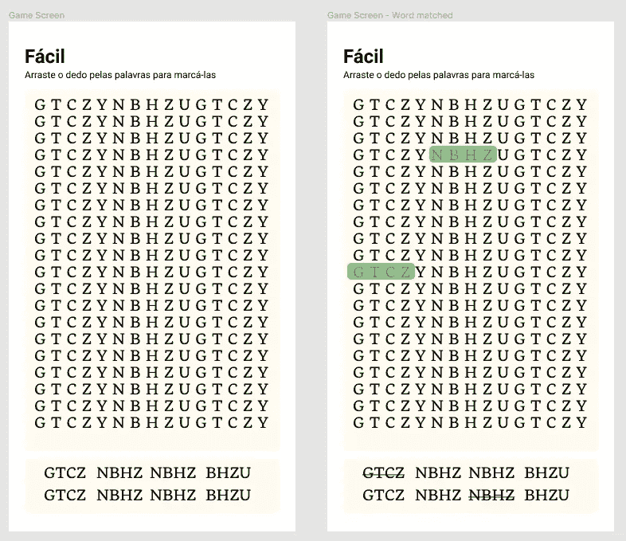
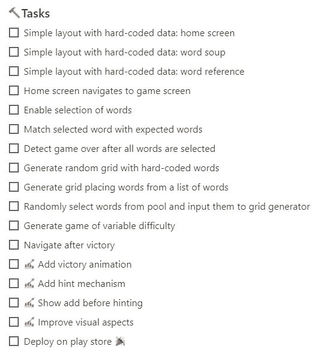
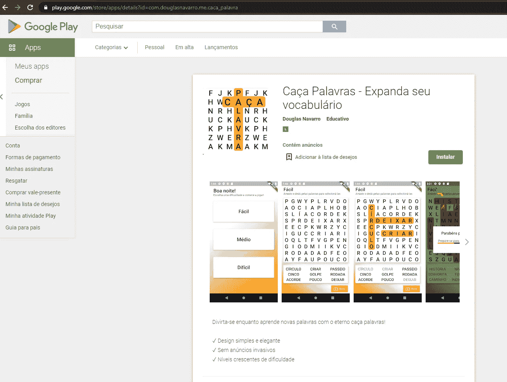

# 充分利用你的宠物项目的 7 个技巧

> 原文：<https://betterprogramming.pub/7-tips-to-make-the-most-out-of-your-pet-projects-db8ffd49c847>

## 剧透:工作到深夜不在其中

凯尔·汉森在 [Unsplash](https://unsplash.com?utm_source=medium&utm_medium=referral) 上拍摄的照片。

我已经开始了这么多的副业。很少或不太少，他们中的大多数都专注于一件事:让自己学习新的东西。

尽管自从七年多前开始编程以来，我已经接手了几个心爱的项目，但年复一年，我花在这些项目上的时间越来越少。如果我想继续下去，变得更有效率是不可避免的。

构建真实的东西对我来说绝对是最好的学习方法，在我的上一个兼职项目(一个使用 Flutter 的单词搜索游戏)中，我意识到了几个真正帮助我充分利用它的模式。希望他们也能帮助你。所以，我们去找他们吧！

*注意:我将使用我上一次努力的例子来使我的观点更加清晰。*

# 1.为自己设定目标和限制

在你开始编码之前，确定你的项目将会有什么样的特性。你想建一个简单的 HTML + CSS + JS 计算器？好吧，它能运行什么算术运算呢？把它写在某个地方。

提出某种期限也是一个好主意，因为这迫使你有一个长期目标，并在多次会议中评估你的进展。很容易陷入不重要的细节，或者在完成一两天前开始的功能后开始添加新的不必要的功能。总会有改进的空间，但是这个期限会帮助你知道什么时候该停下来。

它可以是一张便利贴，一个应用程序，或者是你机器中的一些文本文件。这里的要点是记录你的进度，所以不管是什么都可以。每当你在做你的项目时，回头看看这个笔记，这样你就能确切地知道你下一步要做什么。

设定一个截止日期和预期的特性对于保持事情的正确方向是非常重要的。

# 2.从素描开始

如果涉及任何前端工作，制作一个你希望你的项目看起来像什么的低成本表示也是有帮助的。对于具有前端的 web 应用程序或移动应用程序，这很有帮助。

你需要的只是一张纸上的草图，但是如果你想要一个更具体的，原型般的表现，你可以去找图玛或者 T2。你可以在网上搜索组件模板，这些模板可以很好地快速制作布局，而不需要从头开始绘制。从头开始画所有的东西也会让你的生活变得有点困难，当你实际编码的时候看起来是一样的。

一些应用程序屏幕的草图。不坚持默认 Cupertino 或材料成分是一个坏主意。

如果不涉及视觉效果，开始对数据建模是个好主意。如果它是一个 API，它会有什么接口或端点？输出是什么样的？是 JSON 编码的还是纯文本的？

# **3。制定一个计划，把**坚持到 I **t**

现在你知道了你想从你的宠物项目中得到什么，开始考虑你将如何实现。一旦你有了一个更小的目标或任务的列表，你就不会在未来的编码会议中浪费一秒钟去考虑你应该编码什么而只是如何编码。在我看来，编码和概念化是很难同时做到的。

即使是小的应用程序也可能涉及到许多活动的部分，所以开始用更具体的术语来考虑实现，并把它分成尽可能独立的部分。如果您正在编写 REST API，这是一个简单的方法:每个端点都可以是一个独立的小部分，尽管它们可能都需要一些共享的核心。

我的单词搜索游戏的任务——足够具体，让我在下一次编码会议中有一个目标。

随着你的进展，稍后添加项目是可以的。只是不要忘记关注你的截止日期，这样你就不会做太多不必要的工作。

记住，没有必要深入到最小的细节。如果您几乎是在计划笔记中编写代码，那么您可能已经走得太远了。

# 4.为您的会话使用时间框

时间盒是为一项活动分配时间的简单技术，并且不使用任何超过该时间的时间来完成它。

每天，这意味着我会从晚上 8 点到 10 点做我最喜欢的项目，不会超过这个时间。不管进度如何，我都需要在晚上 10 点停下来。这在两个方面帮助了我。首先，在每天朝九晚五的工作之后，每当我发现自己的时间不多了，我已经疲惫的士气就会得到提升。第二，这阻止了我以可怕的效率工作到深夜，因为我已经很累了。为了这个特定的单词搜索游戏，我做了很多，我真的很后悔。

# 5.公之于众。给人们看

以某种方式安排你的工作也是鞭策自己的一个很好的工具。如果你不这样做，你就会认为无论你做什么，无论你的工作质量如何，都不会有人看到。

请记住，即使这个项目可能非常简单，你仍然可以用它来展示你在求职面试或个人作品集中的能力。说你做了某事很好，但是说“是的，你可以在<your-pet-project>看到它。或者“你可以在 App Store 上下载。链接在这里”更让人印象深刻。</your-pet-project>

它不一定要完美，但要让它运行良好，整洁，易于使用。

[我的傻游戏 app 上架了！](https://play.google.com/store/apps/details?id=com.douglasnavarro.me.caca_palavra)不，它没有 100 万的下载量，但是它在那里，我可以给任何人看！

# 6.使用版本控制

或者其他储存你作品的方式。如果你只是把它留在你的机器上，你最终会失去它，这是你最不想做的事情。

能够回顾所有这些小项目是很重要的。你有时会畏缩，但你肯定会看到自己是如何进步的。有了提交时间戳，您将能够看到从开始项目到停止工作通常需要多长时间。

# 7.管理你的期望

一旦你开始向世界发布你的宠物项目，你可能会开始有一些混合的期望。这是因为有时你可能只是为了学习如何做而开始做一些事情，当你发布它时，你可能期望人们实际上使用它。

为真实的人解决真实的问题很少能满足你学习技术的需要。如果你真的想为人们解决问题，你将不得不做一些用户研究，设计思维等。弄清楚你是否真的在做某事。这并不像看起来那么简单，公司不会无缘无故地雇佣产品经理。

# 包扎

总而言之，为你的副业项目感到骄傲。开始之前先计划一下。享受建造它们的过程。保留它们，列出它们，当你完成它们时，向世界展示它们。当你完成它们时，管理你的期望。