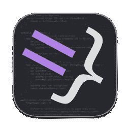
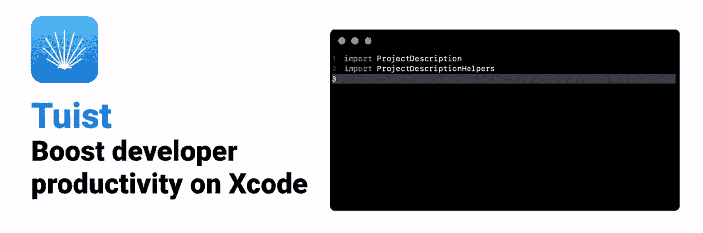

# 帮助您编写更好的 Swift 代码的 7 个工具

> 原文：<https://betterprogramming.pub/7-tools-to-help-you-write-better-swift-code-5e25bc77e88d>

## 工具作业

## 用这些小工具提高你的 iOS 代码质量


[菠萝供应公司](https://unsplash.com/@pineapple?utm_source=medium&utm_medium=referral)在 [Unsplash](https://unsplash.com?utm_source=medium&utm_medium=referral) 上拍摄的照片

当团队的规模扩大时，我们自然会建立一些共同的实践来保持工作时的理智。这些实践防止了 Git 冲突，创建了更加同质的代码库，并帮助人们对他们同事编写的代码感到舒适。

在某些情况下，这些实践可能很难正式和自动地实施。例如，是否使用`Protocol`或`ProtocolWitness`不能被正式强制——这更像是一种编码风格。还有很多其他情况下这是可能的。例如，当我们把一种类型`force cast`成另一种类型时，我们可以要求编译器警告我们。

在今天的文章中，我们将探索一些可以添加到我们的项目中来执行这些规则的工具，朝着更加一致的代码库前进。

# 雨燕

[SwiftLint](https://github.com/realm/SwiftLint) 是由 [Realm](https://github.com/realm) 构建的一个工具，它执行规则来创建一个连贯的编码风格。

可以用`brew`安装，也可以边开发边当`pod`用。在如何使用它方面，我们也有一些选择。我们可以:

1.  用`swiftlint`命令从命令行运行它。
2.  将其附加到 Git 中的 prehook commit 中。
3.  在 Xcode 中将它附加为预构建阶段，这样每次构建时它都会运行。

步骤 3 可以通过在构建阶段之前在 Xcode 中添加以下代码片段来实现。

```
if which swiftlint >/dev/null; then
  swiftlint
else
  echo "warning: SwiftLint not installed, download from https://github.com/realm/SwiftLint"
fi
```

我们甚至可以在自动更正模式下运行该工具。它可以通过简单地在命令行中调用`swiftlint autocorrect`(或者在上面的脚本中添加`auocorrect`标志)来修复一些最简单的情况。在这种情况下，该工具将实际修改您的文件，执行一些规则。

所有规则都可以通过创建和编辑一个由 SwiftLint 读取的`.swiftlint.yml`文件来定制。

# 快速格式



[SwiftFormat](https://github.com/nicklockwood/SwiftFormat) (不是苹果[的那个](https://github.com/apple/swift-format))类似 SwiftLint。然而，它的目的不是强制使用一些风格规则，而是格式化代码，这样我们写的所有东西都有正确的缩进，括号在正确的位置打开和关闭，等等。

和 SwiftLint 一样，我们可以用`brew`安装它，也可以作为`pod`添加到我们的项目中。我们可以像前面的工具一样使用它:

*   从命令行。
*   作为预构建阶段。
*   作为预提交钩子。

从命令行调用它的语法是

```
swiftformat .
```

命令中的`.`是一条路径。在这个例子中，它将格式化当前路径中所有扩展名为`swift`的文件。如果我们想在某个特定的路径上运行`swiftformat`，可以指定文件路径或子文件夹。

**注意** : SwiftFormat 会原地改变你的文件。如果你不想改变原始文件，但你想创建第二个文件，你可以使用`--output`标志。

如果您想使用 SwiftFormat 作为预构建步骤，要在 Xcode 中复制和粘贴的代码片段如下:

```
if which swiftformat >/dev/null; then
  swiftformat .
else
  echo "warning: SwiftFormat not installed, download from https://github.com/nicklockwood/SwiftFormat"
fi
```

所有的规则都可以通过创建和编辑一个由 SwiftFormat 读取的`.swiftformat`文件来定制，以了解哪些规则必须被应用。

# 承诺

不是一个真正的 Swift 工具，但对 Git 非常有帮助，[commit list](https://github.com/conventional-changelog/commitlint)对我们的提交执行[语义提交](https://gist.github.com/joshbuchea/6f47e86d2510bce28f8e7f42ae84c716)指导方针。

当遵循语义提交时，我们的提交消息必须遵循一些特定的规则:

*   第一部分必须是提交类型。它可能是一个新特性(使用`feat`)、一个`fix`，或者与某个配置相关(使用`chore`)。这只是几个例子，但是您可以按照您的标准对其进行配置。
*   然后可以在`()`之间指定一个`scope`。范围是与类型相关的任务的子类。在[弯曲勺子](http://bendingspoons.com)中，我们不怎么使用瞄准镜，但是也许你可以在你的组织中找到它们的用处。
*   然后，我们有一个冒号`:`
*   最后，提交消息
*   提交消息不能以句点结尾

语义提交为什么有用？因为它开启了一些有用的自动化和更好的工作流程:

1.  它让工程师做组织良好的提交。例如，不可能将一个`fix`提交与一个`refactor`提交混合在一起。
2.  这使得恢复中断的提交变得很容易。例如，我们可以恢复一个错误的修复，确保不删除与修复一起提交的重要特性。
3.  它让我们自动创建一个变更日志。
4.  它让我们自动处理[语义版本](https://semver.org/)。例如，如果我们要发布一个新版本的软件，其中所有的提交都是修复的，它可以作为一个`patch`发布。

**注意:**使用语义版本化，一个新的软件版本至少由格式为`x.y.z`的三个数字来标识。第一个数字代表版本的`major`部分；`y`代表`minor`，最后，`z`代表`patch`。版本的种类取决于代码相对于先前版本的变化。
如果 API 发生了突破性的变化，那么它一定是一个`major`。
如果在不破坏公共接口的情况下增加了新功能，应该是一个`minor`。
不然应该是个`pathc`。

要安装 CommitLint，我们可以在 shell 中键入以下命令。

```
npm install --save-dev @commitlint/{config-conventional,cli}
echo "module.exports = {extends: ['@commitlint/config-conventional']}" > commitlint.config.js
```

那么，使用它的最好方法是在预提交钩子中。要安装它，我们可以运行以下命令。

```
# Install Husky v5
npm install husky --save-dev
# Active hooks
npx husky install
# Add hook
npx husky add .husky/commit-msg "npx --no-install commitlint --edit $1"
```

有了这个配置，每当我们试图向 Git 提交一些东西时，prehook 就会运行并确保消息符合语义提交准则。

有几种方法可以配置 CommitLint 的规则。例如，我们可以修改一个`.commitlintrc.yml`或一个`.commitlintrc.json`文件。

# 资源


在每个开发人员的生活中，至少会发生一次我们不得不编写大量重复代码的情况。在 Swift 中，几年前尤其如此，当时这种语言还不能为`Codable`合成实现。

在这种情况下，我们可以利用资源。这是一个让我们定义一些`stencil`文件的工具，这些文件可以用作模板来自动生成一些代码。

像前面的工具一样，安装 Sourcery 有不同的方法。

1.  我们可以把它安装成一个吊舱。
2.  我们可以从`brew`开始安装

它的用法比以前的工具稍微高级一点。我强烈建议花些时间阅读自述文件中[如何开始](https://github.com/krzysztofzablocki/Sourcery#how-to-get-started)部分的教程和文章。

# 巴尔蒂克洛赫


当处理本地化时，我们必须在项目的特定路径中创建一个名为`InfoPlist.strings`的文件。它的父文件夹定义了这些字符串的语言。

例如，`path/to/Localization/en.lproj/InfoPlist.strings`包含英语的成对`<key>=<translation>;`字符串。`path/to/Localization/it.lproj/InfoPlist.strings`包含相同的配对，相同的键，但有意大利语翻译。

魔术是由苹果提供的`NSLocalizedString` API、[实现的。这个 API 要求我们传递一个`key`作为参数。在运行时，操作系统将这些调用替换为与键相对应的值，这些值是用正确的语言从文件中选取的。语言取决于设备设置。](https://developer.apple.com/documentation/foundation/nslocalizedstring)

如果您曾经使用过，您可能会遵循以下流程:

1.  在需要的地方使用`NSLocalizedString`，添加一个键。
2.  打开所有的`InfoPlist.string`并添加带有翻译的密钥
3.  回到 Swift 文件，继续编码。

此外，很难记住我们是否已经创建了`"Ok"`键，或者`purchase_button`是否应该根据使用它的屏幕有不同的副本。

BartyCrouch 前来救援。它稍微改变了流动:

1.  我们在`InfoPlist.string`文件中定义我们的`<key>=<translation>;`字符串。
2.  我们运行`bartycrouch transform`来创建强类型属性和我们可以用来代替键的函数。
3.  在我们的代码中，我们使用`L10n`名称空间来访问所有生成的字符串。

我们的代码可以像这样传递…

```
self.title = NSLocalizedString("onboarding.first-page.header-title", comment: "")
```

…变成这样:

```
self.title = L10n.Onboarding.FirstPage.headerTitle
```

不仅打字更短，而且我们可以利用 Xcode 的自动完成功能，并且我们不能输入错误。

BartyCrouch 可以安装`brew`。

# SwiftGen


与 BartyCrouch 类似， [SwiftGen](https://github.com/SwiftGen/SwiftGen) 适用于图像和其他资源。它甚至还适用于本地化字符串，这意味着如果您使用该工具，您可以避免使用 BartyCrouch(不过，请记住，BartyCrouch 还有其他功能。因此，请花些时间分析这两种工具，并选择最适合您的工具。)

该工具的思想与 BartyCrouch 的类似:避免输入错误，利用我们最喜欢的语言的强类型特性。有多少次我们因为图片的名字没有大写而打错了`UIImage(named: "AppIcon")`？

使用 SwiftGen，我们可以在代码中自动生成一些扩展。然后，我们可以通过键入`Asset.icons.appIcon.image`来访问`appIcon`，并忘记实际的文件名。此外，Xcode 建议如何拼写路径的所有部分！

SwiftGen 可作为`pod`或通过`brew`安装。像许多其他工具一样，我们需要在代码中使用它之前运行它。要运行它，只需在终端中键入`swiftgen`。我们甚至可以将其添加为预构建步骤，以确保在构建项目之前所有的资源和变量都可用。

SwiftGen 在许多不同的元素上工作。它与`assets`、`colors`、`fonts`、`strings`、`plist`以及许多其他东西一起工作。查看它的[自述文件](https://github.com/SwiftGen/SwiftGen#asset-catalog)以获得更详细的描述。

# 图伊斯特



如果你看过我之前的[目标动作](/stop-committing-the-xcodeproj-fa83527ba156#target-action)来配置模式，作为预构建步骤。

它是将所有东西粘合在一起并在您的团队中实施所有这些最佳实践的非常好的候选。

# 结论

在今天的文章中，我们简要探讨了几个工具，它们可以帮助每个 Swift 团队在使用本地化字符串和资源时实施良好的代码格式并避免输入错误。

我们甚至探索了如何安装它们，以便它们可以自动运行，你可以忘记它们。

请注意，我们只是触及了所有这些工具的皮毛:它们比我在本文中试图总结的要多得多，所以如果您打算使用其中的任何一个，请花时间阅读它们的文档。