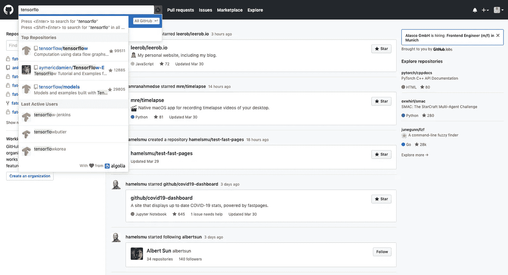
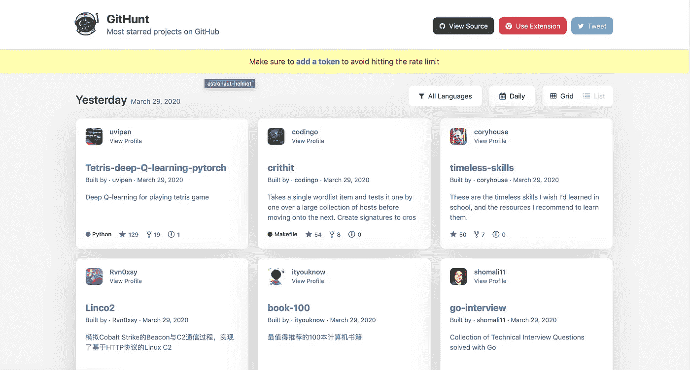
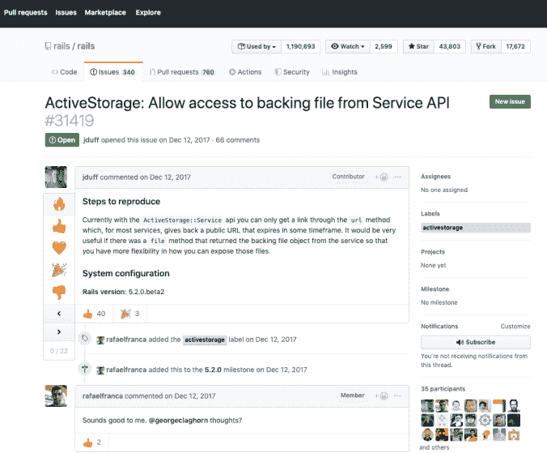
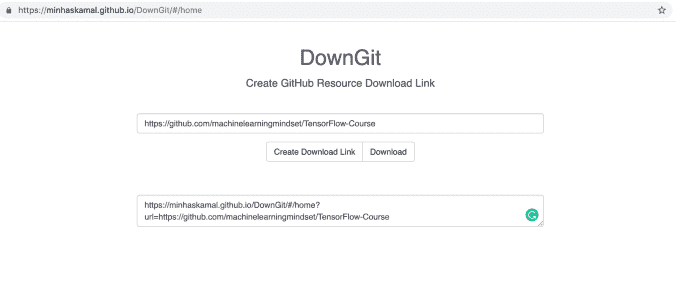
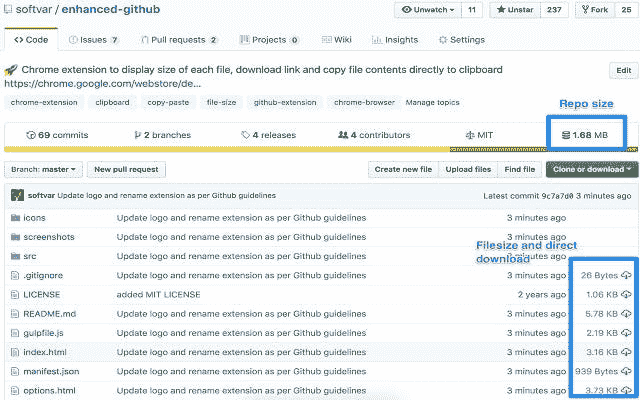
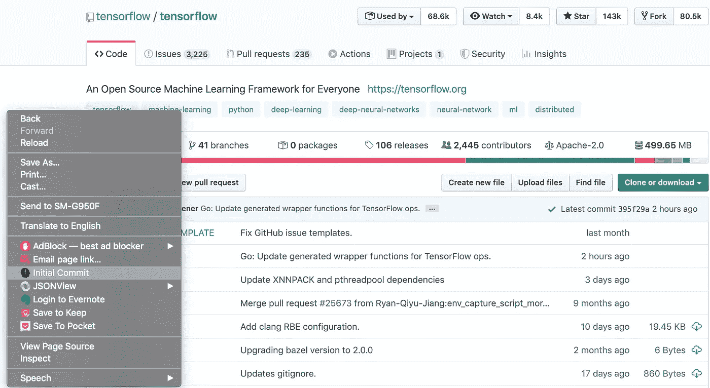
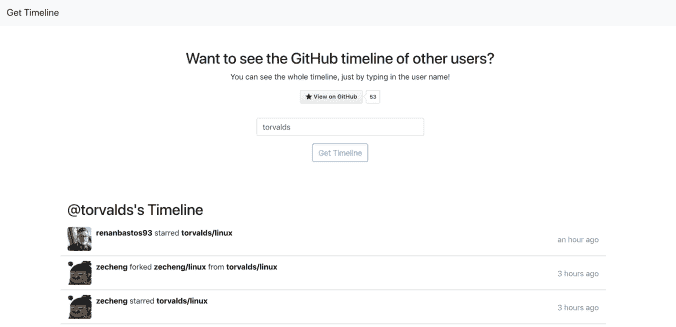

# 让 GitHub 更加有用的 7 个工具

> 原文：<https://betterprogramming.pub/7-tools-to-make-github-even-more-useful-a7afee15f99c>

## GitHub、GitHunt 和其他强大的自动完成功能

由[路](https://unsplash.com?utm_source=medium&utm_medium=referral)上[车头](https://unsplash.com/@headwayio?utm_source=medium&utm_medium=referral)拍摄

GitHub 是最流行的版本控制库之一。在里面，你可以找到无数用多种编程语言编写的公共项目。

您可以使用它来共享您的工作，与您的团队成员和其他人协作。您还可以使用它从无数软件项目中最常用的开源库中学习，并有机会为它们做出贡献。虽然我们一周可能会使用几次，但有很多方式我们可以从中受益更多。

这里有一个列表可以帮助你。

# GitHub 强大的自动完成功能

任何搜索表单中最有用的东西之一是自动完成功能，它可以帮助您提供许多建议。它可以帮助你节省写作时间，但也可以为你可能没有想到的搜索查询提供线索。

您可能已经猜到了，这个扩展将自动完成功能添加到了 GitHub 的搜索表单中。

您可以使用它来搜索存储库和个人或组织的 GitHub 帐户。

这不仅可以帮助您进入最初想要的存储库，还可以帮助您进入其他非常有用的项目。

这是一个有用的库，你可以在工作中使用。这只是一个小脚本，可以帮助你自动化一些你每天做的单调乏味的任务。你也可以把它作为一个插件，帮助你快速搜索周末兼职时遇到的类似问题的答案。或者你可以把它作为一个丰富的列表，里面有许多书籍、课程和其他资源，可以帮助你学习新的东西。

在撰写本文时，它已经被超过 10，000 名用户使用，获得了 59 个五星评价。

点击[此处](https://chrome.google.com/webstore/detail/awesome-autocomplete-for/djkfdjpoelphhdclfjhnffmnlnoknfnd)查看。也是[开源](https://github.com/algolia/github-awesome-autocomplete)。

# 吉特亨特

在许多其他事情中，GitHub 显示趋势项目。这样更容易知道哪些项目得到了最多的关注。您可以找到最近获得了许多来自开发伙伴的明星的项目。

寻找新趋势项目的过程变得更加容易——现在有一个名为 [GitHunt](https://github.com/kamranahmedse/githunt) 的 Chrome 扩展，致力于增加您对开源项目的了解。

GitHunt 可以作为 Chrome 扩展安装在你的浏览器中，让你能够在新标签页中看到 GitHub 上的热门项目。

您可以查看每日、每周或每月的趋势项目。

您可以选择仅用一种语言或所有语言显示趋势项目。但是目前没有选择多于一种语言而不包括所有语言的选项。

除了项目标题和星级数，您还可以查看简短的项目描述(如果已经添加)和打开的问题数。

您也可以通过简单地点击显示在新标签中的项目来访问该项目。

因此，许多开发人员在 GitHub 上发布他们的一些最佳作品。这使得其他开发人员可以从中学习，为其做出贡献，并发布他们自己的创新。

即便如此，有时也很难偶然发现最好的项目。你可能没有直接查看 GitHub 的习惯，只是为了查看趋势项目。但是如果你在 Chrome 的新标签页中有它们，你会增加发现对你有帮助的新的有趣项目的机会。

像脸书、谷歌和微软这样的大公司从开源项目中受益匪浅。让这更能说服你在浏览器中使用这个扩展。

您可能会在新标签页中找到一个简单的项目，它已经为困扰您的问题提供了解决方案。

也许你计划在谷歌上搜索一个看似合理的解决方案，但是这个解决方案可能就在这里。

这些项目可以激发你新的知识、想法和模式，帮助你构建下一个流行的开源项目。

GitHunt 也是一个开源项目，你可以在 GitHub 上找到它。如果你有任何关于如何改进它的想法，[作者](https://github.com/kamranahmedse)已经呼吁你的贡献。

你可以通过访问它的 [GitHub 页面](https://github.com/kamranahmedse/githunt)来阅读更多并查看这个扩展的源代码。你可以通过 Chrome 网上商店下载并安装它。

# GitHub 显著评论

关于 GitHub 的一个很棒的事情是你有一个问题部分，在这里你可以看到与特定项目相关的建议或帮助请求。

在那里你可以找到许多评论，开发者可能会抱怨一个 bug，提供一个解决方案，或者简单地指出一些他们想看到包含在项目中的东西。

如果你想快速浏览这些评论，并直接进入那些有相当大反应的评论，那么你可以尝试安装这个 Chrome 扩展。

在每个项目中，可以有很多评论，所以如果你想去看已经收到反应的评论， [GitHub 显著评论](https://chrome.google.com/webstore/detail/github-notable-comments/jcppcdjgdbnibjdeeihllbefhpibmajf)可能会有用。

它很简单，很轻便，在 Chrome 网上商店几秒钟就能安装完毕。

一旦你安装了它，你就可以去一个项目的问题，并在那里看到它。

让我们来看看[这一期](https://github.com/rails/rails/issues/31419)上的 Rails 项目。

它包含 66 条评论，但是你只对阅读最有帮助的评论感兴趣。

你可以简单地使用这个漂亮的侧边栏，并立即导航到收到最多此类反应的评论。

是的，就这么简单。

它是开源的，由另一个真正有用的与 GitHub 相关的 Chrome 扩展的开发者开发，这个扩展叫做 [GitHunt](https://medium.com/better-programming/githunt-trending-github-projects-in-your-chrome-new-tab-screen-d57168922918) 。你可以在 [GitHub](https://github.com/kamranahmedse/github-notable-comments) 找到它。

# 唐吉

有时你可能需要给某人发送一个项目，而他们可能没有安装 Git。因此他们可能无法从命令行下载存储库。

他们可以下载它的方法之一是手动进入 GitHub 库并点击下载按钮。

这里有另一种方法可以为安装了和没有安装 Git 的人节省时间。

你所要做的就是去 [DownGit](https://minhaskamal.github.io/DownGit/#/home) 把链接粘贴到一个盒子里。

之后，你可以点击“创建下载链接”，在那下面，你有一个链接，你可以用来和别人分享。

# 增强型 GitHub

信用: [Chrome 网上商店](https://chrome.google.com/webstore/detail/enhanced-github/anlikcnbgdeidpacdbdljnabclhahhmd/related)

这是 Chrome 的另一个扩展，你可以用它来添加更多有用的功能。

如果您不满足于使用前面的工具转到另一个页面来获得存储库的下载链接，那么您可以使用这个工具。

它不仅显示下载链接，还显示您正在查看的存储库大小和每个文件大小的详细视图。此外，您还有机会复制剪贴板上的文件内容。尽管被复制的代码会失去它的价值，但它仍然非常有用。

它不仅增加了下载整个存储库的能力，还增加了在其中下载您选择的单个文件的选项。

你可以在 Chrome 网上商店找到它。你也可以在 GitHub 上查看它的[源代码。在撰写本文时，它已经获得了 757 颗星，成为本文中最受欢迎的工具之一。](https://github.com/softvar/enhanced-github)

# 先给我

如果你很想看看对你的某个首选 GitHub 库的第一次提交，那么你不需要花费几分钟就能导航到那个特定的提交。

你现在可以用一个新的 Chrome 插件看到它。

你可能很想看到你为一个你已经开始的(或者你的同事已经完成的)特定项目所做的第一次承诺，所以你可以在看到那次承诺中包含的内容时感到一点怀旧。

您可能也很想了解许多其他项目的情况。

这个 Chrome 插件真的很容易使用，可以节省你很多时间，不用导航和查找 GitHub 项目的第一次提交。

你所要做的就是安装它。然后，您可以转到您想要的项目的 GitHub 页面，并使用新项目 GitHub commit 转到它的第一次提交，它将被添加到您的右键菜单中。

当您试图简单地了解其他人是如何开始他们的 Git 项目时，这真的很方便。

这个 [Chrome 插件](https://chrome.google.com/webstore/detail/git-first/bkodimdeilmanedhmadkjickmfobpjde)也是一个[开源项目](https://github.com/kamranahmedse/git-first)。

# GitHub 时间轴

你是否曾经想知道 GitHub 的某个特定用户是如何看待自己的时间线的？

他追随谁，他主演了哪些项目？

你可以使用一个非常酷的网络应用程序找到这些问题的答案。

你所要做的就是访问 [Get Timeline](https://githubtimeline.xyz/) 并写下 GitHub 用户的用户名，然后只需几秒钟，你就会看到他们访问 GitHub 时实际看到的内容。

你不需要注册一个账号就有这个机会。当然，这仅包括公共项目，而不是用户可以访问的每个项目。你看不到它们属于哪个私有库，也看不到它们在那里提交了什么。

这可能是一个小工具，但它可能会证明是有用的淬火某人的好奇心。

我相信最好的学习方式之一是向最优秀的人学习，看到他们的提交、项目和他们关注的用户是一种很好的方式来抓住用户和吸引他们注意力的活动。

例如，如果你想看到 Linux 内核的主要开发者 Linus Torvalds 的 GitHub 时间轴，你只需要在那里写下他的用户名。

这是一个开源应用程序，你可以在这里看到它的[源代码。](https://github.com/barisesen/github-timeline)

# 结论

感谢阅读。希望这些工具能帮助你从 GitHub 中获益更多。