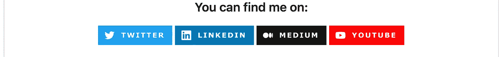
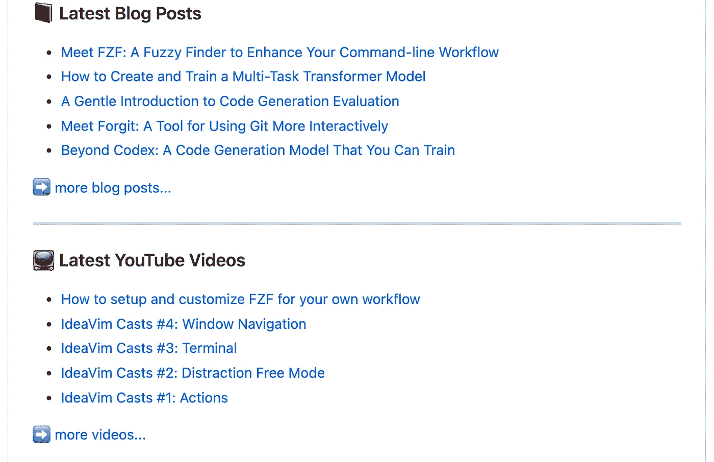
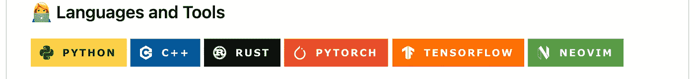
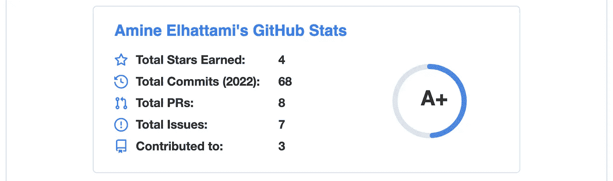
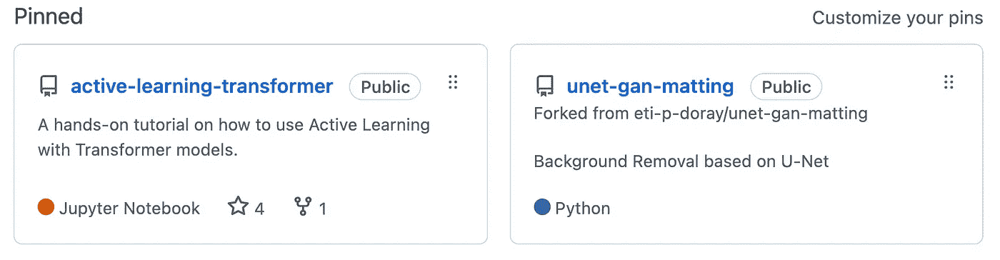

# 让你的 GitHub 档案脱颖而出的 7 项调整

> 原文：<https://betterprogramming.pub/7-tweaks-to-stand-out-with-your-github-profile-766350420ff2>

## 让您的 GitHub 档案大放异彩


照片由[李维·古兹曼](https://unsplash.com/@homeschool?utm_source=medium&utm_medium=referral)在 [Unsplash](https://unsplash.com?utm_source=medium&utm_medium=referral) 上拍摄

你可能已经知道，知名度在机遇的世界里是至关重要的。拥有丰富 LinkedIn 个人资料或受欢迎的 Twitter 账户的人往往会受到更多关注。例如，与没有摘要的个人资料相比，LinkedIn 上有摘要的个人资料从招聘人员那里获得的浏览量高达 3.9 倍。因此，从职业的角度来看，在多个平台上拥有你的个人资料是有价值的。其中一个平台是 Github。

这篇文章将告诉你如何更新你的 Github 个人资料来展示你的技能，让你的个人资料脱颖而出。此外，为你的 GitHub 帐户创建一个干净的登录页面也很有帮助，尤其是因为招聘人员和招聘经理会检查你的任何开源项目。然而，这并不仅限于目前正在找工作的人。有一个干净的个人资料对于联系有共同兴趣的有趣的人来说很实用。

# 基础知识

用户的 Github 个人资料是您使用用户 id 搜索用户时看到的页面。比如我的是[https://github.com/Am1n3e](https://github.com/Am1n3e)。默认概要文件包含一个存储库列表和一个贡献摘要。但是，Github 允许您通过创建具有以下特征的特殊存储库来覆盖它:

*   存储库的名称应该与您的用户名相匹配。例如，如果您的 Github 用户名是`abc`，那么存储库名称应该是`abc`。对我来说，是 https://github.com/Am1n3e/Am1n3e。
*   存储库必须是公共的。
*   存储库必须包含一个`README.md`文件。

一旦您设置了这个存储库，您放在`README.md`文件中的任何内容都将呈现在您的个人资料页面上。所以这个任务就简化成了写 markdown。

# 添加配置文件摘要


图片由作者提供。

类似于你所读到的将个人资料摘要添加到你的 LinkedIn 账户也适用于你的 Github 个人资料。然而，与 LinkedIn 相比，我更喜欢使用简短的摘要，LinkedIn 的摘要可以是几段。

# 让别人更容易联系到你



图片由作者提供。

创建 Github 档案的目标之一是增加你的知名度。一旦有人找到你，你希望他们通过正确的渠道联系到你，特别是因为可能还有其他人同名或者你使用了一个奇怪的用户名。

在我的个人资料中，我使用这些漂亮的徽章，你可以在下面的存储库中找到，它包含了几乎所有东西的许多徽章。

[](https://github.com/alexandresanlim/Badges4-README.md-Profile) [## GitHub-Alexandre sanlim/badges 4-readme . MD-Profile:👩‍💻👨‍💻使用…改进您的 README.md 档案

### 👩‍💻👨‍💻使用这些神奇的徽章改善您的 README.md 档案。- GitHub …

github.com](https://github.com/alexandresanlim/Badges4-README.md-Profile) 

找到您想要的徽章后，您可以使用徽章 URL 将其添加到您的`README.md`文件中，如下所示:

```
[](<on click url>)
```

例如，对于我的 Twitter 徽章，我添加了以下内容:

```
[]([https://twitter.com/amine_elhattami](https://twitter.com/amine_elhattami))
```

如果您找不到特定的徽章或需要自定义徽章，您可以使用 [shields.io](https://shields.io/) 从头开始创建。

# 显示您的内容



图片由作者提供。

你写博客或电子书，或创建 youtube 视频。列出一小部分你最好的作品，尤其是如果你有一些和你的某个知识库相匹配或者展示你的其他兴趣的话。

我同意每次发布新内容时更新自述文件可能会很麻烦。然而，多亏了 Github 动作，可以使用以下动作自动完成**:**

**[](https://github.com/gautamkrishnar/blog-post-workflow) [## GitHub-gautamkrishnar/blog-post-workflow:显示来自任何来源的最新博客帖子或…

### 在您的 GitHub 个人资料/项目上显示来自任何来源或 StackOverflow 活动或 Youtube 视频的最新博客帖子…

github.com](https://github.com/gautamkrishnar/blog-post-workflow) 

此外，设置这种自动化只需要几分钟:

*   在您的概要文件存储库中，在:`.github/workflows/blog-post-workflow.yml`创建一个新的 YAML 文件。你需要创建`.github`和`workflows`文件夹。
*   在新创建的 YAML 文件中，添加以下内容，并用来自[文档](https://github.com/gautamkrishnar/blog-post-workflow#popular-sources)的可用资源之一替换`<your feed list>`。

```
name: Latest blog post workflow
on:
  schedule:
    - cron: '0 * * * *'
  workflow_dispatch: 

jobs:
  update-readme-with-blog:
    name: Update this repo's README with latest blog posts
    runs-on: ubuntu-latest
    steps:
      - name: Checkout
        uses: actions/checkout@v2
      - name: Updated posts
        uses: gautamkrishnar/blog-post-workflow@master
        with:
          feed_list: <your feed list>
```

*   在`README.md`文件中，添加以下内容:

```
<!-- BLOG-POST-LIST:START -->
<!-- BLOG-POST-LIST:END -->
```

当 Github 动作运行时，它将在`BLOG-POST-LIST:START`和`BLOG-POST-LIST:END`之间添加一个链接列表，并提交更改。在下面的示例中，动作每小时运行(`0 * * * *`)或手动运行(`workflow_dispatch`)，最多发布 5 篇帖子(默认值)。查看[文档](https://github.com/gautamkrishnar/blog-post-workflow)，了解您可以更改的所有配置。

# 展示你最好的技能



图片由作者提供。

就像你的 LinkedIn 资料一样，你可以展示一套你精通的编程语言、工具或库。然而，不要落入陷阱，把你知道的每一种编程语言或者你用过的每一种工具。也许，让人们知道你知道如何在 Github 配置文件上使用 Git 可能是不相关的。

至于徽章，我遵循了上面 Twitter 例子中的相同步骤。

# 显示您的贡献统计



图片由作者提供。

我承认，最初，我添加上面的贡献统计小部件只是因为它看起来不错，我只需要在我的`README.md`文件中添加一行。然而，我可以看到，如果我要设定一个目标(例如，每周关闭的 PRs 数量)，在 Github 上对我的活动进行概述可能会有所帮助。此外，从求职的角度来看，如果你的简历中有空白，表明你一直在开源项目上工作是有价值的。

要添加小部件，请将以下内容添加到您的自述文件中。更多细节，请查看[文档](https://github.com/anuraghazra/github-readme-stats)。此外，小部件主题是可定制的。

```
](https://github-readme-stats.vercel.app/api?username=anuraghazra)](https://github.com/anuraghazra/github-readme-stats))
```

# 让你最好的开源项目脱颖而出



图片由作者提供。

默认情况下，GitHub 会按受欢迎程度列出您的开源项目。但是，您可能会遇到这样的情况:您最受欢迎的项目并不是您想要放在第一位的项目。要解决这个问题，您可以使用个人资料页面上的`Customize your pins`按钮将您想要显示的项目固定在顶部。

# 最后

这篇文章并没有涵盖所有你可以添加到你的 Github 个人资料中的信息。例如，如果你是一个 UI 开发人员，如果你正在寻找一个新的工作机会，你可能想要链接你的作品集或简历。

最后，小心过度。显示适量的信息(这不是你能找到多少酷图标的竞赛)。此外，顺序和内容应该反映你的目标受众。为招聘人员和招聘经理寻找工作机会的人的个人资料应该不同于为她的开源项目寻找贡献者的人。

# 参考

*   [作者的 Github 简介。](https://github.com/Am1n3e)
*   [GitHub—Alexandre sanlim/Badges 4-readme . MD-Profile:徽章列表。](https://github.com/alexandresanlim/Badges4-README.md-Profile)
*   [GitHub—anuraghazra/GitHub-readme-stats:GitHub stats 源代码。](https://github.com/anuraghazra/github-readme-stats)
*   [GitHub—gautamkrishnar/Blog-post-workflow:博文动作源代码。](https://github.com/gautamkrishnar/blog-post-workflow)

```
**Want to Connect With the Author?**Follow me on [Twitter](https://twitter.com/amine_elhattami), where I regularly tweet about software development and machine learning.
```