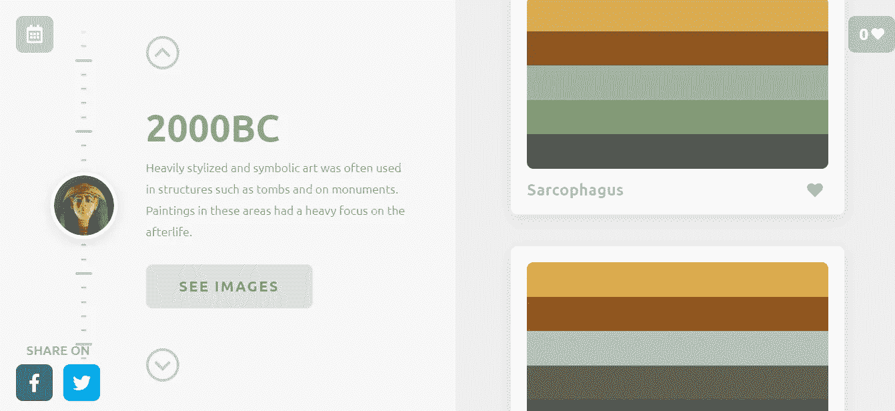
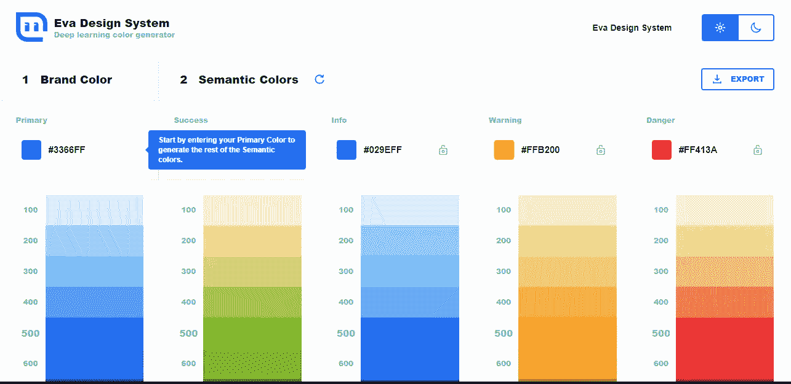
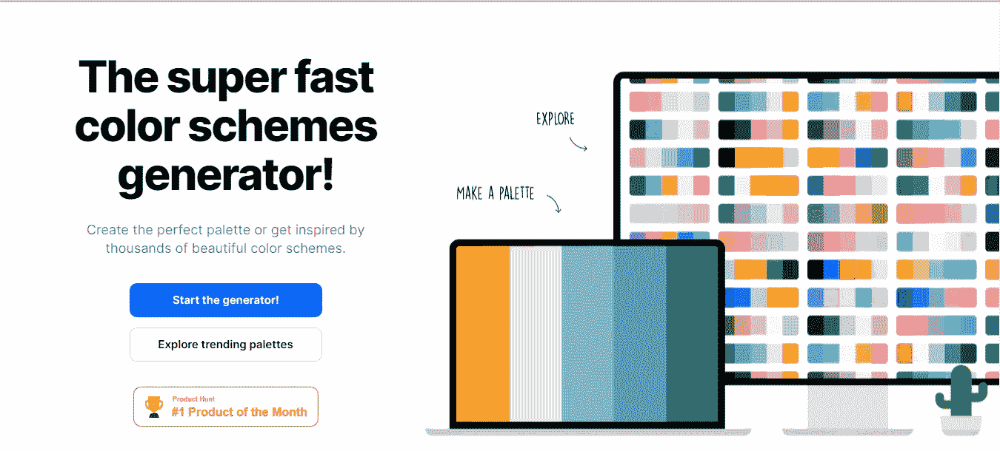
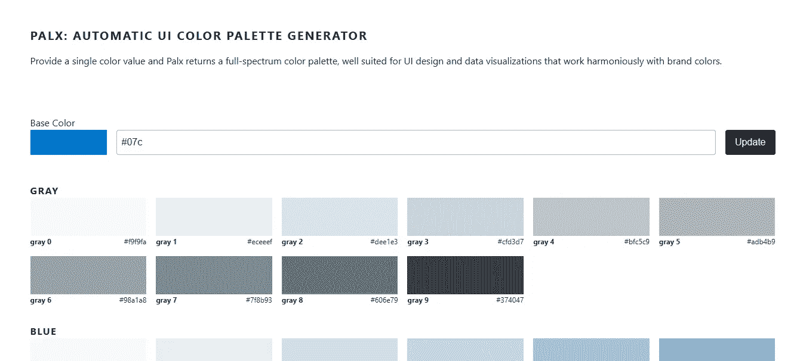
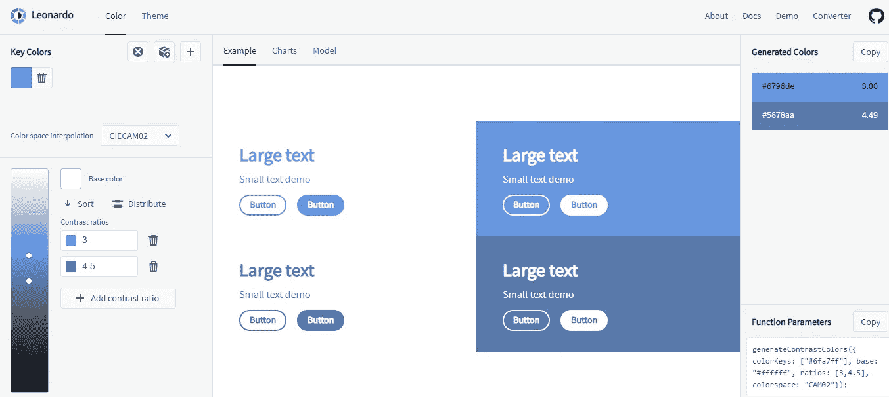
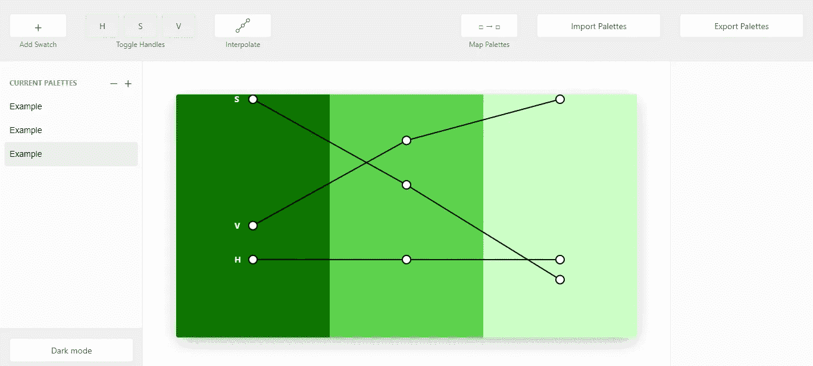
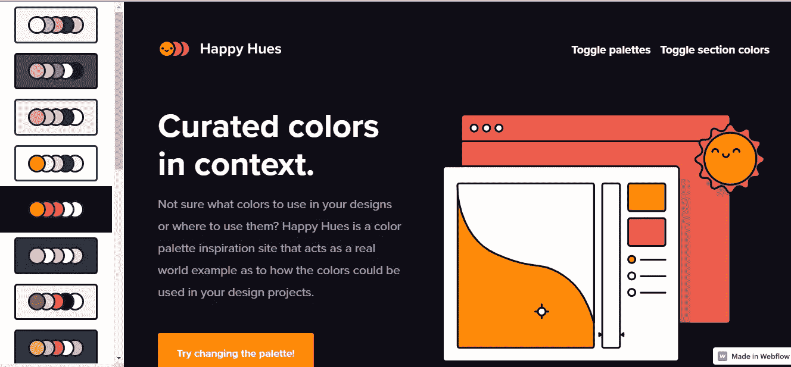

# 7 个 UI 工具，用于创建更好的调色板

> 原文：<https://betterprogramming.pub/7-ui-tools-for-creating-better-color-palettes-a5b432aa7db6>

## 颜色真的很难！让我们让他们更容易

作者照片。

UI 设计中一个耗时但绝对必要的阶段是颜色选择。设计师有时会花上几个小时挑选合适的调色板。

在这篇文章中，我决定列出我最喜欢的创建调色板的工具，你可以用它们来设计更好的界面。

我们开始吧！

# 1.色彩飞跃

根据 [TheMasterPicks](https://www.themasterpicks.com/color-palettes-tool/) 的说法，有了 Color Leap，你可以“在过去 4000 年中使用的 180 种调色板中进行搜索。找到经得起时间考验的颜色组合，从中激发你的想象力。”

# 2.Eva 颜色

来自 [Dribbble 的博客](https://dribbble.com/stories/2019/10/25/7-ui-tools-for-better-color-palettes)，“这个方便的人工智能工具根据你品牌的原色生成语义调色板。每种颜色都有特定的用途，比如成功、信息、警告和危险。”

这个工具还为生成的每种颜色生成各种阴影，并且具有非常容易的导出功能。您甚至可以切换到亮暗模式下查看颜色！是不是很神奇？

# 3.酷派

通过[这个工具](https://coolors.co/)，你可以为你的设计生成或浏览漂亮的颜色组合。

# 4.Palx

这是一个自动 UI [调色板生成器](https://palx.jxnblk.com/)。添加您的基色，系统本身会根据输入的主要十六进制代码为您提供全光谱调色板。生成的颜色无冲突地一起工作，您也可以轻松地导出所有颜色。

# 5.【男性名字】利奥纳多

[该工具](https://leonardocolor.io/)根据所需的对比度生成颜色。这是我最喜欢的工具，因为它可以让你调整阴影的对比度和颜色变化的数量等参数。你一定要去看看！

# 6.帕莱特

使用[调色板](https://palettte.app/)创建和采样颜色方案，使颜色无缝地相互融合。在微调色调和饱和度以及根据需要添加更多颜色样本方面，它为您提供了完整的编辑功能。

只需点击工具左上角的加号图标就可以开始了，当你完成一个调色板后，点击右上角的导出按钮。您也可以导入调色板并相应地编辑它。

# 7.快乐的色调

“不确定在设计中使用什么颜色或在哪里使用它们？据 [HappyHues](https://www.happyhues.co/) 称:“Happy Hues 是一个调色板灵感网站，作为一个真实世界的例子，展示如何在你的设计项目中使用这些颜色。”

# 结论

这是我给你的清单。希望你觉得有用！