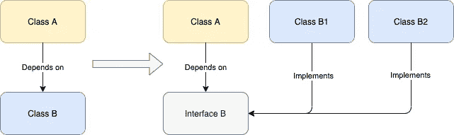
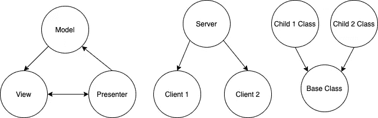
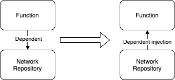
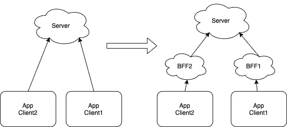

# 7 条非常规的编码建议

> 原文：<https://betterprogramming.pub/7-unconventional-pieces-of-coding-advice-17f0cfc0220f>

## 程序员世界

## 通过从不同的角度看代码，你可能会发现一些新的东西


照片由[瑞德·卫斯理](https://unsplash.com/@rhett__noonan?utm_source=medium&utm_medium=referral)在 [Unsplash](https://unsplash.com?utm_source=medium&utm_medium=referral) 拍摄

在生活中，我们可以用很多方式看待事物。并非所有的事情都像我们看到的那样。如果我们从另一个角度——或从不同的高度——看问题，我们会对生活有新的看法。

类似地，我们可以尝试对编码有不同的看法。也许我们可以得到一些启示，使我们能够更好地掌握它。

以下是我发现的七个观点。

# 1.没有完美的编码方式，只有首选的编码方式

我上大学时，计算机科学学院是数学系的一部分。它被认为是一个逻辑主宰的领域。凡事总有一个完美的答案。

因此，当谈到编程时，程序员对什么是对什么是错的争论:从设计模式到命名约定，甚至到格式化，这帮助催生了程序员的三场战争。

然而，与数学不同，编程是人类发明。它从来都不完美。解决一个问题的方法会有很多，各有利弊。

比如 Kotlin 中双响的使用，也就是`!!`。有反对使用它的[和赞成使用它的](https://czerwinski.it/2018/11/30/the-case-against-double-exclamation-operator.html)的和[。](https://twitter.com/jakewharton/status/1232512754906476544?lang=en)

讨论或辩论这些差异是有益的，因为这是一个学习过程，因为当前的语言功能可能仍有局限性。因此，这种争论被用来改善未来的编程语言。

一个很好的例子是，在 Java 中，没有办法定义一个变量是否可以为空。所以引入了一个`optional`型，更好的保障东西。代码如下:

```
String normalStr = "ab"Optional<String> nullableStr = Optional.of("ab")
```

但是到处都有`Optional`真的很麻烦。因此，较新的语言——如 kot Lin——引入了可空类型和`?`,如下所示:

```
var normalString: String = "ab"var nullableString: String? = "ab"
```

这太好了。遗憾的是，Java 中还没有这个功能。

所以，即使更好的解决方案还没有到位，我们也不要再争论了。学习并接受每一方的优点和缺点——并找到一个达成一致的首选编码方式。不要耿耿于怀，也不要往心里去。

# 2.水土不服使简单简洁的编码变得清晰

在编码中，我们更喜欢清晰而不是简洁。将代码压缩成几行是没有意义的，当下一个编码者阅读它时，需要更多的解码来理解它。

然而，如果一个人过分强调清晰而不是简洁，它可能会阻止编码进化，并且不能避免不必要的仪式。编码将需要继续非常像英语。

比如下面的代码，哪个更好？

```
// JAVAif (a > b) println(a) else print(b);// OR(a > b)? println(a) : println(b);
```

我听过无数关于它们的辩论。有些人更喜欢简单的英语。其他人说，在这种情况下，越短越好。

关于这一点，目前仍有两派观点。

也许另一个例子将有助于强调这些想法:

```
// KOTLINif (a != null) { a.printSelf() } else { println("nothing") }// ORa?.printSelf() ?: println("nothing")
```

如果你问一个非 Kotlin 的开发者，第一个更清楚。但是当你问任何一个精通科特林语的人，第二种显然是首选。

为什么？

仅仅是因为所有的 Kotlin 编码人员都适应了 Kotlin 中更好的可空性检查特性，即`?.`和`?:`。他们对这种语言以及如何使用这种语言有共同的理解。因此简明的方法变得清楚。

如果一个简单简洁的编码方式最初看起来很陌生，可以考虑进一步理解它。如果它们在语义上与更长的版本相同，一定要花些时间练习和适应它。

我们刚学编程的时候，下面这个例子是不是很混乱？然而，后来，我们习惯了。

```
if (a > b) println(a) else println(b);
```

有人说“代码是写给人类阅读的。”我想补充的是“人类阅读的方式是可以改进的”，而且并不总是需要以英语为基础。

# 3.比起代码注释或者没有注释，更喜欢 Git 注释

历史上，注释代码被认为是一种好的实践。我们被鼓励去评论。

随着编程语言的发展，编码人员更容易理解，一些代码注释变得多余。

在这个过程中，我们还发现当代码发生变化时，注释代码可能会变得过时。代码肯定会改变，因为没有代码是永久的。过时的注释会误导下一个查看它们的开发者。

俗话说:“*没有评论比错误的评论好。*

因此，新的约定声明:如果您的代码需要注释，那么您可能应该重写它。

但是…

代码虽然提供了它所做事情的准确语义，但可能无法清楚地提供上下文。在编码的时候，我们对其上下文的理解是最丰富的，我们的大脑中有如此多的东西，我们希望与代码放在一起以便更清楚地理解。怎么才能做到呢？

## 使用 Git 提交注释！

Git 注释确实很棒，原因如下:

*   它与代码签入的时间同步，因此它总是与它所引用的代码相关。
*   当代码改变时，不需要修改它，因为这种改变需要一个新的 git 注释。
*   它在同一个提交中将所有相关代码链接在一起，而不仅仅是针对那一段代码。

我喜欢丹尼尔·卢(Daniel Lew)的说法:“(T2)我从未后悔在提交消息(T5)中写了太多(T3)和(T4)

# 4.代码审查不应该是“残酷的”

我听说过“代码审查应该是残酷的。”

“野蛮”这个词本身真的是不友好的，破坏性的，彻头彻尾的可怕。查字典；这不是一个积极的词。

有些人可能会说“嘿，别往心里去。这是为了让一个人进步……残酷、严肃、乏味是可以的……这样我们就可以学习，让它变得完美。”

但是我们不也需要改善我们的个人生活和职业生活吗？因此，我们的年度绩效评估应该是残酷的。在学校里，学术评论应该很残酷吧？不要！

## 野蛮只是意味着“严格和力求完美”

也许不管是谁创造了这个短语，它都没有负面的意思。这只是意味着在编码审查中，一个人必须严格，力求完美。没有不礼貌和刺耳的话。

好的，这样更好。也许这句话可以是“代码审查应该是建设性的残酷的。”哈哈！

尽管如此，我还是想知道“追求完美”的定义

如果“追求完美”意味着代码审查应该彻底、吹毛求疵、坚持自己的偏好，并进入不同意见的无休止的辩论，从而两种代码只相差 1%的内存改进和 1%的速度改进…那就太过分了。

## 比起彻底的编码审查过程，更喜欢足够好

不要误解我的意思:当我提到足够好时，我并不是说评审员应该做得不好。

我的意思是评审者仍然应该提供所有可能的输入来改进代码。但是根据 Git 提供给我们的选项，有三种类型的反馈。


1.  当我看到已经编码的代码有轻微的改进时，我会建议在注释中修改一些代码。有些可能是个人偏好(吹毛求疵没关系)。如果所有问题都属于这一类别，**我将批准**要检入的代码，代码所有者有权更改或保留其代码。
2.  我发现有些代码可能会对代码产生负面影响，但不严重。**我将对代码进行评论**，并期待评论者提供一些反馈，以便进一步讨论。如果有其他评审人员批准代码，我可以接受它。
3.  一些完全错误的代码，例如，错误的业务逻辑，违反了我们的架构设计，可能会极大地影响性能或有许多第二类问题。**我会要求变更**。我有一个很强的理由为什么它根本不应该做，并希望看到改变。

## 周转时间更快

使用这种方法进行审查，我观察到的结果如下:

*   10%的时间审查是完美的，可以立即检查。
*   70%的情况属于第一类，在这一类中，代码可以很容易地被检查和签入。开发人员有权做出更改(大多数情况下他们会这样做)。
*   15%的情况属于第二类，需要进行一些讨论。但是相对轻松，学习模式讨论。
*   5%的情况下属于第三类。需要一个更繁琐的过程，在进入之前，代码需要被真正地修正和修改。

在这里，我们看到 80%的时间，评审通过了，产生了更快的周转时间，同时得到了所有可以得到的输入。

存在代码不完美的风险(例如，如果一些开发人员不想对次要建议进行更改)，但只要签入的代码是净正值，这仍然是可以的。

代码从来都不是完美的，代码会改变。我们处于敏捷开发中，我们需要让它继续下去。

# 5.代码的可维护性不在于它能持续多长时间，而在于它能有多容易被修改或删除

我们想建立一些持久的东西。我们希望我们的代码保持不变。我们想建造一些坚固的东西。

但是我们需要承认一个事实:

*“硬件是为了经久耐用；
软件被修改；
变化是唯一永恒的东西*

我们编码，我们给现有的软件产品添加特性。我们做得有多好？衡量我们做得如何的一些方法包括没有错误、良好的性能和最小的资源使用。

然而，对于软件来说，另一个重要的标准是，我们能多容易地删除它？是的，有一天会移除这些功能！软件中的任何特性都不会永久存在。我们会修改它，我们会改进它——总有一天我们会取消它。

## 添加代码时的注意事项

因此，当我们添加一些软件功能时，一个重要的问题是它们能多容易地被删除。

当我们添加一个特性时，如果代码分散在各处，这表明需要进行重组。有些代码需要重构或移动。永远不要急于进入一个功能。花点时间重新构建代码，以便更容易地添加该功能。否则，我们以后可能会后悔。

同样，当我们添加一个特性时，我们会看到一些可以重构的类似代码。作为专注的开发人员，我们花时间将它们整合在一起。然而，如果我们把不相关的代码捆绑在一起，我们可能会使改变和删除特性的过程变得复杂。

## 代码的架构有多好，它就有多容易被重新架构

好的，我们可以讨论一个特性的编码有多好，因为知道它很重要，所以我们可以看到它是多么容易被删除。这对功能有好处。

建筑呢？这难道不是为了坚固耐用而建造的吗？我们做这件事的方式通常受到我们建造它的自然本能的影响。也就是说，让我们建立一个坚实的基础。不可改变。

这对硬件来说是好事，因为硬件的基础非常坚固，经久耐用。另一方面，软件会发生变化。由于我们很难预测接下来会发生什么变化，什么不会发生变化，因此我们很难设计出完美的不变架构。

因此，当我们考虑架构我们的软件设计时，我们应该考虑重新架构有多容易。

这怎么可能呢？

举个简单的例子，如果 A 类依赖于 B 类，这就是固定的设计模式。这是依赖关系的图像:



正如我们在上面看到的，一个更好的方法是依赖于接口 B 的类 A，它可以很容易地改变为类 B1 或类 B1。这绝对是一个更加灵活的设计，以迎合未来的变化。

当然，这是一个过于简单的例子，但是它确实说明了架构适应未来变化的能力，这要好得多。

> “仅仅因为架构应该是稳定的，并不意味着它永远不会改变。”—盖伦·赫姆克斯

# 6.使用独立依赖方法设计软件

独立依赖？这是什么？这样的悖论！！

让我解释一下。

所有的软件问题都可以看作是我们如何将整个软件问题分割成相互依赖的小组件，如下所示。



虽然看起来很简单，但是找到合适的划分是个难题，这样设计才具有高内聚性和低耦合性。

更复杂的是，由于软件不断变化的本质，固定的划分和依赖关系经常会限制软件的发展。

帮助时的依赖链接也是问题的原因。

因此，为了改善这种情况，我们必须探索如何进一步解耦依赖性，并提高其灵活性，以获得两个世界的优点，即独立依赖的设计解决方案。

## 一些例子

很难理解这种悖论本身，但这并不新鲜。许多新颖的软件设计实践都是基于这个概念。

依赖注入
这是一个众所周知的概念，也是设计软件解决方案的首选方式。永远不要让一个对象直接依赖于另一个对象。而是通过接口等注入。这是一张图片:



在上图中，功能不再直接依赖于网络存储库。取而代之的是**独立依赖**的网络知识库。这确保了该功能能够:

*   动态创建不同的网络存储库
*   用于测试目的的网络知识库的模拟。

这是今天另一种流行的客户端-服务器关系的方法。

传统上，客户端连接到服务器。但是，这种直接依赖也有一些缺点，例如:

服务器为多个客户端提供服务，其中一个客户端的需求不同于其他客户端。改变服务器来迎合一个客户端会影响所有其他客户端。这是一张图片:



为了改善这种情况，我们将在客户端和服务器之间插入后端对前端(BFF)服务。

*   这将屏蔽服务器的更改，使其直接影响所有客户端。
*   此外，每个客户端现在都可以相应地定制，而根本不需要改变服务器。

换句话说，这种方法使得客户机**独立于服务器**。

下面的文章里有更多的例子。这是更好的软件设计解决方案的蓝图。

[](https://towardsdatascience.com/the-root-of-all-software-design-challenge-independent-or-dependent-31252051bf0e) [## 所有软件设计挑战的根源:独立还是依赖

### 独立依赖设计:许多软件设计方案的蓝图

towardsdatascience.com](https://towardsdatascience.com/the-root-of-all-software-design-challenge-independent-or-dependent-31252051bf0e) 

# 7.预防并不总是比治疗好

有一句老话，“预防胜于治疗。”我们不想陷入困境，也不想摆脱困境。在软件中，这意味着我们不希望任何错误向公众发布，然后不得不在以后修复它。

虽然这对于生活中的许多事情来说是正确的，尤其是硬件产品，但对于软件来说就不那么正确了。为什么？

因为在软件的某些情况下，变更和修复问题的成本低于预防错误的成本。与硬件不同，软件本身的特性降低了开发、变更和部署的成本。软件使变化发生得如此之快，并且几乎不需要任何时间就能部署到用户手中，成本可以忽略不计。

我们知道没有办法保证一个没有错误的软件。我们可以花更多的时间和资源来识别它们，但这将达到一个回报递减的点。

因此，经验法则是，当预防成本高于治疗成本时，让我们承担风险，优化成本。

下图显示了软件和硬件中相同性质的缺陷，其中识别它们的成本是假设相同的。在硬件中修复它们的成本肯定高于软件(因为需要发送、重新创建硬件组件和重新分发等)。).这是一张图片:


软件中有一些错误，修复它们的成本低于识别它们的成本(即蓝色阴影区域)。这个属性让软件更能承受风险，能够做出更多的创新。

免责声明:综上所述，我们当然应该继续降低预防成本，提高自动化测试的质量，改进工作流程等。

顺便说一下，[并不是所有的虫子都是害虫](https://medium.com/swlh/differentiating-software-pest-from-bug-ab261e454e19)。哈哈！

# 最后

编码是一个仍然充满谜团的领域。对我来说，虽然它是学习中的科学，但它是实践中的艺术。

有时候，我们只需要放下现有的视角，敞开心扉，从另一个角度去看，我们可能会发现新的启示。