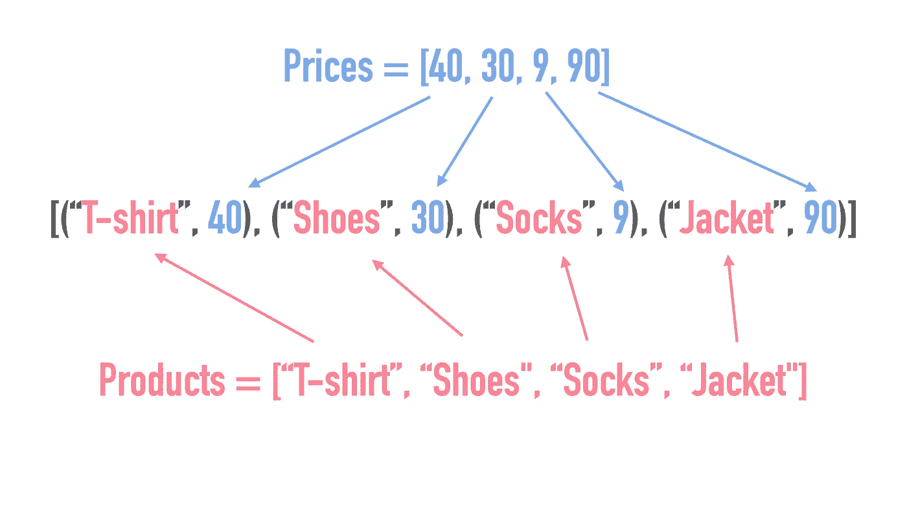

# 7 个有用的 Python 内置函数

> 原文：<https://betterprogramming.pub/7-useful-python-built-in-functions-a83496888f6b>

## 利用这些函数编写更好的 Python 代码


[David Nicolai](https://unsplash.com/@davidnicolai?utm_source=medium&utm_medium=referral) 在 [Unsplash](https://unsplash.com?utm_source=medium&utm_medium=referral) 上拍摄的照片。

Python 有多种实用的内置函数和默认可用的类型。在这篇文章中，我将解释其中的七个，并提供一些简单的和初学者友好的例子。

我希望你喜欢它！

# 1.isinstance()

您可以使用`isinstance()`函数来检查一个对象是否是某个类的实例。这在执行对象类型比较时非常有用。例如:

注意最后一行(`(list, float, int, bool)`)中的类信息是一个[元组](https://www.codingem.com/what-is-a-tuple-in-python/)，返回值是`True`。这是因为`isinstance()`函数检查是否有任何对象是它们中任何一个的实例。

# 2.地图()

`map()`功能是对`for`循环的替代。例如，它为列表中的每个元素应用一个函数。`map()`函数返回一个地图对象。这可以很容易地用`list()`函数转换回一个列表。

为了证明这一点，让我们计算一系列数字的平方:

输出:

```
[1, 4, 9, 16, 25]
```

注意应用于每个元素的函数是一个 [lambda 表达式](/understand-python-lambdas-in-3-minutes-8ce4997134fe)。在上面的例子中，它的语法是`lambda x: x ** 2`。这不是必需的，因为您可以传入一个常规函数。但是，如果您只在短时间内需要该功能，那么使用 lambdas 是一个很好的做法。如果你不熟悉兰姆达斯，看看这篇文章。

# 3.过滤器()

`filter()`函数，顾名思义，可以用来根据特定的条件过滤元素。例如，让我们从列表中过滤所有偶数(即`x % 2 == 0`适用的数字):

输出:

```
[2, 4, 6]
```

# 4.输入()

使用`input()`功能请求用户输入。这个函数以字符串的形式返回输入。例如:

运行该程序会在控制台中询问您的姓名。一旦你输入一个名字并按下回车键，程序就会向你打招呼。

# 5.id()

函数返回一个对象的唯一 ID。例如，当您想要检查是否创建了一个对象的两个独立副本时，这可能会很有用。

在 Python 中，赋值运算符(`=` ) *不复制对象。*相反，它为现有对象创建一个别名。这意味着原始对象中的任何更改都会反映在“新”对象中，反之亦然。这也意味着两个对象应该有相同的 ID。


让我们看看这是否真的会发生:

输出:

```
Both have same ID!
```

注意身份检查也可以通过`is`操作符来完成。你可以用`new_numbers **is** numbers`代替`id(new_numbers) == id(numbers)`得到同样的结果。

要创建一个对象的新的独立副本，可以使用`copy`模块的`deepcopy()`功能。让我们通过创建`numbers`的独立副本来重复上面的例子:

输出:

```
The ID's don't match.
```

# 6.zip()

您可以使用`zip()`函数将两个可迭代的对象压缩在一起，比如列表。它返回一个[元组](https://www.codingem.com/what-is-a-tuple-in-python/)的迭代器，其中每个元组具有来自每个列表的第*个*元素。举例说明:



在代码中，您可以这样做:

输出:

```
[('T-shirt', 40), ('Shoes', 30), ('Socks', 9), ('Jacket', 90)]
```

您也可以结合使用`zip()`功能和`dict()`功能来创建词典。例如:

输出:

```
{'Jacket': 90, 'Shoes': 30, 'T-shirt': 40, 'Socks': 9}
```

最后，不要忘记您还可以解压缩压缩的集合。但是，没有解压缩功能。相反，您需要通过使用解包操作符(`*`)反向使用`zip()`:

输出:

```
('T-shirt', 'Shoes', 'Socks', 'Jacket')
(40, 30, 9, 90)
```

# 7.已排序()

使用`sorted()`函数对列表或[元组](https://www.codingem.com/what-is-a-tuple-in-python/)等可迭代对象进行排序。

*   字符串按字母顺序排序
*   数字是按数字排序的。
*   您也可以选择升序或降序。

以下是一些例子:

## 排序字符串

```
numbers = ["C", "A", "B"]
print(sorted(numbers))
```

输出:

```
['A', 'B', 'C']
```

## 以逆序排序字符串

```
numbers = ["C", "A", "B"]
print(sorted(numbers, reverse=**True**))
```

输出:

```
['C', 'B', 'A']
```

## 排序数字

在上面的例子中，你对列表进行了排序。让我们对一组数字进行排序:

```
numbers = (3, 1, 7)
print(sorted(numbers))
```

输出:

```
[1, 3, 7]
```

请随意查看关于 Python 排序列表的终极指南

# 结论

感谢阅读。编码快乐！

# 你可能会发现这很有用

[](/10-useful-python-snippets-to-code-like-a-pro-e3d9a34e6145) [## 10 个有用的 Python 片段，让你像专业人士一样编写代码

### 我每天使用的有用的提示和技巧

better 编程. pub](/10-useful-python-snippets-to-code-like-a-pro-e3d9a34e6145)