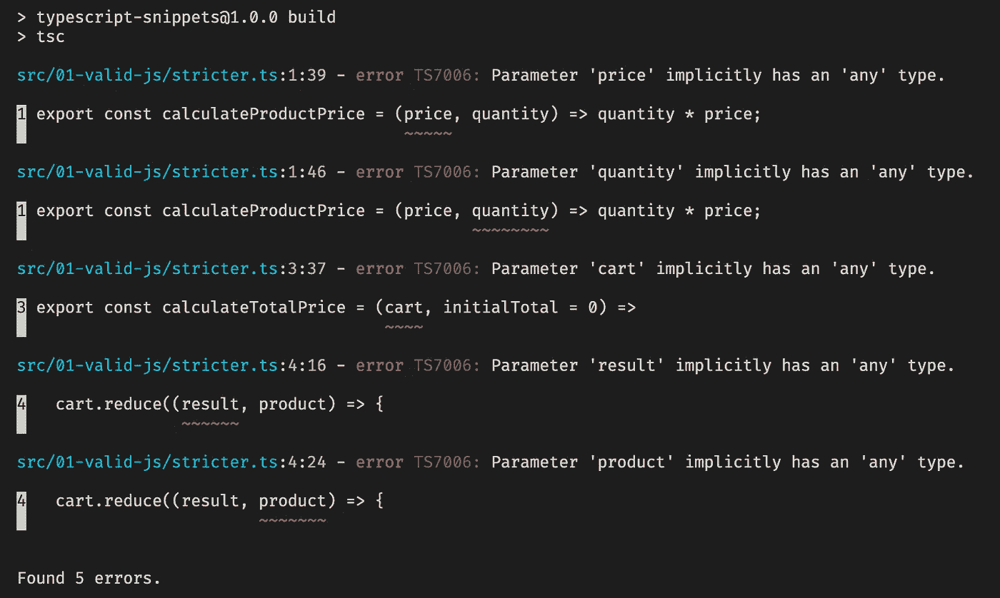
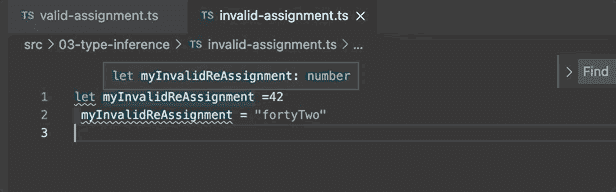
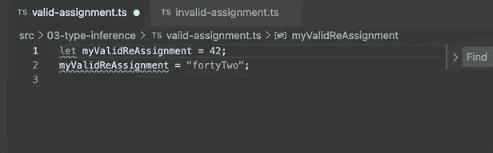
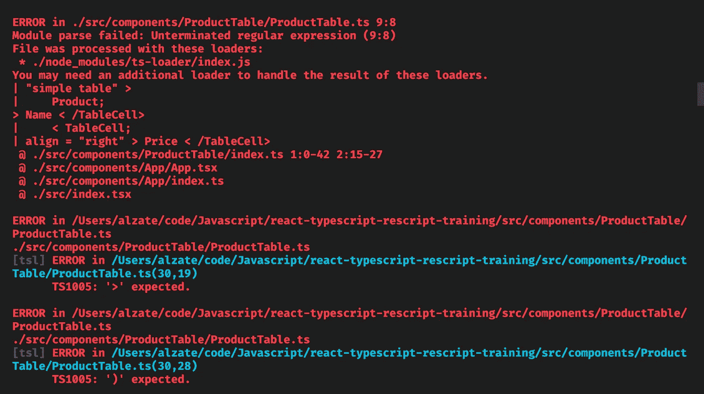
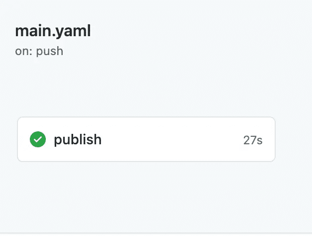

# 7 个对初学者有用的打字稿花絮

> 原文：<https://betterprogramming.pub/7-useful-typescript-tidbits-for-beginners-a2009f5bab67>

## 了解一些让代码启动并运行的 TypeScript 技巧

照片由[戴恩·托普金](https://unsplash.com/@dtopkin1?utm_source=medium&utm_medium=referral)在 [Unsplash](https://unsplash.com?utm_source=medium&utm_medium=referral) 拍摄。

TypeScript 是一种非常受欢迎的语言，并且日益流行。它甚至在 2020 年 JS 状态调查中获得了[最被采用的技术奖。](https://2020.stateofjs.com/en-US/awards/)

对于一个以前从未使用过静态类型语言的 JavaScript 开发人员来说，这似乎有点令人生畏。因此，我想分享一些我从探索 TypeScript 中学到的经验。我的希望是，这些小花絮会说服你去尝试一下，减轻你对提高速度的担忧，或者更好地让你免于一两次头痛。

我们开始吧！

# 1.所有 JavaScript 代码(大部分)都是有效的类型脚本代码

TypeScript 是 JavaScript 的超集。这实际上意味着它只是扩展了普通 JavaScript 的基本功能，最显著的是在其上添加了类型检查系统。这意味着如果您想从技术上开始利用 TypeScript，您所要做的就是将文件从. js 扩展名改为. ts 扩展名。

瞧，你有了你的第一个打字稿文件！

上面只是普通的 JavaScript 代码。我们要做的就是把它更新成. ts 扩展名。

TypeScript 的工作方式是通过编译器运行 TypeScript 文件，输出普通的 JavaScript 代码。编译器会分析您的代码，如果遇到类型错误，它会拒绝编译您的代码。

我们可以通过 TypeScript 编译器运行上面的代码，并获得下面编译后的 JavaScript 输出:

默认情况下，我们的代码编译为 ES3，但是有很多选项，包括 ES6、ES2020 和 ESNext。

应该注意的是，它可能不符合您当前的所有代码。稍后我们将了解更多这方面的内容。

# 2.你可以逐渐选择更严格的打字

学习一门新的语言(或范式)可能会让人不知所措——尤其是在像 TypeScript 这样的编译语言中。如果你不遵守它的标准，编译器会拒绝编译。

幸运的是，TypeScript 允许您配置类型检查的严格程度。最初，它会把你的注意力吸引到最紧迫的问题上。然后，它允许用户在准备就绪时选择更严格的类型检查规则。这是一个很棒的特性，与高度固执己见的强类型语言相比，对于刚刚入门的开发人员来说，这并不那么令人畏惧。此功能还使得将代码库迁移到 TypeScript 变得更加容易。

在前面的例子中，我们的代码编译没有问题。随着我们越来越熟悉，我们可以通过更新编译器配置来添加更严格的类型检查，如下所示:

以上是所有严格检查的列表。在本例中，我们打开了 noImplicitAny。

在上面的配置中，我们打开了`noImplicitAny` 检查。如果我们的编译器检测到代码中没有明确定义的`any`类型，它将会失败。一个`any` 型就是这个意思。我们可以传递或分配一个字符串，数组，或任何我们想要的类型！特别是，这会影响函数参数，因为从理论上讲，我们可以传递任何类型的参数。查看下面的编译器输出:

如您所见，参数被隐式定义为“any”类型。

在我们的文件中，我们有一些像`number`这样的原始类型。所以作为第一步，我建议只输入这些参数。对于我们更复杂的类型，比如我们的`cart`和`product`，我们现在可以显式地将它们类型化为`any` ，直到我们复习我们的类型脚本。下面是强调这种方法的更新文件:

通过逐渐选择额外的严格性，我们可以提高应用程序的类型安全性。

# 3.TypeScript 具有类型推断

TypeScript 可以根据代码的用法推断出某些代码的类型。这使得 TypeScript 可以提醒您由代码中的类型不匹配导致的潜在问题，即使您没有显式键入所有内容。例如，如果我试图将一个字符串值赋给一个用数值初始化的变量，我会得到一个类型错误。这里有一个例子:

分配不同类型的新值时检测到错误。

如果需要的话，我们可以通过使用联合类型`string|number`显式地允许我们的变量被重新分配。下面是一个例子:

显式类型允许我们覆盖推断的类型。

TypeScript 附带了类型推断，这很好，但它并不完美。这就是为什么通常建议用户考虑显式键入他们的代码以提高可读性。

# 4.您只能在中使用 JSX。tsx 文件

如果你在 React 中开发，你通常会使用. js 扩展名或者。React 组件的 jsx 扩展。但是，在 TypeScript 中，您必须使用。tsx 扩展来表示 JSX 的使用。原因是编译器使用这个扩展来告诉编译器期待 JSX。

如果没有，编译器会在看到 JSX 语法时抛出一个解析错误。以下是您的 bundler(如 webpack)会抛出的错误类型的示例:

. ts 文件中的 JSX 导致解析错误。

# 5.没有返回值的函数实际上会返回 Void

如何键入一个没有返回值的函数最初让我很困惑。这包括常见的操作，如`console.log`或调用另一个函数。虽然我认为它会返回`null`或`undefined`，但结果返回的类型是`void`。如果在函数调用结束时显式返回这些类型，函数仍然可以返回`null`或`undefined`。下面是一个返回 void 及其类型的函数示例:

返回 void 的基本函数。

# 6.使用流行的 JavaScript 库很容易

将第三方 JavaScript 库与 TypeScript 一起使用很容易做到。许多较大的库，如 React，都内置了类型定义。这意味着您不必从头开始键入您从库中使用的函数和类。它使您的开发更安全，因为您获得了库的静态类型，并且它为编辑器提供了有用的工具，如开发时的代码完成。

如果你的项目没有附带打字，不要担心。GitHub 上有一个名为 [DefinitelyTyped](https://definitelytyped.org/) 的项目，为大量流行的 npm 包提供了大量的类型定义。我在他们的 GitHub 上数了大概 7000 多个。您所要做的就是对这些类型进行“开发”安装，以利用这一功能。下面是我们如何为流行的 lodash 库安装类型:

为第三方库添加类型可以像 npm 安装一样简单。

你所要做的就是安装，然后你就完成了！

# 7.它的编译器可以作为一个轻量级的构建系统

如前所述，TypeScript 可以编译成 JavaScript，它有许多我们可以编译的目标，包括流行的 ES5。此外，编译器还有一个选项`allowJS`、**、**，它也允许普通的 JavaScript 文件在编译器中运行。

那么这在实践中意味着什么呢？这意味着我们可以利用编译器来帮助简化我们的工具，甚至用 TypeScript 特性来改进我们的普通 JavaScript 项目。它让我们可以在服务器和客户机上使用 JavaScript 的最新特性(包括实验性特性)，并获得可以在任何地方运行的 ES5 JavaScript(例如)。

更好的是，我们甚至不必配置 webpack 或 Babel 来捆绑更简单的项目。就是管用！我们还得到了额外的好处，可以随时选择将类型引入到我们的项目中。

基本模式如下:

1.  安装 TypeScript 并启动一个`tsconfig`文件。
2.  设置目标输出(ES5、ES6 等。).
3.  设置`include`属性指向您想要编译的文件或目录。
4.  设置`outDir`来决定将编译器 JavaScript 输出到哪个文件夹。
5.  将`allowJs`选项设置为`true`。

让我们通过我最近使用它的两个场景来说明这种方法的价值。

## 用现代 JavaScript 构建节点 API

[在这个项目](https://github.com/alzateja/compare-api-tool/tree/master/server)中，我构建了一个小工具来比较 API 请求。然而，我真正的目标是尽可能构建最具声明性的 API。我使用 TypeScript 来允许我在服务器上使用最新的 JavaScript。在尝试(并失败)使用 Babel 完成同样的任务后，它节省了我大量的时间。我的开发环境也很容易建立。我执行了以下步骤:

1.  在监视模式下运行 TypeScript 编译器。
2.  使用 nodemon 来监听输出的服务器文件。

这使得我们只需要几个脚本和依赖项就可以在服务器上进行热重装。这也是一次很棒的开发经历。

你可以在这篇文章中了解更多关于项目[的信息。](https://medium.com/better-programming/build-beautiful-javascript-apis-15b4afd4b1ba)

## 发布前构建 npm 包

在这个项目中，我构建了一个小型 CLI 来帮助搭建 AWS CDK 项目。我想在我的代码中使用最新的 JavaScript，但希望在发布之前有一个轻量级的构建过程将其转换成 ES5。然而，TypeScript 非常适合。我的构建步骤包括运行编译器和使用 shell 脚本将静态文件复制到我的`dist`文件夹中。以下是构建脚本:

我的超级简单的构建过程。

轻量级和简单的构建过程导致了快速的 CI/CD 工作流。

就是这样！使用这种方法，我在开发过程中获得了顶级的语言特性。我还有一个额外的好处，那就是使用 GitHub 动作来自动化我的发布，构建速度非常快。这是一个具有最小配置的超级强大的构建过程。

如果你想了解这个项目的更多信息，请查看这篇文章。

由[马库斯·温克勒](https://unsplash.com/@markuswinkler?utm_source=medium&utm_medium=referral)在 [Unsplash](https://unsplash.com?utm_source=medium&utm_medium=referral) 上拍摄的照片。

# 结论

如您所见，TypeScript 是一种强大而有趣的语言。语言本身的特性和编译器配置允许开发人员使用一系列强大的工具和特性来改善开发体验。你也可以想出无数潜在的新方法来使用这项技术。

我希望您考虑在未来的项目中使用 TypeScript。有了这样一个渐进的学习曲线，最坏的情况会是什么？