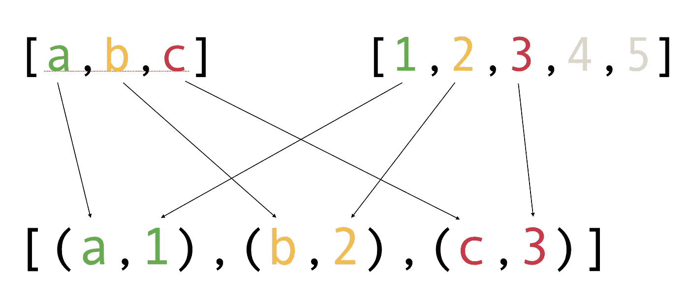
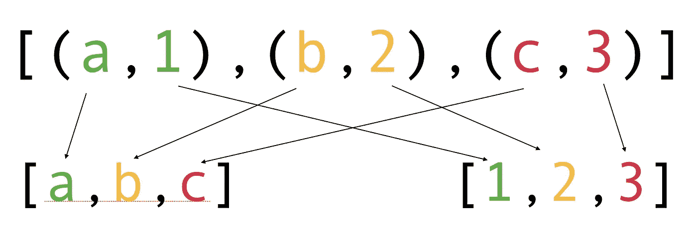
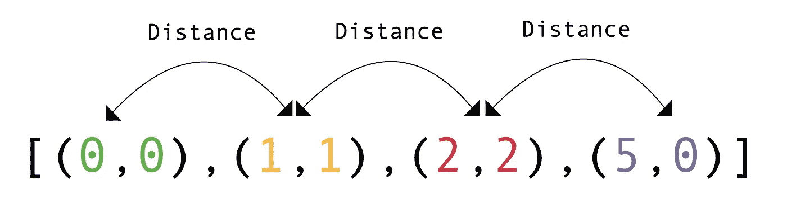

# 在 Python 中使用 Zip()函数的 7 种有用方法

> 原文：<https://betterprogramming.pub/7-useful-ways-to-use-the-zip-function-in-python-2b936414805e>

## 了解 zip()函数如何让您的生活更加轻松


在 [Unsplash](https://unsplash.com?utm_source=medium&utm_medium=referral) 上由 [Nina Cuk](https://unsplash.com/@nimid?utm_source=medium&utm_medium=referral) 拍摄的照片。

Python 有一些有用的内置函数，可以让您的生活变得更加轻松，并在不牺牲质量的情况下节省一些代码行。

今天，您将学习如何使用`zip()`功能。`zip()`函数可以用来聚集来自多个可迭代的数据，比如列表。下面是一个例子:


图片作者？

# zip()函数是什么？

在进入用例之前，让我们简单介绍一下`zip()`函数。

`zip()`函数聚集来自 iterables 的元素，比如两个列表。它返回一个迭代器对象。

例如，让我们将球员和球员号码放在一起:

为了显示压缩的结果，为了简单起见，player_data 被转换为一个列表。

结果:

```
[(7, 'Cristiano Ronaldo'), (9, 'Gareth Bale'), (10, 'Lionel Messi')]
```

`zip()`函数从两个列表的第 n 个元素中创建元组。总而言之，工作原理和实体拉链差不多。


托马斯·索贝克在 [Unsplash](https://unsplash.com?utm_source=medium&utm_medium=referral) 上拍摄的照片。

您现在已经了解了`zip()`功能的基本知识。让我们看看你能用它做什么。

# 1.压缩任意数量的可重复项

您并不局限于只压缩两个可重复项。

例如，让我们压缩三个列表:

输出:

```
[(7, 'Cristiano Ronaldo', 'Juventus'), (9, 'Gareth Bale', 'Real Madrid'), (10, 'Lionel Messi', 'FC Barcelona')]
```

# 2.组合不同大小的列表

压缩列表不需要长度相等。

例如:

输出:

```
[(7, 'Cristiano Ronaldo'), (9, 'Gareth Bale')]
```

当您组合不同长度的列表时，`zip()`函数会忽略通过最短列表的所有内容。



如果不想忽略最后的值，可以使用`zip_longest()`函数。该功能是`Itertools`模块的一部分，因此确保导入它。

例如:

输出:

```
[(7, 'Cristiano Ronaldo'), (9, 'Gareth Bale'), (None, 'Lionel Messi')]
```

默认情况下，该函数用`None`替换缺失的值对。这也是可以改变的。如果你想显示`0`而不是`None`，你可以定义可选的`fillvalue`参数:

```
player_data = zip_longest(player_numbers, player_names, fillvalue=0)
```

# 3.拉开…的拉链

Python 中没有内置的`unzip()`函数。相反，您可以使用`zip()`函数“反向”拆分压缩数据。在这种情况下，还需要使用星号(`*`)。



拉开拉链

例如:

输出:

```
(7, 9, 10)
('Cristiano Ronaldo', 'Gareth Bale', 'Lionel Messi')
```

# 4.将两个列表转换成字典

有两种优雅的方法可以在不使用`for`循环的情况下将两个列表转换成一个字典。

第一种方法使用:

*   [字典理解](https://medium.com/codex/python-make-your-code-fly-with-comprehensions-147873eea0ef#:~:text=it%20is%20no%20surprise%20that%20python%20has%20a%20similar%20shorthand%20for%20looping%20through%20dictionaries%2C%20called%20dictionary%20comprehension.%20the%20syntax%20for%20dictionary%20comprehension%20looks%20like%20this%3A)，这是一个`for`循环的简写。
*   和`zip()`功能。

第二种方法压缩这两个列表，并将结果转换成一个字典。

# 5.拉链成圈

如果你想在同一个`for`循环中处理多个列表，使用`zip()`。

例如:

# 6.使用连续元素

如果您想对连续的元素执行一些操作，压缩在处理单个列表时也很有用。

例如，给定一个坐标列表，让我们像这样计算到相邻坐标的距离:



输出:

```
[1.4142135623730951, 1.4142135623730951, 3.605551275463989]
```

# 7.矩阵转置

在数学中，矩阵转置是一种在对角线上翻转矩阵的操作。

在 Python 中，可以通过解压矩阵(列表的列表)来计算矩阵的转置。

例如，让我们计算一个矩阵的转置:

不管解压的是列表还是元组，解压的方式都是一样的。在这种情况下，解压缩矩阵会将列表的第一个值、第二个值和第三个值分组。

# 结论

在 Python 中，内置的`zip()`函数可以用来聚集来自多个可迭代对象的数据，比如列表。它的工作原理类似于物理拉链。


拉链在行动

感谢阅读。编码快乐！

# 你可能也喜欢

[](/10-useful-python-snippets-to-code-like-a-pro-e3d9a34e6145) [## 10 个有用的 Python 片段，让你像专业人士一样编写代码

### 我每天使用的有用的提示和技巧

better 编程. pub](/10-useful-python-snippets-to-code-like-a-pro-e3d9a34e6145)