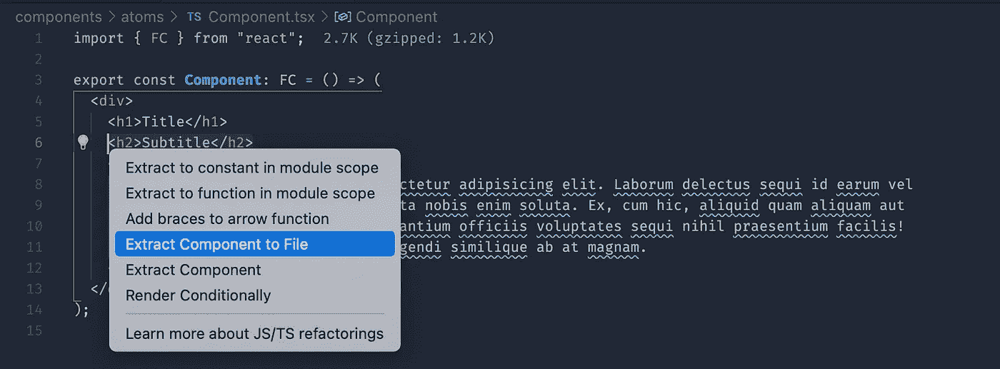

# 我从同事那里学到的 7 个 VS 代码技巧

> 原文：<https://betterprogramming.pub/7-vs-code-tricks-i-learned-from-my-colleagues-6abb340601b4>

## 我在结对编程中发现的便捷捷径


本·科尔德在 [Unsplash](https://unsplash.com/s/photos/laptop?utm_source=unsplash&utm_medium=referral&utm_content=creditCopyText) 上拍摄的照片

结对编程最大的好处之一是，你可以看到其他程序员用来加快工作流程的快捷方式和技巧。

尽管我使用 VS 代码已经有一段时间了——甚至写了一篇关于我最喜欢的 web 开发特性的文章[——我仍然从观察其他人的代码中获得了一些有用的技巧。这里是过去一年中我最喜欢的几个。](https://medium.com/@bretcameron/7-essential-features-of-visual-studio-code-for-web-developers-be77e235bf62)

# 1.重命名命令

每当我需要重命名一个变量时，我通常会选择`⌘D`，它会选择下一个出现的字符串。这仍然非常有用，但是当你有一个类似于`extremelyUniqueVariableName`的字符串时，效果会更好。如果你必须选择更普通的东西，比如`type`，很容易选择比你想要的更多的东西。

VS 代码有一个简单的解决方案:重命名命令。按下`F2`(或者从命令面板中选择重命名符号)，VS 代码将为您完成这项工作。

# 2.重构操作

当重构代码时，你会经常发现自己一遍又一遍地做着同样的事情。这可能是将一些代码移动到它自己的函数中，将一个表达式提取到一个新变量中，或者将一些代码移动到一个不同的文件中。

VS 代码内置了 JavaScript 和 TypeScript 的重构操作，而其他语言可以通过扩展来支持。选择一段代码，按下`⌘.`，你会得到一些选项，比如“移动到一个新文件”或者“给箭头函数加括号”。

我经常使用 React，所以我使用 Wix 的[收集扩展](https://marketplace.visualstudio.com/items?itemName=wix.glean)，它为 JSX 增加了额外的功能，例如将类组件转换为功能组件，将 JSX 提取到一个新的组件中，并用常见的钩子如`useMemo`、`useCallback`和`useEffect`包装代码。



“将组件提取到文件”是将一个大组件拆分成多个小组件的有效方法

# 3.漂亮的 SVG

默认情况下，即使你有 HTML 等语言的自动格式化程序，扩展名为`.svg`的文件也不会被识别。但是 SVG 的一个好处是易于阅读和编辑。幸运的是，很容易配置 VS 代码来将 SVG——以及类似的文件格式，如 XML——与 HTML 相关联。

转到`settings.json`并添加以下内容:

```
"files.associations": {
  "*.svg": "html",
  "*.xml": "html",
}
```

您可能还需要为 HTML 指定一个默认格式化程序。如果你使用更漂亮，相关的设置应该是这样的:

```
"[html]": {
  "editor.defaultFormatter": "esbenp.prettier-vscode"
}
```

# 4.始终保持标签打开

个人比较喜欢 VS Code 的文件预览功能。我觉得这有助于我避免打开太多标签页。但是我认识一些同事，对他们来说这个特性是一种痛苦。如果你是这些人中的一员，你可以在`settings.json`文件中关闭这个功能。

```
"workbench.editor.enablePreview": false
```

或者，对于一个中间的解决方案，您可以只在从命令选项板打开选项卡时才打开它们。我更喜欢这样，因为对我来说，这样打开文件意味着我不太可能“只是浏览”。其设置为:

```
"workbench.editor.enablePreviewFromQuickOpen": false
```

# 5.复制当前文件路径

通常，我发现自己需要引导另一个开发人员找到我已经打开的文件。但是我最近才发现，VS 代码有一种方法可以将活动或相对文件名复制到你的剪贴板上。

您可以通过命令提示符或学习这些按键来完成此操作:

```
Option + CMD + C             Copy path of active file
Shift + Option + CMD + C     Copy relative path of active file
```

非常简单。但是如果你不知道它的存在，你就不能使用它。

# 6.Git 别名

这个技巧并不是专门针对 VS 代码的，但是当我使用集成终端时，它仍然是我的 VS 代码体验的一个重要部分。我们每天都要输入一些特定的命令，经过一年或多年的时间，这些时间真的会越积越多。特别是，我发现我经常重新输入相同的 git 命令，所以我为它们创建了快捷键。

为此，打开终端的配置文件(如`~/.bashrc`或`~/.zshrc`)并添加一些别名。对于 git，我使用以下代码:

```
alias ga="git add"
alias gb="git branch"
alias gc="git commit -m"
alias gf="git fetch"
alias gp="git pull"
alias gs="git status"
```

如果你在寻找更详尽的别名选择，我推荐乔纳森·苏的这篇文章。我肯定会把他的一些建议加入我的节目单。

因为我也经常使用包管理器 Yarn 和版本管理工具 nvm，所以我也有几个别名:

```
alias ys="yarn start"
alias yd="yarn develop"# switch to the correct node version then install packages
alias yi="nvm use && yarn"
```

最后，我有一个命令删除除了`develop`之外的所有 git 分支，T5 通常是我公司项目中的主分支。

```
alias deletebranches="git checkout develop && git branch | grep -v '^*' | xargs git branch -D"
```

我确信还有很多更有用的命令行快捷方式，所以我很想在评论中找到更多的建议。

# 7.源代码管理界面

最后，我越是使用 VS Code 的源代码控制接口，就越觉得它有用。虽然我的上一篇技巧文章是关于命令行别名的，但是通过观察我的同事，我已经看到了与代码的 GUI 相比，它可以节省多少时间。

我已经使用源代码控制接口来存放、取消存放和恢复特定的文件。但是最近，我也开始用它来管理仓库。

在命令行上，我主要用`git stash`隐藏跟踪的变更，然后用`git pop`把它们放回去。但是跟踪多个命名的藏匿点感觉像是一种奢侈——或者也许我只是懒惰。

不管怎样，我发现 VS Code 的接口让这变得容易多了。默认情况下，可以在源代码控制面板的底部找到 stashes。特别是，我有一个项目，在这个项目中，我经常需要切换出某些本地环境变量来测试不同的环境。我将它们作为单独的库保存，并且可以很容易地从源代码控制界面应用它们。

# 结论

我希望这篇文章对你有用。以上的小技巧是我在过去的一年里在工作流程中加入的最有见地的捷径。

我要感谢我的同事。没有他们，就不会有技巧可捏，也不会有文章。

感谢阅读。